# TODO_IN_THIS_PR: Delete this file

## Other Ideas

- Make analogy to a bank
- Look at my LLM presentation
- Use the relays as a rollup from the dec

## TODOs in my own list

- Quote
  > The only thing that grows faster than computer performance is human expectation
  - https://www.stroustrup.com/quotes.html
- The Right To Win
  - Why pocket has the right to win
  -
- TCP up for the internet
- Configs are a setting enforced by gateways
- Tiered token models
- TTMs
- A slide on roc trilemma
- A slide on gateways delegation
- A slide on probabilistic proofs
- 0/1
- Compare rolling up transactions to rolling up relays
- Use Dima’s note to add light clients to diagram
- Show a delineation between grove and pocket
- Create an actors section in the documentation and have a page for each actor
- What if the app and supplier do a 3 way exchange to@agree to the integrity of the data before a challenge - related to the idea of on chain or off chain probers
- Permisionless incentive driven networks will be as decentralized as necessary, but not more.
- There’s no lock-in - you can have partial aggregation of traffic on any network to enable gradual adoption
- Create bonus slides for potential integrations on the probability side
- Opportunity for improvement: proving multiple leads (reference the recapped paper)
- Storing the non hashed data off chain, for large chains
- Tiered systems
- Have a slide showing what we’re not solving
- Having a side explaining how we could theoretically solve it
- Mention that the above is a question we get often
- Need a diagram on rollups of relays
- Need a slide showing the hash that goes on chain
- Alll about API usage, turbo models,
- Models at the edge, etc
- How do we accelerate innovation but also compensate it.
- You can be good at hardware but not want to build a full on service (account, website,etc…)
- There’s a lot of hype around web3 and crypto, but something everyone overlooks is that there’s two kee overlaps: it’s all open source and we can run it on our laptops, but making it efficient vs just fictional are two very different things, especially when you want high performance
- Blog post from C0D3R - read it
- Add a slide on what we’re NOT doing

## Slack conversation dima had

Now that we’ve received more TIA tokens, we want to deploy another Rollkit TestNet. This time, we intend to allow our community to join the network. I’m planning to make a first attempt at deploying a Full Node to join the TestNet. I’ll likely have more questions in the future, but before I start, I want to clarify a few things:
The command to start a Rollkit Full Node appears to be the same as the one that starts the Sequencer and takes the same arguments. Does this imply that the Full Node also requires access to Celestia to read the blobs?
We’ve learned that the Sequencer requires an exclusive Celestia light node. Would each Rollkit Full Node need a dedicated Celestia light node, or could one light node be shared among multiple Rollkit Full Nodes?
Do Rollkit Full Nodes (not the Sequencer) require TIA tokens? I assume the answer is no since they shouldn’t be posting any data, but I might be overlooking something.
Regarding P2P client discovery: Since this TestNet will not be large, I don’t think we need to deploy seeds. Would using `--p2p.persistent_peers` to point to the Rollkit Sequencer be effective, or do you recommend deploying seeds?

1. yes full node needs access to Celestia to read blobs
   (2) Each Rollup full node should run their own light node
   (3) no, rollup full nodes don’t require tokens
   (4) using `--p2p.persistent_peers` to point to the Sequencer or any other running full node should work fine :slightly_smiling_face:
   @Daniel Olshansky
   that’s the right link (ed

## Conversation with Shane

Questions from @Shane _(With access to Protocol materials, I’m seeing that a lot of these questions have answers within Notion. Still would be nice to touch on each one just to ensure I’m up to speed and everything is up-to-date)_

Action Items:

- [ ] Add Shane to all the slack channels
- [ ] Shane to work with PNF to get our first node runner on TestNet
  - (1-2, not 5-10)
  - Make sure they get compensated
  - Willing to go through pain & give feedback
- [ ] Discuss with PNF possible Shannon airdrop for contributors
  - Airdrop would allow folks to participate without PNF having to create a complex structure to manage all the different types of contributions.
- [ ] Clarify and delineate SDK for basic queries/operations and for running clients
- [ ] Future (2+ months): can nodies port some features into AppGateServer

Notes:

- https://www.hyperlane.xyz/
  - Heavily looking into this
- Sequencers
  - RaaS
  - Planned (decentralized): https://astria.org/
  - Backup (centralized): https://caldera.xyz/
- https://rollkit.dev/
- ABCI
  - https://cosmos-network.gitbooks.io/cosmos-academy/content/cosmos-for-developers/tendermint/abci-protocol.html
- https://dev.poktroll.com/architecture/network
  - Sequencer ↔ Validator
  - Full Node ↔ Full Node
  - Light Client ↔ Verifier
    - Data Availability Sampling → whistleblow on potentially bad/missing blocks
    - [Would you like a proof with that?](https://www.notion.so/Would-you-like-a-proof-with-that-8dd05f8ea6274505a3072c9fb4e44898?pvs=21)
- Namespaced Merkle Tree
  - POKT is a namespace in celestia
- Bridge nodes
  - Morse (v0): POKT ← multisig bridge contract (wpokt) —> EVM
  - IBC: L1 ← different type of light client (bridge) —> L1
- Pre-requisite to onboarding operators:
  1. Deploy a new sequencer to Mocha TestNet (celestia)
     1. Sequencer
     2. Protocol team
  2. Document how an operator can run a full node on Shannon
     1. Chain/Data Node (ethereum)
     2. Full Node (pocket node)
  3. Metrics / observability
  4. Who is willing to be a pre-alpha node runner?
     1. Alpha vs Pre-Alpha vs Beta
- Onboarding developers
  - Blocker:
    - Getting a budget
    - Cosmos migration (v0.47 → v0.50)
  - https://github.com/pokt-network/poktroll/issues?q=label%3Acommunity
  - `community`
  - Important but not urgent time being
  - dework.xyz
  - Working with b3n on bounties
    - Pricing the bounty
    - Accepting the appropriate applicant
  - [Idea] In prep for Morse MainNet
    - https://github.com/pokt-network/
    - https://forum.pokt.network/
- Two biggest unlocks for a succesfull TestNet launch:

  1. Onboarding v0 operators
  2. Documenting Morse ↔ Parity

  ***

  1. Onboarding developers
  2. Plan the migraitons

- Actors
  - On-Chain (stake / unstake); part of the protocol
    - Registered
    - Gateway
    - Application
    - Supplier (Servicer State)
      - On-chain state, not a process
      - A registered RelayMiner
  - Off-Chain (configurations / operations); part of the SDK
    - Clients
    - RelayMiner (Servicer)
      - (operates alongside a supplier)
      - Process that a supplier runs
      - All suppliers need a RelayMiner to function
    - AppGateServer (operates alongside an Application and/or Gateway)
      - https://dev.poktroll.com/quickstart

Questions

- What is the Cosmos SDK being used for?
- Is Tendermint a part of used with the Cosmos SDK?
- How does Shannon use both Cosmos and Celestia?
- What does “pre-requesent to no-boarding developers" mean? How will Cosmos open up opportunities for new developers?
- What is the linter?
- What is RelayMiner?
- Is AppGate the SDKs which will be used for gateways or apps?
- What exactly is the node makeup for Shannon nodes (sequencers, validator, lite client, DA node)?
  - Will use this understanding to start making user profiles of who runs what.
- How is Celestia Archival so large?
- What is the best way to join into economic/tokenomics discussions? Who’s heading up what aspects of tokenomics?
- How accurate is the Protocol notion materials?
- What are the key milestones that require community involvement?
- When do you feel that ecosystem builders will need to start preparing their tools for the Shannon transition?
- What are the features right now in the gateway SDKs?
  - How does this compare/contrast Nodies’ gateway kit?

## Rollup of Relays

```mermaid
sequenceDiagram
		title Pocket as a Rollup
		actor A as Application
		actor P as Portal
		actor S as Servicer
		participant DA as DA Layer
		actor V as Validator

		alt Relay (OFF-CHAIN)
			A ->> +S: Trustless Relay Request
			S ->> S: Update Local Merkle Tree
			S ->> -A: Response
		else
			A ->> +P: Delegated Relay Request
			P ->> +S: Relay Request
			S ->> S: Update Local Merkle Tree
			S ->> -P: Response
			P ->> -A: Response
		end

		alt Claim & Proof (ON-CHAIN)
			S -->> DA: Claim (Merkle Root)
			S -->> DA: Proof (Random Branch)
			DA ->> V: Claim & Proof
			V ->> V: Validate Proof
			V ->> DA: Update State
		end
```

## Relay Mining Explanation

- You do “free work” by servicing as many relays as possible
- A small subset of relays meets the necessary difficulty (probabilistically speaking)
- That subset of work goes on-chain as serviced work
- On-chain will be a proxy (not a direct representation) of the amount of relays being done in actualy
- Off-chain data (i.e. gateways) will be necessary to get a real “exact” number of relays in the network
