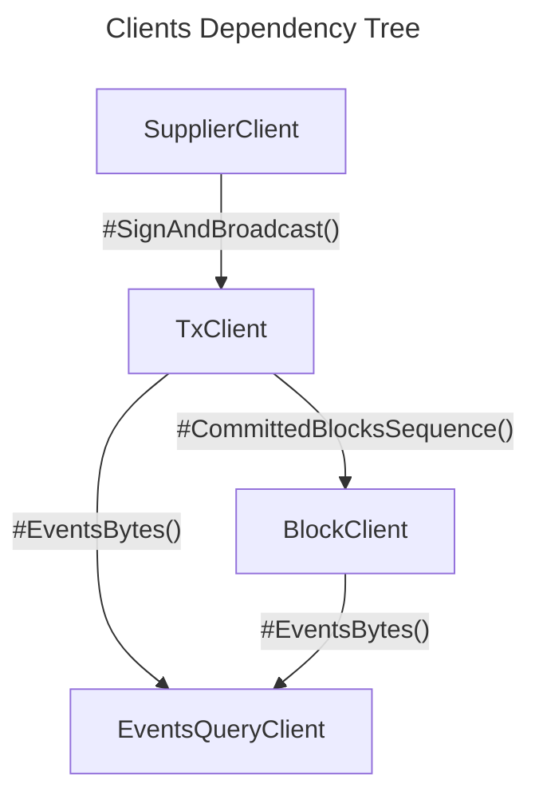
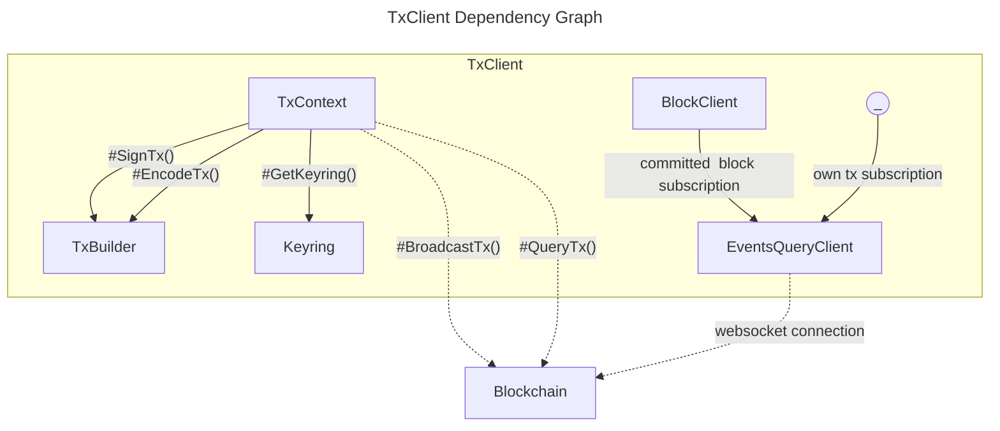

# Package `client`

> Standardized interfaces facilitating interactions with blockchain functionalities.

## Overview

The `client` package serves as a foundational layer for applications aiming to integrate with various blockchain platforms. It abstracts the complexities of sending, receiving, and querying blockchain data, ensuring a consistent experience irrespective of the underlying blockchain:

- **Simplifies Blockchain Interactions**: Provides a clear interface for initiating transactions and querying blockchain events without dealing with platform-specific quirks.
- **Modular and Extendable**: Designed with separation of concerns in mind, allowing developers to customize or replace components as necessary.
- **Unified Communication**: Regardless of the blockchain in use, the interfaces offer a standard way to communicate, streamlining the development process.

## Architecture Diagrams

Visual representations often make it easier to understand the design and flow of a package. Diagrams specific to this package can be added here.



> **Figure 1**: An overview diagram showing the interaction between the various interfaces and the blockchain.



> **Figure 2**: A focused look at how `TxClient` functions and interacts with the underlying blockchain.

## Installation

```bash
go get github.com/pokt-network/poktroll/pkg/client
```

## Features

- **TxClient Interface**: A streamlined way to sign and broadcast multiple messages as part of a blockchain transaction.
- **BlockClient Interface**: Notifications about newly committed blocks and access to the latest block.
- **EventsQueryClient**: Enables subscription to chain event messages.
- **Connection Interface**: A transport agnostic communication channel for sending and receiving messages.
- **Dialer**: Simplifies the establishment of connections.

## Usage

### Basic Example

```go
// Code example showcasing the use of TxClient or any other primary interface.
```

### Advanced Usage

```go
// Example illustrating advanced features or edge cases of the package.
```

### Configuration

- **TxClientOption**: Function type that modifies the `TxClient` allowing for flexible and optional configurations.
- **EventsQueryClientOption**: Modifies the `EventsQueryClient` to apply custom behaviors or configurations.

## API Reference

For the complete API details, see the [godoc](https://pkg.go.dev/github.com/pokt-network/poktroll/pkg/client).

## Best Practices

- **Use Abstractions**: Instead of directly communicating with blockchain platforms, leverage the provided interfaces for consistent and error-free interactions.
- **Stay Updated**: With evolving blockchain technologies, ensure to keep the package updated for any new features or security patches.

## FAQ

#### How does the `TxClient` interface differ from `TxContext`?

While `TxClient` is centered around signing and broadcasting transactions, `TxContext` consolidates operational dependencies for the transaction lifecycle, like building, encoding, and querying.

#### Can I extend or customize the provided interfaces?

Yes, the package is designed with modularity in mind. You can either implement the interfaces based on your requirements or extend them for additional functionalities.