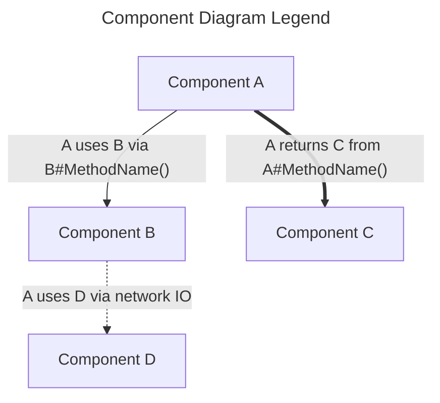
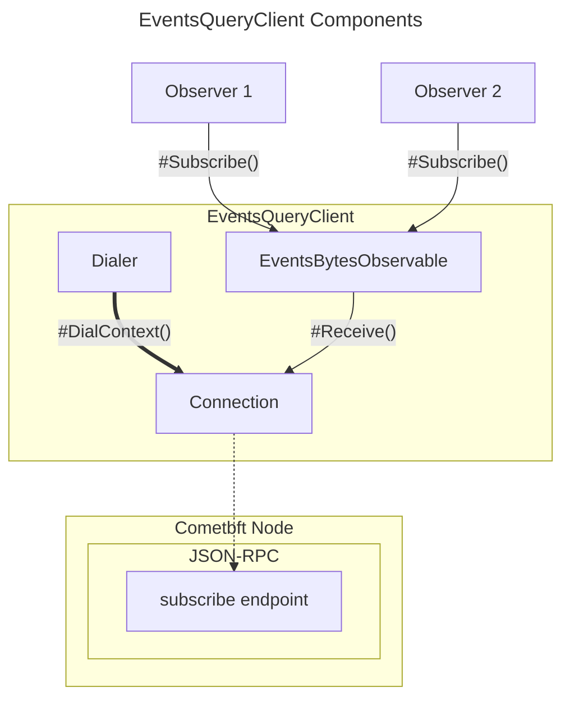
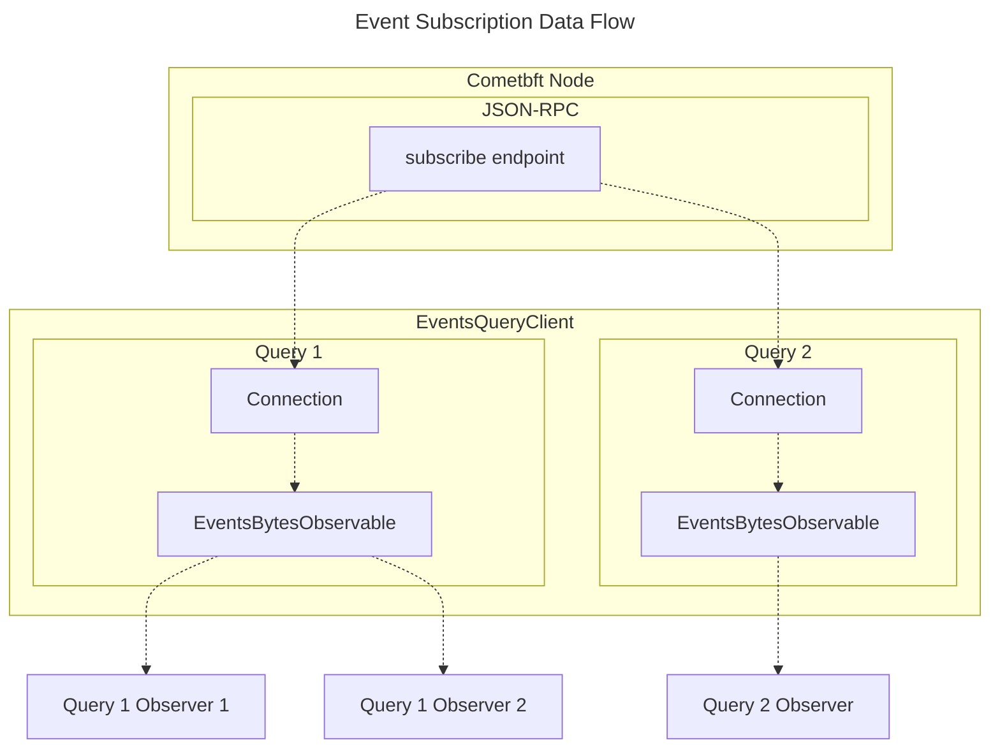

# Package `pocket/pkg/client/events_query` <!-- omit in toc -->

> An event query package for interfacing with [CometBFT](https://cometbft.com/) and the [Cosmos SDK](https://v1.cosmos.network/sdk), facilitating subscriptions to chain event messages.

- [Overview](#overview)
- [Architecture Diagrams](#architecture-diagrams)
  - [Components](#components)
  - [Subscriptions](#subscriptions)
- [Installation](#installation)
- [Features](#features)
- [Usage](#usage)
  - [Basic Example](#basic-example)
  - [Advanced Usage](#advanced-usage)
  - [Configuration](#configuration)
- [Best Practices](#best-practices)
- [FAQ](#faq)
    - [Why use `events_query` over directly using Gorilla WebSockets?](#why-use-events_query-over-directly-using-gorilla-websockets)
    - [How can I use a different connection mechanism other than WebSockets?](#how-can-i-use-a-different-connection-mechanism-other-than-websockets)

## Overview

The `events_query` package provides a client interface to subscribe to chain event messages. It abstracts the underlying connection mechanisms and offers a clear and easy-to-use way to get events from the chain. Highlights:

- Offers subscription to chain event messages matching a given query.
- Uses the Gorilla WebSockets package for underlying connection operations.
- Provides a modular structure with interfaces allowing for mock implementations and testing.
- Offers considerations for potential improvements and replacements, such as integration with the cometbft RPC client.

## Architecture Diagrams

### Components



### Subscriptions


## Installation

```bash
go get github.com/pokt-network/poktroll/pkg/client/events_query
```

## Features

- **Websocket Connection**: Uses the [Gorilla WebSockets](https://github.com/gorilla/websocket) for implementing the connection interface.
- **Events Subscription**: Subscribe to chain event messages using a simple query mechanism.
- **Dialer Interface**: Offers a `Dialer` interface for constructing connections, which can be easily mocked for tests.
- **Observable Pattern**: Integrates the observable pattern, making it easier to react to chain events.

## Usage

### Basic Example

```go
ctx := context.Background()

// Creating a new EventsQueryClient with the default, websocket dialer:
cometWebsocketURL := "ws://example.com"
evtClient := eventsquery.NewEventsQueryClient(cometWebsocketURL)

// Subscribing to a specific event, e.g. newly committed blocks:
// (see: https://docs.cosmos.network/v0.47/core/events#subscribing-to-events)
observable := evtClient.EventsBytes(ctx, "tm.event='NewBlock'")

// Subscribe and receive from the observer channel, typically in some other scope.
observer := observable.Subscribe(ctx)

// Observer channel closes when the context is cancelled, observer is
// unsubscribed, or after the subscription returns an error.
for eitherEvent := range observer.Ch() {
    // (see either.Either: https://github.com/pokt-network/poktroll/blob/main/pkg/either/either.go#L3)
    eventBz, err := eitherEvent.ValueOrError()	
	
    // ...
}
```

### Advanced Usage

```go
// Given some custom dialer & connection implementation, e.g.:
var (
    tcpDialer eventsquery.Dialer = exampletcp.NewTcpDialerImpl()
    grcpDialer eventsquery.Dialer = examplegrpc.NewGrpcDialerImpl()
)

// Both TCP and gRPC use the TCP scheme as gRPC uses TCP for its transport layer.
cometUrl = "tcp://example.com"

// Creating new EventsQueryClients with a custom tcpDialer:
tcpDialerOpt := eventsquery.WithDialer(tcpDialer)
tcpEvtClient := eventsquery.NewEventsQueryClient(cometUrl, tcpDialerOpt)

// Alternatively, with a custom gRPC dialer:
gcpDialerOpt := eventsquery.WithDialer(grcpDialer)
grpcEvtClient := eventsquery.NewEventsQueryClient(cometUrl, grpcDialerOpt)

// ... rest follows the same as the basic example.
```

### Configuration

- **WithDialer**: Configure the client to use a custom dialer for connections.

## Best Practices

- **Connection Handling**: Ensure to close the `EventsQueryClient` when done to free up resources and avoid potential leaks.
- **Error Handling**: Always check both the synchronous error returned by `EventsBytes` as well as asynchronous errors send over the observable.

## FAQ

#### Why use `events_query` over directly using Gorilla WebSockets?

`events_query` abstracts many of the underlying details and provides a streamlined interface for subscribing to chain events.
It also integrates the observable pattern and provides mockable interfaces for better testing.

#### How can I use a different connection mechanism other than WebSockets?

You can implement the `Dialer` and `Connection` interfaces and use the `WithDialer` configuration to provide your custom dialer.
