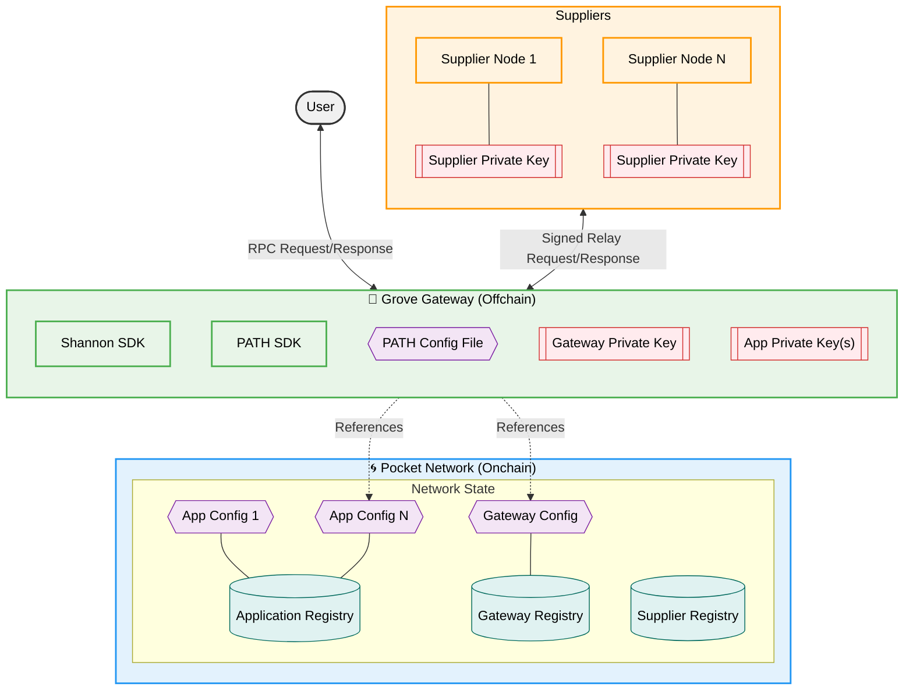

import ReactPlayer from "react-player";

:::warning 🖨 🍝 with Scripted Abstractions 🍝 🖨

Stake an onchain `Supplier` and run an offchain `RelayMiner` in less than an hour, without deep explanations.

:::

---

## Table of Contents <!-- omit in toc -->

- [High Level Architecture Diagram](#high-level-architecture-diagram)
- [20 Minute Video Walkthrough](#20-minute-video-walkthrough)
- [Prerequisites](#prerequisites)
  - [What will you do in this cheatsheet?](#what-will-you-do-in-this-cheatsheet)
- [Account Setup](#account-setup)
  - [1. Create Supplier account](#1-create-supplier-account)
  - [2. Prepare your environment](#2-prepare-your-environment)
  - [3. Fund the Supplier account](#3-fund-the-supplier-account)
- [Supplier Configuration](#supplier-configuration)
  - [1. Get your public URL](#1-get-your-public-url)
  - [2. Configure your Supplier](#2-configure-your-supplier)
  - [3. Stake your Supplier](#3-stake-your-supplier)
  - [4. Suppliers staked on behalf of Owners](#4-suppliers-staked-on-behalf-of-owners)
    - [How to check if you have an onchain account](#how-to-check-if-you-have-an-onchain-account)
- [RelayMiner Configuration](#relayminer-configuration)
  - [(Optional) Start the anvil node](#optional-start-the-anvil-node)
  - [1. Configure the RelayMiner](#1-configure-the-relayminer)
  - [2. Ensure the RelayMiner is funded with an onchain public key](#2-ensure-the-relayminer-is-funded-with-an-onchain-public-key)
  - [3. Start the RelayMiner](#3-start-the-relayminer)
  - [4. Test the RelayMiner](#4-test-the-relayminer)

## High Level Architecture Diagram



## 20 Minute Video Walkthrough

<ReactPlayer
  playing={false}
  controls
  url="https://github.com/user-attachments/assets/bafd0b3e-4968-4e92-ba8a-41b618633455"
/>

## Prerequisites

- [Install `pocketd` CLI](../../2_explore/2_account_management/1_pocketd_cli.md)
- [Create and fund account](../../2_explore/2_account_management/2_create_new_account_cli.md)
- [Stake or find a `service`](1_service_cheatsheet.md)
- [Review hardware requirements](../4_faq/6_hardware_requirements.md)

:::note Optional Vultr Setup

The instructions on this page assume you have experience maintaining backend services.

You can reference the [Vultr Playbook](../5_playbooks/1_vultr.md) for a quick guide on how to set up a server with Vultr.

:::

### What will you do in this cheatsheet?

1. Stake a `Supplier` (i.e. onchain record)
2. Deploy a `RelayMiner` (i.e. offchain coprocessor)
3. Serve relays
4. Claim rewards
5. Submit proofs
6. Earn rewards for onchain services

## Account Setup

### 1. Create Supplier account

```bash
pocketd keys add supplier
```

### 2. Prepare your environment

Create the following environment variables:

```bash
cat > ~/.pocketrc << EOF
export SUPPLIER_ADDR=$(pocketd keys show supplier -a)
export TX_PARAM_FLAGS="--gas=auto --gas-prices=1upokt --gas-adjustment=1.5 --yes"
export BETA_NODE_FLAGS="--network=beta"
export BETA_NETWORK="pocket-beta"
export BETA_RPC_URL="https://shannon-testnet-grove-rpc.beta.poktroll.com"
export BETA_GRPC_URL="https://shannon-testnet-grove-grpc.beta.poktroll.com:443"
export BETA_GRPC_URL_RAW="shannon-testnet-grove-grpc.beta.poktroll.com:443"
```

And source them in your shell:

```bash
echo "source ~/.pocketrc" >> ~/.profile
source ~/.profile
```

### 3. Fund the Supplier account

1. Retrieve your Supplier address:

   ```bash
   echo "Supplier address: $SUPPLIER_ADDR"
   ```

2. Fund your account by going to [Shannon Beta TestNet faucet](https://faucet.beta.testnet.pokt.network/) or running:

   ```bash
   pocketd tx bank send $FUNDING_ADDR $SUPPLIER_ADDR 100000000upokt --network=beta --fees=100upokt --unordered --timeout-duration=5s --yes
   ```

3. Check balance:

   ```bash
   pocketd query bank balances $SUPPLIER_ADDR $BETA_NODE_FLAGS
   ```

## Supplier Configuration

For more details on supplier configurations, see the full [supplier config docs](../3_configs/3_supplier_staking_config.md).

### 1. Get your public URL

Retrieve your external IP:

```bash
EXTERNAL_IP=$(curl -4 ifconfig.me/ip)
```

Pick a public port to open (e.g. 8545):

```bash
sudo ufw allow 8545/tcp
```

Your supplier will be accessible at:

```bash
echo http://${EXTERNAL_IP}:8545
```

### 2. Configure your Supplier

Prepare the stake supplier config:

```bash
cat <<🚀 > /tmp/stake_supplier_config.yaml
owner_address: $SUPPLIER_ADDR
operator_address: $SUPPLIER_ADDR
stake_amount: 1000069upokt
default_rev_share_percent:
  $SUPPLIER_ADDR: 100
services:
  - service_id: "anvil" # change if not using Anvil
    endpoints:
      - publicly_exposed_url: http://$EXTERNAL_IP:8545 # must be public
        rpc_type: JSON_RPC
🚀
```

:::note Replace `service_id`

The example uses `service_id: anvil`.
Use your own service_id or [create a new one](1_service_cheatsheet.md).

:::

:::warning Revenue Share Update Permissions (Operator-Only Updates)

**Revenue share addresses and percentages CAN ONLY be updated by the OPERATOR account.**

In this example, both `owner_address` and `operator_address` are the same (custodial staking).
This means the same account can update both stake amounts and revenue share configurations.
For non-custodial staking, only the operator can modify revenue share settings.

:::

### 3. Stake your Supplier

Submit the staking transaction:

```bash
pocketd tx supplier stake-supplier \
  --config /tmp/stake_supplier_config.yaml \
  --from=$SUPPLIER_ADDR $TX_PARAM_FLAGS $BETA_NODE_FLAGS
```

And check the status onchain:

```bash
pocketd query supplier show-supplier $SUPPLIER_ADDR $BETA_NODE_FLAGS
```

### 4. Suppliers staked on behalf of Owners

:::warning Critical must read for suppliers staked on behalf of owners

Make sure to read this section if your supplier WAS NOT staked by the operator

:::

<details>
<summary>Additional requirements for suppliers staked on behalf of owners</summary>

**Problem**: Suppliers WITHOUT onchain public keys for their operators CANNOT sign Relay Responses and will be **sanctioned by PATH**.

**Root Cause**: A supplier operator may have an onchain account, but it does not necessarily mean it has an onchain public key until it signs its first onchain transaction.

**Solution**: Submit any onchain transaction where `--from` is the operator address.

Any transaction will work. For example, a small transfer

```bash
pocketd tx bank send <your_supplier_operator_address> <some_address_you_own> 1upokt --from=<your_supplier_operator_address> ...
```

#### How to check if you have an onchain account

```bash
pocketd q auth account <your_supplier_operator_address> ...
```

Account without public key:

```yaml
account:
  type: /cosmos.auth.v1beta1.BaseAccount
  value:
    account_number: "..."
    address: pokt1...
    sequence: "..."
```

Account with public key:

```yaml
account:
  type: /cosmos.auth.v1beta1.BaseAccount
  value:
    account_number: "..."
    address: pokt1...
    public_key:
      type: /cosmos.crypto.secp256k1.PubKey
      value: Ap/Nr...
    sequence: "..."
```

</details>

## RelayMiner Configuration

See [RelayMiner config docs](../3_configs/4_relayminer_config.md) for all options.

### (Optional) Start the anvil node

If using `service_id: anvil`, run a local Anvil node:

<details>
<summary>How to run Anvil</summary>

```bash
curl -L https://foundry.paradigm.xyz | bash
source ~/.foundry/bin
foundryup
anvil --port 8546
```

Test:

```bash
curl -X POST http://127.0.0.1:8546 \
  -H "Content-Type: application/json" \
  -d '{"jsonrpc": "2.0", "id": 1, "method": "eth_blockNumber", "params": []}'
```

</details>

### 1. Configure the RelayMiner

Prepare the RelayMiner (i.e. the offchain co-processor) config:

```bash
cat <<🚀 > /tmp/relayminer_config.yaml
default_signing_key_names:
  - supplier
smt_store_path: $HOME/.pocket/smt
pocket_node:
  query_node_rpc_url: $BETA_RPC_URL
  query_node_grpc_url: $BETA_GRPC_URL
  tx_node_rpc_url: $BETA_RPC_URL
suppliers:
  - service_id: "anvil" # change if not using Anvil
    service_config:
      backend_url: "http://127.0.0.1:8546" # change if not using Anvil
    listen_url: http://0.0.0.0:8545 # must match Supplier's public URL
metrics:
  enabled: false
  addr: :9090
pprof:
  enabled: false
  addr: :6060
🚀
```

### 2. Ensure the RelayMiner is funded with an onchain public key

The RelayMiner is responsible

Supplier Public Key Issue Fix
Problem: New suppliers without public keys on-chain can't validate relay responses during their first session, even after delivering claims.
Root Cause: Igniter allows staking without operator signatures, leaving suppliers without required public keys.
Solution:

Ensure operators sign at least one transaction before staking
First claim submission will set the public key on-chain
Monitor for suppliers missing public keys

Consequences: Session-long relay validation failures until public key is established.
Status: Fleet re-staked, monitoring solution in development.

### 3. Start the RelayMiner

Start the RelayMiner (i.e. the offchain co-processor) server:

```bash
pocketd \
  relayminer start \
  --log_level=debug \
  --config=/tmp/relayminer_config.yaml \
  --chain-id=$BETA_NETWORK
```

### 4. Test the RelayMiner

After following the instructions in the [Gateway cheatsheet](5_gateway_cheatsheet.md).

You will need a staked `Application` to send a relay request to your supplier assuming it is staked for the same service:

The following is an example of a relay request to an Anvil (i.e. EVM) node:

```bash
pocketd relayminer relay \
  --app=$APP_ADDR \
  --supplier=$SUPPLIER_ADDR \
  --node=$BETA_RPC_URL \
  --grpc-addr=$BETA_GRPC_URL_RAW \
  --payload="{\"jsonrpc\": \"2.0\", \"id\": 1, \"method\": \"eth_blockNumber\", \"params\": []}"
```

:::warning Specifying a supplier

The request will fail if the specified supplier is not in the session at the time of the relay.

:::

<details>
<summary>*tl;dr example staking an application for `anvil`*</summary>

**Create an application:**

```bash
pocketd keys add application
```

Fund it (faucet or other).

**Prepare the stake config:**

```bash
cat <<🚀 > /tmp/stake_app_config.yaml
stake_amount: 100000000upokt
service_ids:
  - "anvil"
🚀
```

**Stake it:**

```bash
pocketd tx application stake-application \
  --config=/tmp/stake_app_config.yaml \
  --from=$(pocketd keys show application -a) $TX_PARAM_FLAGS $BETA_NODE_FLAGS
```

**Check the staking status:**

```bash
pocketd query application show-application $(pocketd keys show application -a) $BETA_NODE_FLAGS
```

</details>
