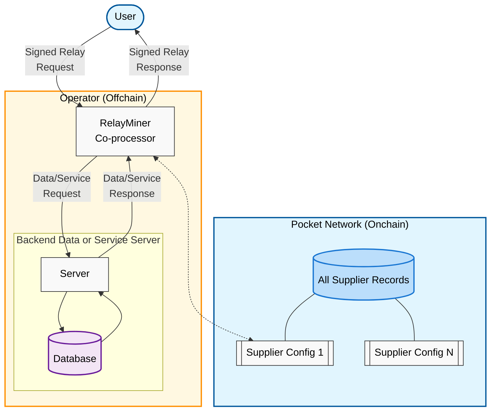

import ReactPlayer from "react-player";

**🖨 🍝 Quickstart: Run a `RelayMiner` after staking a `Supplier` on Pocket Network**

:::warning
This is copy-paste scripting. No deep explanations here.

TODO(@olshansk): Add a Supplier walkthrough.
:::

---

## Table of Contents <!-- omit in toc -->

- [High Level Diagram: Supplier \& RelayMiner](#high-level-diagram-supplier--relayminer)
- [Video Walkthrough](#video-walkthrough)
- [Prerequisites](#prerequisites)
  - [What will you do?](#what-will-you-do)
- [Account Setup](#account-setup)
  - [1. Create Supplier account](#1-create-supplier-account)
  - [2. Prepare your environment](#2-prepare-your-environment)
  - [3. Fund the Supplier account](#3-fund-the-supplier-account)
- [Supplier Configuration](#supplier-configuration)
  - [1. Get your public URL](#1-get-your-public-url)
  - [2. Configure your Supplier](#2-configure-your-supplier)
  - [3. Stake your Supplier](#3-stake-your-supplier)
- [RelayMiner Configuration](#relayminer-configuration)
  - [(Optional) Start the anvil node](#optional-start-the-anvil-node)
  - [1. Configure the RelayMiner](#1-configure-the-relayminer)
  - [2. Start the RelayMiner](#2-start-the-relayminer)

## High Level Diagram: Supplier & RelayMiner



## Video Walkthrough

~20 min walkthrough using this cheatsheet:

<ReactPlayer
  playing={false}
  controls
  url="https://github.com/user-attachments/assets/bafd0b3e-4968-4e92-ba8a-41b618633455"
/>

## Prerequisites

- [Install `pocketd` CLI](../../2_explore/2_account_management/1_pocketd_cli.md)
- [Create/fund account](../../2_explore/2_account_management/2_create_new_account_cli.md)
- [Stake or find a `service`](1_service_cheatsheet.md)
- [Check hardware requirements](../4_faq/6_hardware_requirements.md)

### What will you do?

- Stake a `Supplier` (onchain API record)
- Deploy a `RelayMiner` (offchain coprocessor)
- Serve relays and claim rewards

## Account Setup

### 1. Create Supplier account

```bash
pocketd keys add supplier
```

### 2. Prepare your environment

```bash
cat > ~/.pocketrc << 'EOF'
export SUPPLIER_ADDR=$(pocketd keys show supplier -a)
export TX_PARAM_FLAGS="--gas=auto --gas-prices=1upokt --gas-adjustment=1.5 --yes"
export BETA_NODE_FLAGS="--chain-id=pocket-beta --node=https://shannon-testnet-grove-rpc.beta.poktroll.com"
export BETA_RPC_URL="https://shannon-testnet-grove-rpc.beta.poktroll.com"
export BETA_GRPC_URL="https://shannon-testnet-grove-grpc.beta.poktroll.com:443"
EOF
```

```bash
echo "source ~/.pocketrc" >> ~/.profile
source ~/.profile
```

### 3. Fund the Supplier account

```bash
echo "Supplier address: $SUPPLIER_ADDR"
```

- Go to [Shannon Beta TestNet faucet](https://faucet.beta.testnet.pokt.network/) and fund your account.

Check balance:

```bash
pocketd query bank balances $SUPPLIER_ADDR $BETA_NODE_FLAGS
```

:::tip watch and wait

```bash
watch -n 5 "pocketd query bank balances $SUPPLIER_ADDR $BETA_NODE_FLAGS"
```

:::

## Supplier Configuration

See [Supplier config docs](../3_configs/3_supplier_staking_config.md) for all options.

### 1. Get your public URL

```bash
EXTERNAL_IP=$(curl -4 ifconfig.me/ip)
```

- Pick a public port (e.g. 8545) and open it:

```bash
sudo ufw allow 8545/tcp
```

- Your public URL: `http://$EXTERNAL_IP:8545`

### 2. Configure your Supplier

:::important
The example uses `service_id: anvil`.
Use your own service_id or [create a new one](1_service_cheatsheet.md).
:::

```bash
cat <<🚀 > /tmp/stake_supplier_config.yaml
owner_address: $SUPPLIER_ADDR
operator_address: $SUPPLIER_ADDR
stake_amount: 1000069upokt
default_rev_share_percent:
  $SUPPLIER_ADDR: 100
services:
  - service_id: "anvil" # change if not using Anvil
    endpoints:
      - publicly_exposed_url: http://$EXTERNAL_IP:8545 # must be public
        rpc_type: JSON_RPC
🚀
```

### 3. Stake your Supplier

```bash
pocketd tx supplier stake-supplier \
  --config /tmp/stake_supplier_config.yaml \
  --from=$SUPPLIER_ADDR $TX_PARAM_FLAGS $BETA_NODE_FLAGS
```

Check status:

```bash
pocketd query supplier show-supplier $SUPPLIER_ADDR $BETA_NODE_FLAGS
```

## RelayMiner Configuration

See [RelayMiner config docs](../3_configs/4_relayminer_config.md) for all options.

### (Optional) Start the anvil node

If using `service_id: anvil`, run a local Anvil node:

<details>
<summary>How to run Anvil</summary>

```bash
curl -L https://foundry.paradigm.xyz | bash
source ~/.foundry/bin
foundryup
anvil --port 8546
```

Test:

```bash
curl -X POST http://127.0.0.1:8546 \
  -H "Content-Type: application/json" \
  -d '{"jsonrpc": "2.0", "id": 1, "method": "eth_blockNumber", "params": []}'
```

</details>

### 1. Configure the RelayMiner

```bash
cat <<🚀 > /tmp/relayminer_config.yaml
default_signing_key_names:
  - supplier
smt_store_path: $HOME/.pocket/smt
pocket_node:
  query_node_rpc_url: $BETA_RPC_URL
  query_node_grpc_url: $BETA_GRPC_URL
  tx_node_rpc_url: $BETA_RPC_URL
suppliers:
  - service_id: "anvil" # change if not using Anvil
    service_config:
      backend_url: "http://127.0.0.1:8546" # change if not using Anvil
    listen_url: http://0.0.0.0:8545 # must match Supplier's public URL
metrics:
  enabled: false
  addr: :9090
pprof:
  enabled: false
  addr: :6060
🚀
```

### 2. Start the RelayMiner

```bash
pocketd \
  relayminer \
  --grpc-insecure=false \
  --log_level=debug \
  --config=/tmp/relayminer_config.yaml
```
