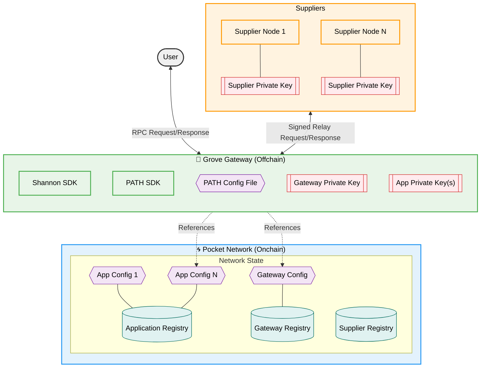

:::warning 🖨 🍝 with Scripted Abstractions 🍝 🖨

Stake an onchain `Application`, delegate to an onchain `Gateway`, and run an offchain `PATH` Gateway in less than an hour, without deep explanations.

:::

## Table of Contents <!-- omit in toc -->

- [High Level Architecture Diagram](#high-level-architecture-diagram)
- [30 Minute Video Walkthrough](#30-minute-video-walkthrough)
- [Prerequisites](#prerequisites)
  - [What will you do in this cheatsheet?](#what-will-you-do-in-this-cheatsheet)
- [Account Setup](#account-setup)
  - [1. Create Application account](#1-create-application-account)
  - [2. Create Gateway account](#2-create-gateway-account)
  - [3. Prepare your environment](#3-prepare-your-environment)
  - [4. Fund the Gateway and Application accounts](#4-fund-the-gateway-and-application-accounts)
- [Gateway and Application Configurations](#gateway-and-application-configurations)
  - [1. Stake the `Gateway`](#1-stake-the-gateway)
  - [2. Stake the `Application`](#2-stake-the-application)
  - [3. Delegate the `Application` to the `Gateway`](#3-delegate-the-application-to-the-gateway)
- [Send a test relay](#send-a-test-relay)
  - [EVM Example](#evm-example)
- [`PATH` Gateway Setup](#path-gateway-setup)

## High Level Architecture Diagram



## 30 Minute Video Walkthrough

Coming soon...

## Prerequisites

- [Install `pocketd` CLI](../../2_explore/2_account_management/1_pocketd_cli.md)
- [Create and fund account](../../2_explore/2_account_management/2_create_new_account_cli.md)
- [Stake or find a `service`](1_service_cheatsheet.md)
- [Review hardware requirements](../4_faq/6_hardware_requirements.md)

:::note Optional Vultr Setup

The instructions on this page assume you have experience maintaining backend services.

You can reference the [Vultr Playbook](../5_playbooks/1_vultr.md) for a quick guide on how to set up a server with Vultr.

:::

### What will you do in this cheatsheet?

1. Stake an `Application` (i.e. onchain record)
2. Stake a `Gateway` (i.e. onchain record)
3. Deploy a `PATH` Gateway (i.e. offchain coprocessor)
4. Send relays
5. Pay for onchain services

## Account Setup

### 1. Create Application account

```bash
pocketd keys add application
```

### 2. Create Gateway account

```bash
pocketd keys add gateway
```

### 3. Prepare your environment

Create the following environment variables:

```bash
cat > ~/.pocketrc << EOF
export APP_ADDR=$(pocketd keys show application -a)
export GATEWAY_ADDR=$(pocketd keys show gateway -a)
export TX_PARAM_FLAGS="--gas=auto --gas-prices=1upokt --gas-adjustment=1.5 --yes"
export BETA_NODE_FLAGS="--network=beta"
export BETA_RPC_URL="https://shannon-testnet-grove-rpc.beta.poktroll.com"
export BETA_GRPC_URL="https://shannon-testnet-grove-grpc.beta.poktroll.com:443"
export BETA_GRPC_URL_RAW="shannon-testnet-grove-grpc.beta.poktroll.com:443"
EOF
```

And source them in your shell:

```bash
echo "source ~/.pocketrc" >> ~/.profile
source ~/.profile
```

### 4. Fund the Gateway and Application accounts

1. Retrieve your Gateway and Application addresses:

   ```bash
   echo "Gateway address: $GATEWAY_ADDR"
   echo "Application address: $APP_ADDR"
   ```

2. Fund your account by going to [Shannon Beta TestNet faucet](https://faucet.beta.testnet.pokt.network/).

3. Check balance:

   ```bash
   pocketd query bank balances $GATEWAY_ADDR $BETA_NODE_FLAGS
   pocketd query bank balances $APP_ADDR $BETA_NODE_FLAGS
   ```

:::tip 🌿 Grove employees only

<details>

<summary>`pkd` helpers</summary>

```bash
# Fund your account
pkd_beta_fund $GATEWAY_ADDR
pkd_beta_fund $APP_ADDR

# Check balance
pkd_beta_query bank balances $GATEWAY_ADDR
pkd_beta_query bank balances $APP_ADDR
```

</details>

:::

## Gateway and Application Configurations

### 1. Stake the `Gateway`

Create a Gateway staking config:

```bash
cat <<🚀 > /tmp/stake_gateway_config.yaml
stake_amount: 1000000upokt
🚀
```

And run the following command to stake the `Gateway`:

```bash
pocketd tx gateway stake-gateway \
  --config=/tmp/stake_gateway_config.yaml \
  --from=$GATEWAY_ADDR $TX_PARAM_FLAGS $NODE_FLAGS
```

After the next block settles, you can check the `Gateway`'s status like so:

```bash
pocketd query gateway show-gateway $GATEWAY_ADDR $NODE_FLAGS
```

### 2. Stake the `Application`

Create an Application staking config:

```bash
cat <<🚀 > /tmp/stake_app_config.yaml
stake_amount: 100000000upokt
service_ids:
  - "anvil"
🚀
```

And run the following command to stake the `Application`:

```bash
pocketd tx application stake-application \
  --config=/tmp/stake_app_config.yaml \
  --from=$APP_ADDR $TX_PARAM_FLAGS $NODE_FLAGS
```

After the next block settles, you can check the `Application`'s status like so:

```bash
pocketd query application show-application $APP_ADDR $NODE_FLAGS
```

### 3. Delegate the `Application` to the `Gateway`

```bash
pocketd tx application delegate-to-gateway $GATEWAY_ADDR --from=$APP_ADDR $TX_PARAM_FLAGS $NODE_FLAGS
```

After about a minute, you can check the `Application`'s status like so:

```bash
pocketd query application show-application $APP_ADDR $NODE_FLAGS
```

## Send a test relay

You can run `pocketd relayminer relay --help` to use a helper utility to send a test relay from your staked `application`.

### EVM Example

```bash
pocketd relayminer relay \
    --app=${APP_ADDR} \
    --node=${BETA_RPC_URL} \
    --grpc-addr=${BETA_GRPC_URL_RAW} \
    --grpc-insecure=false \
    --keyring-backend="$POCKET_TEST_KEYRING_BACKEND" --home="$POCKET_HOME_PROD" \
    --payload="{\"jsonrpc\": \"2.0\", \"id\": 1, \"method\": \"eth_blockNumber\", \"params\": []}"
```

:::warning Optional: Specify a supplier

You can specify a supplier by using the `--supplier=<SUPPLIER_ADDR>` flag.

Note that it will fail if the specified supplier is not in the session at the time of the relay.

:::

## `PATH` Gateway Setup

The documentation for everything related to `PATH` can be found at [path.grove.city](https://path.grove.city/).

In particular, now that you have an `Application` and `Gateway` staked, you can follow the [Configure PATH for Shannon](https://path.grove.city/develop/path/cheatsheet_shannon#2-configure-path-for-shannon) sections of the `PATH` documentation.
