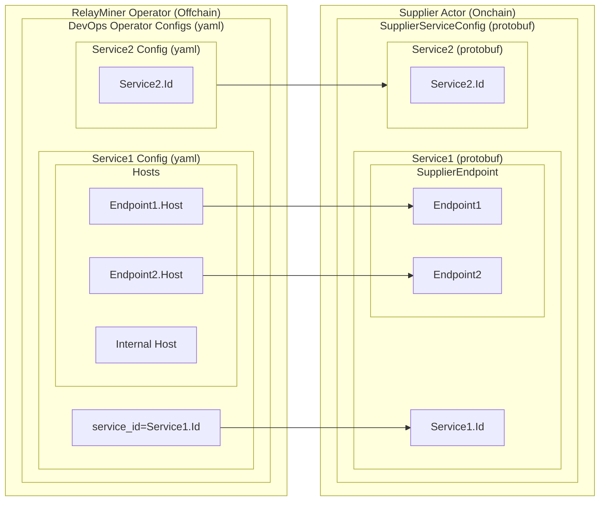
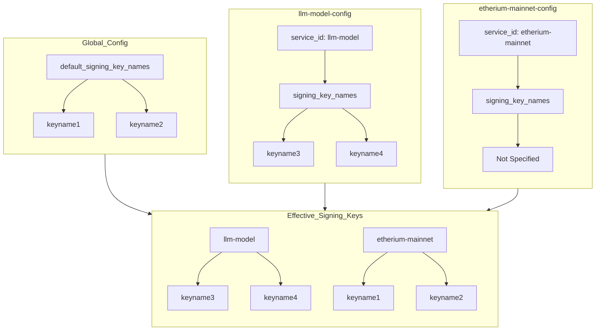
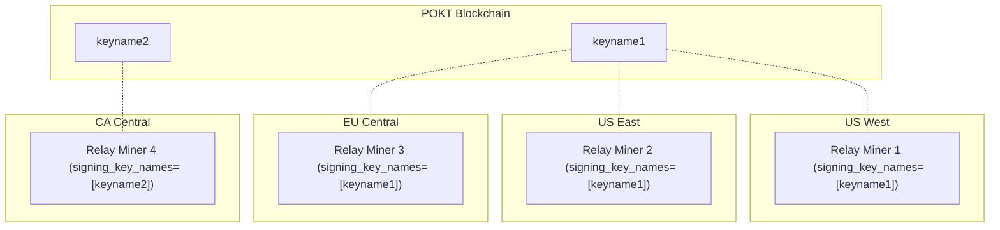

This document describes the configuration options for the `RelayMiner`, a `Supplier`
co-processor/sidecar that acts as the real server for querying request, building
claims, and submitting proofs.

:::tip

You can find a fully featured example configuration at [relayminer_config_full_example.yaml](https://github.com/pokt-network/poktroll/tree/main/localnet/pocketd/config/relayminer_config_full_example.yaml).

:::

- [Introduction](#introduction)
- [Usage](#usage)
- [Structure](#structure)
- [Global options](#global-options)
  - [`default_signing_key_names`](#default_signing_key_names)
  - [`default_request_timeout_seconds`](#default_request_timeout_seconds)
  - [`default_max_body_size`](#default_max_body_size)
  - [`smt_store_path`](#smt_store_path)
  - [`enable_over_servicing`](#enable_over_servicing)
  - [`enable_eager_relay_request_validation`](#enable_eager_relay_request_validation)
  - [`metrics`](#metrics)
  - [`pprof`](#pprof)
  - [`ping`](#ping)
- [Pocket node connectivity](#pocket-node-connectivity)
  - [`query_node_rpc_url`](#query_node_rpc_url)
  - [`query_node_grpc_url`](#query_node_grpc_url)
  - [`tx_node_rpc_url`](#tx_node_rpc_url)
- [Suppliers](#suppliers)
  - [`service_id`](#service_id)
  - [`signing_key_names`](#signing_key_names)
  - [`listen_url`](#listen_url)
  - [`request_timeout_seconds`](#request_timeout_seconds)
  - [`max_body_size`](#max_body_size)
  - [`service_config`](#service_config)
    - [`backend_url`](#backend_url)
    - [`authentication`](#authentication)
    - [`headers`](#headers)
    - [`forward_pocket_headers`](#forward_pocket_headers)
  - [`rpc_type_service_configs`](#rpc_type_service_configs)
- [Configuring Signing Keys](#configuring-signing-keys)
  - [Example Configuration](#example-configuration)
- [Supported server types](#supported-server-types)
- [Payable Proof Submissions](#payable-proof-submissions)
  - [Overview](#overview)
  - [Key Requirements for Operators](#key-requirements-for-operators)
  - [Recommendations for Supplier Operators](#recommendations-for-supplier-operators)
- [Recommended Full / RPC Node Configuration for RelayMiners](#recommended-full--rpc-node-configuration-for-relayminers)
  - [Why does a RelayMiner's Full Node need custom configurations?](#why-does-a-relayminers-full-node-need-custom-configurations)
  - [Required `config.toml` Config Adjustments](#required-configtoml-config-adjustments)
  - [How to Calculate Scalable Values?](#how-to-calculate-scalable-values)
  - [Example Full Node Config Changes](#example-full-node-config-changes)

## Introduction

The following diagram illustrates how the _offchain_ `RelayMiner` operator
config (yaml) MUST match the _onchain_ `Supplier` actor service endpoints
for correct and deterministic behavior.

If these do not match, the behavior is non-deterministic and could result in
a variety of errors such as bad QoS, incorrect proxying, burning of the actor, etc...

_Assuming that the onchain endpoints 1 and 2 have different hosts_



## Usage

The `RelayMiner` start command accepts a `--config` flag that points to a configuration
`yaml` file that will be used to setup the `RelayMiner` instance.

```bash
pocketd relayminer --config ./relayminer_config.yaml --keyring-backend test
```

## Structure

The `RelayMiner` configuration file is a `yaml` file that contains `global options`
and `supplier` specific sections and configurations.

## Global options

```yaml
default_signing_key_names: [<string>, <string>]
default_request_timeout_seconds: <uint64>
default_max_body_size: <string>
smt_store_path: <string>
enable_over_servicing: <boolean>
enable_eager_relay_request_validation: <boolean>
```

### `default_signing_key_names`

_`Required`_ if `suppliers.*.signing_key_names` is not specified.

This configuration option specifies a list of key names from the keyring that the
`RelayMiner` will use to sign transactions (i.e. `SupplierOperator`).
These key names are used to derive the public key and the corresponding address,
which are essential for interacting with POKT.
Each key name listed here must be present in the keyring used to start the
`RelayMiner` instance.

For more details, see [Configuring Signing Keys](#configuring-signing-keys).

### `default_request_timeout_seconds`

_`Optional`_

The default timeout duration in seconds for relay requests. This value is used
when a supplier does not specify its own `request_timeout_seconds` configuration.
If neither `default_request_timeout_seconds` nor supplier-specific `request_timeout_seconds`
is configured, the `RelayMiner` will use a system default.

This timeout applies to the duration that the `RelayMiner` will wait for a response
from the backend service before considering the request as timed out.

### `default_max_body_size`

_`Optional`_

The default max payload size for requests and responses. This value is used
when a supplier does not specify its own `max_body_size` configuration.
If neither `default_max_body_size` nor supplier-specific `max_body_size`
is configured, the `RelayMiner` will use a system default.

This max payload size applies to the request and response size that the `RelayMiner` will accepts.

Supports common unit suffixes like `B`, `KB`, `MB`, `GB`, or `TB`

Defaults to: 20MB

### `smt_store_path`

_`Required`_

The relative or absolute path to the directory where the `RelayMiner` will store
the `SparseMerkleTree` data on disk. This directory is used to persist the `SMT`
in a BadgerDB KV store data files.

**In-memory storage options:**

- `:memory:` - Uses SimpleMap (pure Go map) for in-memory storage. **Recommended**.
- `:memory_pebble:` - Uses Pebble database with in-memory VFS. Experimental option with more overhead.

:::warning TODO(#1734) Experimentation in flight

**This update is as of 08/2025.**

In-memory storage enables relay miners to be significantly more performant. For this reason, `:memory:` is the recommended option.

**Warning:** Prior to #1734, RelayMiner restarts will result in loss of session state.

**Consideration**: Once experimentation is complete, there will either only be one in-memory storage option or a proper enum will be created (disk, memory_simple, memory_pebble).

:::

### `enable_over_servicing`

_`Optional`_ (default: `false`)

Enables or disables over-servicing functionality for the `RelayMiner`.

When set to `true`, the Supplier can provide services beyond what an Application's
stake can cover in a given session. This means the Supplier will mine relays for
"free" without being compensated onchain for the additional service.

Over-servicing is commonly used by Suppliers to:

- Build goodwill with Applications
- Improve their off-chain quality-of-service rating

When disabled (`false`), the `RelayMiner` will strictly enforce rate limiting based
on the Application's allocated stake, rejecting requests that would exceed the
Application's ability to pay.

### `enable_eager_relay_request_validation`

_`Optional`_ (default: `false`)

Controls when validation happens relative to forwarding the request.

| Mode                    | Value   | Behavior                                                                                       | Pros                               | Cons                                                        | When to Use                                                                                                                                                                        |
| ----------------------- | ------- | ---------------------------------------------------------------------------------------------- | ---------------------------------- | ----------------------------------------------------------- | ---------------------------------------------------------------------------------------------------------------------------------------------------------------------------------- |
| **Eager Mode**          | `true`  | Validate first (signature, session, rate limiting), serve later                                | Predictable backend load           | Higher per-request latency                                  | Use when you prefer strict validation before backend load (e.g., highly constrained backends or when minimizing optimistic risk is critical).                                      |
| **Lazy Mode (default)** | `false` | Serve first for unknown sessions, then validate later. Known sessions still validate up-front. | Best cold-start throughput/latency | May transiently forward requests that later fail validation | Use to optimize throughput and latency during cold starts or when many sessions are initially unknown. Improves perceived QoS but may forward requests that later fail validation. |

### `metrics`

_`Optional`_

This section configures a Prometheus exporter endpoint, enabling the collection
and export of metrics data. The `addr` field specifies the network address for
the exporter to bind to. It can be either a port number, which assumes binding
to all interfaces, or a specific host:port combination.

Example configuration:

```yaml
metrics:
  enabled: true
  addr: :9090
```

When `enabled` is set to `true`, the exporter is active. The addr `value` of
`:9090` implies the exporter is bound to port 9090 on all available network
interfaces.

### `pprof`

_`Optional`_

Configures a [pprof](https://github.com/google/pprof/blob/main/doc/README.md)
endpoint for troubleshooting and debugging performance issues.

Example configuration:

```yaml
pprof:
  enabled: true
  addr: localhost:6060
```

You can learn how to use that endpoint on the [Performance Troubleshooting](../../4_develop/developer_guide/performance_troubleshooting.md) page.

### `ping`

_`Optional`_

Configures a `ping` health check server to test the connectivity of all backend
URLs. If all the backend URLs are reachable, the endpoint returns a 204 HTTP
Code. If one or more backend URLs aren't reachable, the service returns an
appropriate HTTP error.

Example configuration:

```yaml
ping:
  enabled: true
  addr: localhost:8081
```

## Pocket node connectivity

```yaml
pocket_node:
  query_node_rpc_url: tcp://<hostname>:<port>
  query_node_grpc_url: tcp://<hostname>:<port>
  tx_node_rpc_url: tcp://<hostname>:<port>
```

### `query_node_rpc_url`

_`Required`_

The RPC URL of the Pocket node that allows the `RelayMiner` to subscribe to events
via websockets. It is then re-formatted as `ws://<hostname>:<port>/websocket`
and establishes a persistent connection to the Pocket node to stream events such as
latest blocks, application staking events, etc...
If unspecified, `tx_node_rpc_url` value will be used.

### `query_node_grpc_url`

_`Optional`_

The gRPC URL of the Pocket node that allows the `RelayMiner` to query/pull data from
the Pocket network (eg. Sessions, Accounts, etc...).

### `tx_node_rpc_url`

_`Required`_

The RPC URL of the Pocket node that allows the `RelayMiner` to broadcast transactions
to the a Pocket network Tendermint node.
It may have a different host than the `query_node_rpc_url` but the same value is
acceptable too.

## Suppliers

The `suppliers` section configures the services that the `RelayMiner` will offer
to Pocket Network. It specifies exactly where those requests will be forwarded
to by the Supplier's infrastructure.

Each suppliers entry's `service_id` MUST reflect the onchain `Service.Id` the
supplier staked for.

At least one supplier is required for the `RelayMiner` to be functional.

```yaml
suppliers:
  - service_id: <string>
    listen_url: <enum{http}>://<host>
    request_timeout_seconds: <uint64>
    service_config:
      backend_url: <url>
      forward_pocket_headers: <boolean>
      authentication:
        username: <string>
        password: <string>
      headers:
        <key>: <value>
```

### `service_id`

_`Required`_, _`Unique`_

The Id of the service which will be used as a unique identifier to reference
a service provided by the `Supplier` and served by the `RelayMiner` instance.

It MUST match the `Service.Id` specified by the supplier when staking for the
service.

### `signing_key_names`

_`Required`_ if `default_signing_key_names` is empty.

This option specifies the list of signing key names specific to a supplier.
If a supplier does not provide its own `signing_key_names`, the `RelayMiner` will use the `default_signing_key_names`.

For more details, see [Configuring Signing Keys](#configuring-signing-keys).

### `listen_url`

_`Required`_

The address on which the `RelayMiner` will start a server to listen for incoming
requests. The server type is inferred from the URL scheme (http, https, etc...).

### `request_timeout_seconds`

_`Optional`_

The timeout duration in seconds for relay requests specific to a supplier's service.
This value overrides the global `default_request_timeout_seconds` setting for
this particular supplier's service.

If not specified, the `default_request_timeout_seconds` will be used.

This timeout controls how long the `RelayMiner` will wait for a response from
the backend service before considering the request as failed and returning a
timeout error to the client.

### `max_body_size`

_`Optional`_

The max body size for relay requests specific to a supplier's service.
This value overrides the global `default_max_body_size` setting for
this particular supplier's service.

If not specified, the `default_max_body_size` will be used.

This max payload size applies to the request and response size that the `RelayMiner` will accepts.

Supports common unit suffixes like `B`, `KB`, `MB`, `GB`, or `TB`

Defaults to: `20MB`

:::info default service configuration

`service_config` is the default configuration and **WILL BE USED UNLESS** both of the following are true:

1. The `rpc_type_service_configs` section is present for the supplier
2. The request from an application or gateway contains a `Rpc-Type` header specifying the request should be handled by a specific RPC-type service-specific config

:::

:::warning TODO: Will be renamed in the future

The `service_config` field will be renamed to `default_service_config` in the future to make this responsibility more explicit. It is kept named `service_config` in the current release for backwards compatibility.

:::

### `service_config`

_`Required`_

The `service_config` section of the supplier configuration is a set of options
that are specific to the service that the `RelayMiner` will be offering to the
Pocket network.

#### `backend_url`

_`Required`_

The URL of the service that the `RelayMiner` will forward the requests to when
a relay is received, also known as **data node** or **service node**.
It MUST be a valid URL (not just a host) and be reachable from the `RelayMiner` instance.

#### `authentication`

_`Optional`_

The `authentication` section of the supplier configuration is a pair of `username`
and `password` that will be used by the basic authentication mechanism to authenticate
the requests that are forwarded to the service.

#### `headers`

_`Optional`_

The `headers` section of the supplier configuration is a set of key-value pairs
that will be added to the request headers when the `RelayMiner` forwards the
requests to the service. It can be used to add additional headers like
`Authorization: Bearer <TOKEN>` for example.

#### `forward_pocket_headers`

_`Optional`_

When `forward_pocket_headers` is enabled, the following Pocket-specific headers are automatically added
to every request sent to your backend service.
These headers help identify the Supplier, the Service, and the Application within the Pocket Network context.

| Header                      | Description                                                          |
| --------------------------- | -------------------------------------------------------------------- |
| Pocket-Supplier             | The address of the Supplier operator that is forwarding the request. |
| Pocket-Service              | The on-chain Service Id for which the Supplier is staked.            |
| Pocket-Session-Id           | The unique Session Id associated with the current relay session.     |
| Pocket-Application          | The address of the Application making the request.                   |
| Pocket-Session-Start-Height | The block height at which the current session began.                 |
| Pocket-Session-End-Height   | The block height at which the current session will end.              |

### `rpc_type_service_configs`

_`Optional`_

The `rpc_type_service_configs` section enables RPC-type-specific backend configurations.
For example, a service may expose multiple protocol endpoints or API types (e.g., CometBFT, JSON-RPC, REST, etc.)

When a relay request is received, the `RelayMiner` will check the `Rpc-Type` header
to determine which service configuration to use. If no matching RPC type is found
in `rpc_type_service_configs`, the default `service_config` will be used.

Supported RPC types include:

- `json_rpc`: For JSON-RPC endpoints (e.g., Ethereum-compatible APIs)
- `rest`: For REST API endpoints (e.g., Cosmos SDK REST APIs)
- `comet_bft`: For CometBFT RPC endpoints (consensus layer queries)
- `websocket`: For WebSocket endpoints (real-time event streaming)

Each RPC type configuration supports all the same options as the main `service_config`:

- `backend_url` (required)
- `authentication` (optional)
- `headers` (optional)
- `forward_pocket_headers` (optional)

Example configuration:

```yaml
suppliers:
  - service_id: xrplevm-testnet
    listen_url: http://0.0.0.0:8545

    # Default configuration (fallback)
    service_config:
      backend_url: http://xrplevm-node:8545
      forward_pocket_headers: true

    rpc_type_service_configs:
      # JSON-RPC for Ethereum-compatible API
      json_rpc:
        backend_url: http://xrplevm-node:8545
        headers:
          Authorization: "Bearer api-key-123"
        forward_pocket_headers: true

      # REST API for Cosmos SDK endpoints
      rest:
        backend_url: http://xrplevm-node:1317
        authentication:
          username: restuser
          password: restpass
        forward_pocket_headers: true

      # CometBFT for consensus queries
      comet_bft:
        backend_url: http://xrplevm-node:26657
        forward_pocket_headers: true

      # WebSocket for real-time events
      websocket:
        backend_url: ws://xrplevm-node:8546
        forward_pocket_headers: false
```

This configuration allows a single service to handle different types of requests
by routing them to appropriate backend endpoints based on the RPC type specified
in the relay request headers.

## Configuring Signing Keys

`RelayMiner` expects the addresses with signing keys to be staked before running
a `RelayMiner`.

There are two ways to configure signing keys for `RelayMiner`: globally using `default_signing_key_names`
or individually for each supplier using `signing_key_names`.

1. **Global Configuration (`default_signing_key_names`)**

- Provides a default list of key names used by all suppliers unless overridden.
- Useful for ensuring a base level of configuration and simplicity.

1. **Supplier-specific Configuration (`signing_key_names`)**

- Allows each supplier to have its own set of signing key names.
- Provides flexibility and granular control over key management.

In summary, use `default_signing_key_names` for a robust fallback and simplified setup.
Use `signing_key_names` for greater control and security tailored to individual suppliers.

### Example Configuration

```yaml
default_signing_key_names:
  - keyname1
  - keyname2
suppliers:
  # RelayMiner will only provide service for `llm-model` using `keyname3` and `keyname4` keys.
  - service_id: llm-model
    signing_key_names:
      - keyname3
      - keyname4
    # ... the rest of the config

  # RelayMiner will only provide service for `etherium-mainnet` using `keyname1` and `keyname2` keys.
  - service_id: etherium-mainnet
    # ... the rest of the config
```



:::note

Multiple `RelayMiner`s can be configured with the same signing keys to sign `RelayResponse`s
and submit `Claim`s and `Proof`s transactions to the Pocket network. (e.g. This is
useful for a `Supplier` that is willing to provide redundant or geographically
distributed services.)



:::

---

## Supported server types

The list of supported server types can be found at [pkg/relayer/config/types.go](https://github.com/pokt-network/poktroll/tree/main/pkg/relayer/config/types.go#L8)

## Payable Proof Submissions

### Overview

Submitting `Proofs` requires the payment of a fee, which is defined by the
`proof_submission_fee` governance parameter.

This fee mechanism is designed to prevent spam attacks (e.g., Sybil bloat attacks)
by discouraging invalid or unnecessary `Proofs`.

Since `Proofs` are the most block space-consuming primitive in the Pocket Network,
this fee plays a crucial role in maintaining the integrity of the network.

<!-- TODO_DOCUMENT(@red-0ne): Add a link to a block in our explorer showcasing this. -->

### Key Requirements for Operators

Due to the probabilistic nature of the `Proof` requirement, `Supplier` operators must
ensure that they maintain sufficient funds to cover the submission fees for all
`Proof`s associated with the `Claim`s they plan to submit.

Failure to maintain adequate funds can result in missed submissions, which can
result in `Supplier` slashing if the `Proof` is required.

### Recommendations for Supplier Operators

- **Sufficient Balance**: Operators should regularly check their account balance
  and ensure they have enough funds to cover the submission fees for `Proofs`.

The following command can be used to check the balance of a `Supplier` operator:

```bash
pocketd query bank balance <supplier_operator_address> upokt --network=<newtork> #e.g. local, alpha, beta, main
```

Which output would look like:

```yaml
balance:
  amount: "109999000"
  denom: upokt
```

- **Automated Monitoring**: It is highly recommended to implement balance monitoring
  or alert systems to avoid running out of funds during critical periods.

<!-- TODO_POST_MAINNET(@okdas): Link to example alerts & infrastructure others can use. -->

- **Cost Awareness**: Operators should familiarize themselves with the current
  `proof_submission_fee` and plan their funding accordingly, especially if they
  anticipate submitting a higher volume of `Proofs`.

The following command can be used to check the current `proof_submission_fee`:

```bash
pocketd query proof params --network=<network> #e.g. local, alpha, beta, main
```

Which output would look like:

```yaml
proof_submission_fee:
  amount: "1000000"
  denom: upokt
```

The list of `Proof` governance parameters can be found at [proto/proof/params.proto](https://github.com/pokt-network/poktroll/blob/main/proto/pocket/proof/params.proto)

:::warning

If you submit a claim but do not submit its corresponding proof, this could result in SLASHING!

Having insufficient funds could lead to rejected `Proof` submissions . This
can disrupt the operator’s participation in the Pocket Network. To maintain a
smooth operation, avoid being slashed, and earn your rewards, operators must plan
and manage their account balance as part of their operational procedures.

:::

## Recommended Full / RPC Node Configuration for RelayMiners

:::critical Must read for all Relay Miners

You must run your own full node (i.e. RPC node) with modified `config.toml` settings for your RelayMiners and Suppliers to scale.

:::

### Why does a RelayMiner's Full Node need custom configurations?

- Each RelayMiner requires an event subscription to each supplier it manages.
- Each RelayMiner requires another event subscription to block events for basic functionality.
- If these limits are not properly configured, your RelayMiner may experience:
  - Disconnections
  - Missed events
  - Other operational issues

### Required `config.toml` Config Adjustments

In your RPC node's `config.toml` file, you must adjust the following parameters:

```toml

# [rpc] section

# Set max_subscriptions_per_client  > (num_suppliers + num_relayminers)
max_subscriptions_per_client = <VALUE>

# Set max_open_connections > (2 * num_relayminers)
max_open_connections = <VALUE>
```

### How to Calculate Scalable Values?

| Parameter                      | Formula                           | Explanation                                                                  |
| ------------------------------ | --------------------------------- | ---------------------------------------------------------------------------- |
| `max_subscriptions_per_client` | > num_suppliers + num_relayminers | Each supplier requires 1 subscription + 1 for each RelayMiner's block events |
| `max_open_connections`         | > 2 × num_relayminers             | Each RelayMiner requires at least 2 connections for basic functionality.     |

### Example Full Node Config Changes

**Scenario 1: 1 RelayMiner managing N Suppliers**

Example:

- 1 RelayMiner managing 20 Suppliers

```toml
# 20 suppliers + 1 RelayMiner = 21 (rounded up to 25 for safety)
max_subscriptions_per_client = 25

# 2 × 1 RelayMiner = 2 (rounded up to 5 for safety)
max_open_connections = 5
```

**Scenario 2: N RelayMiners w/ M Suppliers Each**

Example:

- RelayMiner 1: managing 2 Suppliers
- RelayMiner 2: managing 3 Suppliers
- RelayMiner 3: managing 1 Supplier

```toml
# (2 + 3 + 1) suppliers + 3 RelayMiners = 9 (rounded up to 15 for safety)
max_subscriptions_per_client = 15

# 2 × 3 RelayMiners = 6 (rounded up to 10 for safety)
max_open_connections = 10
```

:::tip Overhead Considerations

Always set these values higher than the calculated minimum to allow for:

- Extra connections
- Unexpected new subscriptions

For large deployments with many suppliers, do one of the following:

- Increase these values substantially
- Or, split RelayMiners across multiple RPC nodes

This helps maintain stability and performance as your system scales.

:::
