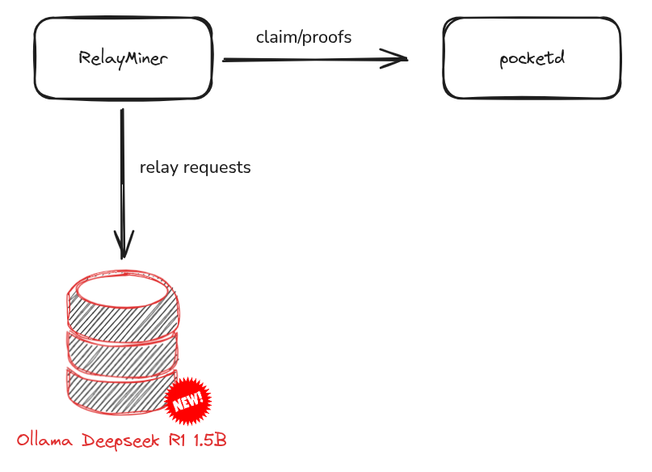

This document is intended to serve as a reference for various example configurations.

## RelayMiner

### `pocket` RelayMiner exposing `REST` and `CometBFT`

```yaml
config:
  default_signing_key_names: [mainnet-prod-relayminer]
  smt_store_path: ":memory:" # /home/pocket/.pocket
  pocket_node:
    query_node_rpc_url: http://<YOUR_POKT_NODE>.<YOUR_TLD>:443
    query_node_grpc_url: tcp://<YOUR_POKT_NODE>.<YOUR_TLD>:443
    tx_node_rpc_url: http://<YOUR_POKT_NODE>.<YOUR_TLD>:443
  suppliers:
    - service_id: pocket
      listen_url: http://0.0.0.0:8545
      service_config:
        backend_url: https://<YOUR_POKT_NODE>.<YOUR_TLD>:443
      rpc_type_service_configs:
        rest:
          backend_url: http://<YOUR_INTERNALIP>:1317
        comet_bft:
          backend_url: http://<YOUR_INTERNALIP>:26657
```

### `xrplevm` RelayMiner exposing `REST`, `CometBFT`, `JSON-RPC`, and `WebSocket`

```yaml
config:
  default_signing_key_names: [mainnet-prod-relayminer]
  smt_store_path: ":memory:" # /home/pocket/.pocket
  pocket_node:
    query_node_rpc_url: http://<YOUR_POKT_NODE>.<YOUR_TLD>:443
    query_node_grpc_url: tcp://<YOUR_POKT_NODE>.<YOUR_TLD>:443
    tx_node_rpc_url: http://<YOUR_POKT_NODE>.<YOUR_TLD>:443
  suppliers:
    - service_id: xrplevm
      listen_url: http://0.0.0.0:8545
      service_config:
        backend_url: https://<YOUR_POKT_NODE>.<YOUR_TLD>:443
      rpc_type_service_configs:
        rest:
          backend_url: http://<YOUR_INTERNALIP>:1317
        comet_bft:
          backend_url: http://<YOUR_INTERNALIP>:26657
        json_rpc:
          backend_url: http://<YOUR_INTERNALIP>:8545
        websocket:
          backend_url: http://<YOUR_INTERNALIP>:48546
```

### RelayMiner exposing a `deepseek` service



#### What?

This section explains how to deploy a `deepseek` datanode and expose a `deepseek` endpoint on the Pocket Network using the `deepSeek-r1:1.5b` model, a distilled (smaller) variant in the DeepSeek R1 family with 1.5 billion parameters. Once you complete this short tutorial, your large language model instance will be able to respond to relay requests sent from an Application and/or a Gateway through the Pocket Network.

#### How?

##### 1. Datanode

A datanode represents the process entity responsible for performing inference computations. In this example, we will use Ollama to run the DeepSeek R1 large language model (LLM) on Kubernetes, and then expose a flexible [API](API) that allows the RelayMiner to forward relay requests and return responses across the network.

First, create a Kubernetes manifest YAML file named `deepseek.yaml` with this content:

```yaml
---
apiVersion: v1
kind: Namespace
metadata:
  name: datanodes
---
apiVersion: apps/v1
kind: Deployment
metadata:
  name: ollama-deepseek
  namespace: datanodes
spec:
  replicas: 1
  selector:
    matchLabels:
      app: ollama-deepseek
  template:
    spec:  
      containers:
      - image: ollama/ollama:0.12.3
        name: ollama
        env:
        - name: OLLAMA_HOST
          value: 0.0.0.0
        ports:
        - containerPort: 11434
        resources:
          requests:
            cpu: 1000m
            memory: 2Gi
          limits: 
            cpu: 2000m
            memory: 3Gi
      - image: curlimages/curl
        name: load-model
        command: ["/bin/sh", "-c"]
        args:
          - "sleep infinity"
        lifecycle:
          postStart:
            exec:
              command:
                - "/bin/sh"
                - "-c"
                - "curl -X POST http://localhost:11434/api/pull -H 'Content-Type: application/json' -d '{\"name\": \"deepseek-r1:1.5b\"}'"
        resources:
          limits:
            memory: 50Mi
            cpu: 25m
---
apiVersion: v1
kind: Service
metadata:
  name: ollama-deepseek
  namespace: datanodes
spec:
  selector:
    app: ollama-deepseek
  ports:
    - protocol: TCP
      name: http
      port: 11434
      targetPort: 11434
```

This Kubernetes manifest will deploy three resources into your Kubernetes cluster:
1. **Namespace**: This will create a dedicated namespace for the datanode.
2. **Deployment**: This deploys an Application workload to run the Ollama docker image.
3. **Service**: This defines a stable (long-lived) IP address (and hostname) and port ([Ollama API](https://docs.ollama.com/api) reachable at `ollama-deepseek.datanodes:11434` within your Kubernetes cluster).

##### 2. Service

There should already be a `deepseek` service staked on-chain on `mainnet`. You can make sure of that by running this command below:
```shell
?> pocketd query service show-service deepseek --node=https://shannon-grove-rpc.mainnet.poktroll.com
service:
  compute_units_per_relay: "5000"
  id: deepseek
  name: Deepseek V3 0324
  owner_address: pokt1lf0kekv9zcv9v3wy4v6jx2wh7v4665s8e0sl9s
```

If the service is not declared, please follow the [Service Creation](../1_cheat_sheets/1_service_cheatsheet.md) documentation to declare a `deepseek` service.

##### 3. Supplier

For your RelayMiner to forward relays to your datanode (llm), you must declare one on-chain Supplier entity that reference your Relayminer public RPC endpoint for the `deepseek` service.

For more information, you can follow this documentation to:
1. [Create a supplier account](http://localhost:3000/operate/cheat_sheets/supplier_cheatsheet#account-setup)
2. [Stake a supplier](http://localhost:3000/operate/cheat_sheets/supplier_cheatsheet#supplier-configuration)

Here is a example of the `pocketd tx supplier stake-supplier`
```yaml
cat <<🚀 > /tmp/stake_supplier_config.yaml
owner_address: <SUPPLIER_ADDR>
operator_address: <SUPPLIER_ADDR>
stake_amount: 1000069upokt
default_rev_share_percent:
  $SUPPLIER_ADDR: 100
services:
  - service_id: "deepseek" # change if not using Anvil
    endpoints:
      - publicly_exposed_url: http://<EXTERNAL_IP>:8545 # must be public
        rpc_type: JSON_RPC
🚀
```

##### 4. Relayminer

Once you got your Datanodes running, and the on-chain Service and Supplier entity declared, you got everything to start running your Relayminer with the appropriate configuration.
This configuration below will start the RelayMiner in the appropriate state to.

```yaml
config:
  default_signing_key_names: [mainnet-prod-relayminer]
  smt_store_path: ":memory:" # /home/pocket/.pocket
  pocket_node:
    query_node_rpc_url: http://<YOUR_POKT_NODE>.<YOUR_TLD>:443
    query_node_grpc_url: tcp://<YOUR_POKT_NODE>.<YOUR_TLD>:443
    tx_node_rpc_url: http://<YOUR_POKT_NODE>.<YOUR_TLD>:443
  suppliers:
    - service_id: deepseek
      listen_url: http://0.0.0.0:8545
      service_config:
        backend_url: http://ollama-deepseek.datanodes:11434/api/generate
```

> Note: The `/api/generate` is mandatory in this example because, this is the Ollama API endpoint that will generate a response for a given prompt with a provided model. 

To make sure your RelayMiner instance is able to process relays correct, you can use this command that simulate a relay:
```
 pocketd relayminer relay --app=<app_address> --supplier=<supplier_address> --node=tcp://127.0.0.1:26657 --grpc-addr=localhost:9090 --grpc-insecure=true --payload="{\"model\": \"deepseek-r1:1.5b\", \"prompt\": \"How are you today?\", \"stream\": false}"
```

> Note: Be careful, you must make sure the `stream` field is equal to `false` as your are sending an RPC relay requests and not streaming data.
