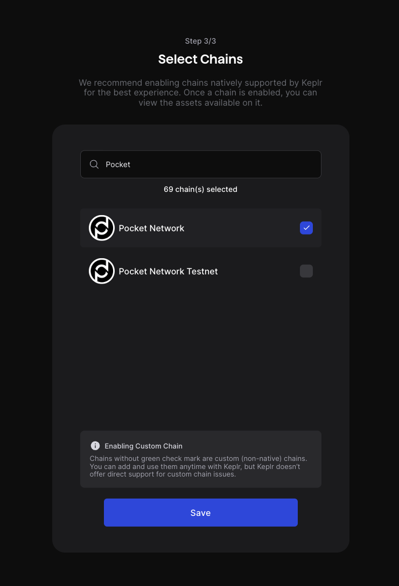

## Table of Contents <!-- omit in toc -->

- [Wallet Options](#wallet-options)
  - [Soothe Tutorial](#soothe-tutorial)
  - [Keplr Tutorial](#keplr-tutorial)
- [Bridged Wallet Options](#bridged-wallet-options)
- [Future Options](#future-options)

## Wallet Options

The [$`POKT`](https://coinmarketcap.com/currencies/pocket-network/) token can currently be accessed in a sovereign wallet using the following:

| Wallet                                  | Chrome | Firefox | Mobile App |
| --------------------------------------- | ------ | ------- | ---------- |
| [Soothe Vault](https://trustsoothe.io/) | ✅     | ✅      | ❌         |
| [Keplr](https://www.keplr.app/)         | ✅     | ✅      | ✅         |

### Soothe Tutorial

1. Go to [Soothe Vault](https://trustsoothe.io/) to find the browser-specific download links
2. Add Soothe Vault to your browser
3. Follow the on-screen instructions to initialize a new wallet or to import your existing wallet via a mnemonic phrase or a private key.

### Keplr Tutorial

1. Go to [Keplr](https://www.keplr.app/) to find the browser-specific download links
2. Add Keplr to your browser
3. Follow the on-screen instructions to initialize a new wallet or to import your existing wallet via a mnemonic phrase or a private key.
4. On the Select Chains screen, make sure to type `Pocket Network` in the textbox to add the chain to your list of chains.

<!--  TODO(@olshansk): Add Copy-pasta URLs + video on how to setup keplr -->

## Bridged Wallet Options

The EVM ([xERC-20](https://www.xerc20.com/)) implementation of the token and the Solana implementation of the token can be obtained by bridging your token via the official [Pocket Network Bridge](https://bridge.pokt.network/). Those bridged tokens can use any wallets that support Ethereum or Solana.

## Future Options

- [Pocket Network's Web Wallet](https://wallet.pokt.network/)
  - A new version of this wallet is in a private beta and this section will be updated when it is ready for public use.
- [Ledger](https://www.ledger.com/)
  - Ledger support is planned but isn't currently available.
