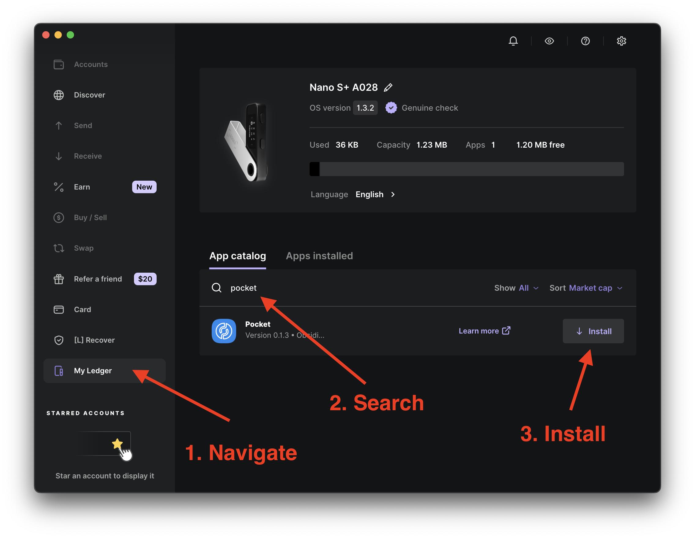

https://support.ledger.com/article/12976051037853-zd


https://support.ledger.com/article/12976051037853-zd
https://support.ledger.com/article/360013713840-zd
https://github.com/satoshilabs/slips/blob/d4b4bd55467f3e67bebb8ed06d0d86864e8ee704/slip-0044.md
https://support.ledger.com/article/4411149814417-zd
https://github.com/chainapsis/keplr-wallet/issues/125


## Setting up a Ledger <!-- omit in toc -->

This page guides you through using a Ledger to sign transactions with `pocketd`.

It assumes you already have a physical device from [Ledger](https://www.ledger.com/) and have previously gone through the process of setting it up at [ledger.com/start](https://www.ledger.com/start).

## Table of Contents <!-- omit in toc -->

To use the CLI (pocketd, gaiad, or any other Cosmos SDK-based appchain binary) with a Ledger hardware wallet, follow these steps:

## 1. Pre-requisites

- Ledger device with the Cosmos app installed and open
- ledger account enabled in your keyring backend
- Your Cosmos SDK appchain must support secp256k1 keys (most do)

1. Install the Cosmos (ATOM) app on your Ledger device
2. Open Ledger Live and navigate to the My Ledger tab.
3. Connect and unlock your Ledger device.
4. If asked, allow My Ledger to access your device.
5. Search for the Cosmos (ATOM) app in the app catalog.
6. Click the Install button to install the app on your Ledger device.
   1. Your Ledger device displays Processing.
   2. Ledger Live displays Installed.
   3. You're all set!




###

brew install hidapi

## 2. Add your Ledger key to the CLI

```bash
pocketd keys add my-ledger --ledger --keyring-backend=os
```

This creates a reference to your Ledger device under the alias my-ledger. No private keys are stored on your machine.

## 3. Verify your address

```bash
pocketd keys show my-ledger --bech=acc
```

You should see your Ledger-derived address. This lets you confirm it’s been added correctly.

## 4. Query balance or other data

```bash
pocketd query bank balances <ledger-address> --node=<rpc-url>
```

# # 5. Send a transaction with Ledger signing

```bash
pocketd tx bank send my-ledger <to-address> 1000000upokt \
 --chain-id=pocket-mainnet \
 --node=<rpc-url> \
 --gas=auto --fees=5000upokt \
 --keyring-backend=os \
 --yes
```

When prompted, your Ledger device will display the transaction details. You must manually approve it on the device.

## 6. Tips & Caveats

- Use --keyring-backend=os or --keyring-backend=test (not file) for Ledger support.
- If using a custom derivation path, add:

--hd-path="44'/118'/0'/0/0"

- Don’t use Ledger with --broadcast-mode=sync or async unless you know what you’re doing. Stick with --broadcast-mode=block for safety.

Let me know your binary name (pocketd, gaiad, etc.) and the exact flow you’re trying (e.g. staking, governance), and I can tailor the commands for you.
