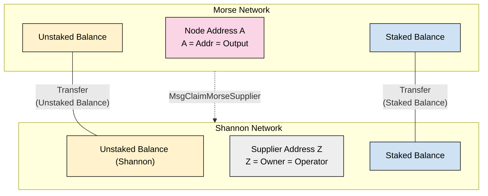
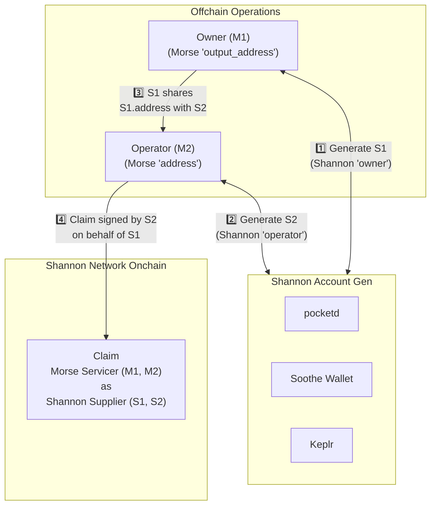

:::note GitHub Discussion Origin Document

This document is a result of the [GitHub Discussion found here](https://github.com/pokt-network/poktroll/discussions/1311).

:::

## Custodial vs Non-custodial Supplier Migration

**Goal:** Provide a clear overview of how Suppliers (Servicers) will migrate from Morse to Shannon.

## Table of Contents

- [Custodial vs Non-custodial Supplier Migration](#custodial-vs-non-custodial-supplier-migration)
- [Table of Contents](#table-of-contents)
- [Terminology](#terminology)
  - [Custody Models](#custody-models)
  - [Address fields by chain](#address-fields-by-chain)
- [Background](#background)
  - [Morse Background](#morse-background)
- [Morse -\> Shannon Migration](#morse---shannon-migration)
  - [Custodial Migration](#custodial-migration)
  - [Non-Custodial Migration](#non-custodial-migration)
  - [Non-Custodial: Most Common Use Case](#non-custodial-most-common-use-case)
  - [Known Risk — Operator Uses a Different Owner](#known-risk--operator-uses-a-different-owner)
- [Quickstart: Non-Custodial Migration](#quickstart-non-custodial-migration)

## Terminology

full

### Custody Models

| Custody type      | Definition                                                 |
| ----------------- | ---------------------------------------------------------- |
| **Custodial**     | Owner of staked funds **is the same** as the node operator |
| **Non-custodial** | Owner of staked funds **differs** from the node operator   |

### Address fields by chain

| Chain       | Node role (v2 name)         | **Required field(s)** | **Optional field(s)** | Who can control each field                                                       |
| ----------- | --------------------------- | --------------------- | --------------------- | -------------------------------------------------------------------------------- |
| **Morse**   | NodeRunner (a.k.a Servicer) | `address`             | `output_address`      | `address`: operator **and/or** owner<br/>`output_address`: owner only            |
| **Shannon** | Supplier                    | `owner_address`       | `operator_address`    | `owner_address`: operator **and/or** owner<br/>`operator_address`: operator only |

## Background

### Morse Background

In Morse, the CLI provides the following documentation for custodial & non-custodial staking:

Running the following command:

```bash
pocket nodes supplier --help
```

Prints out:

```text
The node namespace handles all node related interactions, from staking and unstaking; to unjailing.

---

Operator Address (i.e. Non-Custodial Address) can do the following:
- Submit Block, Claim & Proof Txs

Output Address (i.e. Custodial Address) can do the following:
- Receive earned rewards
- Receive funds after unstaking

Both Operator and Output Addresses can do the following:
- Submit Stake, EditStake, Unstake, Unjail Txs
```

## Morse -> Shannon Migration

### Custodial Migration

Custodial migration is straightforward and can be visualized as follows:



### Non-Custodial Migration

Non-custodial migration has a few variations and can be summarized via the following table.

Assumptions made based on offchain private key ownership:

- Owners of `(S|M)1` and `(S|M)2` are intended to be distinct offchain
- The owner of `SX`/`MX` are the same identity offchain

| Morse / Shannon-sign Description    | Morse (`output_address`, `address`) | Shannon (`owner_address`, `operator_address`) | Claim Signer | Supported | Details / Notes / Explanation                                                                                            | Pre-conditions                                                                            |
| ----------------------------------- | ----------------------------------- | --------------------------------------------- | ------------ | --------- | ------------------------------------------------------------------------------------------------------------------------ | ----------------------------------------------------------------------------------------- |
| custodial / owner-operator-sign     | (`M`, `M`)                          | (`S`, `S`)                                    | `S`          | ✅        | Custodial flow #1                                                                                                        | `S` owns `M`                                                                              |
| custodial / operator-sign           | (null, `M`)                         | (`S`, null)                                   | `S`          | ✅        | Custodial flow #2                                                                                                        | `S` owns `M`                                                                              |
| custodial / operator-sign           | (null, `M`)                         | (`S`, `S`)                                    | `S`          | ✅        | Custodial flow #3                                                                                                        | `S` owns `M`                                                                              |
| non-custodial / owner-sign          | (`M1`, `M2`)                        | (`S1`, null)                                  | `S1`         | ❌        | MUST have a distinct `operator_address` if a distinct `output_address` exists (for backwards-simplification)             | NA                                                                                        |
| non-custodial / owner-sign          | (`M1`, `M2`)                        | (`S1`, `S2`)                                  | `S1`         | ✅        | Non-custodial flow executed by owner (ONLY requires S1 & M1 signature)                                                   | (`S1` owns `M1`) && (`S2` owns `M2`) && (`M2` gives `S2` shannon staking config offchain) |
| non-custodial / operator-sign       | (`M1`, `M2`)                        | (`S1`, `S2`)                                  | `S2`         | ✅        | Non-custodial flow executed by operator (ONLY requires S2 & M2 signature)                                                | (`S1` owns `M1`) && (`S2` owns `M2`) && (`S2` gives `M2` shannon address offline)         |
| non-custodial / owner-sign          | (`M1`, null)                        | (`S1`, `S2`)                                  | `S2`         | ❌        | MUST NOT have a distinct `operator_address` if a distinct `output_address` does not exist (for backwards-simplification) | NA                                                                                        |
| missing operator / NA               | (`M1`, null)                        | NA                                            | NA           | ❌        | Not supported because `M2` cannot be null                                                                                | NA                                                                                        |
| NA / missing owner                  | NA                                  | (null, `S2`)                                  | NA           | ❌        | Not supported because `S1` cannot be null                                                                                | NA                                                                                        |
| non-custodial / owner-operator-sign | (`M1`, `M2`)                        | (`S`, `S`)                                    | `S`          | ❌        | `operator_address` must be distinct from `owner_address` (for backwards-simplification)                                  | NA                                                                                        |

### Non-Custodial: Most Common Use Case

The table above shows all viable supported and unsupported flows.

**Most common use-case:** A POKT token holder outsources staking to a node operator.

| Morse / Shannon-sign Description | Morse (`output_address`, `address`) | Shannon (`owner_address`, `operator_address`) | Claim Signer | Supported | Details / Notes / Explanation                                             | Pre-conditions                                                                    |
| -------------------------------- | ----------------------------------- | --------------------------------------------- | ------------ | --------- | ------------------------------------------------------------------------- | --------------------------------------------------------------------------------- |
| non-custodial / operator-sign    | (`M1`, `M2`)                        | (`S1`, `S2`)                                  | `S2`         | ✅        | Non-custodial flow executed by operator (ONLY requires S2 & M2 signature) | (`S1` owns `M1`) && (`S2` owns `M2`) && (`S2` gives `M2` shannon address offline) |

**What happens in this flow:**

- Owner (`output_address` in Morse) generates a new Shannon `owner_address` (private key).
- Owner gives the new `owner_address` to the Operator (`address` in Morse).
- Operator generates their own Shannon `operator_address`.
- Operator submits the claim using both addresses.

**Preconditions:**

- Owner controls Morse `output_address` and Shannon `owner_address`.
- Operator controls Morse `address` and Shannon `operator_address`.



### Known Risk — Operator Uses a Different Owner

**Can the operator claim the Supplier with a _different_ owner account?**

Yes. Since the operator receives the new `owner_address` off-chain, they could substitute their own address when submitting the claim.

**Trade-offs:**

| Flow                                      | What Happens                                                                           | Owner Effort                             | Security Risk                             | UX for Owner | Supported?            |
| ----------------------------------------- | -------------------------------------------------------------------------------------- | ---------------------------------------- | ----------------------------------------- | ------------ | --------------------- |
| **Default (operator-led claim)**          | Owner creates `owner_address` → shares it → operator submits claim                     | **Low** (share one address)              | **Medium** – operator could swap address  | Very simple  | **Yes (recommended)** |
| Operator generates key, gives it to owner | Operator creates key → passes private key to owner → submits claim                     | Medium                                   | **High** – private key handled insecurely | Awkward      | No                    |
| Owner prepares full staking config        | Owner sets up both `owner_address` & `operator_address`, then hands config to operator | **High** (many owners are non-technical) | Low                                       | Difficult    | No (impractical)      |

**Mitigation Strategy:**

- **Short-term:** Rely on established trust between token holders and professional operators.
- **Long-term:** The Pocket Network Foundation will monitor migrations. If abuse is observed, they will propose a protocol upgrade to:
  - Recover mis-claimed stakes.
  - Penalize offending accounts.

## Quickstart: Non-Custodial Migration

1. **Owner**:
   - Generate a new Shannon `owner_address` (private key).
   - Share the new `owner_address` with the Operator.
2. **Operator**:
   - Generate a new Shannon `operator_address`.
   - Submit the claim using both addresses.
