:::note GitHub Discussion Origin Document

This document is a result of the [GitHub Discussion found here](https://github.com/pokt-network/poktroll/discussions/1311).

:::

## Custodial vs Non-custodial Supplier Migration

**Goal:** Provide a clear overview of how Suppliers (Servicers) will migrate from Morse to Shannon.

## Table of Contents

- [Custodial vs Non-custodial Supplier Migration](#custodial-vs-non-custodial-supplier-migration)
- [Table of Contents](#table-of-contents)
- [Terminology](#terminology)
  - [Address fields by chain](#address-fields-by-chain)
  - [Custody Models](#custody-models)
- [Background](#background)
  - [Morse Background](#morse-background)
- [Morse -\> Shannon Migration Types](#morse---shannon-migration-types)
  - [Custodial Migration](#custodial-migration)
  - [Non-Custodial Migration](#non-custodial-migration)
  - [**Non-custodial #2** – owner sign](#non-custodial-2--owner-sign)
  - [**Non-custodial #3** – operator sign](#non-custodial-3--operator-sign)
  - [**Non-custodial #3** – operator sign - attack](#non-custodial-3--operator-sign---attack)
  - [**Non-custodial #3** – operator vs owner sign risk tradeoffs](#non-custodial-3--operator-vs-owner-sign-risk-tradeoffs)

## Terminology

| Symbol             | Definition                                                                   |
| ------------------ | ---------------------------------------------------------------------------- |
| `M`                | A Morse address controlled by `S` (both owner and operator)                  |
| `M_output`         | A Morse staking (operator and/or owner) address controlled by `S_owner`      |
| `M_operator`       | A Morse output address (owner) controlled by `S_operator` (where rewards go) |
| `S`                | A Shannon address that owns `M` (both owner and operator)                    |
| `S_owner`          | A Shannon owner address (of `M_output`)                                      |
| `S_operator`       | A Shannon operator address (of `M_operator`)                                 |
| `output_address`   | Morse term - Owner of the staked funds (where rewards and unstaked funds go) |
| `address`          | Morse term - The Morse staking address (usually the operator address)        |
| `owner_address`    | Shannon term - Owner of the staked funds                                     |
| `operator_address` | Shannon term - Operator of the staked funds                                  |

### Address fields by chain

| Chain       | Node role                   | **Required field(s)**        | **Optional field(s)** | Who can control each field                                                       |
| ----------- | --------------------------- | ---------------------------- | --------------------- | -------------------------------------------------------------------------------- |
| **Morse**   | NodeRunner (a.k.a Servicer) | `address` (a.k.a `operator`) | `output_address`      | `address`: operator **and/or** owner<br/>`output_address`: owner only            |
| **Shannon** | Supplier                    | `owner_address`              | `operator_address`    | `owner_address`: operator **and/or** owner<br/>`operator_address`: operator only |

### Custody Models

| Custody type      | Definition                                                 |
| ----------------- | ---------------------------------------------------------- |
| **Custodial**     | Owner of staked funds **is the same** as the node operator |
| **Non-custodial** | Owner of staked funds **differs** from the node operator   |

## Background

### Morse Background

In Morse, the CLI provides the following documentation for custodial & non-custodial staking:

Running the following command:

```bash
pocket nodes supplier --help
```

Prints out:

```text
The node namespace handles all node related interactions, from staking and unstaking; to unjailing.

---

Operator Address (i.e. Non-Custodial Address) can do the following:
- Submit Block, Claim & Proof Txs

Output Address (i.e. Custodial Address) can do the following:
- Receive earned rewards
- Receive funds after unstaking

Both Operator and Output Addresses can do the following:
- Submit Stake, EditStake, Unstake, Unjail Txs
```

## Morse -> Shannon Migration Types

### Custodial Migration

Custodial migration is straightforward and can be visualized as follows:


### Non-Custodial Migration

Non-custodial migration has a few variations and can be summarized via the following table.

| Flow Type                              | Supported | Morse `(output_address, address)` | Shannon `(owner_address, operator_address)` | Claim Signer                | Notes                                                                                | Pre-Conditions                                                                                                                       |
| -------------------------------------- | --------- | --------------------------------- | ------------------------------------------- | --------------------------- | ------------------------------------------------------------------------------------ | ------------------------------------------------------------------------------------------------------------------------------------ |
| **Custodial #1** – owner-op sign       | ✅        | `(M, M)`                          | `(S, S)`                                    | `S` & `M`                   | **Same identity controls and signs** Morse & Shannon messages                        | `S` owns `M`                                                                                                                         |
| **Custodial #2** – operator-only       | ✅        | `(null, M)`                       | `(S, null)`                                 | `S` & `M`                   | **Owner signs** with no output override                                              | `S` owns `M`                                                                                                                         |
| **Custodial #3** – operator-only       | ✅        | `(null, M)`                       | `(S, S)`                                    | `S` & `M`                   | Same signer, no output override                                                      | `S` owns `M`                                                                                                                         |
| **Non-custodial #1** – invalid         | ❌        | `(M_output, M_operator)`          | `(S_owner, null)`                           | -                           | Invalid because `operator_address` must be specified if `output_address` ≠ `address` | —                                                                                                                                    |
| **Non-custodial #2** – owner sign      | ✅        | `(M_output, M_operator)`          | `(S_owner, S_operator)`                     | `S_owner` & `M_owner`       | **Owner signs** for staking addr; output addr linked off-chain to `S_owner`          | (`S_owner` owns `M_output`) && (`S_operator` owns `M_operator`) && (`M_operator` gives `S_operator` shannon staking config offchain) |
| **Non-custodial #3** – operator sign   | ✅        | `(M_output, M_operator)`          | `(S_owner, S_operator)`                     | `S_operator` & `M_operator` | **Operator signs** for output addr; off-chain linkage to `M_operator` required       | (`S_owner` owns `M_output`) && (`S_operator` owns `M_operator`) && (`S_operator` gives `M_operator` shannon address offline)         |
| **Non-custodial #4** – invalid         | ❌        | `(M_output, null)`                | `(S_owner, S_operator)`                     | -                           | Operator address should not be defined if no distinct output address                 | —                                                                                                                                    |
| **Invalid** – missing shannon operator | ❌        | `(M_output, null)`                | —                                           | -                           | No operator and no output override — unsupported                                     | —                                                                                                                                    |
| **Invalid** – missing shannon owner    | ❌        | —                                 | `(null, S_operator)`                        | -                           | Owner must be defined                                                                | —                                                                                                                                    |
| **Non-custodial #5** – invalid         | ❌        | `(M1, M2)`                        | `(S, S)`                                    | `S`                         | Owner and operator must differ if output differs from staking address                | —                                                                                                                                    |

### **Non-custodial #2** – owner sign

```mermaid
graph LR
    subgraph Offchain[Offchain]
        Owner["👩 Owner"]
        Operator["👨 Operator"]
    end

    subgraph Morse[Morse Network]
        Servicer["Servicer<br/>(address, output_address)"]
        M_owner["M_owner<br/>(output_address)"]
        M_operator["M_operator<br/>(address)"]
    end

    subgraph Shannon[Shannon Network]
        Supplier["Supplier<br/>(owner_address, operator_address)"]
        S_owner["S_owner<br/>(owner_address)"]
        S_operator["S_operator<br/>(operator_address)"]
    end

    Owner -.-|"controls"| M_owner
    Owner -.-|"controls"| S_owner
    Operator -.-|"controls"| M_operator
    Operator -.-|"controls"| S_operator

    Operator -->|shares supplier config<br/> | Owner
    Owner -->|"owner signs claim <br/> (owner_address, operator_address)"| Supplier

    classDef green fill:#90EE90,stroke:#228B22,stroke-width:2px,color:#000000
    class Supplier green
```



### **Non-custodial #3** – operator sign

```mermaid
graph LR
    subgraph Offchain[Offchain]
        Owner["👩 Owner"]
        Operator["👨 Operator"]
    end

    subgraph Morse[Morse Network]
        Servicer["Servicer<br/>(address, output_address)"]
        M_owner["M_owner<br/>(output_address)"]
        M_operator["M_operator<br/>(address)"]
    end

    subgraph Shannon[Shannon Network]
        Supplier["Supplier<br/>(owner_address, operator_address)"]
        S_owner["S_owner<br/>(owner_address)"]
        S_operator["S_operator<br/>(operator_address)"]
    end

    Owner -.-|"controls"| M_owner
    Owner -.-|"controls"| S_owner
    Operator -.-|"controls"| M_operator
    Operator -.-|"controls"| S_operator

    Owner -->|share owner_address<br/> | Operator
    Operator -->|"operator signs claim <br/> (owner_address, operator_address)"| Supplier

    classDef green fill:#90EE90,stroke:#228B22,stroke-width:2px,color:#000000
    class Supplier green
```



### **Non-custodial #3** – operator sign - attack

```mermaid
graph LR
    subgraph Offchain[Offchain]
        Owner["👩 Owner"]
        Operator["😈👨😈 Operator"]
    end

    subgraph Morse[Morse Network]
        Servicer["Servicer<br/>(address, output_address)"]
        M_owner["M_owner<br/>(output_address)"]
        M_operator["M_operator<br/>(address)"]
    end

    subgraph Shannon[Shannon Network]
        Supplier["Supplier<br/>(operator_address, operator_address)"]
        S_owner["S_owner<br/>(owner_address)"]
        S_operator["S_operator<br/>(operator_address)"]
    end

    Owner -.-|"controls"| M_owner
    Owner -.-|"controls"| S_owner
    Operator -.-|"controls"| M_operator
    Operator -.-|"controls"| S_operator

    Owner -->|share owner_address<br/> | Operator
    Operator -->|"operator signs claim <br/> BUT replaces <br/>owner_address with operator_address<br/>"| Supplier

    classDef red fill:#FFB6C1,stroke:#DC143C,stroke-width:2px,color:#000000
    class Supplier red
```



### **Non-custodial #3** – operator vs owner sign risk tradeoffs

| Flow                                      | What Happens                                                                           | Owner Effort                             | Security Risk                             | UX for Owner | Supported?            |
| ----------------------------------------- | -------------------------------------------------------------------------------------- | ---------------------------------------- | ----------------------------------------- | ------------ | --------------------- |
| **Default (operator-led claim)**          | Owner creates `owner_address` → shares it → operator submits claim                     | **Low** (share one address)              | **Medium** – operator could swap address  | Very simple  | **Yes (recommended)** |
| Operator generates key, gives it to owner | Operator creates key → passes private key to owner → submits claim                     | Medium                                   | **High** – private key handled insecurely | Awkward      | No                    |
| Owner prepares full staking config        | Owner sets up both `owner_address` & `operator_address`, then hands config to operator | **High** (many owners are non-technical) | Low                                       | Difficult    | No (impractical)      |
