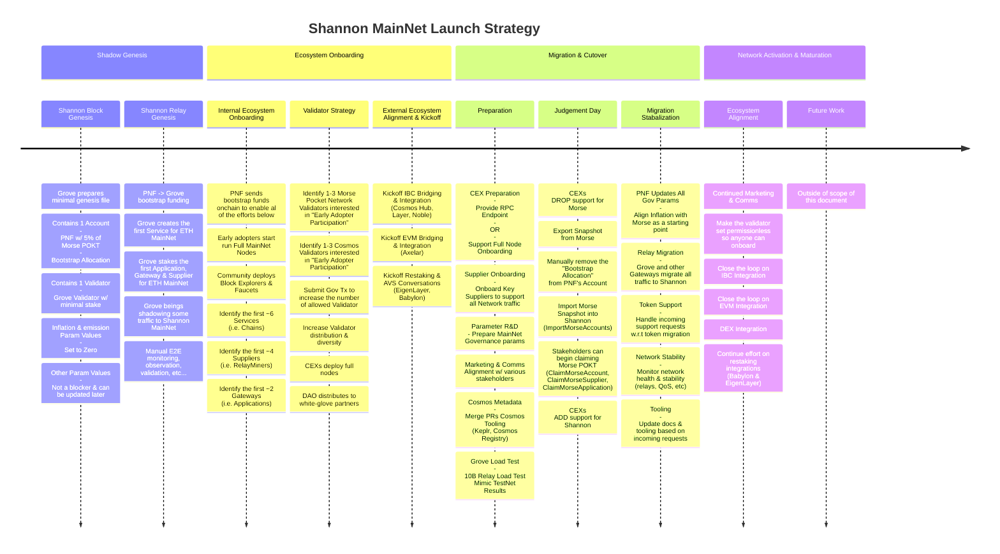

**The `Morse` to `Shannon` migration is not a one day cutover.**

It is a process that will span multiple weeks involving many stakeholders. It includes,
but is not limited to things like Genesis, Preparation, Onboarding, Cutover, etc...

The following diagram provides a high level overview of the migration process:

:::tip Mermaid.live

We recommend using [mermaid.live](https://mermaid.live/) if you want to be able to
navigate or zoom in/out of the timeline above. For the pre-populated link, click [here](https://mermaid.live/edit#pako:eNqtWG1v4kYQ_isjS6WJRGjIyyVBVSUCJJfmCCmk11OVL2t7gVXsXbq7hnCn62_vzK6NbSCXL70vh72zz7w_M863IFIxDzqBFSlPhOTPEvCfFTbhMJkzKZWEIRPygVv4xDIZzWFiNbN8tn6WXtjwyAoUQ_FYreCWS26EKU5hA3OdqOilPIb8XwdutVpyWGi-YJobSIUUKUtg5iVhKhJeFe8padEiA23oRpHKpIVfQ_0bHPn_Hh9uYPULnP8EaurfDJU2HB5H9081wWulrEFfFtBN0DRGTryh5zNLRMys0jUAb3d5hloL241lLzWj7-Q0cRqgATwVxtDPR6ZZSgAZul1FnmC0rYK_uVZVkJGdc_32rQdlgUFIYUaxBkRMQsghW6B5PAbUz_VuWsY8Yet9aaFAHhVehptgTTMZCznbTWCkOWowgEZizrSx6IZeigifMDiDp49FIe1edeGq3uwuFonwKWnCLcKu0MYGTDJ6j869ixhytNGAcTWJP8GolAM6MJ2KiGK7VdxVhCGTGeZwcDKAVEmBqUWAJqjQoD-5TUufdfeb26jVam23wyBSZm0sT2EkQ8W0D1qh505iMiRp2StWz4LhMjZbKTCgsBnReHKGSxZiwyIc1jxFkU8xQhbv8EStqnADppM1YFAWqN9Q4LUFnUm4yZJk0-kPSAqm3gtpmmEo1hDzRaLWJu_mwSs-aUJqwA3LIm5r1-5iLq2YriuZ_fdDURZ58R6IFm9Bj1wxh-9dPtuUQO22q-Eh0pd-H-KkqKcaQqXgCKIAKZu7ZL098O2j04JlqPkwgNyulH4p7xsQlHFuqBMxac-Bz0TXZ4Ka2opILDwLBW9q6SmTKvO_4E6yMBUWbtUSnl6pioSkFkYnKFoyS0O8j_XEkB1XiL7RWee1_E4ZqVhglYowy9kuFktMC5ZOrZ4GX0xeSljNWHlyu-L63VGJRNygYDUXlh_NEjct0C9Kd5mqwetOR3UTMZMpRg_NuBfRi5pOqyryV3B33YNrLeIZ8UTDteZMe7I-yOP9MQubOP_WXDexObDXDvcBDT4P3wTqvmKN6r3Xxpz4z9_pfp7Q4KGQ-WKEg4HASZjrvmbhOlHycJtshqJQ1IBeZjFCFaZ_dJN1d74NvlSP6kMUSVTEHMaPPRjIeKHE1pQdjesDC7sSCcezCLHHG2y2IfDyuA7rX8M9X1c6HXNvcgWM8PPmytm8xpY0GzkV_rjRL5C9k3zDbrcUHslk5MqIpaZO_hob2CeDWM9UqggH_JJpoTLjJ9ZcJbGrwSpRunoZcsuwG1jNuSHXM2SIsSmknpRKNhE4uMd2wBTnZ2M-o-pfH-7Otk-KxfCERVNDbx9f57N863woUhx59EzOY7Flia30ze9ZPOPOvT7b7VGH0B-PHjcZoNHruK42Vl7d2USyhZnjGjLVKt2V8oMV2UnzlBwhnnEKnoO9y1jgTx0YzsGfTbHw1Rgodao9_W4MwHotZ7yPrxd0cjlMfVhMKinNdydsZIgShgHELG2vkQc9OqniYfI2r4rqrb6rDJnD_ZHu9vu1QOcelNkqGx3NDZFzv-70NW0Mf7qdj2o3cQTv-qK-LbqyruylK2HnuY_M4B7pVgPy2zV_VYGvstKS3Z2YyRiUW1Y3szZ14tw18O4aVoV_Ui9cbhilCv4RcXHNwTmlXEaKSGn-D-7CuO6sWrpFmzMBpIV9VeyCOih4IqF9ptagftsDmUvNOUswKA2KRS5-oMl504Q_1MRtfod10ysNnYP6VECsIlqSbC4R4szEGMnSmcKJbWovTO7i47Lg-CGzWeFdacCeyVcelh81Qmaoe4fotkWH2A6uRZeb0W6QQBZc598vCTdIhAqzvVaSu5ZRnr93tCYqXysSpRbkNs3cynx8_wLN1h9c6OMw-xFe7na-GBOg3kxdUd7DcZuPWIxKOXgPq1G-yTD2HP7CpGyrGWXW0NjErclEasH9Oo7fsJj9jNIRNIMU48dEjN_c3-j6c4Bepvw56ODPGHNCS9p3lGM4xidrGQUdqzPeDLTKZvOgM2WJwSf_UdcXDA1PC5EFk38rVX0MOt-C16Bzftk6PfnQbl-cnJ1dnBxfnTeDddA5urpsnZ1cnh6fn50fty-uzi6-N4OvDqDdOj2_OG4ft-nW6eVV-0Mz4DE1x9D_vcD92aAZzDR5khuIXylc94gIg87V9_8AWY9Ibw).

:::
