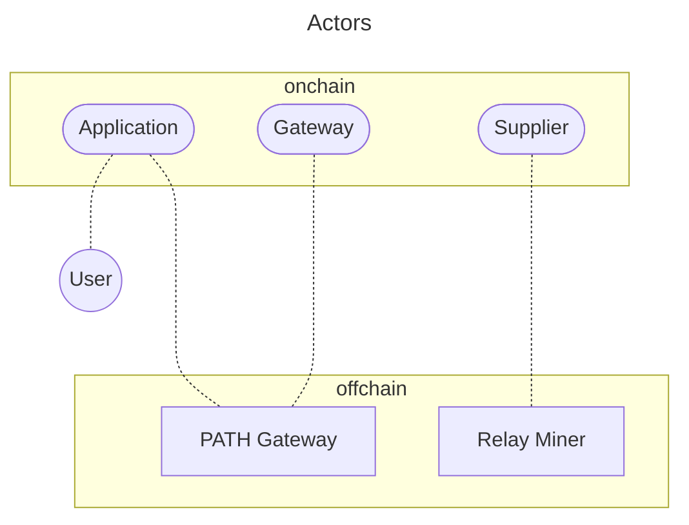

## Table of Contents <!-- omit in toc -->

- [Overview](#overview)
- [Onchain Actors](#onchain-actors)
  - [Risks \& Misbehavior](#risks--misbehavior)
- [Offchain Actors](#offchain-actors)

---

## Overview

Pocket Network protocol is composed of both onchain and offchain actors.

There are 3 onchain actors:

- [Applications](2_application.md): End-users or clients that request services from the network.
- [Suppliers](6_supplier.md): Provide services and resources to applications.
- [Gateways](3_gateway.md): Route and facilitate requests between applications and suppliers.

There are 2 offchain actors:

- [RelayMiners](5_relay_miner.md): Offchain services that process and relay requests between network participants.
- [PATH Gateways](4_path_gateway.md): Specialized offchain gateways that optimize routing and performance.

## Onchain Actors

Onchain actors are part of the Pocket Network distributed ledger (the "Web3" part of Pocket).

- Think of onchain actors as:
  - Records, registrations, or pieces of state at a specific point in time
  - Each has an address, account, balance, and often a stake
  - They exist only on the blockchain and represent the current state of the network

### Risks & Misbehavior

:::warning
This is an open work in progress and an active area of research.
:::

- Gateways:
  - Risks: Intentional overservicing
  - Misbehavior: Low volume exploit
  - Note: Onchain, gateways are mainly a registry to track gateways and application delegations. It's hard to distinguish requests sent by gateways from those sent by applications acting directly.
- Applications:
  - Risks: Insufficient funds to pay for services, intentional overservicing
  - Misbehavior: Low volume exploit
- Suppliers:
  - Risks: Service/quality degradation
  - Misbehavior: No or low quality responses, invalid or missing proofs

## Offchain Actors

Offchain actors are all the operators and services that make up Pocket Network (the "Web2" part of Pocket).

- Think of offchain actors as:
  - Servers, processes, or clients
  - They run the business logic offchain and interact with the blockchain
  - Offchain actors execute logic that is verified onchain and drives state transitions
