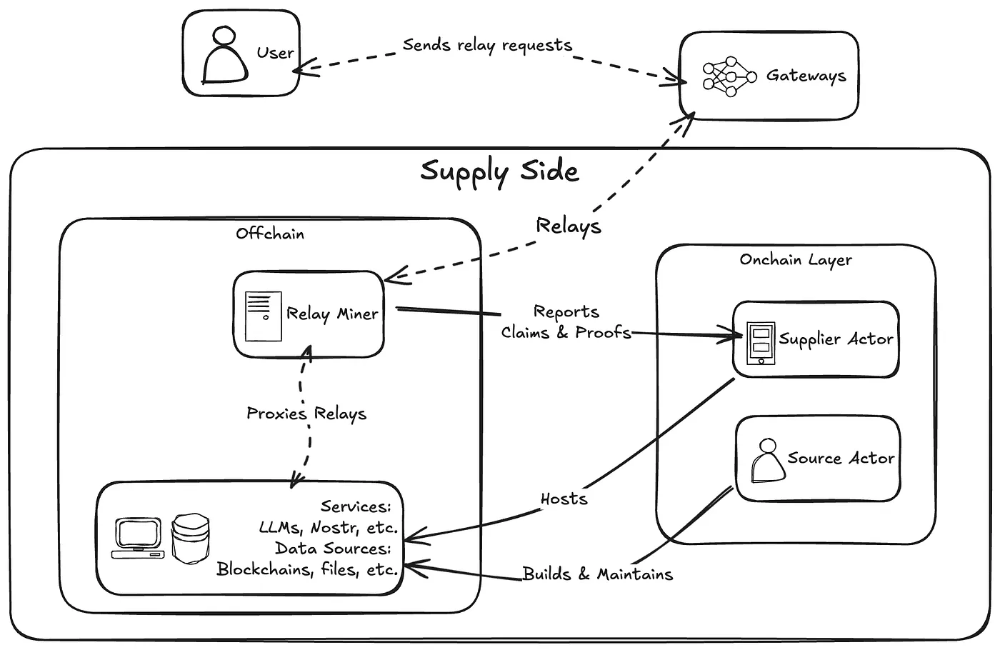

## Table of Contents <!-- omit in toc -->

- [Overview](#overview)
- [Schema](#schema)
- [Configuration](#configuration)
- [Modules](#modules)
  - [Supplier Module](#supplier-module)
  - [Proof Module](#proof-module)
- [Supplier lifecycle](#supplier-lifecycle)
  - [1. Staking Initiation](#1-staking-initiation)
  - [2. Activation](#2-activation)
  - [3. Unsaking Initiation](#3-unsaking-initiation)
  - [4. Unbonding Phase](#4-unbonding-phase)
  - [5. Completion of Unbonding](#5-completion-of-unbonding)
  - [Timeline of Events](#timeline-of-events)

## Overview

A `Supplier` is responsible for staking POKT in order to earn POKT in exchange for
providing services as a function of volume and time.

## Schema

The onchain representation of a `Supplier` can be found at [supplier.proto](https://github.com/pokt-network/poktroll/blob/main/proto/pocket/shared/supplier.proto).

## Configuration

Configurations to stake an `Supplier` can be found at [supplier_staking_config.md](../../1_operate/3_configs/3_supplier_staking_config.md).

## Modules

The `Supplier` actor depends on both the [`supplier`](https://github.com/pokt-network/poktroll/tree/main/x/supplier)
and [`proof`](https://github.com/pokt-network/poktroll/tree/main/x/proof) onchain modules.
These two modules' concerns are separated as follows:

### Supplier Module

- Supplier (un/)staking
- Supplier querying

### Proof Module

- Claim creation & querying
- Proof submission & querying

## Supplier lifecycle

The lifecycle of a `Supplier` in the network involves several phases, each
with specific actions and status changes. Here’s a detailed breakdown:

### 1. Staking Initiation

- The `Supplier` sends a `MsgStakeSupplier` message to the network, initiating
  the staking process.
- The `Supplier` remains inactive until the beginning of the next session.

### 2. Activation

- The `Supplier` becomes active at the start of the new session and can now
  provide services to the network.

### 3. Unsaking Initiation

- The `Supplier` sends a `MsgUnstakeSupplier` message to the network to start
  the unstaking process.
- The `Supplier` continues to be active until the end of the current session.

### 4. Unbonding Phase

- In the following session, the `Supplier` enters the unbonding phase, becoming
  inactive and no longer participating in sessions or providing services.
- During this phase, the staked funds are locked, and any pending claims are settled.

### 5. Completion of Unbonding

- After the unbonding period ends, the staked funds are transferred back to the
  `Supplier`'s account, and the `Supplier`'s record is removed from the network.

### Timeline of Events

Here’s a visual representation of the `Supplier` lifecycle from staking to unbonding
with the following example parameters:

- **Unbonding Period**: 3 sessions
- **Number of Blocks per Session**: 10 blocks
- **Session End Height to Proof Window Close Height**: 15 blocks

```mermaid
timeline
    section Session 1 <br> [1,10]
      Block 3: DO Stake Supplier1 <br> [Is inactive]
      Block 5: DO Stake Supplier2 <br> [Is inactive]
    section Session 2 <br> [11,20]
        Block 11: Supplier1 IS included in sessions : Supplier2 IS included in sessions
    section Session 3 <br> [21,30]
        Block 21 : Supplier1 unstakes <br> [Still active]
        Block 28 : Supplier2 unstakes <br> [Still active]
        Block 30: DO Deactivate Supplier1 : DO Deactivate Supplier2
    section Session 4 <br>[31, 40]
        Block 31: Supplier1 IS NOT included in sessions : Supplier2 IS NOT included in sessions
    section Session 5 <br>[41, 50]
        Block 45: ProofWindowClosed
    section Session 6 <br>[51, 60]
        Block 60: DO UNBOND Supplier1 : DO UNBOND Supplier2
```
