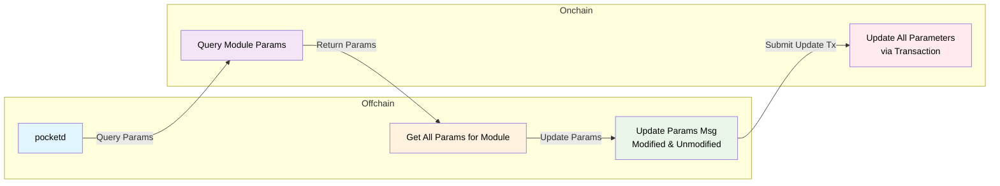

:::warning Authority only

This page is for Pocket Network Authority members only on how to update and manage onchain parameters.

It can be used by developers on LocalNet but can only be executed by the foundation on MainNet.

:::

## Quick Start

Get your hands dirty

```bash
./tools/scripts/params/gov_params.sh --help
./tools/scripts/params/update_all_params.sh --help
```

View all parameters in beta

```bash
./tools/scripts/params/gov_params.sh query-all --env beta
```

Update tokenomics parameters in beta

```bash
./tools/scripts/params/gov_params.sh update tokenomics --env beta
```

Batch update all parameters across all modules:

```bash
./tools/scripts/params/update_all_params.sh beta
./tools/scripts/params/update_all_params.sh main
```

## Overview <!-- omit in toc -->

This repository contains two complementary scripts for parameter management:

1. `gov_params.sh` - Individual governance parameter querying & management
2. `update_all_params.sh` - All-on-one helper for batch parameter updates across all modules

## Pre-requisites

Before updating parameters, make sure you have the following:

- A valid `pocketd` CLI binary installed via [install instructions](../../2_explore/2_account_management/1_pocketd_cli.md)
- A valid `pocket` home directory with the authority keys imported. For example:

```bash
pocket keys import-hex pnf_beta <...>
```

### Important Background: Updating All Params

:::danger Updating all params
Due to how `params` work in the Cosmos SDK, every `MsgUpdateParams`, transaction for
particular module MUST update ALL params for that module EVEN IF only one is being updated.
:::



## Available Modules

### Pocket Network Modules

| Module        | Description                             | Key Parameters                    |
| ------------- | --------------------------------------- | --------------------------------- |
| `tokenomics`  | Token economics and reward calculations | mint allocation, inflation rates  |
| `application` | Application module parameters           | min stake, max delegated gateways |
| `gateway`     | Gateway module parameters               | Gateway-specific configurations   |
| `service`     | Service module parameters               | Service-specific configurations   |
| `supplier`    | Supplier module parameters              | Supplier-specific configurations  |
| `session`     | Session module parameters               | Session management                |
| `proof`       | Proof module parameters                 | Proof validation                  |
| `shared`      | Cross-module shared parameters          | Shared configurations             |

### Cosmos SDK Modules

| Module         | Description               | Key Parameters             |
| -------------- | ------------------------- | -------------------------- |
| `auth`         | Authentication parameters | Account parameters         |
| `bank`         | Bank module parameters    | Send/receive permissions   |
| `gov`          | Governance parameters     | Voting periods, thresholds |
| `staking`      | Staking parameters        | Validator parameters       |
| `slashing`     | Slashing parameters       | Penalty parameters         |
| `distribution` | Distribution parameters   | Reward distribution        |
| `mint`         | Mint parameters           | Inflation parameters       |

## `gov_params.sh` - Script Usage

Query or update an individual module's parameters:

- `query <module_name>` - Query parameters for a specific module
- `query-all` - Query parameters for all available modules
- `update <module_name>` - Generate update transaction for a module

```bash
./tools/scripts/params/gov_params.sh <command> [module_name] [options]
```

For options and configurations, see the `help` command:

```bash
./tools/scripts/params/gov_params.sh help
```

## `update_all_params.sh` - Script Usage

A helper that bulk updates all parameters for a given environment using the `.json` files in `./tools/scripts/params/bulk_params`.

```bash
./tools/scripts/params/update_all_params.sh <command> [options]
```


## Parameter Update Workflow

### Step 1: Query Current Parameters

First, check the current parameter values:

```bash
./tools/scripts/params/gov_params.sh query tokenomics --env beta
```

<details>

<summary>Example output:</summary>

```json
{
  "params": {
    "mint_allocation_percentages": {
      "dao": 0.1,
      "proposer": 0.05,
      "supplier": 0.7,
      "source_owner": 0.15,
      "application": 0
    },
    "dao_reward_address": "pokt1f0c9y7mahf2ya8tymy8g4rr75ezh3pkklu4c3e",
    "global_inflation_per_claim": 0.1
  }
}
```

</details>

### Step 2: Generate Update Template

Create a transaction template with current parameters:

```bash
./tools/scripts/params/gov_params.sh update tokenomics --env beta --output-dir ./params
```

This generates a file like `tokenomics_params_beta_20241230_143022.json`:

<details>

<summary>Example output:</summary>

```json
{
  "body": {
    "messages": [
      {
        "@type": "/pocket.tokenomics.MsgUpdateParams",
        "authority": "pokt10d07y265gmmuvt4z0w9aw880jnsr700j8yv32t",
        "params": {
          "mint_allocation_percentages": {
            "dao": "0.1",
            "proposer": "0.05",
            "supplier": "0.7",
            "source_owner": "0.15",
            "application": "0"
          },
          "dao_reward_address": "pokt1f0c9y7mahf2ya8tymy8g4rr75ezh3pkklu4c3e",
          "global_inflation_per_claim": "0.1"
        }
      }
    ]
  }
}
```

</details>

### Step 3: Edit Parameters

Modify the generated JSON file with your desired parameter changes. For example, to update the mint allocation:

<details>

<summary>Example output:</summary>

```json
{
  "body": {
    "messages": [
      {
        "@type": "/pocket.tokenomics.MsgUpdateParams",
        "authority": "pokt10d07y265gmmuvt4z0w9aw880jnsr700j8yv32t",
        "params": {
          "mint_allocation_percentages": {
            "dao": "0.1",
            "proposer": "0.1",
            "supplier": "0.2",
            "source_owner": "0.1",
            "application": "0.5"
          },
          "dao_reward_address": "pokt10d07y265gmmuvt4z0w9aw880jnsr700j8yv32t",
          "global_inflation_per_claim": "0.5"
        }
      }
    ]
  }
}
```

</details>

### Step 4: Submit Transaction

Submit the parameter update transaction:

```bash
pocketd tx authz exec tokenomics_params_beta_20241230_143022.json \
  --from=pnf_beta \
  --keyring-backend=test --home=~/.pocket \
  --chain-id=pocket-beta --node=https://shannon-testnet-grove-rpc.beta.poktroll.com \
  --fees=200upokt --yes

```

### Step 5: Verify Changes

Check the transaction result and verify parameter updates:

```bash
# Check transaction status
pocketd query tx --type=hash <TRANSACTION_HASH> --network=beta

# Verify updated parameters
./tools/scripts/params/gov_params.sh query tokenomics --env beta
```

## Troubleshooting

### Common Issues

**Module Not Found:**

```bash
❌ Failed to query parameters for module 'unknown_module'
```

Check available modules list with `./tools/scripts/params/gov_params.sh help`

**Authority Mismatch:**

```bash
Error: unauthorized: invalid authority
```

Verify authority address matches environment configuration

**Network Connection:**

```bash
Error: Failed to query parameters
```

Check network connectivity and node endpoint

**Invalid JSON Format:**

```bash
Error: invalid character in JSON
```

Validate JSON syntax before submission

## Common Use Cases & Examples

### Updating Minimum Supplier Stake

```bash
# Query current minimum stake
./tools/scripts/params/gov_params.sh query supplier --env beta

# Generate update template
./tools/scripts/params/gov_params.sh update supplier --env beta

# Submit the transaction
```

### View All Parameters

Check all parameters in beta

```bash
./tools/scripts/params/gov_params.sh query-all --env beta
```

### Complete Tokenomics Update Example

```bash
# 1. Query current state
./tools/scripts/params/gov_params.sh query tokenomics --env beta

# 2. Generate template
./tools/scripts/params/gov_params.sh update tokenomics --env beta --output-dir ./governance

# 3. Edit the generated file
# vim ./governance/tokenomics_params_beta_20241230_143022.json

# 4. Submit transaction
pocketd tx authz exec ./governance/tokenomics_params_beta_20241230_143022.json \
  --from=pnf_beta --network=beta --yes --fees=200upokt

# 5. Verify changes
./tools/scripts/params/gov_params.sh query tokenomics --env beta
```
