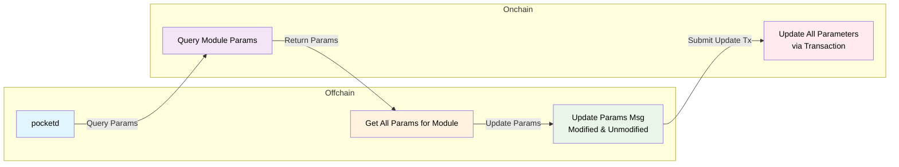

:::warning Authority only

This page is for Pocket Network Authority members only on how to update and manage onchain parameters.

It can be used by developers on LocalNet but can only be executed by the foundation on MainNet.

:::

## Overview <!-- omit in toc -->

The `update_params.sh` script provides a comprehensive tool for querying, managing, and updating governance parameters across different Pocket Network environments. This script supports both Cosmos SDK modules and Pocket-specific modules.

## Quick Start

```bash
./tools/scripts/params/gov_params.sh help
```

### Query Parameters

```bash
# Query specific module parameters
./tools/scripts/params/gov_params.sh query tokenomics

# Query all available module parameters
./tools/scripts/params/gov_params.sh query-all

# Query with specific environment
./tools/scripts/params/gov_params.sh query tokenomics --env beta
```

### Update Parameters

```bash
# Generate update transaction template
./tools/scripts/params/gov_params.sh update tokenomics

# Generate template for specific environment
./tools/scripts/params/gov_params.sh update tokenomics --env beta --output-dir ./params

# Skip edit prompt and just generate template
./tools/scripts/params/gov_params.sh update tokenomics --no-prompt
```

## Pre-requisites

Before updating parameters, make sure you have the following:

- A valid `pocketd` CLI binary installed via [install instructions](../../2_explore/2_account_management/1_pocketd_cli.md)
- A valid `pocket` home directory with the authority keys imported. For example:

```bash
pocket keys import-hex pnf_beta <...>
```

## IMPORTANT: Updating All Params

:::danger Updating all params
Due to how `params` work in the Cosmos SDK, every `MsgUpdateParams`, transaction for
particular module MUST update ALL params for that module EVEN IF only one is being updated.
:::



## Available Modules

### Pocket Network Modules

| Module        | Description                             | Key Parameters                    |
| ------------- | --------------------------------------- | --------------------------------- |
| `tokenomics`  | Token economics and reward calculations | mint allocation, inflation rates  |
| `application` | Application module parameters           | min stake, max delegated gateways |
| `gateway`     | Gateway module parameters               | Gateway-specific configurations   |
| `service`     | Service module parameters               | Service-specific configurations   |
| `supplier`    | Supplier module parameters              | Supplier-specific configurations  |
| `session`     | Session module parameters               | Session management                |
| `proof`       | Proof module parameters                 | Proof validation                  |
| `shared`      | Cross-module shared parameters          | Shared configurations             |

### Cosmos SDK Modules

| Module         | Description               | Key Parameters             |
| -------------- | ------------------------- | -------------------------- |
| `auth`         | Authentication parameters | Account parameters         |
| `bank`         | Bank module parameters    | Send/receive permissions   |
| `gov`          | Governance parameters     | Voting periods, thresholds |
| `staking`      | Staking parameters        | Validator parameters       |
| `slashing`     | Slashing parameters       | Penalty parameters         |
| `distribution` | Distribution parameters   | Reward distribution        |
| `mint`         | Mint parameters           | Inflation parameters       |

## Script Usage

### Command Structure <!-- omit in toc -->

```bash
./tools/scripts/params/gov_params.sh <command> [module_name] [options]
```

### Commands <!-- omit in toc -->

- `query <module_name>` - Query parameters for a specific module
- `query-all` - Query parameters for all available modules
- `update <module_name>` - Generate update transaction for a module

### Options <!-- omit in toc -->

| Option                | Description                                   | Default               |
| --------------------- | --------------------------------------------- | --------------------- |
| `--env <environment>` | Target environment (local, alpha, beta, main) | beta                  |
| `--output-dir <dir>`  | Directory to save transaction files           | . (current directory) |
| `--network <network>` | Network flag for query                        | Uses --env value      |
| `--home <path>`       | Home directory for pocketd                    | ~/.pocket             |
| `--no-prompt`         | Skip edit prompt (update only)                | false                 |

### Environment Configuration <!-- omit in toc -->

| Environment | Chain ID     | Authority                                   | Node                                         |
| ----------- | ------------ | ------------------------------------------- | -------------------------------------------- |
| `local`     | pocket       | pokt1eeeksh2tvkh7wzmfrljnhw4wrhs55lcuvmekkw | localhost:26657                              |
| `alpha`     | pocket-alpha | pokt1r6ja6rz6rpae58njfrsgs5n5sp3r36r2q9j04h | shannon-testnet-grove-rpc.alpha.poktroll.com |
| `beta`      | pocket-beta  | pokt10d07y265gmmuvt4z0w9aw880jnsr700j8yv32t | shannon-testnet-grove-rpc.beta.poktroll.com  |
| `main`      | pocket       | pokt10d07y265gmmuvt4z0w9aw880jnsr700j8yv32t | shannon-grove-rpc.mainnet.poktroll.com       |

## Parameter Update Workflow

### Step 1: Query Current Parameters

First, check the current parameter values:

```bash
./tools/scripts/params/gov_params.sh query tokenomics --env beta
```

Example output:

```json
{
  "params": {
    "mint_allocation_percentages": {
      "dao": 0.1,
      "proposer": 0.05,
      "supplier": 0.7,
      "source_owner": 0.15,
      "application": 0
    },
    "dao_reward_address": "pokt1f0c9y7mahf2ya8tymy8g4rr75ezh3pkklu4c3e",
    "global_inflation_per_claim": 0.1
  }
}
```

### Step 2: Generate Update Template

Create a transaction template with current parameters:

```bash
./tools/scripts/params/gov_params.sh update tokenomics --env beta --output-dir ./params
```

This generates a file like `tokenomics_params_beta_20241230_143022.json`:

```json
{
  "body": {
    "messages": [
      {
        "@type": "/pocket.tokenomics.MsgUpdateParams",
        "authority": "pokt10d07y265gmmuvt4z0w9aw880jnsr700j8yv32t",
        "params": {
          "mint_allocation_percentages": {
            "dao": "0.1",
            "proposer": "0.05",
            "supplier": "0.7",
            "source_owner": "0.15",
            "application": "0"
          },
          "dao_reward_address": "pokt1f0c9y7mahf2ya8tymy8g4rr75ezh3pkklu4c3e",
          "global_inflation_per_claim": "0.1"
        }
      }
    ]
  }
}
```

### Step 3: Edit Parameters

Modify the generated JSON file with your desired parameter changes. For example, to update the mint allocation:

```json
{
  "body": {
    "messages": [
      {
        "@type": "/pocket.tokenomics.MsgUpdateParams",
        "authority": "pokt10d07y265gmmuvt4z0w9aw880jnsr700j8yv32t",
        "params": {
          "mint_allocation_percentages": {
            "dao": "0.1",
            "proposer": "0.1",
            "supplier": "0.2",
            "source_owner": "0.1",
            "application": "0.5"
          },
          "dao_reward_address": "pokt10d07y265gmmuvt4z0w9aw880jnsr700j8yv32t",
          "global_inflation_per_claim": "0.5"
        }
      }
    ]
  }
}
```

### Step 4: Submit Transaction

Submit the parameter update transaction:

```bash
pocketd tx authz exec tokenomics_params_beta_20241230_143022.json \
  --from=pnf_beta \
  --keyring-backend=test \
  --chain-id=pocket-beta \
  --node=https://shannon-testnet-grove-rpc.beta.poktroll.com \
  --yes \
  --home=~/.pocket \
  --fees=200upokt
```

### Step 5: Verify Changes

Check the transaction result and verify parameter updates:

```bash
# Check transaction status
pocketd query tx --type=hash <TRANSACTION_HASH> --network=beta

# Verify updated parameters
./tools/scripts/params/gov_params.sh query tokenomics --env beta
```

## Common Use Cases

### Updating Tokenomics Parameters

**Mint Allocation Changes:**

```bash
# Query current allocation
./tools/scripts/params/gov_params.sh query tokenomics --env beta

# Generate update template
./tools/scripts/params/gov_params.sh update tokenomics --env beta

# Edit the JSON file to modify mint_allocation_percentages
# Submit transaction as shown above
```

**Inflation Rate Updates:**

```bash
# Current: global_inflation_per_claim: 0.1
# Updated: global_inflation_per_claim: 0.5
```

### Updating Application Parameters

```bash
# Query application parameters
./tools/scripts/params/gov_params.sh query application --env beta

# Generate update template
./tools/scripts/params/gov_params.sh update application --env beta
```

### Bulk Parameter Review

Query all module parameters across environments:

```bash
# Check all parameters in beta
./tools/scripts/params/gov_params.sh query-all --env beta

# Check all parameters in alpha
./tools/scripts/params/gov_params.sh query-all --env alpha
```

## Troubleshooting

### Common Issues

**Module Not Found:**

```bash
❌ Failed to query parameters for module 'unknown_module'
```

Check available modules list with `./tools/scripts/params/gov_params.sh help`

**Authority Mismatch:**

```bash
Error: unauthorized: invalid authority
```

Verify authority address matches environment configuration

**Network Connection:**

```bash
Error: Failed to query parameters
```

Check network connectivity and node endpoint

**Invalid JSON Format:**

```bash
Error: invalid character in JSON
```

Validate JSON syntax before submission

## Examples

### Complete Tokenomics Update Example

```bash
# 1. Query current state
./tools/scripts/params/gov_params.sh query tokenomics --env beta

# 2. Generate template
./tools/scripts/params/gov_params.sh update tokenomics --env beta --output-dir ./governance

# 3. Edit the generated file
# vim ./governance/tokenomics_params_beta_20241230_143022.json

# 4. Submit transaction
pocketd tx authz exec ./governance/tokenomics_params_beta_20241230_143022.json \
  --from=pnf_beta --network=beta --yes --fees=200upokt

# 5. Verify changes
./tools/scripts/params/gov_params.sh query tokenomics --env beta
```
