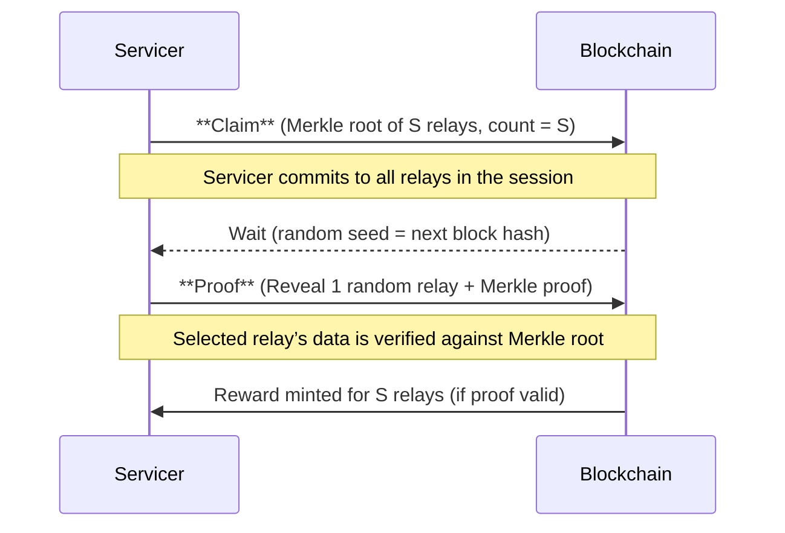

## Probabilistic Proofs: Scaling Verifiable Relay Throughput

### Summary

The number of relays that Pocket Network can process is fundamentally limited by on-chain Claim/Proof transactions.

Each session (batch of relays) associated with an (application, supplier, consumer) tuple serviced must be recorded and verified on-chain, requiring validation resources and consuming block space.

To handle an uncapped number of actors and services onchain, the network needs a scalable verification method.

Approaches like increasing block sizes, batching claims, or off-chain aggregation, are good stop gap solutions, but this document proposes an alternate long-term solution: Probabilistic Proofs.

In essence, instead of fully verifying every relay on-chain, the network will verify a small, random sample of sessions cryptographically, leveraging probabilistic guarantees by leveraging crypto-economic incentives.

### Overview of the Proposed Solution

Probabilistic Proofs introduce a commit-and-reveal-check scheme for session verification.

A servicer (node) will still handle up to a certain number of relays for an application in a session (denoted S, the session’s relay allowance based on the app’s stake). However, instead of submitting proof for every relay, the servicer only proves a random subset of those relays on-chain:
• Commit Phase: During a session, the servicer collects all the relays it serviced and their cryptographic evidence (e.g. the application’s signature on each relay response). It then computes a Merkle tree (or similar accumulator) of all S relays’ evidence. The servicer submits a Claim transaction containing the Merkle root and the total count of relays serviced (this count should not exceed the app’s staked throughput limit). This claim anchors a commitment to the batch of S relays without revealing each relay individually on-chain.
• Reveal/Proof Phase: After a short waiting period (to ensure unpredictability of the next block hash or random seed), the network pseudorandomly selects one (or a few) relay(s) from that session to verify. The selection is based on a source of randomness that servicers cannot predict (e.g. the hash of a future block) to prevent servicers from cheating on non-verified relays. The servicer must then submit a Proof transaction revealing the full details of the selected relay(s) along with a Merkle proof (the branch from the Merkle root to the chosen leaf). The on-chain validation checks: (1) the revealed relay’s data and signature are valid, (2) the Merkle proof matches the previously committed root (ensuring the revealed relay was indeed in the original batch), and (3) the number of relays in the claim did not exceed the allowed limit. If all checks pass, the batch is probabilistically verified as honest, and the servicer earns rewards for the claimed relays. If the check fails (e.g., the servicer lied about a relay or overserved beyond its stake), the servicer can be penalized or slashed, and rewards for that batch are forfeited.

Figure: Commit-and-reveal scheme for Probabilistic Proofs. Only one relay from each batch of S is revealed and verified on-chain, drastically reducing proof traffic.

This probabilistic approach dramatically reduces the number of on-chain proofs required. Rather than one proof per relay, we get roughly one proof per session (or per S relays). In expectation, only a fraction of relays will be explicitly verified on-chain, but thanks to the random selection and strong penalties, servicers are incentivized to be honest for all relays. The security comes from the fact that a servicer does not know in advance which relay will be checked; thus, the safest strategy is to make sure all relays are valid. Cheating on even a small portion of relays carries a significant risk of detection and punishment.

Probabilistic Verification Model

Under this scheme, verification becomes a probabilistic process that can be modeled with well-known statistical distributions. We define the key parameters as follows:
• S – The number of relays in a session (i.e. the batch size committed at once). This is determined by the application’s stake and protocol configuration (it represents the maximum relays an app can utilize in a single session). For simplicity, assume a fixed S for modeling, though in practice S may vary per session or app.
• p – The probability that any given relay in the batch is selected for on-chain proof. In the simplest implementation where exactly one relay is verified per session, p = 1/S (each of the S relays has an equal chance of being the one chosen for proof). More generally, the protocol could choose R relays to prove per session – either exactly R (without replacement) or with an independent probability for each relay. In many cases we can approximate or design this as each relay being independently selected with probability p (yielding an expected R = p·S proofs per session). The parameter p (Probability of Proof Request for each relay) is a critical tuning knob: it directly controls the trade-off between chain load and security. A smaller p means fewer on-chain proofs (higher scalability), while a larger p means more proofs and thus stronger verification per batch.
• R – The expected or target number of relays to be proven per session. If the protocol chooses exactly one relay to verify, then R = 1 (and p = 1/S as above). If the protocol allows multiple proofs per session, R could be >1 (e.g. verifying 2 or 3 relays out of the batch). In an independent sampling model, R = p·S (the expected count of proofs in a batch of S). In either case, R is configured such that R << S; we want to keep proofs per session very low (for scalability) while still high enough to catch misbehavior with high probability.

Geometric Distribution of Proof Intervals: If relay proofs are triggered with independent probability p for each relay, the number of relays between successive proofs follows a geometric distribution. This means the probability that the next proof occurs on the k-th relay (i.e., k-1 relays had no proof and then the k-th relay is selected for proof) is:

P(\text{next proof at relay } k) = (1-p)^{\,k-1} \cdot p,

for k = 1, 2, 3, … (assuming at least one relay in the session). The geometric distribution has the well-known property that its expected value (mean) is 1/p. In our context, on average one proof will occur for every 1/p relays. For example, if p = 0.01 (1% chance per relay), we expect roughly one proof for every 100 relays served. More generally, if the session size is S and proofs are relatively infrequent, the expected number of proofs per session is p \times S = R. (If the protocol fixes R proofs per session deterministically, that is equivalent to a hypergeometric sampling of size R from S, which for modeling purposes can be approximated by the binomial distribution when S is large and R is small.)

Expected On-Chain Throughput: By using probabilistic sampling, the on-chain verification overhead is reduced by a factor of roughly 1/p compared to verifying every relay. If the network originally maxed out at ~3B relays/day with full proofs, and we only prove, say, 1 in 100 relays (p = 0.01), the theoretical throughput ceiling increases ~100× (to ~300B relays/day) without increasing block space usage. In practice, the improvement can be tuned: for instance, p might be set even lower (0.1% or 0.01%) to scale by further orders of magnitude. Section parameters can be adjusted via governance to balance demand and security.

Security Analysis and Parameter Tuning

The security of probabilistic proofs lies in the high probability of catching dishonest behavior. We consider two types of misbehavior: (1) Serving invalid data (or lying about relays that weren’t actually serviced), and (2) Overservicing (servicing more relays than the application is allowed by stake). We model a malicious servicer that cheats on a fraction of relays in a session and analyze detection probabilities.
• Honest Majority Assumption: We assume the majority of servicers and applications are honest and follow the protocol. Dishonest servicers are economically disincentivized via slashing if caught. The random verification mechanism is designed to catch and punish cheaters with high probability before they can profit significantly.
• Probability of Detection per Batch: Suppose a servicer includes some number of bogus or incorrect relays in its claim. Let c be the number of fraudulent relays in a batch of size S (so the servicer is cheating on c/S fraction of the batch). If the protocol verifies R randomly chosen relays (or effectively each relay has probability p of being verified), what is the probability that at least one of the c bad relays is checked?
• If exactly one relay is proved (R = 1), the chance of catching any bad relay in the batch is \frac{c}{S} (since one random pick has c/S probability of hitting one of the c bad relays). Equivalently, the chance the cheater escapes detection in that batch is 1 - \frac{c}{S} = \frac{S-c}{S}.
• If multiple proofs are done or each relay is independently sampled with probability p, the detection probability is higher. For independent sampling, the probability that a specific bad relay is not selected for proof is (1-p). If there are c bad relays (assuming c is much smaller than S so that selections are nearly independent), the probability none of the bad relays are checked is approximately (1-p)^c. Thus, the probability of catching at least one bad relay is:

P\_{\text{catch}} \approx 1 - (1-p)^c.

When p is small and c is not too large, this is roughly 1 - e^{-p c} by the approximation (1-p)^c \approx e^{-pc}. For example, if a servicer cheats on c = 5 relays and p = 0.1 (10% chance per relay to be checked), the chance none of those 5 are checked is (0.9)^^5 \approx 59\%, so there’s a ~41% chance the servicer is caught in that session. If p = 0.2 (20%), that catch probability rises to ~67%. Higher p or more fraudulent relays c both increase the likelihood of detection.
• Above-Threshold Attacks: If a servicer attempts a large-scale cheat – for example, inserting so many fraudulent relays that c is a significant fraction of S – the probability of detection becomes very close to 1. In fact, there is a threshold effect: beyond a certain fraud fraction, it is virtually certain at least one bad relay will be sampled and the servicer will be caught immediately. For instance, if a node falsifies 50% of a batch and we still only sample 1 relay (R=1), the chance of detection is 50%. But with even a small increase in R or p, the catch probability quickly approaches 100%. The protocol can be configured such that any blatant, above-threshold cheating (e.g. claiming significantly more relays than actually serviced) will trigger detection with overwhelming probability in a single session. This deters “obvious” large-scale attacks, as they would almost surely result in slashing on the first attempt.
• Below-Threshold (Subtle) Cheating: More concerning is the scenario of a servicer cheating just below the detection threshold – e.g. falsifying only a very small fraction of relays so that the per-batch catch probability is lower. For example, if a servicer inserts just 1 fake relay in a batch of 100 (c=1, S=100, so 1% cheat rate) and only one relay is sampled, there’s only a 1% chance that particular bad relay gets picked and the servicer is caught in that session. The servicer might get away with it for one batch. However, if the servicer repeats this low-level cheating across many sessions, the probability of eventually being caught compounds over time. The number of sessions they can cheat before being caught follows a geometric distribution as well – each session is an independent chance of detection (in our example, 1% per session). The expected number of sessions until detection in that case is 100; in other words, sooner or later, one of the random checks will hit the fake relay and the servicer will be punished. Critically, when a servicer is caught, the penalties (loss of stake, loss of future rewards, reputation damage, etc.) should outweigh any short-term gains from cheating in those prior sessions. This economic deterrent is key: rational servicers should conclude that even low-probability cheating isn’t worth the eventual catastrophic risk.

Tuning p (Probability of Proof) for Security: We can choose p (or R) to ensure that any “unacceptably large” cheat is caught with high confidence in a single session, and even tiny cheats are caught before they can accumulate profit. For example, the network might set a policy like: “Any servicer overservicing by more than 10% of S will be caught with ≥99% probability.” If c = 0.1 S (10% of relays are bad) and we want P\_{\text{catch}} ≥ 0.99, we require 1 - (1-p)^{0.1S} ≥ 0.99. For large S, a simpler (approximate) way to ensure this is p \cdot 0.1S ≥ 4.6 (since (1-p)^{0.1S} ≈ e^{-0.1 p S} and we want e^{-0.1 p S} ≤ 0.01 which gives 0.1 p S ≥ 4.605). This yields p ≥ \frac{4.6}{0.1 S} = \frac{46}{S}. As a concrete example, if S = 1000 relays per session, p should be at least ~0.046 (4.6%) to catch a 10% fraud with 99% probability in one batch. If S is larger, p would need to be proportionally smaller to maintain the same detection guarantee (because with more total relays, a fixed p means more absolute proofs). In practice, governance might set p based on worst-case acceptable risk and observed network behavior. The expected number of proofs per session, p·S, should remain low (to keep costs down), but not so low that cheating becomes rational. Fine-tuning this parameter can be informed by simulation or testnet data.

Tuning R (Number of Proofs per Session): An alternative tuning knob is R, the number of relays to sample from each batch. Instead of purely probabilistic independent sampling, the protocol could deterministically require, say, R = 2 proofs for certain high-volume sessions. Multiple proofs without replacement from the batch yield a hypergeometric distribution of catches. This slightly complicates analysis but generally improves detection odds, especially for moderate fraud levels, at the cost of higher on-chain load. For instance, with R = 2 verified relays out of S, the chance a 10% cheat goes undetected is roughly \frac{\binom{S-c}{R}}{\binom{S}{R}} (the probability that both sampled relays are among the honest ones). For S = 1000 and c = 100 (10%), if R=2, the chance of not catching a bad relay is extremely low (on the order of 0.5% or less). Thus, R can be used as a discrete lever to strengthen security when needed. However, increasing R beyond 1 has diminishing returns unless cheat fractions are very small, and it linearly increases the proof burden. The current proposal leans toward using a single proof (R=1) per session in normal operation, with p scaled appropriately for session size, because of its simplicity and minimal overhead.

In summary, by adjusting p (and optionally R), Pocket Network can enforce an arbitrarily low probability of undetected fraud while still reaping huge efficiency gains. For example, with a sufficiently low p, even a servicer that tries to sneak in a few extra relays beyond their stake allocation (an overservice attack) will almost surely be caught and penalized before they benefit. Conversely, honest servicers will almost never be asked to provide more than a tiny proof sample, keeping their cost overhead low.

Edge Cases, Assumptions, and Attack Considerations

While Probabilistic Proofs vastly improve scalability, it’s important to make explicit certain assumptions and consider edge cases to ensure the model holds robustly:
• Unpredictable Selection: A crucial assumption is that the random selection of relay(s) to verify is truly unpredictable and unbiased. The proposal relies on using the blockchain’s randomness (e.g., a block hash) after the claim is submitted, so the servicer cannot know which relay will be checked when it formulates its claim. This must be enforced to prevent servicers from selectively “cheating only on relays they know won’t be verified.” Any bias or predictability in the random seed could be exploited (for example, a servicer might try to influence the block hash or time their claim to avoid certain outcomes). Thus, the protocol should use a secure, unpredictable randomness source (or even a verifiable random function if needed) for selecting the proof index. We assume this is in place, as is common in commit-reveal schemes.
• Session Multiplicity (Multiple Concurrent Sessions): In Pocket Network, an application can distribute its traffic across multiple sessions (for example, by using multiple distinct app stakes or by operating on many chains simultaneously). We must consider whether an attacker could exploit many parallel smaller sessions to dodge the probabilistic checks. If each session is verified independently with probability p, does splitting relays into many sessions confer any advantage to a cheater? Intuitively, splitting does not reduce the overall chance of detection if the attacker is cheating proportionally in each session. In fact, having more sessions means more opportunities for random checks to catch misconduct. For example, if an app splits its traffic into 10 sessions and a servicer decides to cheat a little in all 10, each session carries its own risk of detection – the likelihood that none of the 10 sessions catches the cheat is exponentially smaller than for a single session. The worst-case scenario for an attacker would be to concentrate cheating in just one of many sessions and hope that particular session isn’t sampled. But since the network can slash even a single caught session, the attacker doesn’t gain much by this beyond what we already analyzed for one session. One nuance: if a malicious actor uses multiple identities (nodes) across sessions, they might attempt to isolate risk – e.g., cheat with one node/session while keeping others honest, expecting that only the cheating identity gets slashed if caught. However, this still doesn’t let them evade detection; it merely sacrifices one identity for marginal gain. The economic incentives (stake required per identity, and slashing penalties) should make this strategy unprofitable. In summary, session multiplicity does not undermine the probabilistic proof security model, but it’s worth explicitly stating that each session is independently verified. Cheating in any session can lead to punishment in that session, and running multiple sessions in parallel does not meaningfully dilute an honest network’s ability to eventually catch wrongdoing.
• Overservicing and Stake Limits: As mentioned, if a servicer attempts to overserve (service more relays than the application’s stake permits), the claim’s relay count itself should raise a red flag. The protocol can directly enforce that no claim exceeds the maximum relays allowed by the app’s stake (making it impossible to overserve without immediately invalidating the claim). Probabilistic Proofs primarily address the scenario where a servicer includes invalid relays or over-reports relays within the allowed limit to gain unearned rewards. In such cases, the random check mechanism comes into play. An above-threshold overserve (say claiming 2S relays when only S is allowed) would either be outright rejected or trivially caught by even one random check because the servicer cannot produce valid signed evidence for relays beyond S. Thus, maintaining a strict protocol rule on maximum relays per session is assumed.
• Complete Omission of Proofs (Edge Case): There is a small probability that no relay is selected for proof in a given session (if the sampling is purely probabilistic and not guaranteed at least one). For instance, if each relay has p chance independently, it’s possible (though unlikely for moderate pS) that zero relays get flagged. In such a case, the servicer would receive rewards for that session without any on-chain proof being revealed. This is acceptable as long as it’s rare and random – over the long run, repeated lack of sampling would be exceedingly unlikely. However, to avoid this edge case entirely, the protocol may choose a deterministic approach of always sampling at least one relay per session (the original design of R=1 per batch ensures this). Our analysis assumed at least one proof is expected; if governance chooses to allow “proofless” sessions by pure chance, it should be monitored to ensure it doesn’t open a loophole. Statistically, as long as E[R] = pS is reasonably above 1, the probability of zero proofs in a session is (1-p)^S, which becomes negligible for large S (for example, if S=100 and p=0.05, (0.95)^{100} < 0.005, under 0.5%).
• Verification of Honest Relays: It’s worth noting that even when servicers are honest and every relay is valid, the random spot-check imposes a small overhead. Honest servicers will pass the check every time; the protocol must still pay the cost (in block space and verification time) for that one proof. If p is set too high, honest nodes might waste significant effort proving relays that were never in question, reducing overall efficiency. Thus, p should be set just high enough to catch cheating, but not so high that we negate the benefits of probabilistic sampling. The current methodology of using geometric distribution and expected R helps in finding that sweet spot.
• Notation and Consistency: In this document, we used S, p, and R consistently to denote session size, per-relay proof probability, and proofs per session respectively. These parameters should not be confused with other uses (for example, R here is not “reliability” but literally the count of verifications per session). All formulas assume a large population of relays and sessions such that statistical averages hold – in smaller cases, exact hypergeometric probabilities should be considered. We also assume a static p for all sessions for simplicity, though in a real network p could be dynamic or adjusted based on observed behavior or stake size (e.g., maybe larger sessions use a slightly smaller p to keep absolute proofs manageable, or vice versa to ensure absolute security for big sessions).

Conclusion

Probabilistic Proofs offer a robust way to scale Pocket Network’s relay throughput by orders of magnitude without sacrificing verifiability. By replacing exhaustive per-relay proofs with random auditing, the network can handle far more relays within the same block space budget. The geometric and binomial models show that even with a tiny sampling rate, dishonest behavior will almost inevitably be exposed given enough trials – and typically far sooner than “enough trials” thanks to parameter tuning for worst-case scenarios. Honest participants benefit from reduced overhead, and malicious ones face high expected costs for attempts to cheat.

This approach relies on a careful balance: strong crypto-economic penalties to deter cheating, truly unpredictable relay selection, and community/governance oversight to adjust parameters as needed. With those in place, Probabilistic Proofs can maintain the precision and rigor of crypto-economic security (every relay is verifiably serviced with high confidence) while vastly improving efficiency. All mathematical modeling and parameters will be continuously evaluated as we move through testnet and mainnet rollout, ensuring that the theoretical guarantees translate into real-world security. By explicitly stating assumptions and considering edge cases like above-threshold attacks and session splitting, we aim to fortify the design against clever adversaries. The result is a scalable yet rigorous relay verification mechanism that upholds the integrity of Pocket Network as it grows to serve Web3’s massive demand for data relays.
