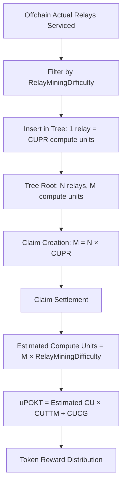

A high level overview of how minting and burning works in the network.

## Overview

This document provides an introduction to the mint and burn mechanisms in the network, covering governance parameters, tokenomics calculations, and the flow from relay servicing to token rewards.

## Tokenomics Flow

### Key Variables

| Variable                        | Description                            | Controller        |
| ------------------------------- | -------------------------------------- | ----------------- |
| `RelayMiningDifficulty`         | Dynamic on-chain difficulty adjustment | Service (Dynamic) |
| `ComputeUnitsPerRelay`          | CU cost per relay                      | Service Owner     |
| `ComputeUnitsToTokenMultiplier` | CU to token conversion rate            | Network           |
| `ComputeUnitCostGranularity`    | Granularity for CU calculations        | Network           |

### Process Flow



## Tokenomics Calculations

### Basic Equations

#### Claim Creation (Actual → Probabilistic)

```bash
offchainActualRelaysServiced
→ filter(RelayMiningDifficulty)
→ insertInTree(1 relay, CUPR computeUnits)
→ root(N relays, M computeUnits where M = N × CUPR)
```

#### Claim Settlement (Probabilistic → Estimated)

**Mathematical Notation:**

```bash
M = ClaimedComputeUnits
EM = M × RelayMiningDifficulty
uPokt = EM × CUTTM ÷ CUCG
```

**Plain English:**

```bash
estimatedOffchainComputeUnits = claim.NumVolumeApplicableComputeUnits × service.RelayMiningDifficulty
uPOKT = estimatedOffchainComputeUnits × chain.ComputeUnitsToTokenMultiplier ÷ chain.ComputeUnitsCostGranularity
```

## Example Calculation

### Scenario Parameters

- **Supplier handled**: 1,000,000 relays
- **Market rate**: $5M for 1M ETH relays
- **Expected uPOKT result**: 0.012

### Required Parameter Values

| Parameter                                 | Current Value | Status        |
| ----------------------------------------- | ------------- | ------------- |
| CUCG (Compute Unit Cost Granularity)      | 1e-6          | Set           |
| CUPR (Compute Units Per Relay)            | TBD           | Needs Update  |
| RelayMiningDifficulty                     | TBD           | Needs Check   |
| CUTTM (Compute Units To Token Multiplier) | TBD           | Needs Setting |

## Token Supply Analysis

### Key Metrics to Track

1. **Total token supply** across all components
2. **Supply per module** breakdown
3. **Staked vs liquid** token distribution
4. **Application minimum stake** requirements

### Minimum Stake Considerations

The application minimum stake should support at least 1,000,000 relays, requiring estimation of:

- Cost per relay
- Service requirements
- Network capacity needs

## Implementation Commands

### Application Parameters

```bash
# App Min Stake
pocketd tx authz exec ./tools/scripts/params/service_target_num_relays.json $(PARAM_FLAGS)

# App Max Delegated Gateways
pocketd tx authz exec ./tools/scripts/params/service_target_num_relays.json $(PARAM_FLAGS)
```

## Technical Notes

- Claims are created using `claim#GetClaimedUPOKT` function
- The system converts actual relay counts to probabilistic estimates through difficulty filtering
- Final token rewards are calculated using network-controlled multipliers and granularity settings

## Next Steps

1. Determine optimal CUPR values for different service types
2. Monitor and adjust RelayMiningDifficulty based on network conditions
3. Set appropriate CUTTM values to match target economics
4. Validate calculations against expected market rates
