A gentle high-level introduction to token minting and burning, intended to understand
the different variables involved and how they interact.

:::warning Morse Readers

If you were involved in the "Morse" network of Pocket Network, approach
this document from a first-principles perspective. **Do not try to draw parallels**.

:::

- [Key Relay Cost Variables](#key-relay-cost-variables)
- [Claim \& Relay Estimation Flow](#claim--relay-estimation-flow)
  - [Mathematic Representation](#mathematic-representation)
  - [💰 Example with Numbers](#-example-with-numbers)
- [Token Distribution (Global Inflation)](#token-distribution-global-inflation)
- [FAQ](#faq)
  - [Why do we need relay mining difficulty?](#why-do-we-need-relay-mining-difficulty)
  - [How do we prove the claim?](#how-do-we-prove-the-claim)
  - [Why is every relay the same number of compute units?](#why-is-every-relay-the-same-number-of-compute-units)
  - [How does rate limiting work?](#how-does-rate-limiting-work)
  - [How does burning work?](#how-does-burning-work)

## Key Relay Cost Variables

| Parameter                       | Parameter Type | Scope            | Controller                      | Description                                                                               |
| ------------------------------- | -------------- | ---------------- | ------------------------------- | ----------------------------------------------------------------------------------------- |
| `RelayMiningDifficulty`         | Dynamic        | Service Specific | Onchain protocol business logic | The probability that a relay is reward applicable                                         |
| `ComputeUnitsPerRelay`          | Static         | Service Specific | Service Owner                   | Number of compute units each reward applicable relay accounts for                         |
| `ComputeUnitsToTokenMultiplier` | Static         | Network Wide     | Network Authority               | Number of onchain tokens minted/burnt per compute unit                                    |
| `ComputeUnitCostGranularity`    | Static         | Network Wide     | Network Authority               | Enable more granular calculations for the cost of a single relay (i.e. less than 1 uPOKT) |

## Claim & Relay Estimation Flow

The end-to-end flow can be split into 4 key steps (steps 1-3 capture in the diagram below):

1. **Tree Construction**: Converts actual offchain number of relays to the probabilistic number of reward applicable relays
2. **Claim Creation**: Sums up the total number of reward applicable relays in the tree into a single claim
3. **Claim Settlement**: Estimates the total number of consumed compute units based on the claim and service parameters
4. **Token Distribution**: Converts the estimated compute units into uPOKT and distributes it to relevant stakeholders

```mermaid
graph TD
    %% Set default styling for all nodes
    classDef default fill:#f9f9f9,stroke:#333,stroke-width:1px,color:black;

    User("👨‍💻 User / Developer"):::userClass
    ServiceOwner("💁 Service Owner"):::userClass

    subgraph HO["👷 Hardware Operator"]
        direction LR
        RelayMiner[["⛏️ RelayMiner<br/>(Co-processor)"]]:::supplierClass
        Tree[("🌲 Sparse Merkle Sum Trie<br/> **Root Sum: Num Relays**<br/>(Reward Applicable Relays)")]:::dbClass
        RelayMiner -.- | **🎲 Probabilistic Number** <br/> of Relays Serviced<br/>|Tree
    end
    HO:::userClass

    User <-->|"**🔢 Actual Number**<br/> of Relays Serviced"| HO
    Tree -->|"Claim Creation"| Blockchain
    User -.- App
    ServiceOwner -.- Service
    HO -.- Supplier

    subgraph Blockchain["🌀 Pocket Network"]
        direction TB

        App[("📱 Application<br/>(User Owned)")]:::configClass
        Supplier[("🏗️ Supplier<br/>(Operator Owned)")]:::configClass
        Service[("🛎 Service<br/>(Service Owned)<br/>")]:::configClass

        subgraph Calculation["Tokenomics Calculation"]
            CUPR["**Service.ComputeUnits<br/>PerRelay**"]:::default
            RMD["**Service.RelayMining<br/>Difficulty**"]:::default
            NumRelays["**Claim.NumRelays**<br/>(Reward Applicable Relays)"]:::default

            NumRelays --> EstimatedCU
            CUPR --> EstimatedCU
            RMD --> EstimatedCU

            uPOKT["**🧾 Session.Cost**<br/>(uPOKT)"]:::default
            EstimatedCU["**🧮 Total Estimated** <br/>Compute Units"]:::default --> uPOKT
        end
    end

    %% Define custom classes with specified colors
    classDef userClass fill:#f0f0f0,stroke:#333,stroke-width:2px,color:black;
    classDef gatewayClass fill:#e8f5e8,stroke:#4caf50,stroke-width:2px,color:black;
    classDef pocketdClass fill:#fff3e0,stroke:#ff8f00,stroke-width:2px,color:black;
    classDef blockchainClass fill:#e3f2fd,stroke:#2196f3,stroke-width:2px,color:black;
    classDef supplierClass fill:#fff3e0,stroke:#ff9800,stroke-width:2px,color:black;
    classDef keyClass fill:#ffebee,stroke:#d32f2f,stroke-width:1px,color:black;
    classDef configClass fill:#f3e5f5,stroke:#7b1fa2,stroke-width:1px,color:black;
    classDef dbClass fill:#e0f2f1,stroke:#00695c,stroke-width:1px,color:black;

    %% Apply classes to subgraphs
    class Blockchain blockchainClass
    class Calculation pocketdClass
```



### Mathematic Representation

$$
\begin{aligned}
\text{Claim.NumRelays} &= \text{scaleDown}(\text{RelayMiningDifficult}, \text{ActualNumberOfRelays}) \\
\text{ClaimedComputeUnits} &= \text{Claim.NumRelays} \times \text{ComputeUnitsPerRelay} \\
\text{EstimatedOffchainComputeUnits} &= \text{scaleUp}(\text{RelayMiningDifficult}, \text{ClaimedComputeUnits}) \\
u\text{POKT} &= \frac{\text{EstimatedOffchainComputeUnits} \times \text{ComputeUnitsToTokenMultiplier}}{\text{ComputeUnitsCostGranularity}}
\end{aligned}
$$

:::warning Rendering bug (ignore the duplication)

TODO(@olshansk): Look into why this equation renders twice: as latex and plaintext.

:::

### 💰 Example with Numbers

Assume the following Offchain market driven numbers:

- **POKT price**: $0.1/POKT
- **Market rate**: $5M for 1M relays
- **Session**: Num actual offchain relays between App (User) & Supplier (Operator)

| Num Relays     | Description                            | RelayMiningDifficulty (RMD) | ComputeUnitsPerRelay (CUPR) | ComputeUnitsToTokenMultiplier (CUTTM) | ComputeUnitCostGranularity (CUCG) | Estimated Compute Units (CU)                       | uPOKT Result                                                                   | USD <br/> (at $0.10/POKT) |
| -------------- | -------------------------------------- | --------------------------- | --------------------------- | ------------------------------------- | --------------------------------- | -------------------------------------------------- | ------------------------------------------------------------------------------ | ------------------------- |
| **1,000,000**  | Baseline values                        | 1.0                         | 1.0                         | 50                                    | 1                                 | 1,000,000 x 1 x 1 <br/> = 1,000,000                | 1,000,000 × 50 / 1 <br/> = **50,000,000 uPOKT <br/> = 50 POKT**                | **$5.00**                 |
| **1,000,000**  | High multiplier <br/> High granularity | 1.0                         | 1.0                         | 50,000,000                            | 1e6                               | 1,000,000 x 1 x 1 <br/> = 1,000,000                | 1,000,000 × 50,000,000 / 1,000,000 <br/> = **50,000,000 uPOKT <br/>= 50 POKT** | **$5.00**                 |
| **1,000,000**  | High compute units per relay           | 1.0                         | 5.0                         | 50                                    | 1                                 | 1,000,000 x 1 x 5 <br/> = 5,000,000                | 5,000,000 × 50 / 1 <br/> = **250,000,000 uPOKT <br/> = 250 POKT**              | **$25.00**                |
| **10,000,000** | Adjusted relay mining difficulty       | 0.1                         | 1.0                         | 50                                    | 1                                 | 1,000,000 x <br/>(0.1 / 0.1) x 1 <br/> = 1,000,000 | 1,000,000 × 50 / 1 <br/> = **5,000,000 uPOKT <br/> = 5 POKT**                  | **$5.00**                 |

:::note Relay Mining Difficulty

The actual computation related to Relay Mining Difficlty is non-linear but used solely for demonstration purposes here.

:::

## Token Distribution (Global Inflation)

Steps 1-3 above represent the baseline `mint=burn` scenario where `POKT` is transferred from the Application to the Supplier.

Step 4 can optionally inflate the overall supply of `POKT` by minting additional tokens.

For example, assuming the following tokenomic module params:

```json
{
  "params": {
    "mint_allocation_percentages": {
      "dao": 0.1,
      "proposer": 0.1,
      "supplier": 0.7,
      "source_owner": 0.1,
      "application": 0
    },
    "dao_reward_address": "pokt10...",
    "global_inflation_per_claim": 0.2
  }
}
```

```mermaid
graph TD
    %% Set default styling for all nodes
    classDef default fill:#f9f9f9,stroke:#333,stroke-width:1px,color:black;

    uPOKT["**🧾 Session.Cost**<br/>(uPOKT)"]:::keyClass

    subgraph GlobalInflation["🌍 Global Inflation Calculation"]
        direction TB
        GIP["**chain.GlobalInflationPerClaim**<br/>(0.2)"]:::default
        InflationAmount["**💰 session.Inflation**<br/>(uPOKT × 0.2)"]:::default

        GIP --> InflationAmount
        uPOKT --> InflationAmount
    end

    subgraph TokenMinting["⚡ Token Minting & Distribution"]
        direction TB

        TotalMint["**🏭 session.MintBurnInflate**<br/>(Session Cost + Inflation)"]:::default

        AppWallet[("📱 Application Wallet<br/>(User Controlled)")]:::configClass
        SupplierWallet[("🏗️ Supplier Wallet<br/>(Operator Controlled)")]:::supplierClass
        DAOAddress[("🏛️ DAO Treasury<br/>pokt10...")]:::daoClass
        ProposerWallet[("👨‍⚖️ Block Proposer<br/>(Validator Wallet)")]:::proposerClass
        SourceOwnerWallet[("🛎 Service Owner Wallet<br/>(Service Controlled)")]:::sourceClass
    end

    InflationAmount --> TotalMint

    TotalMint -->|"🔥 Session.Cost"| AppWallet
    TotalMint -->|"💰 Session.Cost + <br/> 💰 0.7 * Session.Inflation"| SupplierWallet
    TotalMint -->|"💰 0.1 * Session.Inflation"| DAOAddress
    TotalMint -->|"💰 0.1 * Session.Inflation"| ProposerWallet
    TotalMint -->|"💰 0.1 * Session.Inflation"| SourceOwnerWallet

    %% Define custom classes with specified colors
    classDef userClass fill:#f0f0f0,stroke:#333,stroke-width:2px,color:black;
    classDef gatewayClass fill:#e8f5e8,stroke:#4caf50,stroke-width:2px,color:black;
    classDef pocketdClass fill:#fff3e0,stroke:#ff8f00,stroke-width:2px,color:black;
    classDef blockchainClass fill:#e3f2fd,stroke:#2196f3,stroke-width:2px,color:black;
    classDef supplierClass fill:#fff3e0,stroke:#ff9800,stroke-width:2px,color:black;
    classDef keyClass fill:#ffebee,stroke:#d32f2f,stroke-width:1px,color:black;
    classDef configClass fill:#f3e5f5,stroke:#7b1fa2,stroke-width:1px,color:black;
    classDef dbClass fill:#e0f2f1,stroke:#00695c,stroke-width:1px,color:black;
    classDef daoClass fill:#e8eaf6,stroke:#3f51b5,stroke-width:1px,color:black;
    classDef proposerClass fill:#f1f8e9,stroke:#689f38,stroke-width:1px,color:black;
    classDef sourceClass fill:#fce4ec,stroke:#c2185b,stroke-width:1px,color:black;

    %% Apply classes to subgraphs
    class GlobalInflation pocketdClass
    class TokenMinting blockchainClass
```



## FAQ

### Why do we need relay mining difficulty?

To be able to scale a single RelayMiner co-processor to handle billions of relays while being resource efficient.

### How do we prove the claim?

Visit the [claim and proof lifecycle docs](../primitives/claim_and_proof_lifecycle.md) for more information.

### Why is every relay the same number of compute units?

We will handle variable compute units per relay in the future.

### How does rate limiting work?

Rate limiting is an optimistic non-interactive permissionless mechanism that uses a commit-and-reveal scheme with probabilistic guarantees, crypto-economic (dis)incentives, and onchain proofs to ensure that suppliers do not over-service applications.

### How does burning work?

Burning is a mechanism that puts funds in escrow, burns it after work is done, and puts optimistic limits in place whose work volume is proven onchain.
