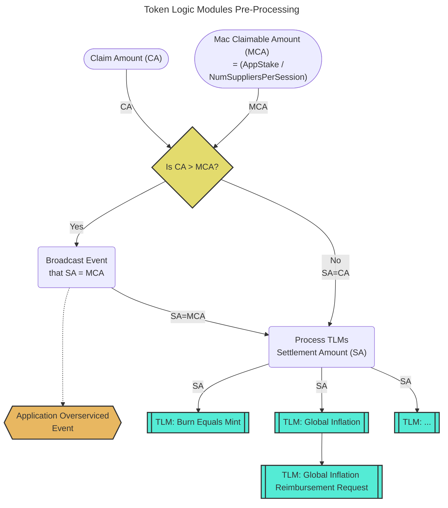

- [Introduction](#introduction)
- [Background: Max Claimable Amount](#background-max-claimable-amount)
- [TLM (pre) Processing](#tlm-pre-processing)

## Introduction

Token Logic Module (TLM) processing consists of the following sequential steps:

1. `TLM pre-processing` - General pre-processing to determine the number of tokens to settle per claim.
2. `TLM processing` - Iterating through each TLM, sequentially, independently of each other.

## Background: Max Claimable Amount

_tl;dr Max Claimable Amount ∝ (Application Stake / Number of Suppliers per Session)_

Per **Algorithm 1** of the [Relay Mining paper](https://arxiv.org/pdf/2305.10672),
the maximum amount a supplier can claim from an application in a single session
MUST NOT exceed the Application's stake divided by the number of suppliers in the session.

This is referred to as "Relay Mining Payable Relay Accumulation" in the paper and
is described by the following pseudo-code:

:::tip

See the [relay mining docs](../primitives/relay_mining.md) or the [annotated presentation](https://olshansky.substack.com/p/annotated-presentation-relay-mining) for more information.

:::

## TLM (pre) Processing

_tl;dr Determine if the claim amount is greater than the maximum claimable amount prior to running each individual TLM._

**Prior to** processing each individual TLM, we need to understand if the amount claimed
by the supplier adheres to the optimistic maxIA set per the limits of the Relay Mining algorithm.

:::info

Pocket Network can be seen as a probabilistic, optimistic permissionless multi-tenant rate limiter.

This works by putting funds in escrow, burning it after work is done, and putting optimistic limits
in place whose work volume is proven onchain.

:::

Suppliers always have the option to over-service an Application (**i.e. do free work**),
in order to ensure high quality service in the network. This may lead to offchain
reputation benefits (e.g. Gateways favoring them), but suppliers' onchain rewards
are always limited by the cumulative amounts Applications' stakes (at session start; per service)
and the number of Suppliers in the session.

:::warning

In order for the `MaxClaimableAmount` to prevent Applications from over-servicing,
the `Application.Stake` must be claimable only by `Supplier`s from the same session
(i.e. the same service).

For a given application `MaxClaimableAmount` is `Application.Stake / NumSuppliersPerSession`
and defined per session/service.

If an `Application` is able send traffic to `n` services then it could be over-servicing
up to `n` times its stake for a given session number by performing
`MaxClaimableAmount * NumSuppliersPerSession * n > Application.Stake` worth of work.

To avoid thy type of over-servicing, The Pocket protocol requires `Application`s
to only be able to stake for EXACTLY ONE service.

:::
