The `Mint=Burn` TLM is, _theoretically_, the only TLM necessary once the network
reaches maturity in the far future.

It is the transfer of tokens from the applications
to the suppliers based on the amount of work received and provided respectively.

- [Introduction](#introduction)
- [Example Distribution](#example-distribution)
- [MintEqualsBurnClaimDistribution Parameters](#mintequalsburnclaimdistribution-parameters)

## Introduction

The number of tokens burnt from the **Application module** is equal to the number of
tokens minted across all protocol participants.

The minted tokens are distributed according to the
`MintEqualsBurnClaimDistribution` parameters to suppliers, proposers, service source
owners, and the DAO.

```mermaid
---
title: "Token Logic Module: Mint=Burn Mechanism"
---
flowchart TD
    %% Input
    CSA(["Claim Settlement Amount (CSA)<br/>💰 Token Value"])

    %% Primary Operations
    CSA -->|"🪙 MINT CSA tokens"| TO
    CSA -->|"🔥 BURN CSA tokens"| AM


    %% Application Operations
    subgraph AO[Application Operations]
        AM[["Application Module"]]
        AK[("Application Keeper")]
        AA["Application Address"]

        AM -.->|monitors| AK
        AM ==>|"⬇️ REDUCE Stake<br/>by SA amount"| AA
    end


    %% Token Distribution Layer
    subgraph TO[Token Operations]
        direction LR
        TK[("Tokenomics Keeper")]

        MEC[["Tokenomics Module <br> (MintEqualsBurnClaimDistribution)"]]

        subgraph DIST[Distribution Allocations]
            direction TB
            DAO_DIST["DAO Treasury <br/> Distribution (X%)"]
            PROP_DIST["Block Proposer <br/> Distribution (Y%)"]
            SUPP_DIST["Supplier <br/> Distribution (Z%)"]
            SRC_DIST["Source Owner<br/> Distribution(W%)"]
        end

        MEC ==> |⬆️ INCREASE Balance| DAO_DIST
        MEC ==> |⬆️ INCREASE Balance| PROP_DIST
        MEC ==> |⬆️ INCREASE Balance| SUPP_DIST
        MEC ==> |⬆️ INCREASE Balance| SRC_DIST
    end

    %% Supplier Operations
    %% subgraph SO[Supplier Operations]
    %%     SM[["Supplier Module"]]

    %%     subgraph SD[Distribution Logic]
    %%         SDC{{"Distribute<br/>Supplier Share"}}
    %%     end

    %%     SUPP_DIST ==> SM
    %%     SM ==> SDC

    %%     subgraph RSA[Revenue Share Recipients]
    %%         OA["Owner Address<br/>💼"]
    %%         OPA["Operator Address<br/>⚙️"]
    %%         RSH1["Revenue Shareholder 1<br/>👤"]
    %%         RSH2["Revenue Shareholder N<br/>👥"]
    %%     end

    %%     SDC -->|"⬆️ INCREASE Balance<br/>(% of supplier share)"| OA
    %%     SDC -->|"⬆️ INCREASE Balance<br/>(% of supplier share)"| OPA
    %%     SDC -->|"⬆️ INCREASE Balance<br/>(% of supplier share)"| RSH1
    %%     SDC -->|"⬆️ INCREASE Balance<br/>(% of supplier share)"| RSH2
    %% end

    %% Styling
    classDef module fill:#ff99ff,color:#333,stroke:#333,stroke-width:3px,font-weight:bold;
    classDef address fill:#9999ff,color:#333,stroke:#333,stroke-width:2px;
    classDef distribution fill:#ffcc66,color:#333,stroke:#333,stroke-width:2px;
    classDef process fill:#66ff99,color:#333,stroke:#333,stroke-width:2px;
    classDef keeper fill:#ff9999,color:#333,stroke:#333,stroke-width:2px,stroke-dasharray: 5 5;

    class SM,AM,MEC,TM module;
    class RSH1,RSH2,OA,OPA,AA,DAO_ADDR,PROP_ADDR,SRC_ADDR address;
    class DAO_DIST,PROP_DIST,SUPP_DIST,SRC_DIST distribution;
    class SDC process;
    class AK,TK keeper;
```

## Example Distribution

Assume the application pays 10 POKT for 10 relays.

The POKT would be distributed as follows:

- **DAO**: 1 POKT (10% of 10 POKT)
- **Proposer**: 0.5 POKT (5% of 10 POKT)
- **Supplier**: 7 POKT (70% of 10 POKT)
- **Source Owner**: 1.5 POKT (15% of 10 POKT)
- **Application**: 0 POKT (0% of 10 POKT)

## MintEqualsBurnClaimDistribution Parameters

The `MintEqualsBurnClaimDistribution` parameters control how the settlement amount is distributed across different network participants:

- **`dao`**: Percentage of settlement amount sent to the DAO reward address
- **`proposer`**: Percentage of settlement amount sent to the block proposer (validator)
- **`supplier`**: Percentage of settlement amount sent to suppliers (distributed among revenue shareholders)
- **`source_owner`**: Percentage of settlement amount sent to the service source owner
- **`application`**: Percentage of settlement amount that remains with the application (typically 0 for mint=burn)

These percentages must sum to 1.0 (100%) to ensure all settlement tokens are properly distributed.
