- [TLM: Mint=Burn (MEB)](#tlm-mintburn-meb)
  - [TLM: Distributed Settlement](#tlm-distributed-settlement)
  - [Configuration](#configuration)
  - [Distributed Settlement Flow](#distributed-settlement-flow)
  - [Key Differences from Global Mint](#key-differences-from-global-mint)
  - [Use Cases](#use-cases)

## TLM: Mint=Burn (MEB)

_tl;dr The transfer of tokens from the applications to the suppliers based on the amount of work received and provided respectively._

The `Mint=Burn` TLM is, _theoretically_, the only TLM necessary once the network
reaches maturity in the far future.

The same number of tokens minted to the **Supplier module** is burned from
the **Application module**. The stake (in escrow) owned by the application which is
paying for work is reduced and the rewards are distributed to the suppliers and their
revenue shareholder addresses.

```mermaid
---
title: "Token Logic Module: Mint=Burn"
---
flowchart TD
    SA(["Settlement Amount (SA)"])

    SA -- 💲 MINT SA coins --> SM
    SA -- 🔥 BURN SA coins--> AM

    subgraph SO[Supplier Operations]
        SM[[Supplier Module]]
        SK[(Supplier Keeper)]
        SD(Distribute SA coins)
        RSA[Other Revenue Share Addresses]

        SM -.- SK
        SM -. 🔥 BURN if proof <br> is missing or invalid .-> OA
        SD -->|"⬆️ INCREASE Balance <br> (% distribution)"| OA
        SD -->|"⬆️ INCREASE Balance <br> (% distribution)"| RSH1
        SD -->|"⬆️ INCREASE Balance <br> (% distribution)"| RSH2
        SD -->|"⬆️ INCREASE Balance <br> (% distribution)"| OPA

        subgraph RSA[Revenue Share Addresses]
            OA[Owner Address]
            OPA[Operator Address]
            RSH1[Revenue shareholder 1]
            RSH2[Revenue shareholder ...]
        end
    end

    subgraph AO[Application Operations]
        AM[[Application Module]]
        AK[(Application Keeper)]
        AA[Application Address]

        AM -.- AK
        AM -. ⬇️ REDUCE Stake by SA .-> AA
        AA -.- TODO{See TODO below}
    end

    SM --> SD

    classDef module fill:#f9f,color: #333,stroke:#333,stroke-width:2px;
    classDef address fill:#bbf,color: #333,stroke:#333,stroke-width:2px;
    classDef question fill:#e3db6d,color: #333,stroke:#333,stroke-width:2px;
    classDef event fill:#e8b761,color: #333,stroke:#333,stroke-width:2px;

    class SM,AM module;
    class RSH1,RSH2,OA,OPA,AA address;
    class TODO question;
```

:::note

TODO_MAINNET: If the application stake has dropped to (near?) zero, should
we unstake it? Should we use it's balance? Should their be a payee of last resort?
Make sure to document whatever decision we come to.

:::

### TLM: Distributed Settlement

_tl;dr Distribute the application settlement amount according to onchain allocation percentages instead of giving everything to the supplier._

The `Distributed Settlement` feature provides an alternative to the traditional Mint=Burn behavior when global inflation is disabled (`global_inflation_per_claim = 0`). Instead of suppliers receiving 100% of the settlement amount, the tokens are distributed among all stakeholders according to the governance-defined claim settlement distribution percentages.

### Configuration

This feature is automatically activated when `global_inflation_per_claim = 0` and uses the `claim_settlement_distribution` governance parameter to determine how to split the settlement amount:

- **When `global_inflation_per_claim > 0`**: Traditional global mint behavior with mint allocation percentages
- **When `global_inflation_per_claim = 0`**: Distributed settlement using claim settlement distribution percentages

### Distributed Settlement Flow

When `global_inflation_per_claim = 0`:

1. **Settlement Amount Calculation**: Same as traditional Mint=Burn - based on work done
2. **Percentage Distribution**: Settlement amount is split according to `claim_settlement_distribution`:
   - **Supplier**: 70% (distributed to supplier and revenue shareholders)
   - **DAO**: 10% (sent to DAO reward address)
   - **Proposer**: 5% (sent to block proposer)
   - **Source Owner**: 15% (sent to service owner)
   - **Application**: 0% (can be configured if needed)
3. **Application Burn**: Application stake decreases by the full settlement amount (unchanged)

### Key Differences from Global Mint

| Aspect                   | Global Mint TLM                      | Distributed Settlement               |
| ------------------------ | ------------------------------------ | ------------------------------------ |
| **Total Token Supply**   | Increases (new tokens minted)        | Unchanged (no new minting)           |
| **Activation Condition** | `global_inflation_per_claim > 0`     | `global_inflation_per_claim = 0`     |
| **Application Cost**     | Settlement + inflation reimbursement | Settlement only                      |
| **Supplier Reward**      | 100% of settlement + inflation share | Percentage of settlement (e.g., 70%) |

```mermaid
---
title: "Token Logic Module: Distributed Settlement"
---
flowchart TD
    SA(["Settlement Amount (SA)"])
    EDS{"global_inflation_per_claim = 0"}

    subgraph DS[Distributed Settlement]
        TM[[Tokenomics Module]]
        MAP[Claim Settlement Distribution]

        SA_SUPP["Supplier: 70% of SA"]
        SA_DAO["DAO: 10% of SA"]
        SA_PROP["Proposer: 5% of SA"]
        SA_SO["Source Owner: 15% of SA"]

        TM -- "💲 MINT SA" --> TM
        SA --> MAP
        MAP --> SA_SUPP
        MAP --> SA_DAO
        MAP --> SA_PROP
        MAP --> SA_SO
    end

    subgraph TRAD[Traditional Behavior]
        SM[[Supplier Module]]
        SA_FULL["Supplier: 100% of SA"]
        SM -- "💲 MINT SA" --> SA_FULL
    end

    subgraph AO[Application Operations]
        AM[[Application Module]]
        AA[Application Address]
        AM -. ⬇️ REDUCE Stake by SA .-> AA
    end

    SA --> EDS
    EDS -- "Yes" --> DS
    EDS -- "No" --> TRAD

    DS --> AO
    TRAD --> AO

    SA_SUPP --> RSS[Revenue Share Distribution]
    SA_DAO --> DAO_ADDR[DAO Address]
    SA_PROP --> PROP_ADDR[Proposer Address]
    SA_SO --> SO_ADDR[Service Owner Address]

    classDef module fill:#f9f,color: #333,stroke:#333,stroke-width:2px;
    classDef address fill:#bbf,color: #333,stroke:#333,stroke-width:2px;
    classDef question fill:#e3db6d,color: #333,stroke:#333,stroke-width:2px;
    classDef amount fill:#d4edda,color: #333,stroke:#333,stroke-width:2px;

    class TM,SM,AM module;
    class DAO_ADDR,PROP_ADDR,SO_ADDR,AA address;
    class EDS question;
    class SA_SUPP,SA_DAO,SA_PROP,SA_SO,SA_FULL amount;
```

### Use Cases

**Distributed Settlement is ideal when:**

- Network wants to transition away from inflationary tokenomics
- Desire to maintain stakeholder rewards without increasing token supply
- Applications prefer predictable costs without inflation surcharges

**Traditional Mint=Burn is ideal when:**

- Simplified tokenomics with suppliers receiving full settlement
- Global inflation is active for network growth incentives

:::note

The distributed settlement feature enables governance to experiment with non-inflationary reward distribution while maintaining the existing mint allocation percentages structure. This provides a bridge between inflationary and deflationary tokenomics models.

:::
