_tl;dr The transfer of tokens from the applications to the suppliers based on the amount of work received and provided respectively._

The `Mint=Burn` TLM is, _theoretically_, the only TLM necessary once the network
reaches maturity in the far future.

The same number of tokens minted across all protocol participants is burned from
the **Application module**. The stake (in escrow) owned by the application which is
paying for work is reduced and the rewards are distributed according to the
`MintEqualsBurnClaimDistribution` parameters to suppliers, proposers, service source
owners, and the DAO.

```mermaid
---
title: "Token Logic Module: Mint=Burn Mechanism"
---
flowchart TD
    %% Input
    SA(["Settlement Amount (SA)<br/>💰 Token Value"])

    %% Primary Operations
    SA -->|"🪙 MINT SA tokens"| TD
    SA -->|"🔥 BURN SA tokens"| AM

    %% Token Distribution Layer
    subgraph TD[Token Distribution]
        MEC[["MintEqualsBurnClaimDistribution"]]

        subgraph DIST[Distribution Allocations]
            DAO_DIST["DAO Distribution<br/>(X%)"]
            PROP_DIST["Proposer Distribution<br/>(Y%)"]
            SUPP_DIST["Supplier Distribution<br/>(Z%)"]
            SRC_DIST["Source Owner Distribution<br/>(W%)"]
        end

        MEC ==> DAO_DIST
        MEC ==> PROP_DIST
        MEC ==> SUPP_DIST
        MEC ==> SRC_DIST
    end

    %% Supplier Operations
    subgraph SO[Supplier Operations]
        SM[["Supplier Module"]]

        subgraph SD[Distribution Logic]
            SDC{{"Distribute<br/>Supplier Share"}}
        end

        SUPP_DIST ==> SM
        SM ==> SDC

        subgraph RSA[Revenue Share Recipients]
            OA["Owner Address<br/>💼"]
            OPA["Operator Address<br/>⚙️"]
            RSH1["Revenue Shareholder 1<br/>👤"]
            RSH2["Revenue Shareholder N<br/>👥"]
        end

        SDC -->|"⬆️ INCREASE Balance<br/>(% of supplier share)"| OA
        SDC -->|"⬆️ INCREASE Balance<br/>(% of supplier share)"| OPA
        SDC -->|"⬆️ INCREASE Balance<br/>(% of supplier share)"| RSH1
        SDC -->|"⬆️ INCREASE Balance<br/>(% of supplier share)"| RSH2
    end

    %% Application Operations
    subgraph AO[Application Operations]
        AM[["Application Module"]]
        AK[("Application Keeper")]
        AA["Application Address"]

        AM -.->|monitors| AK
        AM ==>|"⬇️ REDUCE Stake<br/>by SA amount"| AA
    end

    %% Direct Recipients
    DAO_DIST ==>|"⬆️ INCREASE Balance"| DAO_ADDR["DAO Treasury"]
    PROP_DIST ==>|"⬆️ INCREASE Balance"| PROP_ADDR["Proposer Address"]
    SRC_DIST ==>|"⬆️ INCREASE Balance"| SRC_ADDR["Source Owner"]

    %% Styling
    classDef module fill:#ff99ff,color:#333,stroke:#333,stroke-width:3px,font-weight:bold;
    classDef address fill:#9999ff,color:#333,stroke:#333,stroke-width:2px;
    classDef distribution fill:#ffcc66,color:#333,stroke:#333,stroke-width:2px;
    classDef process fill:#66ff99,color:#333,stroke:#333,stroke-width:2px;
    classDef keeper fill:#ff9999,color:#333,stroke:#333,stroke-width:2px,stroke-dasharray: 5 5;

    class SM,AM,MEC module;
    class RSH1,RSH2,OA,OPA,AA,DAO_ADDR,PROP_ADDR,SRC_ADDR address;
    class DAO_DIST,PROP_DIST,SUPP_DIST,SRC_DIST distribution;
    class SDC process;
    class AK keeper;
```

## MintEqualsBurnClaimDistribution Parameters

The `MintEqualsBurnClaimDistribution` parameters control how the settlement amount is distributed across different network participants:

- **`dao`**: Percentage of settlement amount sent to the DAO reward address
- **`proposer`**: Percentage of settlement amount sent to the block proposer (validator)
- **`supplier`**: Percentage of settlement amount sent to suppliers (distributed among revenue shareholders)
- **`source_owner`**: Percentage of settlement amount sent to the service source owner
- **`application`**: Percentage of settlement amount that remains with the application (typically 0 for mint=burn)

These percentages must sum to 1.0 (100%) to ensure all settlement tokens are properly distributed.

### Default Distribution

The default distribution percentages are:

- **DAO**: 10% (0.1)
- **Proposer**: 5% (0.05)
- **Supplier**: 70% (0.7)
- **Source Owner**: 15% (0.15)
- **Application**: 0% (0.0)

### Parameter Governance

This parameter can be updated through governance proposals using the `MsgUpdateParams` message. All distribution percentages must be non-negative and sum to exactly 1.0.
