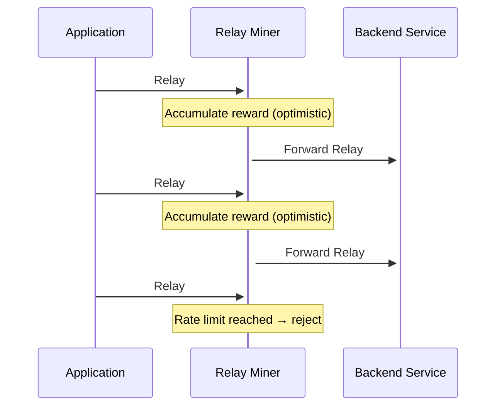
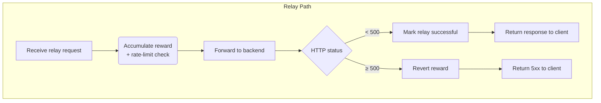

## tl;dr

:::note **Reference GitHub Issue**

This page was put together as a result of the discussion in [pokt-network/poktroll#1315](https://github.com/pokt-network/poktroll/issues/1315).

:::

---

## Table of Contents

- [tl;dr](#tldr)
- [Table of Contents](#table-of-contents)
- [Background on Optimistic Relay Accumulation](#background-on-optimistic-relay-accumulation)
  - [Managing 5xx Rewards](#managing-5xx-rewards)
- [Rate Limiting with Optimistic Accumulation](#rate-limiting-with-optimistic-accumulation)
  - [Pessimistic Reversal of 5xx Rewards](#pessimistic-reversal-of-5xx-rewards)

---

## Background on Optimistic Relay Accumulation

RelayMiner's accumulate relay rewards **before** the relay is forwarded to the backend.

This optimistic approach:

- Counts the relay immediately
- Enables _in-process_ rate-limiting (no extra network calls)
- Protects suppliers against over-servicing flood attacks

### Managing 5xx Rewards

1. Before a relay is forwarded to the backend, the relay miner accumulates the reward.
2. If the backend replies with a `5xx` status, the relay miner immediately reverts the reward.
3. If the backend replies with a `2xx` or `3xx` status, the relay miner keeps the reward.
4. This ensures that suppliers are not paid for failed relays, while rate-limiting remains effective against burst traffic.

---

## Rate Limiting with Optimistic Accumulation

The following diagram shows the optimistic accumulation of rewards:

### Pessimistic Reversal of 5xx Rewards

The following diagram shows the pessimistic reversal of rewards for 5xx responses:

