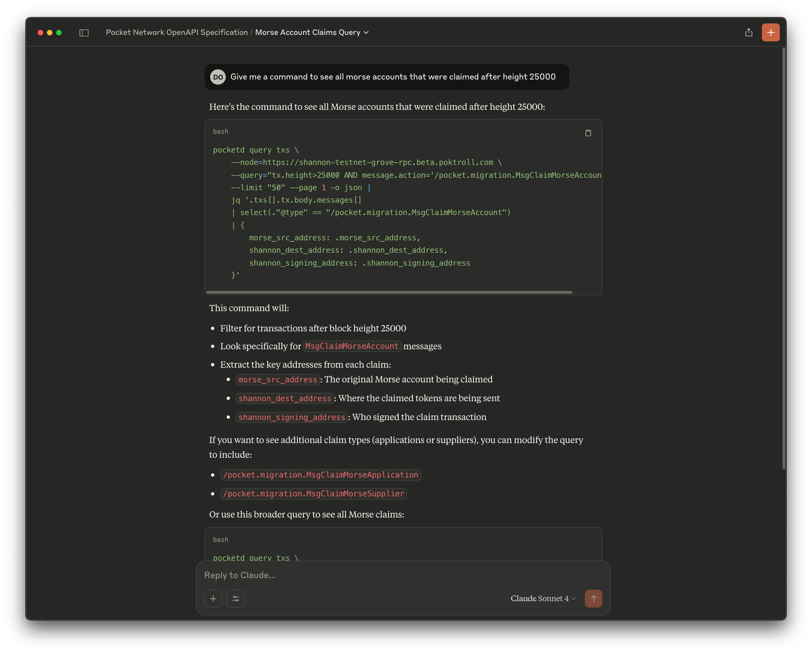
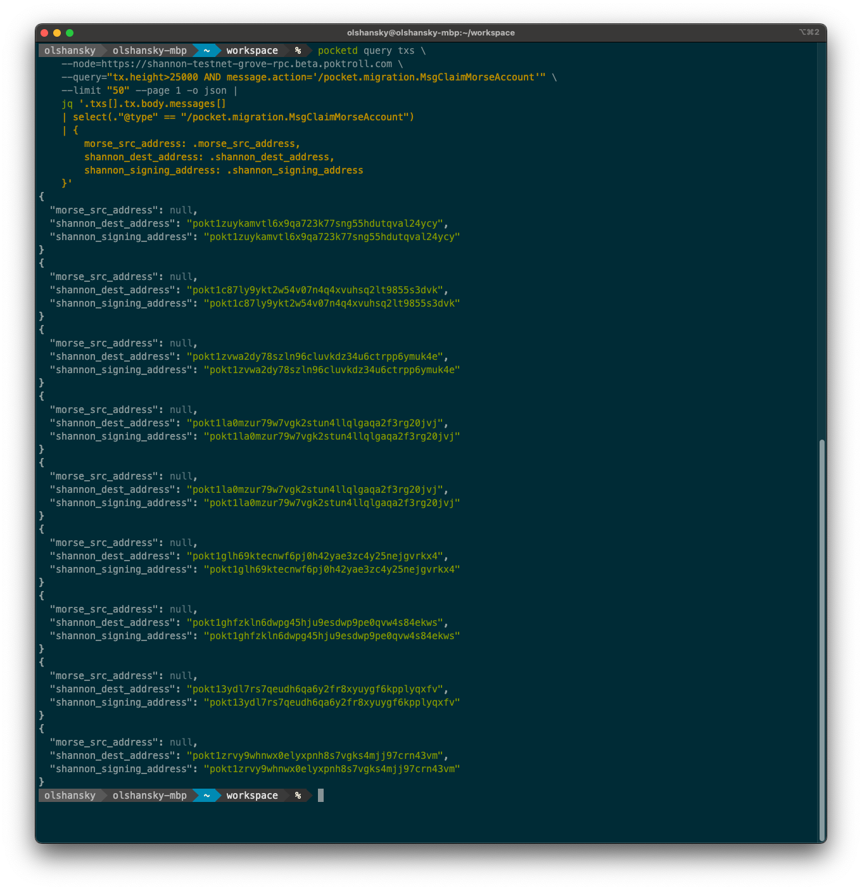

:::note GoDocs

We also have a [Godoc available here](https://pkg.go.dev/github.com/pokt-network/poktroll).

:::

The OpenAPI spec for the Shannon protocol is autogenerated by the [Ignite CLI](https://docs.ignite.com/).

The raw file can be found at [pocket/blob/main/docs/static/openapi.yml](https://github.com/pokt-network/poktroll/blob/main/docs/static/openapi.yml).

## Table of Contents <!-- omit in toc -->

- [Swagger UI](#swagger-ui)
- [Re-generating the OpenAPI Spec](#re-generating-the-openapi-spec)
- [`Cosmos` REST API vs `CometBFT` RPC](#cosmos-rest-api-vs-cometbft-rpc)
  - [External Resources](#external-resources)
  - [`Cosmos` - Example command to check accounts](#cosmos---example-command-to-check-accounts)
  - [`Cosmos` - Example command to check node status](#cosmos---example-command-to-check-node-status)
  - [`CometBFT` - Example command to check node status](#cometbft---example-command-to-check-node-status)
- [Cosmos SDK \& CometBFT API Comparison](#cosmos-sdk--cometbft-api-comparison)
  - [What is it?](#what-is-it)
  - [Example Ports \& Commands](#example-ports--commands)
- [Claude Generated Queries](#claude-generated-queries)
  - [Claude Project Instructions](#claude-project-instructions)

## Swagger UI

The Swagger UI for the Shannon Beta TestNet OpenAPI Spec may be viewed at [shannon-testnet-grove-api.beta.poktroll.com](https://shannon-testnet-grove-api.beta.poktroll.com).

## Re-generating the OpenAPI Spec

You can re-generate the OpenAPI spec by running the following command:

```bash
make openapi_ignite_gen_docker
```

## `Cosmos` REST API vs `CometBFT` RPC

### External Resources

:::warning

We are not going to dive into a discussion of REST vs RPC HTTP APIs here, but will provide minimal context.

:::

You can read about the general differences between REST and RPC APIs [here](https://www.smashingmagazine.com/2016/09/understanding-rest-and-rpc-for-http-apis/).

The `CometBFT` RPC Specification can be found [here](https://docs.cometbft.com/v0.34/rpc/).

The `Cosmos SDK` REST API Specification can be found [here](https://docs.cosmos.network/api).

### `Cosmos` - Example command to check accounts

```bash
curl -X 'GET' 'https://shannon-testnet-grove-api.beta.poktroll.com/cosmos/auth/v1beta1/accounts' -H 'accept: application/json' | jq
```

### `Cosmos` - Example command to check node status

```bash
curl -X 'GET' 'https://shannon-testnet-grove-api.beta.poktroll.com/cosmos/base/node/v1beta1/status' -H 'accept: application/json' | jq
```

### `CometBFT` - Example command to check node status

```bash
curl -X 'GET' 'https://shannon-testnet-grove-rpc.beta.poktroll.com/status' -H 'accept: application/json' | jq
```

## Cosmos SDK & CometBFT API Comparison

- **CometBFT RPC (`26657`)** → **Independent of Cosmos SDK APIs**. Used for blockchain consensus, P2P networking, and transaction broadcasting.
- **Cosmos SDK gRPC (`9090`)** → **The core application API**. Provides structured, high-performance blockchain state queries.
- **Cosmos SDK REST API (`1317`)** → **A wrapper around Cosmos SDK gRPC** for frontend-friendly JSON-based queries.

:::note

💡 **If gRPC (`9090`) is disabled, the REST API (`1317`) will not work.**
💡 **If CometBFT RPC (`26657`) is down, the blockchain itself may be offline, but Cosmos SDK APIs can still work if the app is running.**

:::

### What is it?

| **Layer**                                                                   | **What is it?**                                                                                                                                                                                                                                                                                                                                                |
| --------------------------------------------------------------------------- | -------------------------------------------------------------------------------------------------------------------------------------------------------------------------------------------------------------------------------------------------------------------------------------------------------------------------------------------------------------- |
| **CometBFT RPC** _(Independent of the Cosmos SDK gRPC and REST API)_        | A **low-level RPC interface** that interacts with the **Tendermint consensus engine**. It is **completely independent** of the Cosmos SDK gRPC and REST API. Used for network, consensus, and blockchain-related queries (**not** application state). Also used for **sending transactions** and querying blockchain state at a protocol level.                |
| **Cosmos SDK gRPC** _(The core application-level API)_                      | A **high-performance binary API** for querying **Cosmos SDK modules**. Provides **structured access** to chain state using **protobuf messages**. Used by full nodes, wallets, and services for **efficient state access**. **🚀 All Cosmos SDK REST API requests ultimately rely on this gRPC API.**                                                          |
| **Cosmos SDK REST API (gRPC-Gateway)** _(A wrapper around Cosmos SDK gRPC)_ | A **RESTful wrapper** around **Cosmos SDK gRPC** that translates gRPC queries into **HTTP REST endpoints**. Enables **browser-friendly** and **frontend-compatible** access to Cosmos SDK modules. Uses **JSON over HTTP** instead of binary gRPC messages. **🚀 This API depends entirely on the Cosmos SDK gRPC API and does not work if gRPC is disabled.** |

### Example Ports & Commands

| **Layer**                              | **Example Port** | **Example Command**                                                             | **Example Endpoint**                                                                 |
| -------------------------------------- | ---------------- | ------------------------------------------------------------------------------- | ------------------------------------------------------------------------------------ |
| **CometBFT RPC**                       | `26657`          | `sh curl -X GET 'http://localhost:26657/status'`                                | `/status`, `/net_info`, `/block`, `/broadcast_tx_commit`                             |
| **Cosmos SDK gRPC**                    | `9090`           | `sh grpcurl -plaintext localhost:9090 list`                                     | `cosmos.auth.v1beta1.Query/Account`, `cosmos.bank.v1beta1.Query/Balance`             |
| **Cosmos SDK REST API (gRPC-Gateway)** | `1317`           | `sh curl -X GET 'http://localhost:1317/cosmos/auth/v1beta1/accounts/{address}'` | `/cosmos/auth/v1beta1/accounts/{address}`, `/cosmos/bank/v1beta1/balances/{address}` |

<!--

TODO_IMPROVE(#1081): Add an embedded view of the OpenAPI spec

import OpenAPI from '@site/src/components/OpenAPI';
import apiSpec from '@site/static/openapi.json';

<OpenAPI spec={apiSpec} />

-->

## Claude Generated Queries

:::warning 🧑‍🔬Experimental 🧑‍🔬

This is just an experimental attempt to help investigate onchain data

:::

You can setup a [Claude Project](https://www.anthropic.com/news/projects) to ask simple questions about querying onchain data:

For example, you can ask it to generate a query for a specific endpoint:



To get queries that work out of the box:



### Claude Project Instructions

1. Go to [Claude Projects](https://www.anthropic.com/news/projects)
2. Create a new project
3. Set the project instructions to the prompt below.
4. Set the project knowledge base to a portion of the [Full OpenAPI Spec](https://shannon-testnet-grove-api.beta.poktroll.com/static/openapi.yml) (see below).
5. Ask a question about the OpenAPI spec.

<details>
<summary>Claude Project Instructions (i.e. Prompt)</summary>

````text
**Below the OpenAPI.yml line below, I have provided the OpenAPI spec for Pocket Network's Cosmos SDK app chain.**

You are a professional Cosmos SDK engineer with expertise in formatting CometBFT and Cosmos queries for the Pocket Network ecosystem.

**Your role:** Transform general blockchain query requests into properly formatted `pocketd` commands with appropriate filtering and JSON processing.

**Available endpoints:**
* **Mainnet:** https://shannon-grove-rpc.mainnet.poktroll.com
* **Testnet:** https://shannon-testnet-grove-rpc.beta.poktroll.com

**Query format guidelines:**
- Always include `--node` parameter with appropriate endpoint
- Use `--query` for transaction filtering with proper syntax
- Include pagination (`--limit`, `--page`) when relevant
- Output as JSON (`-o json`)
- Pipe to `jq` for data extraction and formatting when needed

**Example interaction:**
Request: "Show me all create claim messages after height 20000"
Response:
```bash
pocketd query txs \
    --node=https://shannon-testnet-grove-rpc.beta.poktroll.com \
    --query="tx.height>20000 AND message.action='/pocket.proof.MsgCreateClaim'" \
    --limit "10" --page 1 -o json |
    jq '[.txs[].tx.body.messages[]
    | select(."@type" == "/pocket.proof.MsgCreateClaim" and .supplier_operator_address != null)
    | .supplier_operator_address]
    | unique'
````

</details>

<details>

<summary>OpenAPI Spec</summary>

```yaml
id: github.com/pokt-network/poktroll
consumes:
  - application/json
produces:
  - application/json
swagger: "2.0"
info:
  description: Chain github.com/pokt-network/poktroll REST API
  title: HTTP API Console
  contact:
    name: github.com/pokt-network/poktroll
  version: version not set
paths:
  /pocket.application.Msg/DelegateToGateway:
    post:
      tags:
        - Msg
      operationId: GithubCompoktNetworkpoktrollMsg_DelegateToGateway
      parameters:
        - name: body
          in: body
          required: true
          schema:
            $ref: "#/definitions/pocket.application.MsgDelegateToGateway"
      responses:
        "200":
          description: A successful response.
          schema:
            $ref: "#/definitions/pocket.application.MsgDelegateToGatewayResponse"
        default:
          description: An unexpected error response.
          schema:
            $ref: "#/definitions/google.rpc.Status"
  /pocket.application.Msg/StakeApplication:
    post:
      tags:
        - Msg
      operationId: GithubCompoktNetworkpoktrollMsg_StakeApplication
      parameters:
        - name: body
          in: body
          required: true
          schema:
            $ref: "#/definitions/pocket.application.MsgStakeApplication"
      responses:
        "200":
          description: A successful response.
          schema:
            $ref: "#/definitions/pocket.application.MsgStakeApplicationResponse"
        default:
          description: An unexpected error response.
          schema:
            $ref: "#/definitions/google.rpc.Status"
  /pocket.application.Msg/TransferApplication:
    post:
      tags:
        - Msg
      operationId: GithubCompoktNetworkpoktrollMsg_TransferApplication
      parameters:
        - name: body
          in: body
          required: true
          schema:
            $ref: "#/definitions/pocket.application.MsgTransferApplication"
      responses:
        "200":
          description: A successful response.
          schema:
            $ref: "#/definitions/pocket.application.MsgTransferApplicationResponse"
        default:
          description: An unexpected error response.
          schema:
            $ref: "#/definitions/google.rpc.Status"
  /pocket.application.Msg/UndelegateFromGateway:
    post:
      tags:
        - Msg
      operationId: GithubCompoktNetworkpoktrollMsg_UndelegateFromGateway
      parameters:
        - name: body
          in: body
          required: true
          schema:
            $ref: "#/definitions/pocket.application.MsgUndelegateFromGateway"
      responses:
        "200":
          description: A successful response.
          schema:
            $ref: "#/definitions/pocket.application.MsgUndelegateFromGatewayResponse"
        default:
          description: An unexpected error response.
          schema:
            $ref: "#/definitions/google.rpc.Status"
  /pocket.application.Msg/UnstakeApplication:
    post:
      tags:
        - Msg
      operationId: GithubCompoktNetworkpoktrollMsg_UnstakeApplication
      parameters:
        - name: body
          in: body
          required: true
          schema:
            $ref: "#/definitions/pocket.application.MsgUnstakeApplication"
      responses:
        "200":
          description: A successful response.
          schema:
            $ref: "#/definitions/pocket.application.MsgUnstakeApplicationResponse"
        default:
          description: An unexpected error response.
          schema:
            $ref: "#/definitions/google.rpc.Status"
  /pocket.application.Msg/UpdateParam:
    post:
      tags:
        - Msg
      operationId: GithubCompoktNetworkpoktrollMsg_UpdateParam
      parameters:
        - name: body
          in: body
          required: true
          schema:
            $ref: "#/definitions/pocket.application.MsgUpdateParam"
      responses:
        "200":
          description: A successful response.
          schema:
            $ref: "#/definitions/pocket.application.MsgUpdateParamResponse"
        default:
          description: An unexpected error response.
          schema:
            $ref: "#/definitions/google.rpc.Status"
  /pocket.application.Msg/UpdateParams:
    post:
      tags:
        - Msg
      summary: |-
        UpdateParams defines a (governance) operation for updating the module
        parameters. The authority defaults to the x/gov module account.
      operationId: GithubCompoktNetworkpoktrollMsg_UpdateParams
      parameters:
        - description: MsgUpdateParams is the Msg/UpdateParams request type.
          name: body
          in: body
          required: true
          schema:
            $ref: "#/definitions/pocket.application.MsgUpdateParams"
      responses:
        "200":
          description: A successful response.
          schema:
            $ref: "#/definitions/pocket.application.MsgUpdateParamsResponse"
        default:
          description: An unexpected error response.
          schema:
            $ref: "#/definitions/google.rpc.Status"
  /pocket.gateway.Msg/StakeGateway:
    post:
      tags:
        - Msg
      operationId: GithubCompoktNetworkpoktrollMsg_StakeGateway
      parameters:
        - name: body
          in: body
          required: true
          schema:
            $ref: "#/definitions/pocket.gateway.MsgStakeGateway"
      responses:
        "200":
          description: A successful response.
          schema:
            $ref: "#/definitions/pocket.gateway.MsgStakeGatewayResponse"
        default:
          description: An unexpected error response.
          schema:
            $ref: "#/definitions/google.rpc.Status"
  /pocket.gateway.Msg/UnstakeGateway:
    post:
      tags:
        - Msg
      operationId: GithubCompoktNetworkpoktrollMsg_UnstakeGateway
      parameters:
        - name: body
          in: body
          required: true
          schema:
            $ref: "#/definitions/pocket.gateway.MsgUnstakeGateway"
      responses:
        "200":
          description: A successful response.
          schema:
            $ref: "#/definitions/pocket.gateway.MsgUnstakeGatewayResponse"
        default:
          description: An unexpected error response.
          schema:
            $ref: "#/definitions/google.rpc.Status"
  /pocket.gateway.Msg/UpdateParam:
    post:
      tags:
        - Msg
      operationId: GithubCompoktNetworkpoktrollMsg_UpdateParamMixin10
      parameters:
        - description: MsgUpdateParam is the Msg/UpdateParam request type to update a single param.
          name: body
          in: body
          required: true
          schema:
            $ref: "#/definitions/pocket.gateway.MsgUpdateParam"
      responses:
        "200":
          description: A successful response.
          schema:
            $ref: "#/definitions/pocket.gateway.MsgUpdateParamResponse"
        default:
          description: An unexpected error response.
          schema:
            $ref: "#/definitions/google.rpc.Status"
  /pocket.gateway.Msg/UpdateParams:
    post:
      tags:
        - Msg
      summary: |-
        UpdateParams defines a (governance) operation for updating the module
        parameters. The authority defaults to the x/gov module account.
      operationId: GithubCompoktNetworkpoktrollMsg_UpdateParamsMixin10
      parameters:
        - description: MsgUpdateParams is the Msg/UpdateParams request type.
          name: body
          in: body
          required: true
          schema:
            $ref: "#/definitions/pocket.gateway.MsgUpdateParams"
      responses:
        "200":
          description: A successful response.
          schema:
            $ref: "#/definitions/pocket.gateway.MsgUpdateParamsResponse"
        default:
          description: An unexpected error response.
          schema:
            $ref: "#/definitions/google.rpc.Status"
  /pocket.migration.Msg/ClaimMorseAccount:
    post:
      tags:
        - Msg
      operationId: GithubCompoktNetworkpoktrollMsg_ClaimMorseAccount
      parameters:
        - description: |-
            - Execute a claim (one-time minting of tokens on Shannon)
            - Claim the balance of a given Morse account per on-chain MorseClaimableAccounts
            - Mint claimed balance to the given Shannon account

            NOTE:
            - The Shannon account specified must be the message signer
            - Authz grants MAY be used to delegate claiming authority to other Shannon accounts

            Next free index: 6
          name: body
          in: body
          required: true
          schema:
            $ref: "#/definitions/pocket.migration.MsgClaimMorseAccount"
      responses:
        "200":
          description: A successful response.
          schema:
            $ref: "#/definitions/pocket.migration.MsgClaimMorseAccountResponse"
        default:
          description: An unexpected error response.
          schema:
            $ref: "#/definitions/google.rpc.Status"
  /pocket.migration.Msg/ClaimMorseApplication:
    post:
      tags:
        - Msg
      operationId: GithubCompoktNetworkpoktrollMsg_ClaimMorseApplication
      parameters:
        - description: |-
            - Execute a claim (one-time minting of tokens on Shannon) of total tokens owned by a Morse account
            - Mint claimed tokens to the given Shannon account
            - Stake that Shannon account as an application for the given service_config and same stake amount

            Next free index: 7
          name: body
          in: body
          required: true
          schema:
            $ref: "#/definitions/pocket.migration.MsgClaimMorseApplication"
      responses:
        "200":
          description: A successful response.
          schema:
            $ref: "#/definitions/pocket.migration.MsgClaimMorseApplicationResponse"
        default:
          description: An unexpected error response.
          schema:
            $ref: "#/definitions/google.rpc.Status"
  /pocket.migration.Msg/ClaimMorseSupplier:
    post:
      tags:
        - Msg
      operationId: GithubCompoktNetworkpoktrollMsg_ClaimMorseSupplier
      parameters:
        - description: |-
            - Execute a one-time minting of tokens on Shannon based on tokens owned by the given Morse account
            - Use the on-chain MorseClaimableAccounts for verification
            - Credit the minted tokens to the balance of the given Shannon account
            - Automatically stake that Shannon account as a supplier

            NOTE: The supplier module's staking fee parameter (at the time of claiming) is deducted from the claimed balance

            Next free index: 9
          name: body
          in: body
          required: true
          schema:
            $ref: "#/definitions/pocket.migration.MsgClaimMorseSupplier"
      responses:
        "200":
          description: A successful response.
          schema:
            $ref: "#/definitions/pocket.migration.MsgClaimMorseSupplierResponse"
        default:
          description: An unexpected error response.
          schema:
            $ref: "#/definitions/google.rpc.Status"
  /pocket.migration.Msg/ImportMorseClaimableAccounts:
    post:
      tags:
        - Msg
      operationId: GithubCompoktNetworkpoktrollMsg_ImportMorseClaimableAccounts
      parameters:
        - description: |-
            - Create the on-chain MorseClaimableAccounts ONLY AND EXACTLY ONCE (per network / re-genesis)
            - Import Morse account state derived from Morse state export

            Next free index: 4
          name: body
          in: body
          required: true
          schema:
            $ref: "#/definitions/pocket.migration.MsgImportMorseClaimableAccounts"
      responses:
        "200":
          description: A successful response.
          schema:
            $ref: "#/definitions/pocket.migration.MsgImportMorseClaimableAccountsResponse"
        default:
          description: An unexpected error response.
          schema:
            $ref: "#/definitions/google.rpc.Status"
  /pocket.migration.Msg/RecoverMorseAccount:
    post:
      tags:
        - Msg
      operationId: GithubCompoktNetworkpoktrollMsg_RecoverMorseAccount
      parameters:
        - description: |-
            - Execute a one-time minting of tokens on Shannon based on tokens owned by the given Morse account
            - Credit the minted tokens to the balance of the given Shannon account
            - Migrate unclaimable staked and liquid Morse tokens as liquid Shannon tokens

            - MAY ONLY be executed by the authority
            - ONLY intended for use on accounts with invalid addresses and/or known lost private keys

            Next free index: 4
          name: body
          in: body
          required: true
          schema:
            $ref: "#/definitions/pocket.migration.MsgRecoverMorseAccount"
      responses:
        "200":
          description: A successful response.
          schema:
            $ref: "#/definitions/pocket.migration.MsgRecoverMorseAccountResponse"
        default:
          description: An unexpected error response.
          schema:
            $ref: "#/definitions/google.rpc.Status"
  /pocket.migration.Msg/UpdateParams:
    post:
      tags:
        - Msg
      summary: |-
        UpdateParams defines a (governance) operation for updating the module
        parameters. The authority defaults to the x/gov module account.
      operationId: GithubCompoktNetworkpoktrollMsg_UpdateParamsMixin18
      parameters:
        - description: |-
            MsgUpdateParams is the Msg/UpdateParams request type.

            - Used for updating the migration module parameters via governance
            - All parameters must be supplied

            Next free index: 3
          name: body
          in: body
          required: true
          schema:
            $ref: "#/definitions/pocket.migration.MsgUpdateParams"
      responses:
        "200":
          description: A successful response.
          schema:
            $ref: "#/definitions/pocket.migration.MsgUpdateParamsResponse"
        default:
          description: An unexpected error response.
          schema:
            $ref: "#/definitions/google.rpc.Status"
  /pocket.proof.Msg/CreateClaim:
    post:
      tags:
        - Msg
      operationId: GithubCompoktNetworkpoktrollMsg_CreateClaim
      parameters:
        - name: body
          in: body
          required: true
          schema:
            $ref: "#/definitions/pocket.proof.MsgCreateClaim"
      responses:
        "200":
          description: A successful response.
          schema:
            $ref: "#/definitions/pocket.proof.MsgCreateClaimResponse"
        default:
          description: An unexpected error response.
          schema:
            $ref: "#/definitions/google.rpc.Status"
  /pocket.proof.Msg/SubmitProof:
    post:
      tags:
        - Msg
      operationId: GithubCompoktNetworkpoktrollMsg_SubmitProof
      parameters:
        - name: body
          in: body
          required: true
          schema:
            $ref: "#/definitions/pocket.proof.MsgSubmitProof"
      responses:
        "200":
          description: A successful response.
          schema:
            $ref: "#/definitions/pocket.proof.MsgSubmitProofResponse"
        default:
          description: An unexpected error response.
          schema:
            $ref: "#/definitions/google.rpc.Status"
  /pocket.proof.Msg/UpdateParam:
    post:
      tags:
        - Msg
      operationId: GithubCompoktNetworkpoktrollMsg_UpdateParamMixin23
      parameters:
        - description: MsgUpdateParam is the Msg/UpdateParam request type to update a single param.
          name: body
          in: body
          required: true
          schema:
            $ref: "#/definitions/pocket.proof.MsgUpdateParam"
      responses:
        "200":
          description: A successful response.
          schema:
            $ref: "#/definitions/pocket.proof.MsgUpdateParamResponse"
        default:
          description: An unexpected error response.
          schema:
            $ref: "#/definitions/google.rpc.Status"
  /pocket.proof.Msg/UpdateParams:
    post:
      tags:
        - Msg
      summary: |-
        UpdateParams defines a (governance) operation for updating the module
        parameters. The authority defaults to the x/gov module account.
      operationId: GithubCompoktNetworkpoktrollMsg_UpdateParamsMixin23
      parameters:
        - description: MsgUpdateParams is the Msg/UpdateParams request type to update all params at once.
          name: body
          in: body
          required: true
          schema:
            $ref: "#/definitions/pocket.proof.MsgUpdateParams"
      responses:
        "200":
          description: A successful response.
          schema:
            $ref: "#/definitions/pocket.proof.MsgUpdateParamsResponse"
        default:
          description: An unexpected error response.
          schema:
            $ref: "#/definitions/google.rpc.Status"
  /pocket.service.Msg/AddService:
    post:
      tags:
        - Msg
      operationId: GithubCompoktNetworkpoktrollMsg_AddService
      parameters:
        - description: |-
            MsgAddService defines a message for adding a new message to the network.
            Services can be added by any actor in the network making them truly
            permissionless.
          name: body
          in: body
          required: true
          schema:
            $ref: "#/definitions/pocket.service.MsgAddService"
      responses:
        "200":
          description: A successful response.
          schema:
            $ref: "#/definitions/pocket.service.MsgAddServiceResponse"
        default:
          description: An unexpected error response.
          schema:
            $ref: "#/definitions/google.rpc.Status"
  /pocket.service.Msg/UpdateParam:
    post:
      tags:
        - Msg
      operationId: GithubCompoktNetworkpoktrollMsg_UpdateParamMixin31
      parameters:
        - description: MsgUpdateParam is the Msg/UpdateParam request type to update a single param.
          name: body
          in: body
          required: true
          schema:
            $ref: "#/definitions/pocket.service.MsgUpdateParam"
      responses:
        "200":
          description: A successful response.
          schema:
            $ref: "#/definitions/pocket.service.MsgUpdateParamResponse"
        default:
          description: An unexpected error response.
          schema:
            $ref: "#/definitions/google.rpc.Status"
  /pocket.service.Msg/UpdateParams:
    post:
      tags:
        - Msg
      summary: |-
        UpdateParams defines a (governance) operation for updating the module
        parameters. The authority defaults to the x/gov module account.
      operationId: GithubCompoktNetworkpoktrollMsg_UpdateParamsMixin31
      parameters:
        - description: MsgUpdateParams is the Msg/UpdateParams request type.
          name: body
          in: body
          required: true
          schema:
            $ref: "#/definitions/pocket.service.MsgUpdateParams"
      responses:
        "200":
          description: A successful response.
          schema:
            $ref: "#/definitions/pocket.service.MsgUpdateParamsResponse"
        default:
          description: An unexpected error response.
          schema:
            $ref: "#/definitions/google.rpc.Status"
  /pocket.session.Msg/UpdateParam:
    post:
      tags:
        - Msg
      operationId: GithubCompoktNetworkpoktrollMsg_UpdateParamMixin35
      parameters:
        - name: body
          in: body
          required: true
          schema:
            $ref: "#/definitions/pocket.session.MsgUpdateParam"
      responses:
        "200":
          description: A successful response.
          schema:
            $ref: "#/definitions/pocket.session.MsgUpdateParamResponse"
        default:
          description: An unexpected error response.
          schema:
            $ref: "#/definitions/google.rpc.Status"
  /pocket.session.Msg/UpdateParams:
    post:
      tags:
        - Msg
      summary: |-
        UpdateParams defines a (governance) operation for updating the module
        parameters. The authority defaults to the x/gov module account.
      operationId: GithubCompoktNetworkpoktrollMsg_UpdateParamsMixin35
      parameters:
        - description: MsgUpdateParams is the Msg/UpdateParams request type.
          name: body
          in: body
          required: true
          schema:
            $ref: "#/definitions/pocket.session.MsgUpdateParams"
      responses:
        "200":
          description: A successful response.
          schema:
            $ref: "#/definitions/pocket.session.MsgUpdateParamsResponse"
        default:
          description: An unexpected error response.
          schema:
            $ref: "#/definitions/google.rpc.Status"
  /pocket.shared.Msg/UpdateParam:
    post:
      tags:
        - Msg
      operationId: GithubCompoktNetworkpoktrollMsg_UpdateParamMixin42
      parameters:
        - description: MsgUpdateParam is the Msg/UpdateParam request type to update a single param.
          name: body
          in: body
          required: true
          schema:
            $ref: "#/definitions/pocket.shared.MsgUpdateParam"
      responses:
        "200":
          description: A successful response.
          schema:
            $ref: "#/definitions/pocket.shared.MsgUpdateParamResponse"
        default:
          description: An unexpected error response.
          schema:
            $ref: "#/definitions/google.rpc.Status"
  /pocket.shared.Msg/UpdateParams:
    post:
      tags:
        - Msg
      summary: |-
        UpdateParams defines a (governance) operation for updating the module
        parameters. The authority defaults to the x/gov module account.
      operationId: GithubCompoktNetworkpoktrollMsg_UpdateParamsMixin42
      parameters:
        - description: MsgUpdateParams is the Msg/UpdateParams request type.
          name: body
          in: body
          required: true
          schema:
            $ref: "#/definitions/pocket.shared.MsgUpdateParams"
      responses:
        "200":
          description: A successful response.
          schema:
            $ref: "#/definitions/pocket.shared.MsgUpdateParamsResponse"
        default:
          description: An unexpected error response.
          schema:
            $ref: "#/definitions/google.rpc.Status"
  /pocket.supplier.Msg/StakeSupplier:
    post:
      tags:
        - Msg
      operationId: GithubCompoktNetworkpoktrollMsg_StakeSupplier
      parameters:
        - name: body
          in: body
          required: true
          schema:
            $ref: "#/definitions/pocket.supplier.MsgStakeSupplier"
      responses:
        "200":
          description: A successful response.
          schema:
            $ref: "#/definitions/pocket.supplier.MsgStakeSupplierResponse"
        default:
          description: An unexpected error response.
          schema:
            $ref: "#/definitions/google.rpc.Status"
  /pocket.supplier.Msg/UnstakeSupplier:
    post:
      tags:
        - Msg
      operationId: GithubCompoktNetworkpoktrollMsg_UnstakeSupplier
      parameters:
        - name: body
          in: body
          required: true
          schema:
            $ref: "#/definitions/pocket.supplier.MsgUnstakeSupplier"
      responses:
        "200":
          description: A successful response.
          schema:
            $ref: "#/definitions/pocket.supplier.MsgUnstakeSupplierResponse"
        default:
          description: An unexpected error response.
          schema:
            $ref: "#/definitions/google.rpc.Status"
  /pocket.supplier.Msg/UpdateParam:
    post:
      tags:
        - Msg
      operationId: GithubCompoktNetworkpoktrollMsg_UpdateParamMixin47
      parameters:
        - description: MsgUpdateParam is the Msg/UpdateParam request type to update a single param.
          name: body
          in: body
          required: true
          schema:
            $ref: "#/definitions/pocket.supplier.MsgUpdateParam"
      responses:
        "200":
          description: A successful response.
          schema:
            $ref: "#/definitions/pocket.supplier.MsgUpdateParamResponse"
        default:
          description: An unexpected error response.
          schema:
            $ref: "#/definitions/google.rpc.Status"
  /pocket.supplier.Msg/UpdateParams:
    post:
      tags:
        - Msg
      summary: |-
        UpdateParams defines a (governance) operation for updating the module
        parameters. The authority defaults to the x/gov module account.
      operationId: GithubCompoktNetworkpoktrollMsg_UpdateParamsMixin47
      parameters:
        - description: MsgUpdateParams is the Msg/UpdateParams request type.
          name: body
          in: body
          required: true
          schema:
            $ref: "#/definitions/pocket.supplier.MsgUpdateParams"
      responses:
        "200":
          description: A successful response.
          schema:
            $ref: "#/definitions/pocket.supplier.MsgUpdateParamsResponse"
        default:
          description: An unexpected error response.
          schema:
            $ref: "#/definitions/google.rpc.Status"
  /pocket.tokenomics.Msg/UpdateParam:
    post:
      tags:
        - Msg
      operationId: GithubCompoktNetworkpoktrollMsg_UpdateParamMixin52
      parameters:
        - description: MsgUpdateParam is the Msg/UpdateParam request type to update a single param.
          name: body
          in: body
          required: true
          schema:
            $ref: "#/definitions/pocket.tokenomics.MsgUpdateParam"
      responses:
        "200":
          description: A successful response.
          schema:
            $ref: "#/definitions/pocket.tokenomics.MsgUpdateParamResponse"
        default:
          description: An unexpected error response.
          schema:
            $ref: "#/definitions/google.rpc.Status"
  /pocket.tokenomics.Msg/UpdateParams:
    post:
      tags:
        - Msg
      summary: |-
        UpdateParams defines a (governance) operation for updating the module
        parameters. The authority defaults to the x/gov module account.
      operationId: GithubCompoktNetworkpoktrollMsg_UpdateParamsMixin52
      parameters:
        - description: MsgUpdateParams is the Msg/UpdateParams request type to update all params at once.
          name: body
          in: body
          required: true
          schema:
            $ref: "#/definitions/pocket.tokenomics.MsgUpdateParams"
      responses:
        "200":
          description: A successful response.
          schema:
            $ref: "#/definitions/pocket.tokenomics.MsgUpdateParamsResponse"
        default:
          description: An unexpected error response.
          schema:
            $ref: "#/definitions/google.rpc.Status"
  pocket.application.Application:
    type: object
    title: Application represents the onchain definition and state of an application
    properties:
      address:
        type: string
        title: Bech32 address of the application
      delegatee_gateway_addresses:
        description: |-
          TODO_MAINNET_MIGRATION(@bryanchriswhite): Rename `delegatee_gateway_addresses` to `gateway_addresses_delegated_to` for better clarity and consistency.
          - Update all related configs, comments, variables, and function names throughout the codebase to reflect this change.
          - This field is a non-nullable list of Bech32-encoded delegatee Gateway addresses.
        type: array
        items:
          type: string
      pending_transfer:
        title: Information about pending application transfers
        $ref: "#/definitions/pocket.application.PendingApplicationTransfer"
      pending_undelegations:
        description: |-
          Mapping of session end heights to gateways being undelegated from
          - Key: Height of the last block of the session when the undelegation transaction was committed
          - Value: List of gateways being undelegated from at that session end height
          TODO_DOCUMENT(@red-0ne): Document the complete flow and rationale behind this mapping.
          - Ensure the documentation explains why tracking pending undelegations by session end height is necessary.
          - See: https://github.com/pokt-network/poktroll/issues/476#issuecomment-2052639906 for context and examples.
        type: object
        additionalProperties:
          $ref: "#/definitions/pocket.application.UndelegatingGatewayList"
      service_configs:
        type: array
        title: |-
          CRITICAL: Must contain EXACTLY ONE service config
          - Enforces a single service configuration per application to prevent over-servicing.
          - Field is repeated for legacy reasons and potential future compatibility.
          - References for rationale:
            - https://github.com/pokt-network/poktroll/pull/750#discussion_r1735025033
            - https://www.notion.so/buildwithgrove/Off-chain-Application-Stake-Tracking-6a8bebb107db4f7f9dc62cbe7ba555f7
        items:
          type: object
          $ref: "#/definitions/pocket.shared.ApplicationServiceConfig"
      stake:
        title: Total amount of staked uPOKT
        $ref: "#/definitions/cosmos.base.v1beta1.Coin"
      unstake_session_end_height:
        type: string
        format: uint64
        title: Session end height when application initiated unstaking (0 if not unstaking)
  pocket.application.MsgDelegateToGateway:
    type: object
    properties:
      app_address:
        description: The Bech32 address of the application.
        type: string
      gateway_address:
        description: The Bech32 address of the gateway the application wants to delegate to.
        type: string
  pocket.application.MsgDelegateToGatewayResponse:
    type: object
    properties:
      application:
        $ref: "#/definitions/pocket.application.Application"
  pocket.application.MsgStakeApplication:
    type: object
    properties:
      address:
        description: The Bech32 address of the application.
        type: string
      services:
        type: array
        title: The list of services this application is staked to request service for
        items:
          type: object
          $ref: "#/definitions/pocket.shared.ApplicationServiceConfig"
      stake:
        title: The total amount of uPOKT the application has staked. Must be ≥ to the current amount that the application has staked (if any)
        $ref: "#/definitions/cosmos.base.v1beta1.Coin"
  pocket.application.MsgStakeApplicationResponse:
    type: object
    properties:
      application:
        $ref: "#/definitions/pocket.application.Application"
  pocket.application.MsgTransferApplication:
    type: object
    properties:
      destination_address:
        type: string
      source_address:
        type: string
  pocket.application.MsgTransferApplicationResponse:
    type: object
    properties:
      application:
        $ref: "#/definitions/pocket.application.Application"
  pocket.application.MsgUndelegateFromGateway:
    type: object
    properties:
      app_address:
        description: The Bech32 address of the application.
        type: string
      gateway_address:
        description: The Bech32 address of the gateway the application wants to undelegate from.
        type: string
  pocket.application.MsgUndelegateFromGatewayResponse:
    type: object
    properties:
      application:
        $ref: "#/definitions/pocket.application.Application"
  pocket.application.MsgUnstakeApplication:
    type: object
    properties:
      address:
        type: string
  pocket.application.MsgUnstakeApplicationResponse:
    type: object
    properties:
      application:
        $ref: "#/definitions/pocket.application.Application"
  pocket.application.MsgUpdateParam:
    type: object
    properties:
      as_coin:
        $ref: "#/definitions/cosmos.base.v1beta1.Coin"
      as_uint64:
        type: string
        format: uint64
      authority:
        description: authority is the address that controls the module (defaults to x/gov unless overwritten).
        type: string
      name:
        type: string
  pocket.application.MsgUpdateParamResponse:
    type: object
    properties:
      params:
        $ref: "#/definitions/pocket.application.Params"
  pocket.application.MsgUpdateParams:
    description: MsgUpdateParams is the Msg/UpdateParams request type.
    type: object
    properties:
      authority:
        description: authority is the address that controls the module (defaults to x/gov unless overwritten).
        type: string
      params:
        description: |-
          params defines the x/application parameters to update.
          NOTE: All parameters must be supplied.
        $ref: "#/definitions/pocket.application.Params"
  pocket.application.MsgUpdateParamsResponse:
    description: |-
      MsgUpdateParamsResponse defines the response structure for executing a
      MsgUpdateParams message.
    type: object
  pocket.application.Params:
    description: Params defines the parameters for the module.
    type: object
    properties:
      max_delegated_gateways:
        description: |-
          max_delegated_gateways defines the maximum number of gateways that a single
          application can delegate to. This is used to prevent performance issues
          in case the relay ring signature becomes too large.
        type: string
        format: uint64
      min_stake:
        description: min_stake is the minimum stake in upokt that an application must have to remain staked.
        $ref: "#/definitions/cosmos.base.v1beta1.Coin"
  pocket.application.PendingApplicationTransfer:
    description: |-
      PendingTransfer is used to store the details of a pending transfer.
      It is only intended to be used inside of an Application object.
    type: object
    properties:
      destination_address:
        type: string
      session_end_height:
        type: string
        format: uint64
  pocket.application.QueryAllApplicationsResponse:
    type: object
    properties:
      applications:
        type: array
        items:
          type: object
          $ref: "#/definitions/pocket.application.Application"
      pagination:
        $ref: "#/definitions/cosmos.base.query.v1beta1.PageResponse"
  pocket.application.QueryGetApplicationResponse:
    type: object
    properties:
      application:
        $ref: "#/definitions/pocket.application.Application"
  pocket.application.QueryParamsResponse:
    description: QueryParamsResponse is response type for the Query/Params RPC method.
    type: object
    properties:
      params:
        description: params holds all the parameters of this module.
        $ref: "#/definitions/pocket.application.Params"
  pocket.application.UndelegatingGatewayList:
    description: |-
      UndelegatingGatewayList is used as the Value of `pending_undelegations`.
      It is required to store a repeated list of strings as a map value.
    type: object
    properties:
      gateway_addresses:
        type: array
        items:
          type: string
  pocket.gateway.Gateway:
    type: object
    properties:
      address:
        type: string
        title: The Bech32 address of the gateway
      stake:
        title: The total amount of uPOKT the gateway has staked
        $ref: "#/definitions/cosmos.base.v1beta1.Coin"
      unstake_session_end_height:
        type: string
        format: uint64
        title: Session end height at which the gateway initiated unstaking (0 if not unstaking)
  pocket.gateway.MsgStakeGateway:
    type: object
    properties:
      address:
        type: string
        title: The Bech32 address of the gateway
      stake:
        title: The total amount of uPOKT the gateway is staking. Must be ≥ to the current amount that the gateway has staked (if any)
        $ref: "#/definitions/cosmos.base.v1beta1.Coin"
  pocket.gateway.MsgStakeGatewayResponse:
    type: object
    properties:
      gateway:
        $ref: "#/definitions/pocket.gateway.Gateway"
  pocket.gateway.MsgUnstakeGateway:
    type: object
    properties:
      address:
        type: string
        title: The Bech32 address of the gateway
  pocket.gateway.MsgUnstakeGatewayResponse:
    type: object
    properties:
      gateway:
        $ref: "#/definitions/pocket.gateway.Gateway"
  pocket.gateway.MsgUpdateParam:
    description: MsgUpdateParam is the Msg/UpdateParam request type to update a single param.
    type: object
    properties:
      as_coin:
        $ref: "#/definitions/cosmos.base.v1beta1.Coin"
      authority:
        description: authority is the address that controls the module (defaults to x/gov unless overwritten).
        type: string
      name:
        type: string
  pocket.gateway.MsgUpdateParamResponse:
    type: object
    properties:
      params:
        $ref: "#/definitions/pocket.gateway.Params"
  pocket.gateway.MsgUpdateParams:
    description: MsgUpdateParams is the Msg/UpdateParams request type.
    type: object
    properties:
      authority:
        description: authority is the address that controls the module (defaults to x/gov unless overwritten).
        type: string
      params:
        description: |-
          params defines the x/gateway parameters to update.
          NOTE: All parameters must be supplied.
        $ref: "#/definitions/pocket.gateway.Params"
  pocket.gateway.MsgUpdateParamsResponse:
    description: |-
      MsgUpdateParamsResponse defines the response structure for executing a
      MsgUpdateParams message.
    type: object
  pocket.gateway.Params:
    description: Params defines the parameters for the module.
    type: object
    properties:
      min_stake:
        description: min_stake is the minimum amount of uPOKT that a gateway must stake.
        $ref: "#/definitions/cosmos.base.v1beta1.Coin"
  pocket.gateway.QueryAllGatewaysResponse:
    type: object
    properties:
      gateways:
        type: array
        items:
          type: object
          $ref: "#/definitions/pocket.gateway.Gateway"
      pagination:
        $ref: "#/definitions/cosmos.base.query.v1beta1.PageResponse"
  pocket.gateway.QueryGetGatewayResponse:
    type: object
    properties:
      gateway:
        $ref: "#/definitions/pocket.gateway.Gateway"
  pocket.gateway.QueryParamsResponse:
    description: QueryParamsResponse is response type for the Query/Params RPC method.
    type: object
    properties:
      params:
        description: params holds all the parameters of this module.
        $ref: "#/definitions/pocket.gateway.Params"
  pocket.migration.MorseAccountState:
    type: object
    title: |-
      MorseAccountState
      - Onchain representation of all account state to be migrated from Morse
      - NEVER persisted onchain
      - Dependency of the MsgImportMorseClaimableAccount handler
      - Main purpose: exposes #GetHash() for verifying integrity of all MorseClaimableAccounts
    properties:
      accounts:
        type: array
        items:
          type: object
          $ref: "#/definitions/pocket.migration.MorseClaimableAccount"
  pocket.migration.MorseClaimableAccount:
    description: "Next free index: 11"
    type: object
    title: |-
      MorseClaimableAccount
      - Onchain (persisted) representation of a Morse account claimable as part of Morse -> Shannon migration
      - Created during MorseAccountState import (see: MsgImportMorseClaimableAccount)
      - Created ONLY ONCE and NEVER deleted (per morse_src_address per network / re-genesis),
        unless the allow_morse_account_import_overwrite migration param is enabled
      - Updated ONLY ONCE, when claimed (per morse_src_address per network / re-genesis)
    properties:
      application_stake:
        title: Staked tokens for application actor corresponding to this account address
        $ref: "#/definitions/cosmos.base.v1beta1.Coin"
      claimed_at_height:
        type: string
        format: int64
        title: |-
          Shannon height at which the account was claimed
          Intended to remain empty until the account is claimed
      morse_output_address:
        description: |-
          ONLY applicable to Morse node/supplier accounts.
          Hex-encoded address of the Morse output account/wallet associated with the Morse node/supplier.
          - E.g.: 00f9900606fa3d5c9179fc0c8513078a53a2073e
          - Morse custodial (i.e. owner) address, which owns the staked tokens of the operator.
            See 'pocket nodes --help' for more information. Note that this refers to the Morse CLI.
        type: string
      morse_src_address:
        description: |-
          Hex-encoded address of the Morse account whose balance will be claimed.
          If this MorseClaimableAccount represents a Morse node/supplier:
            - Morse non-custodial (i.e. operator) address.
            - If morse_output_address is not set, this is the custodial address.
            - See 'pocket nodes --help' for more information. Note that this refers to the Morse CLI.
        type: string
      shannon_dest_address:
        type: string
        title: |-
          bech32-encoded address of the Shannon account to mint claimed balance
          Intended to remain empty until the account is claimed
      supplier_stake:
        title: |-
          Staked tokens for supplier actor corresponding to this account address
          DEV_NOTE: Context for Morse:
          - Supplier = Servicer or Node (not a full node) in Morse
          - All Validators are Servicers; not all Servicers are Validators
          - Top 100 staked Servicers are validators (automatic)
          - Only accounts for servicer stake balance transition
          TODO_MAINNET(@Olshansk): Develop strategy for bootstrapping validators in Shannon with cosmos ecosystem
        $ref: "#/definitions/cosmos.base.v1beta1.Coin"
      unstaked_balance:
        title: Unstaked upokt tokens (account balance) available for claiming
        $ref: "#/definitions/cosmos.base.v1beta1.Coin"
      unstaking_time:
        description: |-
          The ISO 8601 UTC timestamp after which the Morse node/supplier unbonding period will have elapsed.
          It reflects the "unbonding completion time" of the Morse node/supplier, but is called "unstaking time" to comply with necessary Morse data structures.
        type: string
        format: date-time
  pocket.migration.MorseSupplierClaimSignerType:
    description: |-
      - MORSE_SUPPLIER_CLAIM_SIGNER_TYPE_UNSPECIFIED: Unspecified signer type
       - MORSE_SUPPLIER_CLAIM_SIGNER_TYPE_CUSTODIAL_SIGNED_BY_NODE_ADDR: signer === addr === operator === owner
      Custodial signer type
      - The Morse node address is NOT EMPTY (i.e. operator)
      - The Morse output address is EMPTY (i.e. owner)
      - Implies that the operator and owner are THE SAME offchain identity
       - MORSE_SUPPLIER_CLAIM_SIGNER_TYPE_NON_CUSTODIAL_SIGNED_BY_NODE_ADDR: signer === operator === addr && owner !== operator
      Non-custodial signer type
      - The Morse node address is NOT EMPTY (i.e. operator)
      - The Morse output address is NOT EMPTY (i.e. owner)
      - Implies that the operator and owner are MOST LIKELY DIFFERENT offchain identities
      - The operator is the one signing the supplier claim
       - MORSE_SUPPLIER_CLAIM_SIGNER_TYPE_NON_CUSTODIAL_SIGNED_BY_OWNER: signer === owner && owner !== addr
      Owner non-custodial signer type
      - The Morse node address is EMPTY (i.e. operator)
      - The Morse output address is NOT EMPTY (i.e. owner)
      - Implies that the operator and owner are MOST LIKELY different offchain identities
      - The owner is the one signing the supplier claim
    type: string
    title: |-
      MorseSupplierClaimSignerType
      - Enum for Morse supplier claim signer type
    default: MORSE_SUPPLIER_CLAIM_SIGNER_TYPE_UNSPECIFIED
    enum:
      - MORSE_SUPPLIER_CLAIM_SIGNER_TYPE_UNSPECIFIED
      - MORSE_SUPPLIER_CLAIM_SIGNER_TYPE_CUSTODIAL_SIGNED_BY_NODE_ADDR
      - MORSE_SUPPLIER_CLAIM_SIGNER_TYPE_NON_CUSTODIAL_SIGNED_BY_NODE_ADDR
      - MORSE_SUPPLIER_CLAIM_SIGNER_TYPE_NON_CUSTODIAL_SIGNED_BY_OWNER
  pocket.migration.MsgClaimMorseAccount:
    description: |-
      - Execute a claim (one-time minting of tokens on Shannon)
      - Claim the balance of a given Morse account per on-chain MorseClaimableAccounts
      - Mint claimed balance to the given Shannon account

      NOTE:
      - The Shannon account specified must be the message signer
      - Authz grants MAY be used to delegate claiming authority to other Shannon accounts

      Next free index: 6
    type: object
    title: "MsgClaimMorseAccount is used to:"
    properties:
      morse_public_key:
        description: The ed25519 public key of the morse account with morse_src_address.
        type: string
        format: byte
      morse_signature:
        type: string
        format: byte
        title: |-
          The hex-encoded signature, by the Morse account, of this message (where this field is nil).
          I.e.: morse_signature = private_key.sign(marshal(MsgClaimMorseAccount{morse_signature: nil, ...}))
      shannon_dest_address:
        description: The bech32-encoded address of the Shannon account to which the claimed balance will be minted.
        type: string
      shannon_signing_address:
        description: |-
          The bech32-encoded address of the Shannon account which is signing for this message.
          This account is liable for any fees incurred by violating the constraints of Morse
          account/actor claim message fee waiving; the tx contains ONE OR MORE Morse account/actor
          claim messages AND has EXACTLY ONE signer.
        type: string
  pocket.migration.MsgClaimMorseAccountResponse:
    description: |-
      MsgClaimMorseAccountResponse is returned from MsgClaimMorseAccount.

      - Indicates the morse_src_address of the claimed account
      - Reports the claimed balance and commit height

      Next free index: 4
    type: object
    properties:
      claimed_balance:
        description: The balance which was claimed.
        $ref: "#/definitions/cosmos.base.v1beta1.Coin"
      morse_src_address:
        type: string
        title: |-
          The hex-encoded address of the Morse account whose balance will be claimed.
          E.g.: 00f9900606fa3d5c9179fc0c8513078a53a2073e
      session_end_height:
        description: The session end height (on Shannon) in which the claim was committed (i.e. claimed).
        type: string
        format: int64
  pocket.migration.MsgClaimMorseApplication:
    description: |-
      - Execute a claim (one-time minting of tokens on Shannon) of total tokens owned by a Morse account
      - Mint claimed tokens to the given Shannon account
      - Stake that Shannon account as an application for the given service_config and same stake amount

      Next free index: 7
    type: object
    title: "MsgClaimMorseApplication is used to:"
    properties:
      morse_public_key:
        description: The ed25519 public key of the morse account with morse_src_address.
        type: string
        format: byte
      morse_signature:
        type: string
        format: byte
        title: |-
          The hex-encoded signature, by the Morse account, of this message (where this field is nil).
          I.e.: morse_signature = private_key.sign(marshal(MsgClaimMorseAccount{morse_signature: nil, ...}))
      service_config:
        description: |-
          The services this application is staked to request service for.
          NOTE: This is not a repeated field, as in MsgStakeApplication,
          because an application can only be staked for one service.
        $ref: "#/definitions/pocket.shared.ApplicationServiceConfig"
      shannon_dest_address:
        description: |-
          The bech32-encoded address of the Shannon account to which the claimed tokens
          will be minted and from which the application will be staked.
        type: string
      shannon_signing_address:
        description: |-
          The bech32-encoded address of the Shannon account which is signing for this message.
          This account is liable for any fees incurred by violating the constraints of Morse
          account/actor claim message fee waiving; the tx contains ONE OR MORE Morse account/actor
          claim messages AND has EXACTLY ONE signer.
        type: string
  pocket.migration.MsgClaimMorseApplicationResponse:
    description: |-
      MsgClaimMorseApplicationResponse is returned from MsgClaimMorseApplication.

      - Indicates the morse_src_address of the claimed account
      - Reports the unstaked balance claimed, application stake, and commit height
      - Returns the staked application

      Next free index: 6
    type: object
    properties:
      application:
        description: The application which was staked as a result of the claim.
        $ref: "#/definitions/pocket.application.Application"
      claimedApplicationStake:
        description: |-
          The stake of the application which was staked as a result of the claim.
          If the application was already staked, this amount does not include the initial stake (i.e. only the portion which was "claimed").
        $ref: "#/definitions/cosmos.base.v1beta1.Coin"
      claimed_balance:
        description: The unstaked balance which was claimed.
        $ref: "#/definitions/cosmos.base.v1beta1.Coin"
      morse_src_address:
        description: The hex-encoded address of the Morse account whose balance will be claimed.
        type: string
      session_end_height:
        description: The session end height (on Shannon) in which the claim was committed (i.e. claimed).
        type: string
        format: int64
  pocket.migration.MsgClaimMorseSupplier:
    description: |-
      - Execute a one-time minting of tokens on Shannon based on tokens owned by the given Morse account
      - Use the on-chain MorseClaimableAccounts for verification
      - Credit the minted tokens to the balance of the given Shannon account
      - Automatically stake that Shannon account as a supplier

      NOTE: The supplier module's staking fee parameter (at the time of claiming) is deducted from the claimed balance

      Next free index: 9
    type: object
    title: "MsgClaimMorseSupplier is used to:"
    properties:
      morse_node_address:
        type: string
        title: |-
          The hex-encoded address of the Morse non-custodial (i.e. operator) account.
          - Unstaked balance will be migrated 1:1
          - Stake will be migrated 1:1 from morse_node_address to shannon_operator_address
          - Morse non-custodial (i.e. operator) address.
          If morse_output_address is not set, this is the custodial address.
          - See 'pocket nodes --help' for more information. Note that this refers to the Morse CLI.
          E.g.: 00f9900606fa3d5c9179fc0c8513078a53a2073e
      morse_public_key:
        type: string
        format: byte
        title: |-
          The ed25519 public key of EITHER the Morse node/supplier operator OR owner account.
          - MUST correspond to the private key which was used to produce the morse_signature.
          - MUST correspond to ONE OF THE FOLLOWING:
            - morse_node_address
            - morse_output_address
      morse_signature:
        type: string
        format: byte
        title: |-
          The hex-encoded signature, of this message (where this field is nil).
          I.e.: morse_signature = private_key.sign(marshal(MsgClaimMorseSupplier{morse_signature: nil, ...}))
          - MUST match morse_public_key.
          - MUST be signed by ONE OF THE FOLLOWING:
            - Morse node account (i.e. operator); if signer_is_output_address is false
            - Morse output account (i.e. owner); if signer_is_output_address is true
      services:
        description: The services this supplier is staked to provide service for.
        type: array
        items:
          type: object
          $ref: "#/definitions/pocket.shared.SupplierServiceConfig"
      shannon_operator_address:
        description: |-
          The bech32-encoded address of the Shannon account to which will become the supplier operator.
          If empty, the shannon_owner_address will be used.
          See: https://dev.poktroll.com/operate/configs/supplier_staking_config#staking-types.
        type: string
      shannon_owner_address:
        description: |-
          The bech32-encoded address of the Shannon account to which the claimed tokens
          will be minted and which become the supplier owner.
          See: https://dev.poktroll.com/operate/configs/supplier_staking_config#staking-types.
        type: string
      shannon_signing_address:
        description: |-
          The bech32-encoded address of the Shannon account which is signing for this message.
          This account is liable for any fees incurred by violating the constraints of Morse
          account/actor claim message fee waiving; the tx contains ONE OR MORE Morse account/actor
          claim messages AND has EXACTLY ONE signer.
        type: string
      signer_is_output_address:
        description: |-
          Set to true if the private key corresponding to the morse_output_address is producing the morse_signature.
          For non-custodial claiming:
          - This MUST be true.
          - The morse_public_key MUST correspond to morse_output_address.
          - The morse_signature MUST correspond to morse_output_address.
        type: boolean
  pocket.migration.MsgClaimMorseSupplierResponse:
    description: |-
      MsgClaimMorseSupplierResponse is returned from MsgClaimMorseSupplier.

      - Indicates the morse_operator_address of the claimed account
      - Reports the unstaked balance claimed, session end height, and staked supplier
      - Includes claim signer type and signer address

      Next free index: 10
    type: object
    properties:
      claim_signer_type:
        title: |-
          The type of supplier claim signer, indicating which actor executed the claim
          and whether it was a custodial or non-custodial claim.
          - MORSE_SUPPLIER_CLAIM_SIGNER_TYPE_NON_CUSTODIAL_SIGNED_BY_ADDR
          - MORSE_SUPPLIER_CLAIM_SIGNER_TYPE_CUSTODIAL_SIGNED_BY_OPERATOR
          - MORSE_SUPPLIER_CLAIM_SIGNER_TYPE_CUSTODIAL_SIGNED_BY_OWNER
        $ref: "#/definitions/pocket.migration.MorseSupplierClaimSignerType"
      claimed_balance:
        description: The unstaked balance which was claimed.
        $ref: "#/definitions/cosmos.base.v1beta1.Coin"
      claimed_supplier_stake:
        $ref: "#/definitions/cosmos.base.v1beta1.Coin"
      morse_node_address:
        type: string
        title: |-
          The hex-encoded address of the Morse non-custodial (i.e. operator) account.
          - Unstaked balance will be migrated 1:1
          - Stake will be migrated 1:1 from morse_node_address to shannon_operator_address
          - Morse non-custodial (i.e. operator) address.
          If morse_output_address is not set, this is the custodial address.
          - See 'pocket nodes --help' for more information. Note that this refers to the Morse CLI.
          E.g.: 00f9900606fa3d5c9179fc0c8513078a53a2073e
      morse_output_address:
        description: |-
          Hex-encoded address of the Morse output account/wallet associated with the Morse node/supplier.
          - E.g.: 00f9900606fa3d5c9179fc0c8513078a53a2073e
          - Morse custodial (i.e. owner) address, which owns the staked tokens of the operator.
            See 'pocket nodes --help' for more information. Note that this refers to the Morse CLI.
        type: string
      session_end_height:
        description: The session end height (on Shannon) in which the claim was committed (i.e. claimed).
        type: string
        format: int64
      supplier:
        description: The supplier which was staked as a result of the claim.
        $ref: "#/definitions/pocket.shared.Supplier"
  pocket.migration.MsgImportMorseClaimableAccounts:
    description: |-
      - Create the on-chain MorseClaimableAccounts ONLY AND EXACTLY ONCE (per network / re-genesis)
      - Import Morse account state derived from Morse state export

      Next free index: 4
    type: object
    title: "MsgImportMorseClaimableAccounts is used to:"
    properties:
      authority:
        description: authority is the address that controls the module (defaults to x/gov unless overwritten).
        type: string
      morse_account_state:
        title: Account state derived from Morse state export and `pocketd tx migration collect-morse-accounts`
        $ref: "#/definitions/pocket.migration.MorseAccountState"
      morse_account_state_hash:
        description: |-
          Verification (high-level):
            $ pocketd tx migration collect-morse-accounts $<(pocket util export-genesis-for-reset)

          Additional docs:
            - pocket util export-genesis-for-migration --help
            - pocketd tx migration collect-morse-accounts --help
        type: string
        format: byte
        title: |-
          Validates the morse_account_state sha256 hash:
          - Transaction fails if hash doesn't match on-chain computation
          - Off-chain social consensus should be reached before verification
  pocket.migration.MsgImportMorseClaimableAccountsResponse:
    description: |-
      MsgImportMorseClaimableAccountsResponse is returned from MsgImportMorseClaimableAccounts.

      - Indicates the canonical hash of the imported MorseAccountState
      - Reports the number of claimable accounts imported

      Next free index: 3
    type: object
    properties:
      num_accounts:
        description: Number of claimable accounts (EOAs) collected from Morse state export.
        type: string
        format: uint64
      state_hash:
        description: On-chain computed sha256 hash of the morse_account_state provided in the corresponding MsgCreateMorseAccountState.
        type: string
        format: byte
  pocket.migration.MsgRecoverMorseAccount:
    description: |-
      - Execute a one-time minting of tokens on Shannon based on tokens owned by the given Morse account
      - Credit the minted tokens to the balance of the given Shannon account
      - Migrate unclaimable staked and liquid Morse tokens as liquid Shannon tokens

      - MAY ONLY be executed by the authority
      - ONLY intended for use on accounts with invalid addresses and/or known lost private keys

      Next free index: 4
    type: object
    title: "MsgRecoverMorseAccount is used to:"
    properties:
      authority:
        description: |-
          The bech32-encoded address of the migration module authority account ("gov" module address by default).
          ONLY the authority, or its delegates, MAY recover Morse recoverable accounts.
        type: string
      morse_src_address:
        type: string
        title: |-
          EITHER:
          - The hex-encoded address of the recoverable Morse account whose stake(s) and/or balance(s) will be recovered.
            This address MAY be invalid but NEVER empty.
            E.g.: 00f9900606fa3d5c9179fc0c8513078a53a2073e
          - The name of a Morse module account whose balance will be recovered.
            E.g. "dao" or "fee-collector"
      shannon_dest_address:
        description: |-
          The bech32-encoded address of the Shannon account to which the Morse account's stake(s) and/or
          balance(s) will be minted (recovered) as liquid Shannon tokens.
        type: string
  pocket.migration.MsgRecoverMorseAccountResponse:
    description: |-
      MsgRecoverMorseAccountResponse is returned from MsgRecoverMorseAccount.

      - Indicates the morse_src_address of the recovered account
      - Reports the sum of any actor stakes and unstaked balance recovered
      - Reports the session end height in which the recovery was committed
      - Returns the destination Shannon address

      Next free index: 5
    type: object
    properties:
      morse_src_address:
        type: string
        title: |-
          EITHER:
          - The hex-encoded address of the Morse account whose stake(s) and/or balances were recovered.
            This address MAY be invalid but NEVER empty.
            E.g.: 00f9900606fa3d5c9179fc0c8513078a53a2073e
          - The name of a Morse module account whose balance was recovered.
            E.g. "dao" or "fee-collector"
      recovered_balance:
        description: The sum of any unstaked and staked balances which were recovered.
        $ref: "#/definitions/cosmos.base.v1beta1.Coin"
      session_end_height:
        description: The session end height (on Shannon) in which the recovery was committed (i.e. recovered).
        type: string
        format: int64
      shannon_dest_address:
        description: |-
          The bech32-encoded address of the Shannon account to which the Morse account's stake(s) and/or
          balance(s) were recovered.
        type: string
  pocket.migration.MsgUpdateParams:
    description: |-
      MsgUpdateParams is the Msg/UpdateParams request type.

      - Used for updating the migration module parameters via governance
      - All parameters must be supplied

      Next free index: 3
    type: object
    properties:
      authority:
        description: authority is the address that controls the module (defaults to x/gov unless overwritten).
        type: string
      params:
        title: |-
          Module parameters to update
          NOTE: All parameters must be supplied
        $ref: "#/definitions/pocket.migration.Params"
  pocket.migration.MsgUpdateParamsResponse:
    description: |-
      MsgUpdateParamsResponse defines the response structure for executing a MsgUpdateParams message.

      - Empty response on success
    type: object
  pocket.migration.Params:
    description: |-
      Params defines the parameters for the module.

      Next free index: 3
    type: object
    properties:
      allow_morse_account_import_overwrite:
        description: |-
          allow_morse_account_import_overwrite is a feature flag which is used to enable/disable
          the re-importing of Morse claimable accounts by the authority.
          Such a re-import will:
          - Ignore (i.e. leave) ALL claimed destination Shannon accounts/actors
          - Delete ALL existing onchain MorseClaimableAccounts
          - Import the new set of MorseClaimableAccounts from the provided MsgImportMorseClaimableAccounts
          This is useful for testing purposes, but should be disabled in production.
        type: boolean
      waive_morse_claim_gas_fees:
        type: boolean
        title: |-
          waive_morse_claim_gas_fees is a feature flag used to enable/disable the waiving of gas fees for txs that:
          - Contain exactly one secp256k1 signer
          - Contain at least one Morse account/actor claim messages
          - Do not contain any other messages other than Morse account/actor claim messages
  pocket.migration.QueryAllMorseClaimableAccountResponse:
    type: object
    properties:
      morseClaimableAccount:
        type: array
        items:
          type: object
          $ref: "#/definitions/pocket.migration.MorseClaimableAccount"
      pagination:
        $ref: "#/definitions/cosmos.base.query.v1beta1.PageResponse"
  pocket.migration.QueryMorseClaimableAccountResponse:
    type: object
    properties:
      morseClaimableAccount:
        $ref: "#/definitions/pocket.migration.MorseClaimableAccount"
  pocket.migration.QueryParamsResponse:
    description: QueryParamsResponse is response type for the Query/Params RPC method.
    type: object
    properties:
      params:
        description: params holds all the parameters of this module.
        $ref: "#/definitions/pocket.migration.Params"
  pocket.proof.Claim:
    type: object
    title: Claim is the serialized object stored onchain for claims pending to be proven
    properties:
      proof_validation_status:
        title: "Important: This field MUST only be set by proofKeeper#EnsureValidProofSignaturesAndClosestPath"
        $ref: "#/definitions/pocket.proof.ClaimProofStatus"
      root_hash:
        description: Root hash from smt.SMST#Root().
        type: string
        format: byte
      session_header:
        description: Session header this claim is for.
        $ref: "#/definitions/pocket.session.SessionHeader"
      supplier_operator_address:
        description: |-
          Address of the supplier's operator that submitted this claim.

          the address of the supplier's operator that submitted this claim
        type: string
  pocket.proof.ClaimProofStatus:
    type: string
    title: |-
      Status of proof validation for a claim
      Default is PENDING_VALIDATION regardless of proof requirement
    default: PENDING_VALIDATION
    enum:
      - PENDING_VALIDATION
      - VALIDATED
      - INVALID
  pocket.proof.MsgCreateClaim:
    type: object
    properties:
      root_hash:
        type: string
        format: byte
        title: root returned from smt.SMST#Root()
      session_header:
        $ref: "#/definitions/pocket.session.SessionHeader"
      supplier_operator_address:
        type: string
  pocket.proof.MsgCreateClaimResponse:
    type: object
    properties:
      claim:
        $ref: "#/definitions/pocket.proof.Claim"
  pocket.proof.MsgSubmitProof:
    type: object
    properties:
      proof:
        type: string
        format: byte
        title: serialized version of *smt.SparseCompactMerkleClosestProof
      session_header:
        $ref: "#/definitions/pocket.session.SessionHeader"
      supplier_operator_address:
        type: string
  pocket.proof.MsgSubmitProofResponse:
    type: object
    properties:
      proof:
        $ref: "#/definitions/pocket.proof.Proof"
  pocket.proof.MsgUpdateParam:
    description: MsgUpdateParam is the Msg/UpdateParam request type to update a single param.
    type: object
    properties:
      as_bytes:
        type: string
        format: byte
      as_coin:
        $ref: "#/definitions/cosmos.base.v1beta1.Coin"
      as_float:
        type: number
        format: double
      authority:
        description: authority is the address that controls the module (defaults to x/gov unless overwritten).
        type: string
      name:
        type: string
        title: |-
          The (name, as_type) tuple must match the corresponding name and type as
          specified in the `Params`` message in `proof/params.proto.`
  pocket.proof.MsgUpdateParamResponse:
    description: |-
      MsgUpdateParamResponse defines the response structure for executing a
      MsgUpdateParam message after a single param update.
    type: object
    properties:
      params:
        $ref: "#/definitions/pocket.proof.Params"
  pocket.proof.MsgUpdateParams:
    description: MsgUpdateParams is the Msg/UpdateParams request type to update all params at once.
    type: object
    properties:
      authority:
        description: authority is the address that controls the module (defaults to x/gov unless overwritten).
        type: string
      params:
        description: |-
          params defines the x/proof parameters to update.
          NOTE: All parameters must be supplied.
        $ref: "#/definitions/pocket.proof.Params"
  pocket.proof.MsgUpdateParamsResponse:
    description: |-
      MsgUpdateParamsResponse defines the response structure for executing a
      MsgUpdateParams message.
    type: object
  pocket.proof.Params:
    description: Params defines the parameters for the module.
    type: object
    properties:
      proof_missing_penalty:
        description: |-
          proof_missing_penalty is the number of tokens (uPOKT) which should be slashed from a supplier
          when a proof is required (either via proof_requirement_threshold or proof_missing_penalty)
          but is not provided.
          TODO_MAINNET_MIGRATION: Consider renaming this to `proof_missing_penalty_upokt`.
        $ref: "#/definitions/cosmos.base.v1beta1.Coin"
      proof_request_probability:
        description: |-
          proof_request_probability is the probability of a session requiring a proof
          if it's cost (i.e. compute unit consumption) is below the ProofRequirementThreshold.
        type: number
        format: double
      proof_requirement_threshold:
        description: |-
          proof_requirement_threshold is the session cost (i.e. compute unit consumption)
          threshold which asserts that a session MUST have a corresponding proof when its cost
          is equal to or above the threshold. This is in contrast to the this requirement
          being determined probabilistically via ProofRequestProbability.

          TODO_MAINNET_MIGRATION: Consider renaming this to `proof_requirement_threshold_upokt`.
        $ref: "#/definitions/cosmos.base.v1beta1.Coin"
      proof_submission_fee:
        description: |-
          proof_submission_fee is the number of tokens (uPOKT) which should be paid by
          the supplier operator when submitting a proof.
          This is needed to account for the cost of storing proofs onchain and prevent
          spamming (i.e. sybil bloat attacks) the network with non-required proofs.
          TODO_MAINNET_MIGRATION: Consider renaming this to `proof_submission_fee_upokt`.
        $ref: "#/definitions/cosmos.base.v1beta1.Coin"
  pocket.proof.Proof:
    type: object
    properties:
      closest_merkle_proof:
        description: The serialized SMST compacted proof from the `#ClosestProof()` method.
        type: string
        format: byte
      session_header:
        description: The session header of the session that this claim is for.
        $ref: "#/definitions/pocket.session.SessionHeader"
      supplier_operator_address:
        description: Address of the supplier's operator that submitted this proof.
        type: string
  pocket.proof.QueryAllClaimsResponse:
    type: object
    properties:
      claims:
        type: array
        items:
          type: object
          $ref: "#/definitions/pocket.proof.Claim"
      pagination:
        $ref: "#/definitions/cosmos.base.query.v1beta1.PageResponse"
  pocket.proof.QueryAllProofsResponse:
    type: object
    properties:
      pagination:
        $ref: "#/definitions/cosmos.base.query.v1beta1.PageResponse"
      proofs:
        type: array
        items:
          type: object
          $ref: "#/definitions/pocket.proof.Proof"
  pocket.proof.QueryGetClaimResponse:
    type: object
    properties:
      claim:
        $ref: "#/definitions/pocket.proof.Claim"
  pocket.proof.QueryGetProofResponse:
    type: object
    properties:
      proof:
        $ref: "#/definitions/pocket.proof.Proof"
  pocket.proof.QueryParamsResponse:
    description: QueryParamsResponse is response type for the Query/Params RPC method.
    type: object
    properties:
      params:
        description: params holds all the parameters of this module.
        $ref: "#/definitions/pocket.proof.Params"
  pocket.service.MsgAddService:
    description: |-
      MsgAddService defines a message for adding a new message to the network.
      Services can be added by any actor in the network making them truly
      permissionless.
    type: object
    properties:
      owner_address:
        description: The Bech32 address of the service owner.
        type: string
      service:
        title: The Service being added to the network
        $ref: "#/definitions/pocket.shared.Service"
  pocket.service.MsgAddServiceResponse:
    type: object
    properties:
      service:
        $ref: "#/definitions/pocket.shared.Service"
  pocket.service.MsgUpdateParam:
    description: MsgUpdateParam is the Msg/UpdateParam request type to update a single param.
    type: object
    properties:
      as_coin:
        $ref: "#/definitions/cosmos.base.v1beta1.Coin"
      as_uint64:
        type: string
        format: uint64
      authority:
        description: authority is the address that controls the module (defaults to x/gov unless overwritten).
        type: string
      name:
        type: string
        title: |-
          The (name, as_type) tuple must match the corresponding name and type as
          specified in the `Params` message in `proof/params.proto.`
  pocket.service.MsgUpdateParamResponse:
    description: |-
      MsgUpdateParamResponse defines the response structure for executing a
      MsgUpdateParam message after a single param update.
    type: object
    properties:
      params:
        $ref: "#/definitions/pocket.service.Params"
  pocket.service.MsgUpdateParams:
    description: MsgUpdateParams is the Msg/UpdateParams request type.
    type: object
    properties:
      authority:
        description: authority is the address that controls the module (defaults to x/gov unless overwritten).
        type: string
      params:
        description: |-
          params defines the x/service parameters to update.
          NOTE: All parameters must be supplied.
        $ref: "#/definitions/pocket.service.Params"
  pocket.service.MsgUpdateParamsResponse:
    description: |-
      MsgUpdateParamsResponse defines the response structure for executing a
      MsgUpdateParams message.
    type: object
  pocket.service.Params:
    description: Params defines the parameters for the module.
    type: object
    properties:
      add_service_fee:
        description: |-
          The amount of uPOKT required to add a new service.
          This will be deducted from the signer's account balance,
          and transferred to the pocket network foundation.
        $ref: "#/definitions/cosmos.base.v1beta1.Coin"
      target_num_relays:
        description: |-
          target_num_relays is the target for the EMA of the number of relays per session.
          Per service, onchain relay mining difficulty will be adjusted to maintain this target.
        type: string
        format: uint64
  pocket.service.QueryAllRelayMiningDifficultyResponse:
    type: object
    properties:
      pagination:
        $ref: "#/definitions/cosmos.base.query.v1beta1.PageResponse"
      relayMiningDifficulty:
        type: array
        items:
          type: object
          $ref: "#/definitions/pocket.service.RelayMiningDifficulty"
  pocket.service.QueryAllServicesResponse:
    type: object
    properties:
      pagination:
        $ref: "#/definitions/cosmos.base.query.v1beta1.PageResponse"
      service:
        type: array
        items:
          type: object
          $ref: "#/definitions/pocket.shared.Service"
  pocket.service.QueryGetRelayMiningDifficultyResponse:
    type: object
    properties:
      relayMiningDifficulty:
        $ref: "#/definitions/pocket.service.RelayMiningDifficulty"
  pocket.service.QueryGetServiceResponse:
    type: object
    properties:
      service:
        $ref: "#/definitions/pocket.shared.Service"
  pocket.service.QueryParamsResponse:
    description: QueryParamsResponse is response type for the Query/Params RPC method.
    type: object
    properties:
      params:
        description: params holds all the parameters of this module.
        $ref: "#/definitions/pocket.service.Params"
  pocket.service.RelayMiningDifficulty:
    description: |-
      RelayMiningDifficulty is a message used to store the onchain Relay Mining
      difficulty associated with a specific service ID.
      TODO_TECHDEBT: Embed this message in the Service message.
    type: object
    properties:
      block_height:
        description: |-
          The block height at which this relay mining difficulty was computed.
          This is needed to determine how much time has passed since the last time
          the exponential moving average was computed.
        type: string
        format: int64
      num_relays_ema:
        description: The exponential moving average of the number of relays for this service.
        type: string
        format: uint64
      service_id:
        description: The service ID the relay mining difficulty is associated with.
        type: string
      target_hash:
        description: |-
          The target hash determining the difficulty to mine relays for this service.
          For example, if we use sha256 to hash the (RelayRequest,ReqlayResponse) tuple,
          and the difficulty has 4 leading zero bits, then the target hash would be:
          0b0000111... (until 32 bytes are filled up).
        type: string
        format: byte
  pocket.session.MsgUpdateParam:
    type: object
    properties:
      as_uint64:
        type: string
        format: uint64
      authority:
        description: authority is the address that controls the module (defaults to x/gov unless overwritten).
        type: string
      name:
        type: string
  pocket.session.MsgUpdateParamResponse:
    type: object
    properties:
      params:
        $ref: "#/definitions/pocket.session.Params"
  pocket.session.MsgUpdateParams:
    description: MsgUpdateParams is the Msg/UpdateParams request type.
    type: object
    properties:
      authority:
        description: authority is the address that controls the module (defaults to x/gov unless overwritten).
        type: string
      params:
        description: |-
          params defines the x/session parameters to update.
          NOTE: All parameters must be supplied.
        $ref: "#/definitions/pocket.session.Params"
  pocket.session.MsgUpdateParamsResponse:
    description: |-
      MsgUpdateParamsResponse defines the response structure for executing a
      MsgUpdateParams message.
    type: object
  pocket.session.Params:
    description: Params defines the parameters for the module.
    type: object
    properties:
      num_suppliers_per_session:
        description: |-
          num_suppliers_per_session is the maximum number of suppliers per session
          (application:supplier pair for a given session number).
        type: string
        format: uint64
  pocket.session.QueryGetSessionResponse:
    type: object
    properties:
      session:
        $ref: "#/definitions/pocket.session.Session"
  pocket.session.QueryParamsResponse:
    description: QueryParamsResponse is response type for the Query/Params RPC method.
    type: object
    properties:
      params:
        description: params holds all the parameters of this module.
        $ref: "#/definitions/pocket.session.Params"
  pocket.session.Session:
    description: |-
      Session is a fully hydrated session object that contains all the information for the Session
      and its parcipants.
    type: object
    properties:
      application:
        title: A fully hydrated application object this session is for
        $ref: "#/definitions/pocket.application.Application"
      header:
        title: The header of the session containing lightweight data
        $ref: "#/definitions/pocket.session.SessionHeader"
      num_blocks_per_session:
        type: string
        format: int64
        title: The number of blocks per session when this session started
      session_id:
        type: string
        title: A unique pseudoranom ID for this session
      session_number:
        type: string
        format: int64
        title: The session number since genesis
      suppliers:
        type: array
        title: A fully hydrated set of servicers that are serving the application
        items:
          type: object
          $ref: "#/definitions/pocket.shared.Supplier"
  pocket.session.SessionHeader:
    description: |-
      SessionHeader is a lightweight header for a session that can be passed around.
      It is the minimal amount of data required to hydrate & retrieve all data relevant to the session.
    type: object
    properties:
      application_address:
        description: The Bech32 address of the application.
        type: string
      service_id:
        type: string
        title: The service id this session is for
      session_end_block_height:
        description: |-
          Note that`session_end_block_height` is a derivative of (`start` + `num_blocks_per_session`)
          as goverened by onchain params at the time of the session start.
          It is stored as an additional field to simplofy business logic in case
          the number of blocks_per_session changes during the session.

          The height at which this session ended, this is the last block of the session
        type: string
        format: int64
      session_id:
        description: A unique pseudoranom ID for this session
        type: string
        title: "NOTE: session_id can be derived from the above values using onchain but is included in the header for convenience"
      session_start_block_height:
        type: string
        format: int64
        title: The height at which this session started
  pocket.shared.ApplicationServiceConfig:
    type: object
    title: ApplicationServiceConfig holds the service configuration the application stakes for
    properties:
      service_id:
        type: string
        title: The Service ID for which the application is configured
  pocket.shared.ConfigOption:
    type: object
    title: Key-value wrapper for config options, as proto maps can't be keyed by enums
    properties:
      key:
        title: Config option key
        $ref: "#/definitions/pocket.shared.ConfigOptions"
      value:
        type: string
        title: Config option value
  pocket.shared.ConfigOptions:
    description: |-
      Enum to define configuration options
      TODO_RESEARCH: Should these be configs, SLAs or something else? There will be more discussion once we get closer to implementing onchain QoS.

       - UNKNOWN_CONFIG: Undefined config option
       - TIMEOUT: Timeout setting
    type: string
    default: UNKNOWN_CONFIG
    enum:
      - UNKNOWN_CONFIG
      - TIMEOUT
  pocket.shared.MsgUpdateParam:
    description: MsgUpdateParam is the Msg/UpdateParam request type to update a single param.
    type: object
    properties:
      as_bytes:
        type: string
        format: byte
      as_string:
        type: string
      as_uint64:
        type: string
        format: uint64
      authority:
        description: authority is the address that controls the module (defaults to x/gov unless overwritten).
        type: string
      name:
        type: string
  pocket.shared.MsgUpdateParamResponse:
    description: |-
      MsgUpdateParamResponse defines the response structure for executing a
      MsgUpdateParam message after a single param update.
    type: object
    properties:
      params:
        $ref: "#/definitions/pocket.shared.Params"
  pocket.shared.MsgUpdateParams:
    description: MsgUpdateParams is the Msg/UpdateParams request type.
    type: object
    properties:
      authority:
        description: authority is the address that controls the module (defaults to x/gov unless overwritten).
        type: string
      params:
        description: "NOTE: All parameters must be supplied."
        $ref: "#/definitions/pocket.shared.Params"
  pocket.shared.MsgUpdateParamsResponse:
    description: |-
      MsgUpdateParamsResponse defines the response structure for executing a
      MsgUpdateParams message.
    type: object
  pocket.shared.Params:
    description: Params defines the parameters for the module.
    type: object
    properties:
      application_unbonding_period_sessions:
        description: |-
          application_unbonding_period_sessions is the number of sessions that an application must wait after
          unstaking before their staked assets are moved to their account balance.
          Onchain business logic requires, and ensures, that the corresponding block count of the
          application unbonding period will exceed the end of its corresponding proof window close height.
        type: string
        format: uint64
      claim_window_close_offset_blocks:
        description: |-
          claim_window_close_offset_blocks is the number of blocks after the claim window
          open height, at which the claim window closes.
        type: string
        format: uint64
      claim_window_open_offset_blocks:
        description: |-
          claim_window_open_offset_blocks is the number of blocks after the session grace
          period height, at which the claim window opens.
        type: string
        format: uint64
      compute_unit_cost_granularity:
        description: |-
          compute_unit_cost_granularity is the fraction of the base unit (uPOKT) used
          to represent the smallest price of a single compute unit.
          compute_unit_cost_granularity defines the smallest fraction of uPOKT that can represent
          the cost of a single compute unit.

          It acts as a denominator in the formula:

            compute_unit_cost_in_uPOKT = compute_units_to_tokens_multiplier / compute_unit_cost_granularity

          This enables high-precision pricing of compute units using integer math.
          For example:

          +-------------------------------+---------------------------------------------+
          | compute_unit_cost_granularity | compute_units_to_tokens_multiplier unit     |
          +-------------------------------+---------------------------------------------+
          | 1                             | uPOKT                                       |
          | 1_000                         | nPOKT (nanoPOKT, 1e-3 uPOKT)                |
          | 1_000_000                     | pPOKT (picoPOKT, 1e-6 uPOKT)                |
          +-------------------------------+---------------------------------------------+

          ⚠️ Note: This value is a configurable global network parameter (not a constant).
          It must be a power of 10, allowing precise denomination shifts without affecting
          ongoing sessions. This prevents sessions from settling using parameters that
          were not in effect during their creation.
        type: string
        format: uint64
      compute_units_to_tokens_multiplier:
        description: |-
          The amount of tokens that a compute unit should translate to when settling a session.
          It is denominated in fractional uPOKT (1/compute_unit_cost_granularity)
          DEV_NOTE: This used to be under x/tokenomics but has been moved here to avoid cyclic dependencies.
        type: string
        format: uint64
      gateway_unbonding_period_sessions:
        description: |-
          gateway_unbonding_period_sessions is the number of sessions that a gateway must wait after
          unstaking before their staked assets are moved to its account balance.
        type: string
        format: uint64
      grace_period_end_offset_blocks:
        description: |-
          grace_period_end_offset_blocks is the number of blocks, after the session end height,
          during which the supplier can still service payable relays.
          Suppliers will need to recreate a claim for the previous session (if already created) to
          get paid for the additional relays.
        type: string
        format: uint64
      num_blocks_per_session:
        description: num_blocks_per_session is the number of blocks between the session start & end heights.
        type: string
        format: uint64
      proof_window_close_offset_blocks:
        description: |-
          proof_window_close_offset_blocks is the number of blocks after the proof window
          open height, at which the proof window closes.
        type: string
        format: uint64
      proof_window_open_offset_blocks:
        description: |-
          proof_window_open_offset_blocks is the number of blocks after the claim window
          close height, at which the proof window opens.
        type: string
        format: uint64
      supplier_unbonding_period_sessions:
        description: |-
          supplier_unbonding_period_sessions is the number of sessions that a supplier must wait after
          unstaking before their staked assets are moved to their account balance.
          Onchain business logic requires, and ensures, that the corresponding block count of the unbonding
          period will exceed the end of any active claim & proof lifecycles.
        type: string
        format: uint64
  pocket.shared.QueryParamsResponse:
    description: QueryParamsResponse is response type for the Query/Params RPC method.
    type: object
    properties:
      params:
        description: params holds all the parameters of this module.
        $ref: "#/definitions/pocket.shared.Params"
  pocket.shared.RPCType:
    description: |-
      - UNKNOWN_RPC: Undefined RPC type
       - GRPC: gRPC
       - WEBSOCKET: WebSocket
       - JSON_RPC: JSON-RPC
       - REST: REST
    type: string
    title: Enum to define RPC types
    default: UNKNOWN_RPC
    enum:
      - UNKNOWN_RPC
      - GRPC
      - WEBSOCKET
      - JSON_RPC
      - REST
  pocket.shared.Service:
    type: object
    title: Service message to encapsulate unique and semantic identifiers for a service on the network
    properties:
      compute_units_per_relay:
        description: Compute units required per relay for this service
        type: string
        format: uint64
        title: |-
          The cost of a single relay for this service in terms of compute units.
          Must be used alongside the global 'compute_units_to_tokens_multiplier' to calculate the cost of a relay for this service.
          cost_per_relay_for_specific_service = compute_units_per_relay_for_specific_service * compute_units_to_tokens_multiplier_global_value
      id:
        description: Unique identifier for the service
        type: string
        title: For example, what if we want to request a session for a certain service but with some additional configs that identify it?
      name:
        description: (Optional) Human readable description of the service
        type: string
        title: "TODO_POST_MAINNET: Rename service.name to service.description"
      owner_address:
        description: |-
          The owner address that created the service.
          It is the address that receives rewards based on the Service's onchain usage
          It is the only address that can update the service configuration (e.g. compute_units_per_relay),
          or make other updates to it.

          The Bech32 address of the service owner / creator
        type: string
      metadata:
        description: Optional metadata describing the service API; exposed as base64 and limited to 100 KiB when decoded.
        $ref: "#/definitions/pocket.shared.Metadata"
  pocket.shared.ServiceConfigUpdate:
    description: |-
      ServiceConfigUpdate tracks a change in a supplier's service configurations
      at a specific block height, enabling tracking of configuration changes over time.
      This record helps maintain a complete history of service configs and their availability periods.
    type: object
    properties:
      activation_height:
        type: string
        format: int64
        title: Block height at which this service configuration became active in the network
      deactivation_height:
        type: string
        format: int64
        title: |-
          Block height at which this service configuration was deactivated (0 if still active)
          For service configs scheduled for deactivation:
          - This field stores the block height when deactivation will occur
          - After deactivation, the config remains in history only as needed for claim settlement
          - Once no longer required for settlement, the config is automatically removed by
            the EndBlockerPruneSupplierServiceConfigHistory process
      operator_address:
        type: string
        title: Operator address of the supplier corresponding to the service configuration change
      service:
        title: The specific service configuration that was added, modified or scheduled for removal
        $ref: "#/definitions/pocket.shared.SupplierServiceConfig"
  pocket.shared.ServiceRevenueShare:
    type: object
    title: ServiceRevenueShare message to hold revenue share configuration details
    properties:
      address:
        type: string
        title: The Bech32 address of the revenue share recipient
      rev_share_percentage:
        type: string
        format: uint64
        title: The percentage of revenue share the recipient will receive
  pocket.shared.Metadata:
    type: object
    title: Metadata message to hold additional metadata for a service
    properties:
      api_specs:
        description: Base64 encoded API specification payload (<= 100 KiB when decoded)
        type: string
        format: byte
  pocket.shared.Supplier:
    type: object
    title: Supplier represents an actor in Pocket Network that provides RPC services
    properties:
      operator_address:
        description: |-
          Operator address managing the offchain server
          Immutable for supplier's lifespan - requires unstake/re-stake to change.
          Can update supplier configs except for owner address.
        type: string
      owner_address:
        type: string
        title: |-
          Owner address that controls the staked funds and receives rewards by default
          Cannot be updated by the operator
      service_config_history:
        description: |-
          List of historical service configuration updates, tracking the suppliers
          services update and corresponding activation heights.
        type: array
        items:
          type: object
          $ref: "#/definitions/pocket.shared.ServiceConfigUpdate"
      services:
        type: array
        title: List of service configurations supported by this supplier
        items:
          type: object
          $ref: "#/definitions/pocket.shared.SupplierServiceConfig"
      stake:
        title: Total amount of staked uPOKT
        $ref: "#/definitions/cosmos.base.v1beta1.Coin"
      unstake_session_end_height:
        type: string
        format: uint64
        title: Session end height when supplier initiated unstaking (0 if not unstaking)
  pocket.shared.SupplierEndpoint:
    type: object
    title: SupplierEndpoint message to hold service configuration details
    properties:
      configs:
        type: array
        title: Additional configuration options for the endpoint
        items:
          type: object
          $ref: "#/definitions/pocket.shared.ConfigOption"
      rpc_type:
        title: Type of RPC exposed on the url above
        $ref: "#/definitions/pocket.shared.RPCType"
      url:
        type: string
        title: URL of the endpoint
  pocket.shared.SupplierServiceConfig:
    type: object
    title: SupplierServiceConfig holds the service configuration the supplier stakes for
    properties:
      endpoints:
        type: array
        title: List of endpoints for the service
        items:
          type: object
          $ref: "#/definitions/pocket.shared.SupplierEndpoint"
      rev_share:
        type: array
        title: List of revenue share configurations for the service
        items:
          type: object
          $ref: "#/definitions/pocket.shared.ServiceRevenueShare"
      service_id:
        type: string
        title: The Service ID for which the supplier is configured
  pocket.supplier.MsgStakeSupplier:
    type: object
    properties:
      operator_address:
        type: string
        title: The Bech32 address of the operator (i.e. provider, non-custodial)
      owner_address:
        type: string
        title: The Bech32 address of the owner (i.e. custodial, staker)
      services:
        type: array
        title: The list of services this supplier is staked to provide service for
        items:
          type: object
          $ref: "#/definitions/pocket.shared.SupplierServiceConfig"
      signer:
        type: string
        title: The Bech32 address of the message signer (i.e. owner or operator)
      stake:
        title: The total amount of uPOKT the supplier has staked. Must be ≥ to the current amount that the supplier has staked (if any)
        $ref: "#/definitions/cosmos.base.v1beta1.Coin"
  pocket.supplier.MsgStakeSupplierResponse:
    type: object
    properties:
      supplier:
        $ref: "#/definitions/pocket.shared.Supplier"
  pocket.supplier.MsgUnstakeSupplier:
    type: object
    properties:
      operator_address:
        type: string
        title: The Bech32 address of the operator (i.e. provider, non-custodial)
      signer:
        type: string
        title: The Bech32 address of the message signer (i.e. owner or operator)
  pocket.supplier.MsgUnstakeSupplierResponse:
    type: object
    properties:
      supplier:
        $ref: "#/definitions/pocket.shared.Supplier"
  pocket.supplier.MsgUpdateParam:
    description: MsgUpdateParam is the Msg/UpdateParam request type to update a single param.
    type: object
    properties:
      as_coin:
        $ref: "#/definitions/cosmos.base.v1beta1.Coin"
      authority:
        description: authority is the address that controls the module (defaults to x/gov unless overwritten).
        type: string
      name:
        type: string
  pocket.supplier.MsgUpdateParamResponse:
    type: object
    properties:
      params:
        $ref: "#/definitions/pocket.supplier.Params"
  pocket.supplier.MsgUpdateParams:
    description: MsgUpdateParams is the Msg/UpdateParams request type.
    type: object
    properties:
      authority:
        description: authority is the address that controls the module (defaults to x/gov unless overwritten).
        type: string
      params:
        description: |-
          params defines the x/supplier parameters to update.
          NOTE: All parameters must be supplied.
        $ref: "#/definitions/pocket.supplier.Params"
  pocket.supplier.MsgUpdateParamsResponse:
    description: |-
      MsgUpdateParamsResponse defines the response structure for executing a
      MsgUpdateParams message.
    type: object
  pocket.supplier.Params:
    description: Params defines the parameters for the module.
    type: object
    properties:
      min_stake:
        description: |-
          min_stake is the minimum amount of uPOKT that a supplier must stake to be
          included in network sessions and remain staked.
        $ref: "#/definitions/cosmos.base.v1beta1.Coin"
      staking_fee:
        description: staking_fee is the fee charged by the protocol for staking a supplier.
        $ref: "#/definitions/cosmos.base.v1beta1.Coin"
  pocket.supplier.QueryAllSuppliersResponse:
    type: object
    properties:
      pagination:
        $ref: "#/definitions/cosmos.base.query.v1beta1.PageResponse"
      supplier:
        type: array
        items:
          type: object
          $ref: "#/definitions/pocket.shared.Supplier"
  pocket.supplier.QueryGetSupplierResponse:
    type: object
    properties:
      supplier:
        $ref: "#/definitions/pocket.shared.Supplier"
  pocket.supplier.QueryParamsResponse:
    description: QueryParamsResponse is response type for the Query/Params RPC method.
    type: object
    properties:
      params:
        description: params holds all the parameters of this module.
        $ref: "#/definitions/pocket.supplier.Params"
  pocket.tokenomics.MintAllocationPercentages:
    description: |-
      MintAllocationPercentages represents the distribution of newly minted tokens,
      at the end of claim settlement, as a result of the Global Mint TLM.
    type: object
    properties:
      application:
        description: |-
          allocation_application is the percentage of the minted tokens which are sent
          to the application account address during claim settlement.
        type: number
        format: double
      dao:
        description: |-
          dao is the percentage of the minted tokens which are sent
          to the DAO reward address during claim settlement.
        type: number
        format: double
      proposer:
        description: |-
          proposer is the percentage of the minted tokens which are sent
          to the block proposer account address during claim settlement.
        type: number
        format: double
      source_owner:
        description: |-
          source_owner is the percentage of the minted tokens which are sent
          to the service source owner account address during claim settlement.
        type: number
        format: double
      supplier:
        description: |-
          supplier is the percentage of the minted tokens which are sent
          to the block supplier account address during claim settlement.
        type: number
        format: double
  pocket.tokenomics.MsgUpdateParam:
    description: MsgUpdateParam is the Msg/UpdateParam request type to update a single param.
    type: object
    properties:
      as_float:
        type: number
        format: double
      as_mint_allocation_percentages:
        $ref: "#/definitions/pocket.tokenomics.MintAllocationPercentages"
      as_string:
        type: string
      authority:
        description: authority is the address that controls the module (defaults to x/gov unless overwritten).
        type: string
      name:
        type: string
        title: |-
          The (name, as_type) tuple must match the corresponding name and type as
          specified in the `Params` message in `proof/params.proto.`
  pocket.tokenomics.MsgUpdateParamResponse:
    description: |-
      MsgUpdateParamResponse defines the response structure for executing a
      MsgUpdateParam message after a single param update.
    type: object
    properties:
      params:
        $ref: "#/definitions/pocket.tokenomics.Params"
  pocket.tokenomics.MsgUpdateParams:
    description: MsgUpdateParams is the Msg/UpdateParams request type to update all params at once.
    type: object
    properties:
      authority:
        description: authority is the address that controls the module (defaults to x/gov unless overwritten).
        type: string
      params:
        description: |-
          params defines the x/tokenomics parameters to update.
          NOTE: All parameters must be supplied.
        $ref: "#/definitions/pocket.tokenomics.Params"
  pocket.tokenomics.MsgUpdateParamsResponse:
    description: |-
      MsgUpdateParamsResponse defines the response structure for executing a
      MsgUpdateParams message.
    type: object
    properties:
      params:
        $ref: "#/definitions/pocket.tokenomics.Params"
  pocket.tokenomics.Params:
    description: Params defines the parameters for the tokenomics module.
    type: object
    properties:
      dao_reward_address:
        description: |-
          dao_reward_address is the address to which mint_allocation_dao percentage of the
          minted tokens are at the end of claim settlement.

          Bech32 cosmos address
        type: string
      global_inflation_per_claim:
        description: global_inflation_per_claim is the percentage of a claim's claimable uPOKT amount which will be minted on settlement.
        type: number
        format: double
      mint_allocation_percentages:
        description: |-
          mint_allocation_percentages represents the distribution of newly minted tokens,
          at the end of claim settlement, as a result of the Global Mint TLM.
        $ref: "#/definitions/pocket.tokenomics.MintAllocationPercentages"
  pocket.tokenomics.QueryParamsResponse:
    description: QueryParamsResponse is response type for the Query/Params RPC method.
    type: object
    properties:
      params:
        description: params holds all the parameters of this module.
        $ref: "#/definitions/pocket.tokenomics.Params"
```

</details>
