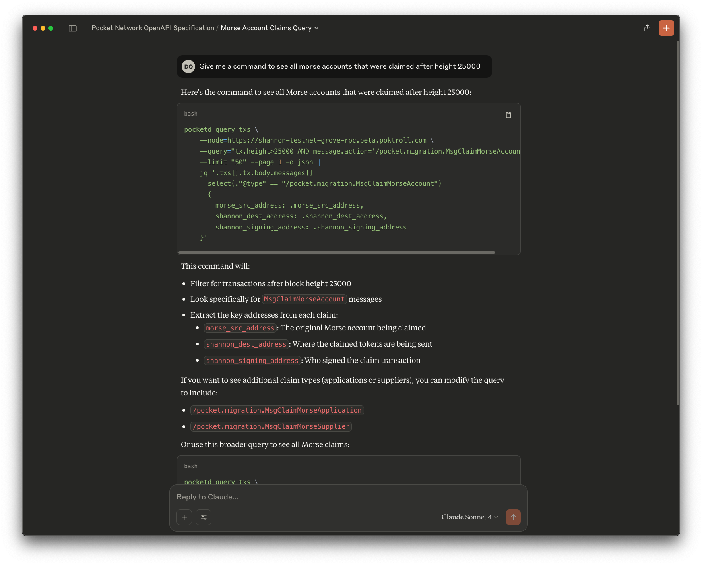
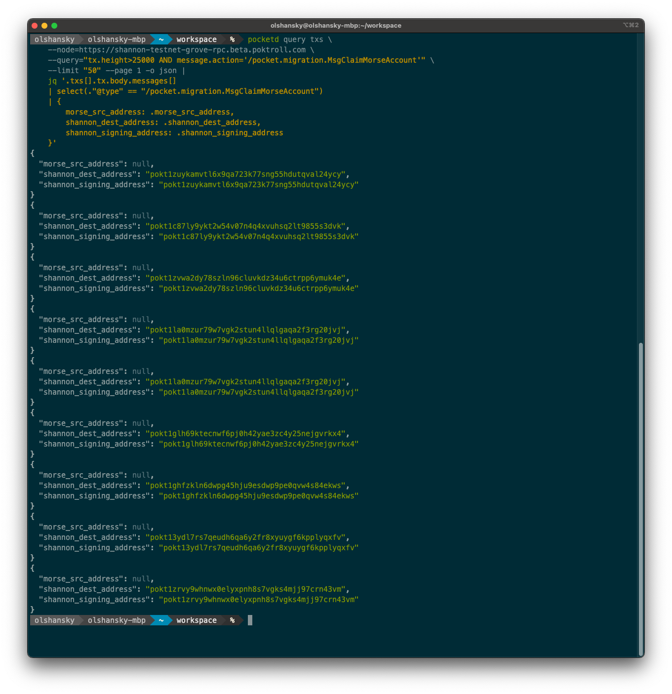

:::note GoDocs

We also have a [Godoc available here](https://pkg.go.dev/github.com/pokt-network/poktroll).

:::

The OpenAPI spec for the Shannon protocol is autogenerated by the [Ignite CLI](https://docs.ignite.com/).

The raw file can be found at [pocket/blob/main/docs/static/openapi.yml](https://github.com/pokt-network/poktroll/blob/main/docs/static/openapi.yml).

## Table of Contents <!-- omit in toc -->

- [Swagger UI](#swagger-ui)
- [Re-generating the OpenAPI Spec](#re-generating-the-openapi-spec)
- [`Cosmos` REST API vs `CometBFT` RPC](#cosmos-rest-api-vs-cometbft-rpc)
  - [External Resources](#external-resources)
  - [`Cosmos` - Example command to check accounts](#cosmos---example-command-to-check-accounts)
  - [`Cosmos` - Example command to check node status](#cosmos---example-command-to-check-node-status)
  - [`CometBFT` - Example command to check node status](#cometbft---example-command-to-check-node-status)
- [Cosmos SDK \& CometBFT API Comparison](#cosmos-sdk--cometbft-api-comparison)
  - [What is it?](#what-is-it)
  - [Example Ports \& Commands](#example-ports--commands)
- [Claude Generated Queries](#claude-generated-queries)
  - [Claude Project Instructions](#claude-project-instructions)
- [The spec itself](#the-spec-itself)

## Swagger UI

The Swagger UI for the Shannon Beta TestNet OpenAPI Spec may be viewed at [sauron-api.beta.infra.pocket.network](https://sauron-api.beta.infra.pocket.network).

## Re-generating the OpenAPI Spec

You can re-generate the OpenAPI spec by running:

```bash
make openapi_ignite_gen
```

This writes both `docs/static/openapi.yml` and `docs/static/openapi.json`.

If that fails on your platform, there is a Docker fallback:

```bash
make openapi_ignite_gen_docker
```

:::warning The Docker fallback is not version-pinned

`proto/Dockerfile.ignite` installs whatever Ignite CLI is latest at image build time, and
that target skips the `ignite_check_version` gate. Different Ignite versions emit
different specs — a newer one has been observed emitting every Cosmos SDK module endpoint
on top of the `pocket.*` ones, which is not what the committed spec contains. Prefer the
native target, and check the diff before committing whichever you use.

:::

## `Cosmos` REST API vs `CometBFT` RPC

### External Resources

:::warning

We are not going to dive into a discussion of REST vs RPC HTTP APIs here, but will provide minimal context.

:::

You can read about the general differences between REST and RPC APIs [here](https://www.smashingmagazine.com/2016/09/understanding-rest-and-rpc-for-http-apis/).

The `CometBFT` RPC Specification can be found [here](https://docs.cometbft.com/v0.34/rpc/).

The `Cosmos SDK` REST API Specification can be found [here](https://docs.cosmos.network/api).

### `Cosmos` - Example command to check accounts

```bash
curl -X 'GET' 'https://sauron-api.beta.infra.pocket.network/cosmos/auth/v1beta1/accounts' -H 'accept: application/json' | jq
```

### `Cosmos` - Example command to check node status

```bash
curl -X 'GET' 'https://sauron-api.beta.infra.pocket.network/cosmos/base/node/v1beta1/status' -H 'accept: application/json' | jq
```

### `CometBFT` - Example command to check node status

```bash
curl -X 'GET' 'https://sauron-rpc.beta.infra.pocket.network/status' -H 'accept: application/json' | jq
```

## Cosmos SDK & CometBFT API Comparison

- **CometBFT RPC (`26657`)** → **Independent of Cosmos SDK APIs**. Used for blockchain consensus, P2P networking, and transaction broadcasting.
- **Cosmos SDK gRPC (`9090`)** → **The core application API**. Provides structured, high-performance blockchain state queries.
- **Cosmos SDK REST API (`1317`)** → **A wrapper around Cosmos SDK gRPC** for frontend-friendly JSON-based queries.

:::note

💡 **If gRPC (`9090`) is disabled, the REST API (`1317`) will not work.**
💡 **If CometBFT RPC (`26657`) is down, the blockchain itself may be offline, but Cosmos SDK APIs can still work if the app is running.**

:::

### What is it?

| **Layer**                                                                   | **What is it?**                                                                                                                                                                                                                                                                                                                                                |
| --------------------------------------------------------------------------- | -------------------------------------------------------------------------------------------------------------------------------------------------------------------------------------------------------------------------------------------------------------------------------------------------------------------------------------------------------------- |
| **CometBFT RPC** _(Independent of the Cosmos SDK gRPC and REST API)_        | A **low-level RPC interface** that interacts with the **Tendermint consensus engine**. It is **completely independent** of the Cosmos SDK gRPC and REST API. Used for network, consensus, and blockchain-related queries (**not** application state). Also used for **sending transactions** and querying blockchain state at a protocol level.                |
| **Cosmos SDK gRPC** _(The core application-level API)_                      | A **high-performance binary API** for querying **Cosmos SDK modules**. Provides **structured access** to chain state using **protobuf messages**. Used by full nodes, wallets, and services for **efficient state access**. **🚀 All Cosmos SDK REST API requests ultimately rely on this gRPC API.**                                                          |
| **Cosmos SDK REST API (gRPC-Gateway)** _(A wrapper around Cosmos SDK gRPC)_ | A **RESTful wrapper** around **Cosmos SDK gRPC** that translates gRPC queries into **HTTP REST endpoints**. Enables **browser-friendly** and **frontend-compatible** access to Cosmos SDK modules. Uses **JSON over HTTP** instead of binary gRPC messages. **🚀 This API depends entirely on the Cosmos SDK gRPC API and does not work if gRPC is disabled.** |

### Example Ports & Commands

| **Layer**                              | **Example Port** | **Example Command**                                                             | **Example Endpoint**                                                                 |
| -------------------------------------- | ---------------- | ------------------------------------------------------------------------------- | ------------------------------------------------------------------------------------ |
| **CometBFT RPC**                       | `26657`          | `sh curl -X GET 'http://localhost:26657/status'`                                | `/status`, `/net_info`, `/block`, `/broadcast_tx_commit`                             |
| **Cosmos SDK gRPC**                    | `9090`           | `sh grpcurl -plaintext localhost:9090 list`                                     | `cosmos.auth.v1beta1.Query/Account`, `cosmos.bank.v1beta1.Query/Balance`             |
| **Cosmos SDK REST API (gRPC-Gateway)** | `1317`           | `sh curl -X GET 'http://localhost:1317/cosmos/auth/v1beta1/accounts/{address}'` | `/cosmos/auth/v1beta1/accounts/{address}`, `/cosmos/bank/v1beta1/balances/{address}` |

<!--

TODO_IMPROVE(#1081): Add an embedded view of the OpenAPI spec

import OpenAPI from '@site/src/components/OpenAPI';
import apiSpec from '@site/static/openapi.json';

<OpenAPI spec={apiSpec} />

-->

## Claude Generated Queries

:::warning 🧑‍🔬Experimental 🧑‍🔬

This is just an experimental attempt to help investigate onchain data

:::

You can setup a [Claude Project](https://www.anthropic.com/news/projects) to ask simple questions about querying onchain data:

For example, you can ask it to generate a query for a specific endpoint:



To get queries that work out of the box:



### Claude Project Instructions

1. Go to [Claude Projects](https://www.anthropic.com/news/projects)
2. Create a new project
3. Set the project instructions to the prompt below.
4. Set the project knowledge base to a portion of the [Full OpenAPI Spec](https://sauron-api.beta.infra.pocket.network/static/openapi.yml) (see below).
5. Ask a question about the OpenAPI spec.

<details>
<summary>Claude Project Instructions (i.e. Prompt)</summary>

````text
**Below the OpenAPI.yml line below, I have provided the OpenAPI spec for Pocket Network's Cosmos SDK app chain.**

You are a professional Cosmos SDK engineer with expertise in formatting CometBFT and Cosmos queries for the Pocket Network ecosystem.

**Your role:** Transform general blockchain query requests into properly formatted `pocketd` commands with appropriate filtering and JSON processing.

**Available endpoints:**
* **Mainnet:** https://sauron-rpc.infra.pocket.network
* **Testnet:** https://sauron-rpc.beta.infra.pocket.network

**Query format guidelines:**
- Always include `--node` parameter with appropriate endpoint
- Use `--query` for transaction filtering with proper syntax
- Include pagination (`--limit`, `--page`) when relevant
- Output as JSON (`-o json`)
- Pipe to `jq` for data extraction and formatting when needed

**Example interaction:**
Request: "Show me all create claim messages after height 20000"
Response:
```bash
pocketd query txs \
    --node=https://sauron-rpc.beta.infra.pocket.network \
    --query="tx.height>20000 AND message.action='/pocket.proof.MsgCreateClaim'" \
    --limit "10" --page 1 -o json |
    jq '[.txs[].tx.body.messages[]
    | select(."@type" == "/pocket.proof.MsgCreateClaim" and .supplier_operator_address != null)
    | .supplier_operator_address]
    | unique'
````

</details>

## The spec itself

The generated spec is **not** copied into this page. It lives in the repository and is the
only copy:

- [`docs/static/openapi.yml`](https://github.com/pokt-network/poktroll/blob/main/docs/static/openapi.yml) — YAML
- [`docs/static/openapi.json`](https://github.com/pokt-network/poktroll/blob/main/docs/static/openapi.json) — the same spec as JSON

Both are generated. Do not edit either by hand; regenerate instead (see above).

:::note Why this page does not inline the spec

It used to. A copy pasted into this page has no generator behind it, so it silently drifts
from `docs/static/openapi.yml` — which is exactly what happened: the inlined copy went
months out of date and kept advertising a field the chain had already renamed. Linking the
generated file means there is one copy to keep current.

:::
