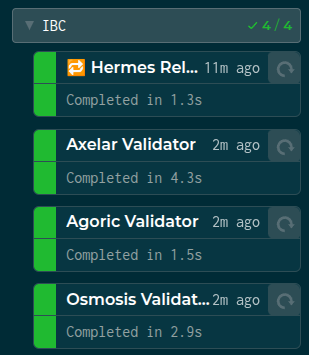
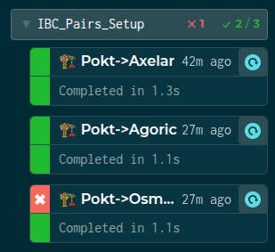

# Localnet IBC Environment

## Quickstart

1. Ensure that you can run localnet according to the [Developer Guide -> Walkthrough](../developer_guide/walkthrough.md)
2. Run localnet and wait for pocket and counterparty validators to be producing blocks
3. Check `localnet_config.yaml` to ensure that the expected counterparty validators are enabled
4. If an IBC pair setup tilt service (`🏗️ Pokt-><counterparty>`) has errored until persistent backoff, click the manual trigger arrow on the IBC pair setup tilt service
5. Wait for IBC setup for each enabled pair to complete
6. Once setup has completed successfully, click the manual trigger arrow on the `🔁 Hermes Relayer` tilt service to restart the corresponding relayer

<table>
<tbody>
<tr>
<td style={{verticalAlign: "top"}}>



</td>
<td style={{verticalAlign: "top"}}>



</td>
</tr>
</tbody>
</table>

## IBC Setup

For each pair of networks/chains, the IBC protocol requires an `Client`, `Connection`, and `Channel` be created between those networks.
The tilt localnet environment exposes this setup as a oneshot service, with the format with `🏗️ Pokt-><counterparty>`.

These setup services **do** automatically start after their respective tilt resource dependencies; however, each network validator integration has its own quirks which may require additional delay.
They will also **automatically retry** with exponential backoff, but may be manually triggered by clicking the arrow in the corresponding service.

:::warning

Multiple **simultaneous** IBC pair setups are likely interfere with each others expectations about the pocket account sequence number; however, hermes CLI will automatically retry with an updated sequence number - it just may take a bit longer.

:::

The following uses the `pocket-axelar` pair as an example.

Example setup log output:

<details>
<summary>

```
2025-06-26T11:40:41.166006Z  INFO ThreadId(01) running Hermes v1.13.1+5e403dd
2025-06-26T11:40:45.211899Z  INFO ThreadId(01) Creating new clients, new connection, and a new channel with order ORDER_UNORDERED
2025-06-26T11:40:50.240782Z  INFO ThreadId(01) foreign_client.create{client=axelar->pocket:07-tendermint-0}: 🍭 client was created successfully id=07-tendermint-0
2025-06-26T11:41:06.131924Z  INFO ThreadId(01) foreign_client.create{client=pocket->axelar:07-tendermint-0}: 🍭 client was created successfully id=07-tendermint-0
2025-06-26T11:41:09.671319Z  INFO ThreadId(01) 🥂 pocket => OpenInitConnection(OpenInit { Attributes { connection_id: connection-0, client_id: 07-tendermint-0, counterparty_connection_id: None, counterparty_client_id: 07-tendermint-0 } }) at height 0-22
2025-06-26T11:41:56.934211Z  INFO ThreadId(01) 🥂 axelar => OpenTryConnection(OpenTry { Attributes { connection_id: connection-0, client_id: 07-tendermint-0, counterparty_connection_id: connection-0, counterparty_client_id: 07-tendermint-0 } }) at height 0-19
2025-06-26T11:42:23.508663Z  INFO ThreadId(01) 🥂 pocket => OpenAckConnection(OpenAck { Attributes { connection_id: connection-0, client_id: 07-tendermint-0, counterparty_connection_id: connection-0, counterparty_client_id: 07-tendermint-0 } }) at height 0-58
2025-06-26T11:42:58.297181Z  INFO ThreadId(01) 🥂 axelar => OpenConfirmConnection(OpenConfirm { Attributes { connection_id: connection-0, client_id: 07-tendermint-0, counterparty_connection_id: connection-0, counterparty_client_id: 07-tendermint-0 } }) at height 0-31
2025-06-26T11:43:06.326874Z  INFO ThreadId(01) connection handshake already finished for Connection { delay_period: 0ns, a_side: ConnectionSide { chain: BaseChainHandle { chain_id: pocket }, client_id: 07-tendermint-0, connection_id: connection-0 }, b_side: ConnectionSide { chain: BaseChainHandle { chain_id: axelar }, client_id: 07-tendermint-0, connection_id: connection-0 } }
2025-06-26T11:43:08.162131Z  INFO ThreadId(01) 🎊  pocket => OpenInitChannel(OpenInit { port_id: transfer, channel_id: channel-0, connection_id: None, counterparty_port_id: transfer, counterparty_channel_id: None }) at height 0-79
2025-06-26T11:43:19.232828Z  INFO ThreadId(01) 🎊  axelar => OpenTryChannel(OpenTry { port_id: transfer, channel_id: channel-0, connection_id: connection-0, counterparty_port_id: transfer, counterparty_channel_id: channel-0 }) at height 0-35
2025-06-26T11:43:53.673647Z  INFO ThreadId(01) 🎊  pocket => OpenAckChannel(OpenAck { port_id: transfer, channel_id: channel-0, connection_id: connection-0, counterparty_port_id: transfer, counterparty_channel_id: channel-0 }) at height 0-100
2025-06-26T11:44:11.728489Z  INFO ThreadId(01) 🎊  axelar => OpenConfirmChannel(OpenConfirm { port_id: transfer, channel_id: channel-0, connection_id: connection-0, counterparty_port_id: transfer, counterparty_channel_id: channel-0 }) at height 0-45
2025-06-26T11:44:19.747405Z  INFO ThreadId(01) channel handshake already finished for Channel { ordering: ORDER_UNORDERED, a_side: ChannelSide { chain: BaseChainHandle { chain_id: pocket }, client_id: 07-tendermint-0, connection_id: connection-0, port_id: transfer, channel_id: channel-0, version: None }, b_side: ChannelSide { chain: BaseChainHandle { chain_id: axelar }, client_id: 07-tendermint-0, connection_id: connection-0, port_id: transfer, channel_id: channel-0, version: None }, connection_delay: 0ns }
```

</summary>

```
SUCCESS Channel {
    ordering: Unordered,
    a_side: ChannelSide {
        chain: BaseChainHandle {
            chain_id: ChainId {
                id: "pocket",
                version: 0,
            },
            runtime_sender: Sender { .. },
        },
        client_id: ClientId(
            "07-tendermint-0",
        ),
        connection_id: ConnectionId(
            "connection-0",
        ),
        port_id: PortId(
            "transfer",
        ),
        channel_id: Some(
            ChannelId(
                "channel-0",
            ),
        ),
        version: None,
    },
    b_side: ChannelSide {
        chain: BaseChainHandle {
            chain_id: ChainId {
                id: "axelar",
                version: 0,
            },
            runtime_sender: Sender { .. },
        },
        client_id: ClientId(
            "07-tendermint-0",
        ),
        connection_id: ConnectionId(
            "connection-0",
        ),
        port_id: PortId(
            "transfer",
        ),
        channel_id: Some(
            ChannelId(
                "channel-0",
            ),
        ),
        version: None,
    },
    connection_delay: 0ns,
}
```

</details>


## Onchain IBC State

TODO_IN_THIS_COMMIT: link to overview -> IBC core...

### Clients

```shell
# List localnet clients for a given network
make ibc_list_<network>_clients

# E.g.
make ibc_list_axelar_clients
```

### Connections

```shell
# List localnet connections for a given network
make ibc_list_<network>_connections

# E.g.
make ibc_list_axelar_connections
```

### Channels

```shell
# List localnet channels for a given network
make ibc_list_<network>_channels

# E.g.
make ibc_list_axelar_channels
```

### Interchain Accounts

```
// TODO(@bryanchriswhite)
```

## Testing Localnet IBC

### Transfers

```shell
# Transfer Example:
#   1000upokt from pocket to axelar
#
# NOTE: make targets exist for supported counterparty networks in both directions.
# E.g.:
# - make ibc_test_transfer_axelar_to_pocket
# - make ibc_test_transfer_pocket_to_agoric
# - ...
$ make ibc_test_transfer_pocket_to_axelar
code: 0
codespace: ""
data: ""
events: []
gas_used: "0"
gas_wanted: "0"
height: "0"
info: ""
logs: []
raw_log: ""
timestamp: ""
tx: null
txhash: 35D669173501D1DCBB5441927A075BE813E18C1D0FE174DF80146E4E48D754CF

# Check that the TX on the source chain was successful
$ make query_tx_json_short HASH=35D669173501D1DCBB5441927A075BE813E18C1D0FE174DF80146E4E48D754CF
{
  "code": 0,  # <-- code 0 == success
  "log": "",  # <-- empty log == success; otherwise, log contains error details
  "timestamp": "2025-07-02T09:05:04Z",
  "height": "5457",
  "txhash": "35D669173501D1DCBB5441927A075BE813E18C1D0FE174DF80146E4E48D754CF"
}

# Hermes relayer logs:
2025-07-02T09:05:09.539879Z  INFO ThreadId(337) worker.batch{chain=pocket}:supervisor.handle_batch{chain=pocket}:supervisor.process_batch{chain=pocket}:worker.packet.cmd{src_chain=pocket src_port=transfer src_channel=channel-3 dst_chain=axelar}:relay{odata=b21976eb ->Destination @0-5457; len=1}: assembled batch of 2 message(s)
2025-07-02T09:05:09.556979Z  INFO ThreadId(337) worker.batch{chain=pocket}:supervisor.handle_batch{chain=pocket}:supervisor.process_batch{chain=pocket}:worker.packet.cmd{src_chain=pocket src_port=transfer src_channel=channel-3 dst_chain=axelar}:relay{odata=b21976eb ->Destination @0-5457; len=1}: response(s): 1; Ok:2D7A3168CBFBB0DC76D49D7AA1BF00810BA22C37C2A3BB3C56A3AF4A03CF3DE0 target_chain=axelar
2025-07-02T09:05:09.557018Z  INFO ThreadId(337) worker.batch{chain=pocket}:supervisor.handle_batch{chain=pocket}:supervisor.process_batch{chain=pocket}:worker.packet.cmd{src_chain=pocket src_port=transfer src_channel=channel-3 dst_chain=axelar}:relay{odata=b21976eb ->Destination @0-5457; len=1}: submitted
2025-07-02T09:05:12.876224Z  INFO ThreadId(30) worker.batch{chain=axelar}:supervisor.handle_batch{chain=axelar}:supervisor.process_batch{chain=axelar}:worker.client.misbehaviour{client=07-tendermint-0 src_chain=pocket dst_chain=axelar}:foreign_client.detect_misbehaviour_and_submit_evidence{client=pocket->axelar:07-tendermint-0}:foreign_client.detect_misbehaviour{client=pocket->axelar:07-tendermint-0}: No evidence of misbehavior detected for chain pocket
2025-07-02T09:05:12.976365Z  INFO ThreadId(87) worker.batch{chain=axelar}:supervisor.handle_batch{chain=axelar}:supervisor.process_batch{chain=axelar}:worker.client.misbehaviour{client=07-tendermint-0 src_chain=pocket dst_chain=axelar}:foreign_client.detect_misbehaviour_and_submit_evidence{client=pocket->axelar:07-tendermint-0}: client is valid
2025-07-02T09:05:17.680828Z  INFO ThreadId(284) worker.batch{chain=axelar}:supervisor.handle_batch{chain=axelar}:supervisor.process_batch{chain=axelar}:worker.packet.cmd{src_chain=axelar src_port=transfer src_channel=channel-0 dst_chain=pocket}:relay{odata=7f01e6e0 ->Destination @0-1563; len=1}: assembled batch of 2 message(s)
2025-07-02T09:05:18.034841Z  INFO ThreadId(284) worker.batch{chain=axelar}:supervisor.handle_batch{chain=axelar}:supervisor.process_batch{chain=axelar}:worker.packet.cmd{src_chain=axelar src_port=transfer src_channel=channel-0 dst_chain=pocket}:relay{odata=7f01e6e0 ->Destination @0-1563; len=1}: response(s): 1; Ok:FC2E41FEC8AF3EC03614B18013D579D36506E748C18533723BDC53513E98E9E4 target_chain=pocket
2025-07-02T09:05:18.034869Z  INFO ThreadId(284) worker.batch{chain=axelar}:supervisor.handle_batch{chain=axelar}:supervisor.process_batch{chain=axelar}:worker.packet.cmd{src_chain=axelar src_port=transfer src_channel=channel-0 dst_chain=pocket}:relay{odata=7f01e6e0 ->Destination @0-1563; len=1}: submitted
2025-07-02T09:05:21.473744Z  INFO ThreadId(31) worker.batch{chain=pocket}:supervisor.handle_batch{chain=pocket}:supervisor.process_batch{chain=pocket}:worker.client.misbehaviour{client=07-tendermint-6 src_chain=axelar dst_chain=pocket}:foreign_client.detect_misbehaviour_and_submit_evidence{client=axelar->pocket:07-tendermint-6}:foreign_client.detect_misbehaviour{client=axelar->pocket:07-tendermint-6}: No evidence of misbehavior detected for chain axelar
2025-07-02T09:05:21.573908Z  INFO ThreadId(43) worker.batch{chain=pocket}:supervisor.handle_batch{chain=pocket}:supervisor.process_batch{chain=pocket}:worker.client.misbehaviour{client=07-tendermint-6 src_chain=axelar dst_chain=pocket}:foreign_client.detect_misbehaviour_and_submit_evidence{client=axelar->pocket:07-tendermint-6}: client is valid

# Watch for the the destination account balance to include the new ics20 token
$ watch -n 2 "make ibc_query_axelar_balance"
$ make acc_balance_query ACC=pokt1mrqt5f7qh8uxs27cjm9t7v9e74a9vvdnq5jva4
Every 2,0s: make ibc_query_axelar_balance

balances:
- amount: "1000"
  # NOTE: the denom may be different.
  denom: ibc/43D77F2F7509D83FC29E32D9A00D45E5F1F848F137E59F84873CE83B9FF9B95C
- amount: "9990000000"
  denom: stake
- amount: "9999977141"
  denom: uaxl
pagination:
  next_key: null
  total: "0"
```


### Interchain Accounts

```
// TODO(@bryanchriswhite)
```


## Troubleshooting / Known Issues

```
TODO_IN_THIS_COMMIT: make presentable:
- sometimes tx succeeds on origin but the relayer never relays.
- notable occasional hermes relayer daemon log entry:
  2025-07-02T08:42:54.450821Z  WARN ThreadId(229) worker.batch{chain=pocket}:supervisor.handle_batch{chain=pocket}:supervisor.process_batch{chain=pocket}:worker.clear.cmd{src_chain=pocket src_port=transfer src_channel=channel-3 dst_chain=axelar}:schedule_packet_clearing{height=Some(Height { revision: 0, height: 4820 })}:relay_pending_packets{height=Some(Height { revision: 0, height: 4819 })}:schedule_recv_packet_and_timeout_msgs{query_height=0-4819}: no packet data was pulled at height <=0-4819 for sequences 1..=1, this might be due to the data not being available on the configured endpoint. Please verify that the RPC endpoint has the required packet data, for more details see https://hermes.informal.systems/advanced/troubleshooting/cross-comp-config.html#uncleared-pending-packets
- sequence mismatch error:
    - need to use a different pocket account than app1 and double-check for and elminiate reuse of hermes relayer accounts
    - log example:
        2025-07-02T09:05:17.696065Z ERROR ThreadId(30) worker.batch{chain=axelar}:supervisor.handle_batch{chain=axelar}:supervisor.process_batch{chain=axelar}:worker.packet.cmd{src_chain=axelar src_port=transfer src_channel=channel-0 dst_chain=pocket}:relay{odata=7f01e6e0 ->Destination @0-1563; len=1}:send_messages_and_wait_check_tx{chain=pocket tracking_id=7f01e6e0}:send_tx_with_account_sequence_retry{chain=pocket account.sequence=59}:estimate_gas: failed to simulate tx. propagating error to caller: gRPC call `send_tx_simulate` failed with status: status: Unknown, message: "account sequence mismatch, expected 61, got 59: incorrect account sequence [cosmos/cosmos-sdk@v0.53.0/x/auth/ante/sigverify.go:364] with gas used: '33244'", details: [], metadata: MetadataMap { headers: {"content-type": "application/grpc", "x-cosmos-block-height": "5461"} }
        2025-07-02T09:05:17.696113Z  WARN ThreadId(30) worker.batch{chain=axelar}:supervisor.handle_batch{chain=axelar}:supervisor.process_batch{chain=axelar}:worker.packet.cmd{src_chain=axelar src_port=transfer src_channel=channel-0 dst_chain=pocket}:relay{odata=7f01e6e0 ->Destination @0-1563; len=1}:send_messages_and_wait_check_tx{chain=pocket tracking_id=7f01e6e0}:send_tx_with_account_sequence_retry{chain=pocket account.sequence=59}: failed to estimate gas because of a mismatched account sequence number, refreshing account sequence number and retrying once error=gRPC call `send_tx_simulate` failed with status: status: Unknown, message: "account sequence mismatch, expected 61, got 59: incorrect account sequence [cosmos/cosmos-sdk@v0.53.0/x/auth/ante/sigverify.go:364] with gas used: '33244'", details: [], metadata: MetadataMap { headers: {"content-type": "application/grpc", "x-cosmos-block-height": "5461"} }
        2025-07-02T09:05:17.711375Z  INFO ThreadId(30) worker.batch{chain=axelar}:supervisor.handle_batch{chain=axelar}:supervisor.process_batch{chain=axelar}:worker.packet.cmd{src_chain=axelar src_port=transfer src_channel=channel-0 dst_chain=pocket}:relay{odata=7f01e6e0 ->Destination @0-1563; len=1}:send_messages_and_wait_check_tx{chain=pocket tracking_id=7f01e6e0}:send_tx_with_account_sequence_retry{chain=pocket account.sequence=59}: refreshed account sequence number old=59 new=61
```

