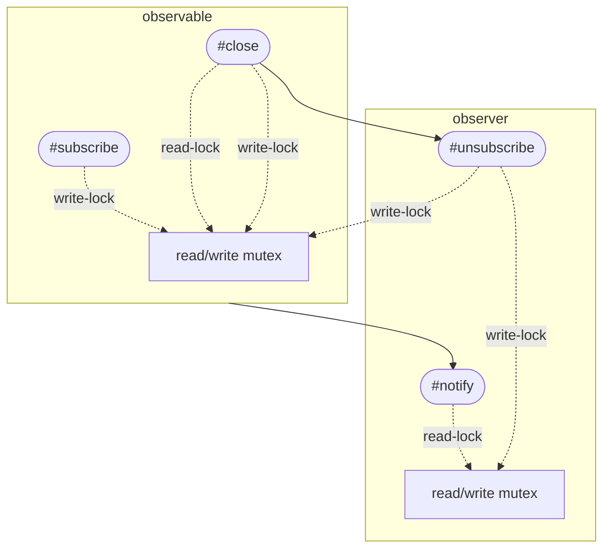
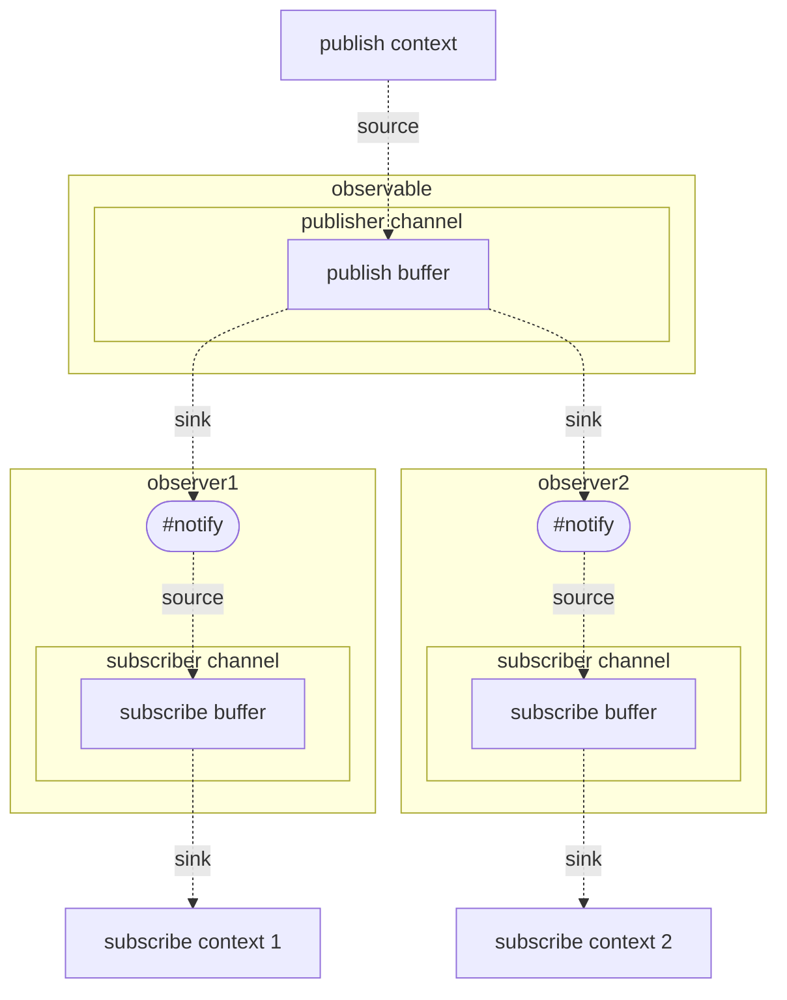

## `pocket/pkg/observable` Package <!-- omit in toc -->

The `pocket/pkg/observable` package provides a lightweight and straightforward mechanism to handle asynchronous notifications using the Observer pattern. This is achieved through two primary interfaces: `Observable` and `Observer`.

- [Overview](#overview)
- [Interfaces and Structures](#interfaces-and-structures)
  - [`Observable` Interface](#observable-interface)
  - [`Observer` Interface](#observer-interface)
- [Architecture Diagrams](#architecture-diagrams)
  - [Observable Synchronization](#observable-synchronization)
  - [Observable Buffering](#observable-buffering)
- [Usage](#usage)
  - [Basic Example](#basic-example)
- [Considerations](#considerations)
- [Conclusion](#conclusion)

## Overview

The `Observable` interface is responsible for notifying multiple subscribers about new values asynchronously, while the `Observer` interface allows access to the notified channel and facilitates unsubscribing from an `Observable`.

## Interfaces and Structures

### `Observable` Interface

Represents a publisher in a "Fan-Out" system design, allowing multiple subscribers to be notified of new values asynchronously.

- **Methods**:

  - **Subscribe**: Used to subscribe an observer to the observable. Returns an instance of the `Observer` interface.

    ```go
    func (o *MyObservableType) Subscribe(ctx context.Context) Observer[MyValueType]
    ```

  - **UnsubscribeAll**: Unsubscribes all observers from the observable.

    ```go
    func (o *MyObservableType) UnsubscribeAll()
    ```

### `Observer` Interface

Represents a subscriber in a "Fan-Out" system design, providing access to the notified channel and capabilities to unsubscribe.

- **Methods**:

  - **Unsubscribe**: Used to unsubscribe the observer from its associated observable.

    ```go
    func (obs *MyObserverType) Unsubscribe()
    ```

  - **Ch**: Returns the channel through which the observer receives notifications.

    ```go
    func (obs *MyObserverType) Ch() <-chan MyValueType
    ```

## Architecture Diagrams

Visual representations often make it easier to understand the design and flow of a package. Below are the architecture diagrams that explain the high-level structure and interactions in this package:

### Observable Synchronization



> **Figure 1**: This diagram depicts the synchronization mechanisms between the observable and its observers. It specifically showcases the use of read and write locks for different operations in both observable and observer contexts.

### Observable Buffering



> Figure 2: The diagram illustrates the buffering mechanisms within the observable and its observers. It highlights how published messages are buffered and how they propagate to the individual observers' buffers.

## Usage

### Basic Example

```go
package main

import (
	"context"
	"fmt"
	"time"

	"pocket/pkg/observable/channel"
)

func main() {
	// Create a new context that can be cancelled
	ctx, cancel := context.WithCancel(context.Background())
	// Ensure to cancel the context to release resources
	defer cancel()

	// Create a new Observable and its corresponding publisher
	obsvbl, publisher := channel.NewObservable[int]()
	// Subscribe the first Observer to the Observable
	observer1 := obsvbl.Subscribe(ctx)

	// Start observing with observer1 in a goroutine
	go func() {
		for v := range observer1.Ch() {
			fmt.Println("Observer1 received:", v)
		}
	}()

	// Publish the first value to the Observable
	publisher <- 10
	time.Sleep(time.Millisecond)

	// Now, subscribe the second Observer to the Observable
	observer2 := obsvbl.Subscribe(ctx)

	// Start observing with observer2 in a goroutine
	go func() {
		for v := range observer2.Ch() {
			fmt.Println("Observer2 received:", v)
		}
	}()

	// Publish the second value
	publisher <- 20
	time.Sleep(time.Millisecond)

	// Unsubscribe observer1 before the last value is sent
	observer1.Unsubscribe()
	fmt.Println("Observer1 unsubscribed!")

	// Publish the third value
	publisher <- 30
	time.Sleep(time.Millisecond)
}

// Expected Output:
// Observer1 received: 10
// Observer2 received: 20
// Observer1 received: 20
// Observer1 unsubscribed!
// Observer2 received: 30

```

## Considerations

While the `pkg/observable` package is designed to be simple and minimal, developers with more complex requirements may need to consider extending its functionality or exploring other libraries like [RxGo](https://github.com/ReactiveX/RxGo).

## Conclusion

The `pkg/observable` package is an intuitive solution for handling asynchronous notifications in Go projects, ensuring efficient communication between observables and observers.
