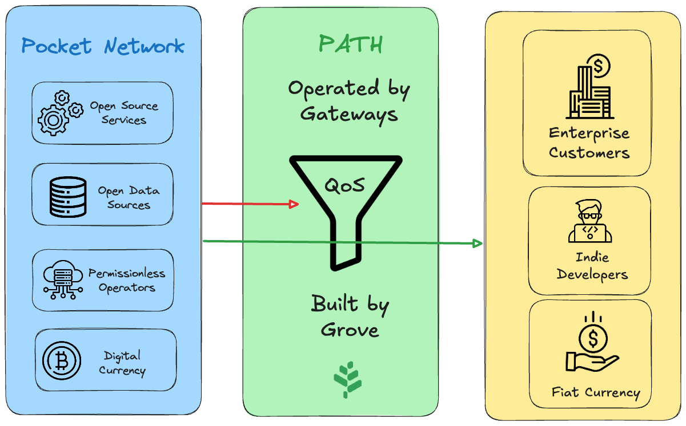

<!-- markdownlint-disable MD033 -->
<!-- markdownlint-disable MD045 -->

  

  
  
  
  
  
  
  
  
  
  
  
  
  

## Pocket Network Shannon Technical Docs <!-- omit in toc -->

**poktroll** is the source code and core implementation of the [Shannon upgrade](https://docs.pokt.network/pokt-protocol/the-shannon-upgrade) for [Pocket Network](https://pokt.network/).

`pocketd` is built using the [Cosmos SDK](https://docs.cosmos.network), [CometBFT](https://cometbft.com/) and [Ignite CLI](https://ignite.com/cli).

## Where do I get started?

Allocate 1-3 hours of time and go through the [Operator Cheat Sheets](../category/cheat-sheets-to-stake--deploy-intermediate) available.

You'll be able to setup `Accounts`, `Services`, `Full Nodes`, `Validators`, `Suppliers`, `Gateways` or `Applications` depending on how you want to participate in the network.

## Pocket and PATH

The technical docs for Pocket Network Shannon upgrade are accompanied by [PATH](https://path.grove.city/) documentation.

**PATH (Path API & Toolkit Harness)** is an open source framework to enable access
to a permissionless network of API providers of open source services and data
sources without sacrificing enterprise-grade SLAs.

An easy way to think about **PATH** and **Pocket Network** is:

- **Pocket Network** is a permissionless network (i.e. directory) of API providers for open source services and data sources
- **PATH** is a framework to build a Gateway that ensures a high quality of service atop of Pocket Network using Smart QoS

### PATH Roadmap

[Grove](https://grove.city/) is developing [PATH](https://path.grove.city/) for
anyone who aims to deploy a Pocket Network gateway. Visit the docs to get started.

The PATH Roadmap, along with all past, active and future work is tracked via [this Github project](https://github.com/orgs/buildwithgrove/projects/1).

### Shannon Roadmap

The Shannon Roadmap, along with all past, active and future work is tracked via [this Github project](https://github.com/orgs/pokt-network/projects/144).

## Documents Available

1. [Guides & Deployment](../category/cheat-sheets-to-stake--deploy-intermediate): Deployment cheat sheets and config overviews for node runners, infrastructure operators and CLI users.
2. [Tools & Explorers](../category/pocketd-cli): Explorers, wallets, faucets and other resources to interact with the network.
3. [Core Developers](../category/developer-guide): Guides & walkthroughs for core or external developers looking to contribute to the core protocol or SDK.
4. [Protocol Design](../category/protocol-actors): Learn more about tokenomics design & protocol architecture.

## GoDoc Documentation

The Godoc for the source code can be found at [pkg.go.dev/github.com/pokt-network/pocket](https://pkg.go.dev/github.com/pokt-network/pocket).

---

## License

This project is licensed under the MIT License; see the [LICENSE](https://github.com/pokt-network/poktroll/blob/main/LICENSE) file for details.
