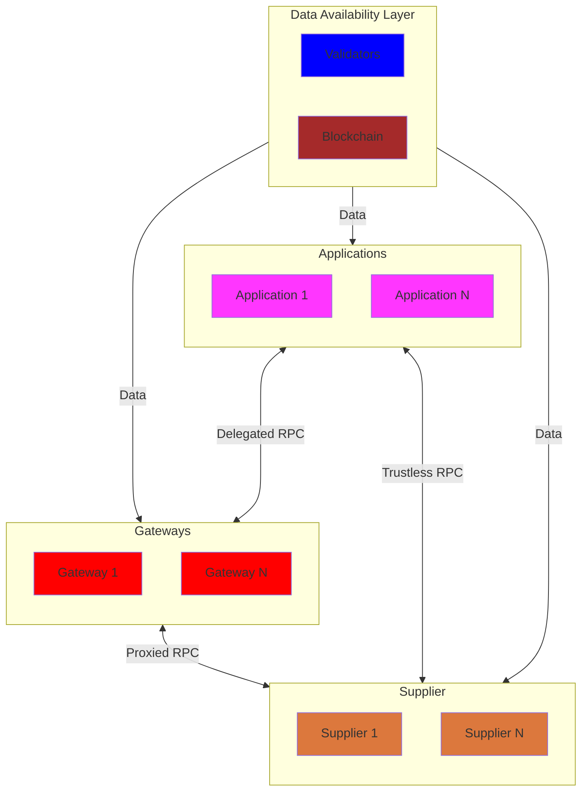

# Pocket Network Actors <!-- omit in toc -->

- [Overview](#overview)
- [On-Chain vs Off-Chain](#on-chain-vs-off-chain)
- [On-Chain Actors](#on-chain-actors)
- [Off-Chain Actors](#off-chain-actors)

## Overview

## On-Chain vs Off-Chain

Pocket Network protocol is composed of both on-chain and off-chain actors.

There are 3 on-chain actors:

- [Applications](./application.md)
- [Suppliers](./supplier.md)
- [Gateways](./gateway.md)

There are 2 off-chain actors:

- [RelayMiners](./relay_miner.md)
- [AppGateServers](./appgate_server.md)

## On-Chain Actors

On-Chain actors are part of the Pocket Network distributed ledger. They are the
_"Web3"_ part of Pocket.

They can thought of as a `record`, a `registration` or a piece of `state` at a
certain point in time. They have an `address`, an `account`, a `balance` and often
also have a `stake`.

## Off-Chain Actors

Off-Chain actors are all the operators that make up Pocket Network. They are the
_"Web2"_ part of Pocket.

They can be thought of as `servers`, `processes` or `clients`.

Off-chain actors play a key role in executing off-chain business logic that is
verified on-chain and drives on-chain state transitions.
