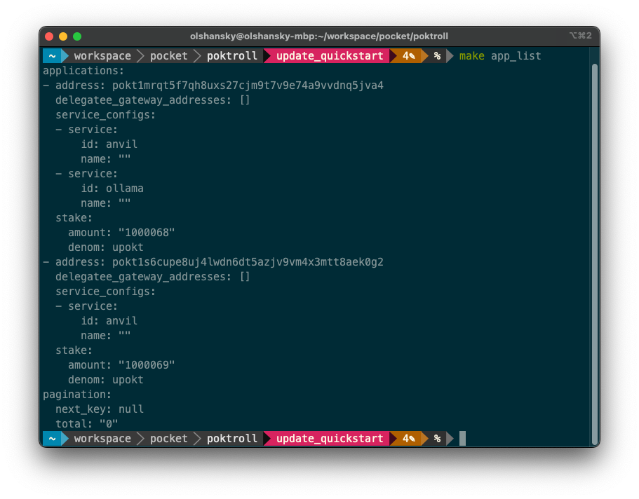

# Quickstart <!-- omit in toc -->

:::tip
The goal of this document is to get you up and running with a LocalNet and
end-to-end relay.

**If you encounter any problems**, the best way to get support
from the team is by creating a new [GitHub Issue here](https://github.com/pokt-network/pocket/issues/new/choose).
:::

- [Install Dependencies](#install-dependencies)
- [Launch LocalNet](#launch-localnet)
  - [Clone the repository](#clone-the-repository)
  - [See all the available helper commands](#see-all-the-available-helper-commands)
  - [Prepare your environment](#prepare-your-environment)
  - [Create a k8s cluster](#create-a-k8s-cluster)
  - [Start up LocalNet](#start-up-localnet)
- [Interact with your Local Pocket Network](#interact-with-your-local-pocket-network)
  - [Create a new Account](#create-a-new-account)
  - [Fund your account](#fund-your-account)
  - [Stake Shannon as an Application](#stake-shannon-as-an-application)
  - [Check for suppliers](#check-for-suppliers)
  - [Checking logs](#checking-logs)
  - [Send a relay](#send-a-relay)
  - [Send a relay a shannon](#send-a-relay-a-shannon)
- [Explore the tools](#explore-the-tools)
  - [E2E Tests](#e2e-tests)
  - [poktrolld](#poktrolld)
  - [Makefile](#makefile)
  - [Ignite](#ignite)

## Install Dependencies

:::note
You might already have these installed if you've followed the [LocalNet instructions](../internal_infrastructure/localnet.md).
:::

Install the following dependencies:

1. [Golang](https://go.dev/doc/install) - The programming language we use to implement the protocol
2. [Docker](https://docs.docker.com/get-docker/) - Containerization tool
3. [Ignite](https://docs.ignite.com/welcome/install) - Cosmos SDK CLI for building and deploying blockchains
4. [Kind](https://kind.sigs.k8s.io/#installation-and-usage) - k8s local cluster manager
5. [Helm](https://helm.sh/docs/intro/install/#through-package-managers) - k8s configuration and automation tool
6. [Tilt](https://docs.tilt.dev/install.html) - k8s local development tool & environment manager

## Launch LocalNet

This section will help you deploy a Pocket LocalNet in a k8s cluster on your machine.

### Clone the repository

```bash
git clone https://github.com/pokt-network/poktroll.git
cd poktroll
```

### See all the available helper commands

```bash
make help
```

:::tip Makefile

We leverage the `Makefile` to wrap the complexity of some common commands, but you
can open it up directly to see what the underlying command being executed is.
:::

### Prepare your environment

Compile protobufs, generate mocks and verify that all tests are passing by running:

```bash
make go_develop_and_test
```

### Create a k8s cluster

```bash
kind create cluster
```

### Start up LocalNet

```bash
make localnet_up
```

Visit [localhost:10350](<http://localhost:10350/r/(all)/overview>) and wait until all the containers are 🟢.

If everything worked as expected, your screen should look similar to the following:


## Interact with your Local Pocket Network

This section of the Quickstart is an opinionated walkthrough of a small number
of interactions you can have with the network as a starting point. There will be
a lot more to explore later!

### Create a new Account

List all the accounts we get out of the box by running:

```bash
make ignite_acc_list
```

And create a new account named `shannon` by running:

```bash
ignite account create shannon \
  --keyring-dir=./localnet/poktrolld \
  --keyring-backend test
```

If you re-run `make ignite_acc_list`, you shold now see `shannon` in the list.

Make sure to note its address under the `Address` column and export it as an
environment variable for convenience. For example:

```bash
export SHANNON_ADDRESS=pokt1skun4qy6z0cvac4fc37kcqcjsyr3qe9thhlzkv
```


### Fund your account

Query your account's balance by running:

```bash
make acc_balance_query ACC=$SHANNON_ADDRESS
```

And you should see an empty balance:

```yaml
~ Balances ~
balances: []
pagination: {}

~ Spendable Balances ~
Querying spendable balance for pokt1h04g6njyuv03dhd74a73pyzeadmd8dk7l9tsk8
balances: []
pagination: {}

```

But if you look in our genesis file (`./localnet/poktrolld/config/genesis.json`)
you'll find that our validator has a lot of `POKT`, so we can use some of that.

```bash
poktrolld --home=./localnet/poktrolld \
  tx bank send \
  validator1 $SHANNON_ADDRESS 420000000000069upokt \
  --node tcp://127.0.0.1:36657
```

And you'll find that `shannon` is now rolling in `POKT`:

```yaml
balances:
  - amount: "420000000000069"
    denom: upokt
pagination:
  next_key: null
  total: "0"
```

### Stake Shannon as an Application

Run `make app_list` to see all the applications staked on the network. There
will be a default application, but `SHANNON_ADDRESS` won't be there.

In order to stake shannon as an on-chain application, we need to create a new
config file:

```bash
cat <<EOF >> shannon_app_config.yaml
service_ids:
 - anvil
EOF
```

And stake the application:

```bash
poktrolld --home=./localnet/poktrolld \
  tx application stake-application 1000upokt \
  --config shannon_app_config.yaml \
  --keyring-backend test \
  --from shannon \
  --node tcp://127.0.0.1:36657
```

:::note Anvil Service

Anvil runs a local test Ethereum node.

We are only staking the application for the `anvil` service because it is
pre-configured to be available in the LocalNet you just started.

:::

If you re-run, `make ap_list` you should see that `SHANNON_ADDRESS` is now staked as an app:



### Check for suppliers

Run `make supplier_list` and check that there is at least one supplier available
with support for `Anvil`.


We have already pre-configured two more suppliers to be staked for `anvil`, which
you can do by simply running the following commands:

```bash
make supplier2_stake
make supplier3_stake
```

Running `make supplier_list` should now show that all three suppliers are staked.

### Checking logs

You can view or inspect logs either through Tilt or Grafana.

Given that we just staked a few suppliers, you customize the query to look for
`Supplier` either on [Grafana](http://localhost:3003/explore?schemaVersion=1&panes=%7B%22d1l%22:%7B%22datasource%22:%22P8E80F9AEF21F6940%22,%22queries%22:%5B%7B%22refId%22:%22A%22,%22expr%22:%22%7Bcontainer%3D%5C%22poktrolld-validator%5C%22%7D%20%7C%3D%20%60Supplier%60%20%7C%20json%22,%22queryType%22:%22range%22,%22datasource%22:%7B%22type%22:%22loki%22,%22uid%22:%22P8E80F9AEF21F6940%22%7D,%22editorMode%22:%22builder%22%7D%5D,%22range%22:%7B%22from%22:%22now-1h%22,%22to%22:%22now%22%7D%7D%7D&orgId=1) or [Tilt](http://localhost:10350/r/validator/overview?term=Supplier).


### Send a relay

:::warning Initialize Public Keys

You must run `make acc_initialize_pubkeys` before sending a relay in order for
the public keys to be initialized correctly.

See the [x/auth](https://docs.cosmos.network/main/build/modules/auth) for more
information on how public keys are stored and accessible on-chain.

:::

If you look in `./localnet/poktrolld/config/appgate_server_config.yaml`, you'll find
the configurations for an appgate server that is listening on port `42069`. 🌿

You can send a relay to the `anvil` service (i.e. locally running
ethereum node) like so:

```bash
curl -X POST -H "Content-Type: application/json" \
  --data '{"jsonrpc":"2.0","method":"eth_blockNumber","params":[],"id":1}' \
  http://localhost:42069/anvil
```

If everything worked as expected, you should see output similar to the following:

```json
{"jsonrpc":"2.0","id":1,"result":"0x61"}%
```

### Send a relay a shannon

However, the appgate server above is not configured to sign relays on behalf of `SHANNON_ADDRESS`.

To do so, you'll need to create a similar configuration like so:

```yaml
cat <<EOF >> shannon_appgate_config.yaml
self_signing: true
signing_key: shannon
listening_endpoint: http://localhost:42042
query_node_url: tcp://127.0.0.1:36657
EOF
```

And the start the appgate server locally:

```bash
poktrolld --home=./localnet/poktrolld  appgate-server \
  --config shannon_appgate_config.yaml --keyring-backend test \
  --node tcp://127.0.0.1:36657
```

:::warning
You might need to add the following to your `/etc/hosts` file:
127.0.0.1 anvil
127.0.0.1 relayminers
:::

Repeat sending the relay to the new port:

```bash
curl -X POST -H "Content-Type: application/json" \
  --data '{"jsonrpc":"2.0","method":"eth_blockNumber","params":[],"id":1}' \
  http://localhost:42042/anvil
```

## Explore the tools

There are three primary tools you'll use to develop and interact with the network:

1. `poktrolld` - the Pocket Node CLI
2. `make` - a collection of helpers to make your life easier
3. `ignite` - a tool to manage the local k8s cluster

:::tip

All of these are extensive and you will likely only need a small subset of their
functionality in your day-to-day development. However, knowing of their existence
will help you when you need to do something that you haven't done before.
:::

### E2E Tests

The `e2e` package contains a collection of end-to-end tests that leverage
[Cucumber & Gherkin](https://cucumber.io/docs/gherkin/). You can execute all of
them with:

```bash
make test_e2e
```

### poktrolld

Run `poktrolld --help` in order to explore all the different. You will likely
spend most of your time with either `poktrolld query --help` or `poktrolld tx --help`.

### Makefile

Run `make` in order to see all the helpers our team has developed to
improve our development experience.

### Ignite

Run `ignite --help` in order to explore all the different commands.
