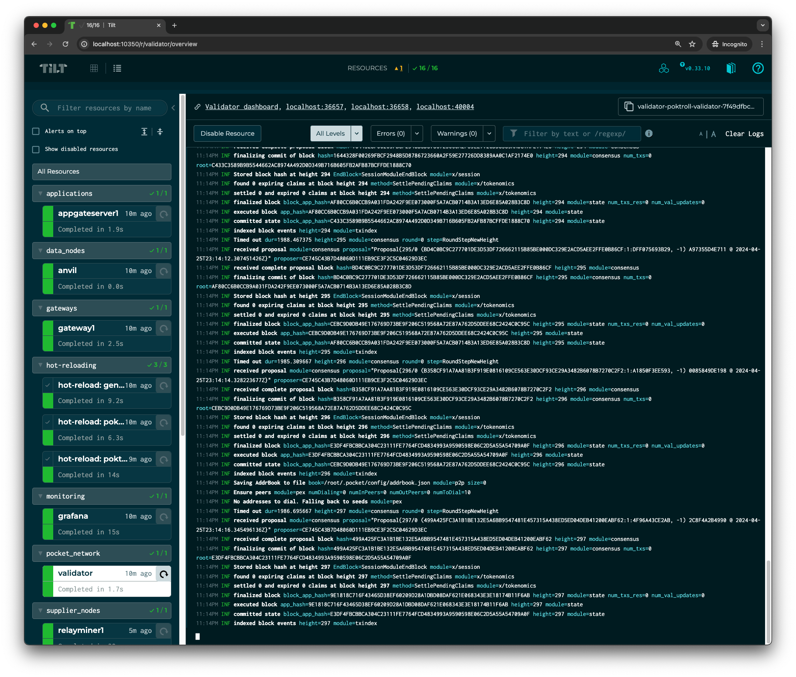
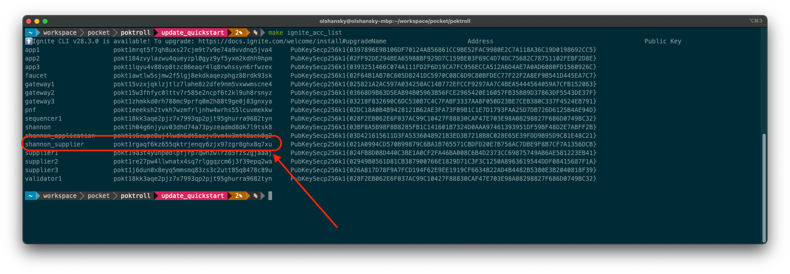
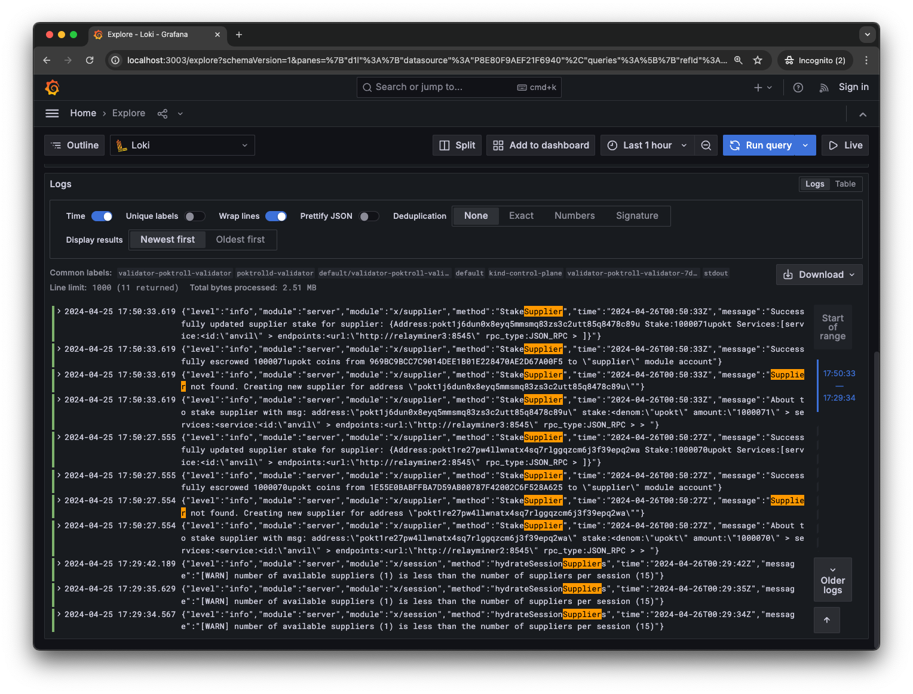

# Quickstart <!-- omit in toc -->

:::tip
The goal of this document is to get you up and running with a LocalNet and
end-to-end relay.

**If you encounter any problems**, the best way to get support
from the team is by creating a new [GitHub Issue here](https://github.com/pokt-network/pocket/issues/new/choose).
:::

- [Install Dependencies](#install-dependencies)
- [1. Launch \& Inspect LocalNet](#1-launch--inspect-localnet)
  - [1.1 Clone the repository](#11-clone-the-repository)
  - [1.2 See all the available helper commands](#12-see-all-the-available-helper-commands)
  - [1.3 Prepare your environment](#13-prepare-your-environment)
  - [1.4 Create a k8s cluster](#14-create-a-k8s-cluster)
  - [1.5 Start up LocalNet](#15-start-up-localnet)
  - [1.6 Grafana Logs](#16-grafana-logs)
  - [1.7 Check the status of the blockchain](#17-check-the-status-of-the-blockchain)
- [2. Fund New Accounts](#2-fund-new-accounts)
  - [2.1 Create a Shannon Supplier Account](#21-create-a-shannon-supplier-account)
  - [2.2 Create a Shannon Application Account](#22-create-a-shannon-application-account)
  - [2.3 Fund your Supplier Account](#23-fund-your-supplier-account)
  - [2.4 Fund your Application Account](#24-fund-your-application-account)
- [3. Manually Stake a Supplier \& Deploy a RelayMiner](#3-manually-stake-a-supplier--deploy-a-relayminer)
  - [3.1 View existing suppliers](#31-view-existing-suppliers)
  - [3.2 Create a Supplier configuration](#32-create-a-supplier-configuration)
  - [3.3 Stake the new Supplier](#33-stake-the-new-supplier)
  - [3.4 Prepare the RelayMiner configuration](#34-prepare-the-relayminer-configuration)
  - [3.5 Start the RelayMiner locally](#35-start-the-relayminer-locally)
- [4. Manually Stake an Application \& Deploy an AppGate Server](#4-manually-stake-an-application--deploy-an-appgate-server)
  - [4.1 View Existing Application](#41-view-existing-application)
  - [4.2 Create an Application configuration](#42-create-an-application-configuration)
  - [4.3 Stake the new Application](#43-stake-the-new-application)
  - [4.4 Prepare the AppGate Server configuration](#44-prepare-the-appgate-server-configuration)
  - [4.5 Start the AppGate Server locally](#45-start-the-appgate-server-locally)
- [5. Send A Relay](#5-send-a-relay)
  - [5.1 Send a relay a shannon](#51-send-a-relay-a-shannon)
  - [5.2 Stake a few more Suppliers](#52-stake-a-few-more-suppliers)
  - [Checking logs](#checking-logs)
- [6. Dynamically Scaling LocalNet](#6-dynamically-scaling-localnet)
- [7. Explore the tools](#7-explore-the-tools)
  - [E2E Tests](#e2e-tests)
  - [poktrolld](#poktrolld)
  - [Makefile](#makefile)
  - [Ignite](#ignite)

## Install Dependencies

:::note
You might already have these installed if you've followed the [LocalNet instructions](../internal_infrastructure/localnet.md).
:::

Install the following dependencies:

1. [Golang](https://go.dev/doc/install) - The programming language we use to implement the protocol
2. [Docker](https://docs.docker.com/get-docker/) - Containerization tool
3. [Ignite](https://docs.ignite.com/welcome/install) - Cosmos SDK CLI for building and deploying blockchains
4. [Kind](https://kind.sigs.k8s.io/#installation-and-usage) - k8s local cluster manager
5. [Helm](https://helm.sh/docs/intro/install/#through-package-managers) - k8s configuration and automation tool
6. [Tilt](https://docs.tilt.dev/install.html) - k8s local development tool & environment manager

## 1. Launch & Inspect LocalNet

This section will help you deploy a Pocket LocalNet in a k8s cluster on your machine,
and inspect it so you have an idea of what's going on!

We'll be manually configuring a few actors to run in your shell for the sake of
the tutorial, but in practice, you should be using [localnet](./../internal_infrastructure/localnet.md)
to dynamically scale your actors.

### 1.1 Clone the repository

```bash
git clone https://github.com/pokt-network/poktroll.git
cd poktroll
```

### 1.2 See all the available helper commands

```bash
make help
```

:::tip Makefile

We leverage the `Makefile` to wrap the complexity of some common commands, but you
can [view it directly](https://github.com/pokt-network/poktroll/blob/main/Makefile)
to see what the underlying command being executed is.
:::

### 1.3 Prepare your environment

Compile protobufs, generate mocks and verify that all tests are passing by running:

```bash
make go_develop_and_test
```

### 1.4 Create a k8s cluster

```bash
kind create cluster
```

### 1.5 Start up LocalNet

```bash
make localnet_up
```

Visit [localhost:10350](<http://localhost:10350/r/(all)/overview>) and wait until all the containers are 🟢

If everything worked as expected, your screen should look similar to the following:



### 1.6 Grafana Logs

Every actor has a local grafana dashboard associated with it.

For example, if you visit the [RelayMiner Tilt UI](http://localhost:10350/r/relayminer1/overview),
you can click in the top right corner to view its [grafana dashboard](http://localhost:3003/d/relayminer/protocol-relayminer?orgId=1&var-relayminer=relayminer1&refresh=5s).


### 1.7 Check the status of the blockchain

You can query the status of the blockchain using `poktrolld` by running:

```bash
poktrolld status --node=tcp://127.0.0.1:36657 | jq
```

Alternatively, you use the CometBFT status directly at:

```bash
curl -s -X POST localhost:36657/status | jq
```

Or at latest block at:

```bash
curl -s -X POST localhost:36657/block | jq
```

For example, you can get the height of the blockchain by visiting the
[Validator Grafana Dashboarrd](http://localhost:3003/d/cosmoscometbft/protocol-cometbft-dashboard?orgId=1&from=now-1h&to=now)
or from the CLI like so:

```bash
curl -s -X POST localhost:36657/block | jq '.result.block.last_commit.height'
```

## 2. Fund New Accounts

This section will help you fund a few accounts that we'll use in the next
sections.

### 2.1 Create a Shannon Supplier Account

List all the accounts we get out of the box by running:

```bash
make ignite_acc_list
```

And create a new account named `shannon_supplier` by running:

```bash
ignite account create shannon_supplier \
  --keyring-dir=./localnet/poktrolld \
  --keyring-backend test
```

If you re-run `make ignite_acc_list`, you should now see `shannon_supplier` in the list.

Make sure to note its address under the `Address` column and export it as an
environment variable for convenience. For example:

```bash
export SHANNON_SUPPLIER=pokt1skun4qy6z0cvac4fc37kcqcjsyr3qe9thhlzkv
```



### 2.2 Create a Shannon Application Account

Let's do the same thing for a `shannon_application`:

```bash
ignite account create shannon_application \
  --keyring-dir=./localnet/poktrolld \
  --keyring-backend test
```

```bash
export SHANNON_APPLICATION=pokt1s6cupe8uj4lwdn6dt5azjv9vm4x3mtt8aek0g2
```

### 2.3 Fund your Supplier Account

Query your supplier's balance by running:

```bash
make acc_balance_query ACC=$SHANNON_SUPPLIER
```

And you should see an empty balance:

```yaml
~ Balances ~
balances: []
pagination: {}

~ Spendable Balances ~
Querying spendable balance for pokt1h04g6njyuv03dhd74a73pyzeadmd8dk7l9tsk8
balances: []
pagination: {}
```

But if you look in our genesis file (`./localnet/poktrolld/config/genesis.json`)
you'll find that you actually have direct access to the `faucet`!

```bash
poktrolld \
  tx bank send \
  faucet $SHANNON_SUPPLIER 420000000000069upokt \
  --node tcp://127.0.0.1:36657 \
  --home=./localnet/poktrolld
```

And you'll find that `shannon_supplier` is now rolling in `POKT`:

```yaml
balances:
  - amount: "420000000000069"
    denom: upokt
pagination:
  next_key: null
  total: "0"
```

### 2.4 Fund your Application Account

Let's do the same thing for the `shannon_application`:

```bash
poktrolld \
  tx bank send \
  faucet $SHANNON_APPLICATION 420000000000069upokt \
  --node tcp://127.0.0.1:36657 \
  --home=./localnet/poktrolld
```

And make sure to check its balance again:

```bash
make acc_balance_query ACC=$SHANNON_APPLICATION
```

## 3. Manually Stake a Supplier & Deploy a RelayMiner

If you want to understand the different on-chain actors and off-chain operators
in POKT Network, look at the docs [here](../../protocol/actors/actors.md). This
guide won't dive into a deep explanation of these concepts but will help you
deploy them in a LocalNet.

### 3.1 View existing suppliers

You can run the following command to see all the suppliers available in the network:

```bash
make supplier_list
```

You should see that we have a default supplier, but `SHANNON_SUPPLIER` won't be there yet.

### 3.2 Create a Supplier configuration

You can learn more about our [supplier configs here](../../operate/configs/supplier_staking_config.md)
but the following will help you get started.

A few things to note in the config below:

1. LocalNet already deployed an [anvil](https://book.getfoundry.sh/anvil/),
   local Ethereum test node, so we're going to reuse that.
2. We'll be deploying a `relayminer` in one of the next steps, which is the
   publicly exposed URL we'll be using.

You can verify the `anvil` node is running with the following curl:

```bash
curl http://localhost:8547 \
  -X POST \
  -H "Content-Type: application/json" \
  --data '{"method":"eth_blockNumber","params":[],"id":1,"jsonrpc":"2.0"}'
```

Assuming it works, you should see a response similar to:

```json
{ "jsonrpc": "2.0", "id": 1, "result": "0x61" }
```

This is equivalent to "running your own node", so we can move on to configuring
a Supplier which will be backed by it.

```bash
cat <<EOF >> shannon_supplier_config.yaml
stake_amount: 1000069upokt
services:
  - service_id: anvil
    endpoints:
      - publicly_exposed_url: http://localhost:6942
        rpc_type: JSON_RPC
EOF
```

### 3.3 Stake the new Supplier

Stake the supplier on-chain:

```bash
poktrolld \
  tx supplier stake-supplier \
  --config shannon_supplier_config.yaml \
  --keyring-backend test \
  --from shannon_supplier \
  --node tcp://127.0.0.1:36657 \
  --home=./localnet/poktrolld \
  --yes
```

And verify that the supplier is now staked with:

```bash
poktrolld query supplier show-supplier $SHANNON_SUPPLIER --node tcp://127.0.0.1:36657
```

### 3.4 Prepare the RelayMiner configuration

You can learn more about our [relay miner configs here](../../operate/configs/relayminer_config.md)
but the following will help you get started.

```bash
cat <<EOF >> shannon_relayminer_config.yaml
signing_key_name: shannon_supplier
smt_store_path: smt_stores
metrics:
  enabled: true
  addr: :9090
pocket_node:
  query_node_rpc_url: tcp://127.0.0.1:36657
  query_node_grpc_url: tcp://127.0.0.1:36658
  tx_node_rpc_url: tcp://127.0.0.1:36657
suppliers:
  - service_id: anvil
    listen_url: http://localhost:6942
    service_config:
      backend_url: http://localhost:8081
      publicly_exposed_endpoints:
        - localhost
pprof:
  enabled: false
  addr: localhost:6060
EOF
```

### 3.5 Start the RelayMiner locally

Start the RelayMiner locally:

```bash
poktrolld relayminer \
  --config ./shannon_relayminer_config.yaml \
  --keyring-backend test \
  --home=./localnet/poktrolld
```

Leave the RelayMiner running in its own shell instance and open a new one. We'll
be using it to serve relays in the next section.

## 4. Manually Stake an Application & Deploy an AppGate Server

### 4.1 View Existing Application

You can run the following command to see all the application available in the network:

```bash
make app_list
```

### 4.2 Create an Application configuration

You can learn more about our [application configs here](../../operate/configs/app_staking_config.md)
but the following will help you get started.

```bash
cat <<EOF >> shannon_app_config.yaml
stake_amount: 1000069upokt
service_ids:
 - anvil
EOF
```

### 4.3 Stake the new Application

Stake the application on-chain:

```bash
poktrolld --home=./localnet/poktrolld \
  tx application stake-application \
  --config shannon_app_config.yaml \
  --keyring-backend test \
  --from shannon_application \
  --node tcp://127.0.0.1:36657 \
  --yes
```

And verify that the application is now staked with:

```bash
poktrolld query application show-application $SHANNON_APPLICATION --node tcp://127.0.0.1:36657
```

You can also you re-run, `make app_list` you should see that `SHANNON_APPLICATION` is now staked as an app:


### 4.4 Prepare the AppGate Server configuration

You can learn more about our [appgate server configs here](../../operate/configs/appgate_server_config.md)
but the following will help you get started.

```yaml
cat <<EOF >> shannon_appgate_config.yaml
query_node_rpc_url: tcp://127.0.0.1:36657
query_node_grpc_url: tcp://127.0.0.1:36658
self_signing: true
signing_key: shannon_application
listening_endpoint: http://localhost:42042
metrics:
  enabled: true
  addr: :9091
EOF
```

### 4.5 Start the AppGate Server locally

And the start the appgate server locally:

```bash
poktrolld appgate-server \
  --config shannon_appgate_config.yaml \
  --keyring-backend test \
  --node tcp://127.0.0.1:36657 \
  --home=./localnet/poktrolld
```

:::warning
You might need to add the following to your `/etc/hosts` file:
127.0.0.1 anvil
127.0.0.1 relayminers
:::

:::note Independent Gateway

This section showed how to deploy a sovereign Application which acts as its
own Gateway, but we are leaving delegated Gateways outside the scope of the
Quickstart guide.

:::

## 5. Send A Relay

### 5.1 Send a relay a shannon

```bash
curl -X POST -H "Content-Type: application/json" \
  --data '{"jsonrpc":"2.0","method":"eth_blockNumber","params":[],"id":1}' \
  http://localhost:42042/anvil
```

:::warning Initialize Public Keys

You must run `make acc_initialize_pubkeys` before sending a relay in order for
the public keys to be initialized correctly.

See the [x/auth](https://docs.cosmos.network/main/build/modules/auth) for more
information on how public keys are stored and accessible on-chain.

:::

If you look in `./localnet/poktrolld/config/appgate_server_config.yaml`, you'll find
the configurations for an appgate server that is listening on port `42069`. 🌿

You can send a relay to the `anvil` service (i.e. locally running
ethereum node) like so:

```bash
curl -X POST -H "Content-Type: application/json" \
  --data '{"jsonrpc":"2.0","method":"eth_blockNumber","params":[],"id":1}' \
  http://localhost:42069/anvil
```

If everything worked as expected, you should see output similar to the following:

```json
{"jsonrpc":"2.0","id":1,"result":"0x61"}%
```

### 5.2 Stake a few more Suppliers

Even though we are running our own RelayMiner backed by our own Supplier, we
can stake a few more suppliers to diversify where the requests are going to go.

```bash
make supplier2_stake
make supplier3_stake
```

Running `make supplier_list` should now show that all three suppliers are staked.

### Checking logs

You can view or inspect logs either through Tilt or Grafana.

Given that we just staked a few suppliers, you customize the query to look for
`Supplier` either on [Grafana](http://localhost:3003/explore?schemaVersion=1&panes=%7B%22d1l%22:%7B%22datasource%22:%22P8E80F9AEF21F6940%22,%22queries%22:%5B%7B%22refId%22:%22A%22,%22expr%22:%22%7Bcontainer%3D%5C%22poktrolld-validator%5C%22%7D%20%7C%3D%20%60Supplier%60%20%7C%20json%22,%22queryType%22:%22range%22,%22datasource%22:%7B%22type%22:%22loki%22,%22uid%22:%22P8E80F9AEF21F6940%22%7D,%22editorMode%22:%22builder%22%7D%5D,%22range%22:%7B%22from%22:%22now-1h%22,%22to%22:%22now%22%7D%7D%7D&orgId=1) or [Tilt](http://localhost:10350/r/validator/overview?term=Supplier).




## 6. Dynamically Scaling LocalNet

We went through a low of steps above just so you can get a feel for how things work.

That said, did you know you can dynamically scale the number of any actors
in LocalNet by ony changing one line?

Go to our [localnet tutorial](./../internal_infrastructure/localnet.md) to learn more.

## 7. Explore the tools

There are three primary tools you'll use to develop and interact with the network:

1. `poktrolld` - the Pocket Node CLI
2. `make` - a collection of helpers to make your life easier
3. `ignite` - a tool to manage the local k8s cluster

:::tip

All of these are extensive and you will likely only need a small subset of their
functionality in your day-to-day development. However, knowing of their existence
will help you when you need to do something that you haven't done before.
:::

### E2E Tests

The `e2e` package contains a collection of end-to-end tests that leverage
[Cucumber & Gherkin](https://cucumber.io/docs/gherkin/). You can execute all of
them with:

```bash
make test_e2e
```

### poktrolld

Run `poktrolld --help` in order to explore all the different. You will likely
spend most of your time with either `poktrolld query --help` or `poktrolld tx --help`.

### Makefile

Run `make` in order to see all the helpers our team has developed to
improve our development experience.

### Ignite

Run `ignite --help` in order to explore all the different commands.
