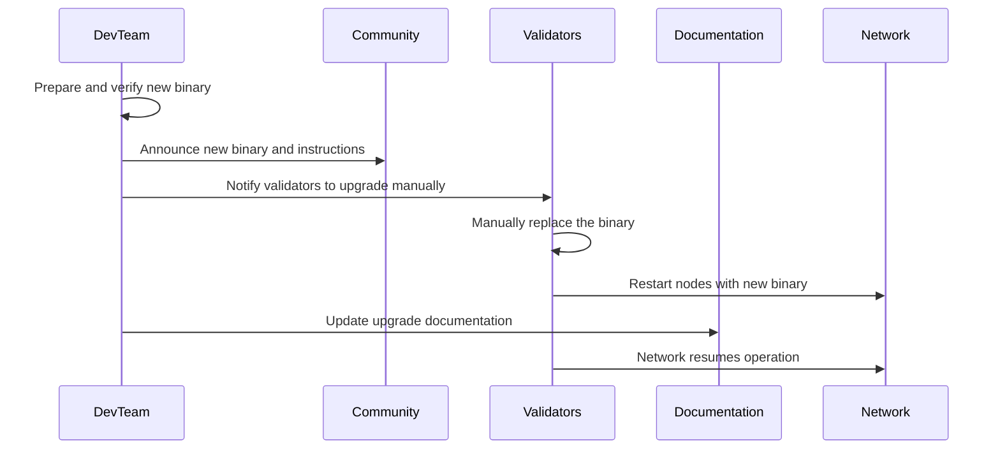
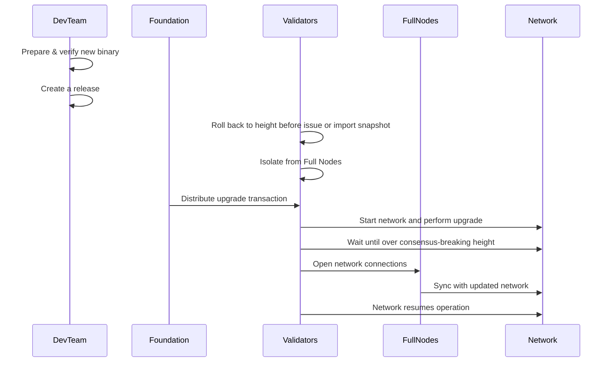

## Chain Halt Recovery <!-- omit in toc -->

This document describes how to recover from a chain halt. It assumes that the cause of
the chain halt has been identified, and that the new release has been created and verified
function correctly.

:::tip
See [Chain Halt Troubleshooting](./chain_halt_troubleshooting.md) for more information on identifying the cause of a chain halt.
:::

- [Background](#background)
- [Resolving halts during a network upgrade](#resolving-halts-during-a-network-upgrade)
  - [Manual binary replacement (preferred)](#manual-binary-replacement-preferred)
  - [Rollback, fork and upgrade](#rollback-fork-and-upgrade)
    - [Step 5: Data rollback - retrieving snapshot at a specific height](#step-5-data-rollback---retrieving-snapshot-at-a-specific-height)
    - [Step 6: Validator Isolation - risks](#step-6-validator-isolation---risks)

## Background

Pocket network is built on top of `cosmos-sdk`, which utilizes the CometBFT consensus engine.
Comet's Byzantine Fault Tolerant (BFT) consensus algorithm requires that **at least** 2/3 of Validators
are online and voting for the same block to reach a consensus. In order to maintain liveness
and avoid a chain-halt, we need the majority (> 2/3) of Validators to participate
and use the same version of the software.

## Resolving halts during a network upgrade

If the halt is caused by the network upgrade, it is possible the solution can be as simple as
skipping an upgrade (i.e. `unsafe-skip-upgrade`) and creating a new (fixed) upgrade.

Read more about [upgrade contingency plans](../../protocol/upgrades/contigency_plans.md).

### Manual binary replacement (preferred)

:::note

This is the preferred way of resolving consensus-breaking issues.

**Significant side effect**: this breaks an ability to sync from genesis **without manual interventions**.
For example, when a consensus-breaking issue occurs on a node that is synching from the first block, node operators need
to manually replace the binary with the new one. There are efforts underway to mitigate this issue, including
configuration for `cosmovisor` that could automate the process.

<!-- TODO_IMPROVE(@okdas): Add links to Cosmovisor documentation on how the new UX can be used to automate syncing from genesis without human input. -->

:::

Since the chain is not moving, **it is impossible** to issue an automatic upgrade with an upgrade plan. Instead,
we need **social consensus** to manually replace the binary and get the chain moving.

1. Prepare and verify a new binary that addresses the consensus-breaking issue.
2. Reach out to the community and validators so they can upgrade the binary manually.
   :::warning UNKNOWN, NEED TO INVESTIGATE
   <!-- TODO_INVESTIGATE(@okdas): check if need to sync rounds/steps -->
   We might need to coordinate the timing of when the nodes should be started. In Tendermint version of Pocket Network
   (Morse), this was necessary to sync consensus rounds and steps, getting the chain moving. It might not be a
   requirement anymore, but we need to double-check. [More information](https://docs.cometbft.com/v1.0/spec/consensus/consensus).
3. Update [the documentation](../../protocol/upgrades/upgrade_list.md) to include a range a height when the binary needs
   to be repleced. Consider a configuration change for `cosmovisor` so it would automatically replace the binary when
   synching from genesis. <!-- TODO_IMPROVE(@okdas): Investigate and add Cosmovisor documentation. -->



### Rollback, fork and upgrade

:::info

These instructions are only relevant to Pocket Network's Shannon release.

We do not currently use `x/gov` and on-chain voting for upgrades.

Instead, our DAO votes on upgrades off-chain and the Foundation executes
transactions on their behalf.

:::

**Performing a rollback is analogous to forking the network at the older height.**

This should be avoided unless absolutely necessary.

However, if necessary, the instructions to follow are:

1. Prepare & verify a new binary that addresses the consensus-breaking issue.
2. [Create a release](../../protocol/upgrades/release_process.md).
3. [Prepare an upgrade transaction](../../protocol/upgrades/upgrade_procedure.md#writing-an-upgrade-transaction) to the new version.
4. Get the Validator set off the network **3 blocks** prior to the height of the chain halt. For example:
   - Assume an issue at height `103`
   - Get the validator set at height `100`
   - Submit an upgrade transaction at `101`
   - Upgrade the chain at height `102`
   - Avoid the issue at height `103`
5. Ensure all validators rolled back to the same height and use the same snapshot - ([how to get the snapshot](#step-5-data-rollback---retrieving-snapshot-at-a-specific-height))
   - The snapshot should be imported into each Validator's data directory.
   - This is necessary to ensure data continuity and prevent forks.
6. Isolate the validator set from full nodes - ([why this is necessary](#step-6-validator-isolation---risks)).
   - This is necessary to avoid full nodes from gossiping blocks that have been rolled back.
   - This may require using a firewall or a private network.
   - Validators should only be permitted to gossip blocks amongst themselves.
7. Start the validator set and perform the upgrade. For example, reiterating the process above:
   - Start all Validators at height `100`.
   - On block `101`, submit the `MsgSoftwareUpgrade` transaction with a `Plan.height` set to `102`.
   - `x/upgrade` will perform the upgrade in the `EndBlocker` of block `102`.
   - If using `cosmosvisor`, the node will wait to replace the binary.
8. Wait for the network to reach the height of the previous ledger (`104`+).
9. Allow validators to open their network to full nodes again.
   - Note that full nodes will need to perform the rollback or use a snapshot as well.



#### Step 5: Data rollback - retrieving snapshot at a specific height

There are two ways to get a snapshot from a prior height:

1. Execute

   ```bash
   poktrolld rollback --hard
   ```

   repeately until the command responds with the desired block number.

2. Use a snapshot and start the node with `--halt-height=100` parameter so it only syncs up to certain height and then
   gracefully shuts down. Add this argument to `poktrolld start` like this:

   ```bash
   poktrolld start --halt-height=100
   ```

#### Step 6: Validator Isolation - risks

Having at least one node that has knowledge of the forking ledger can jeopardize the whole process. In particular, the
following errors in logs are the sign of the nodes syncing blocks from the wrong fork:

- `found conflicting vote from ourselves; did you unsafe_reset a validator?`
- `conflicting votes from validator`
