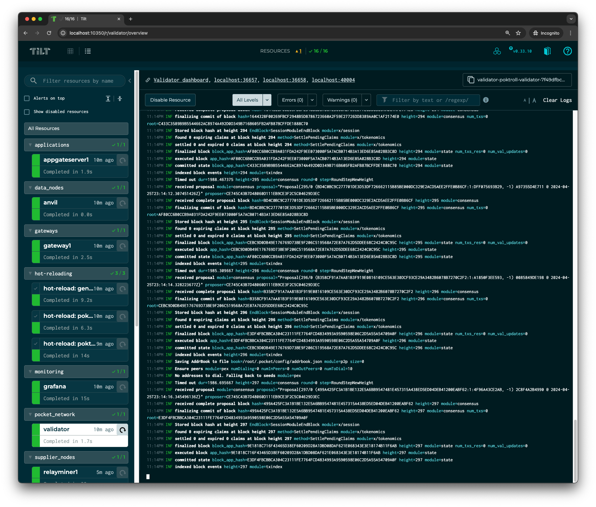
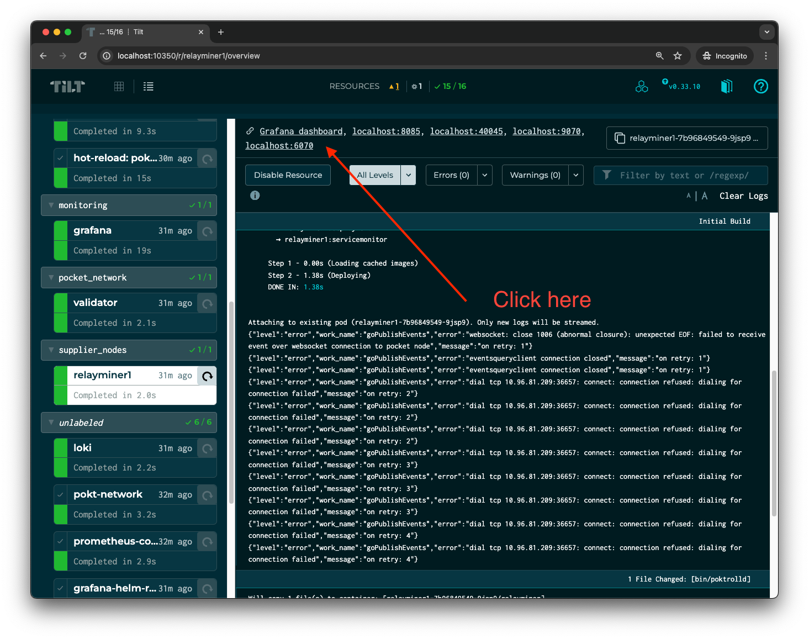
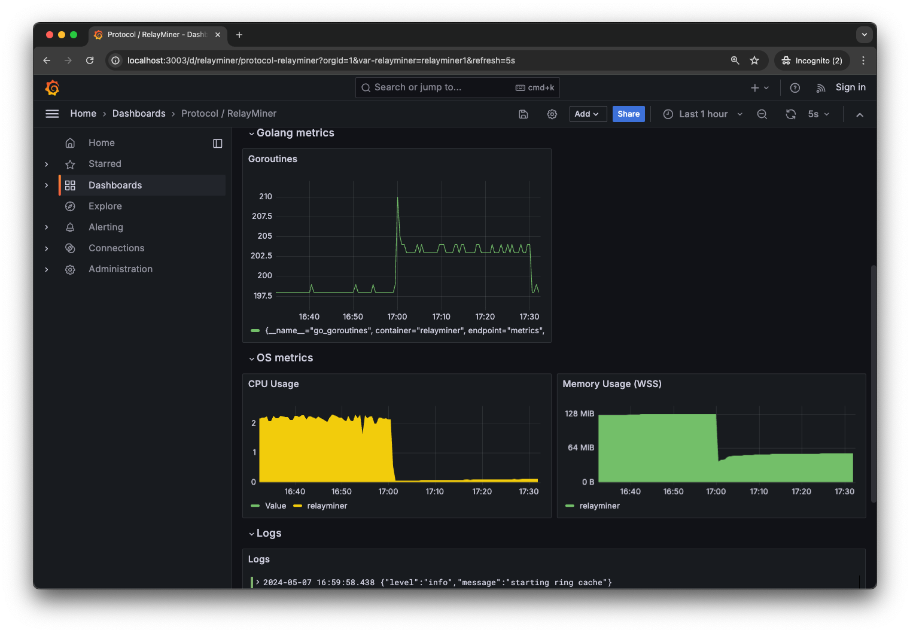
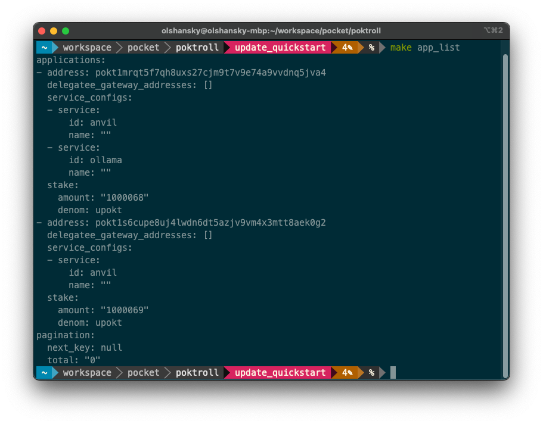
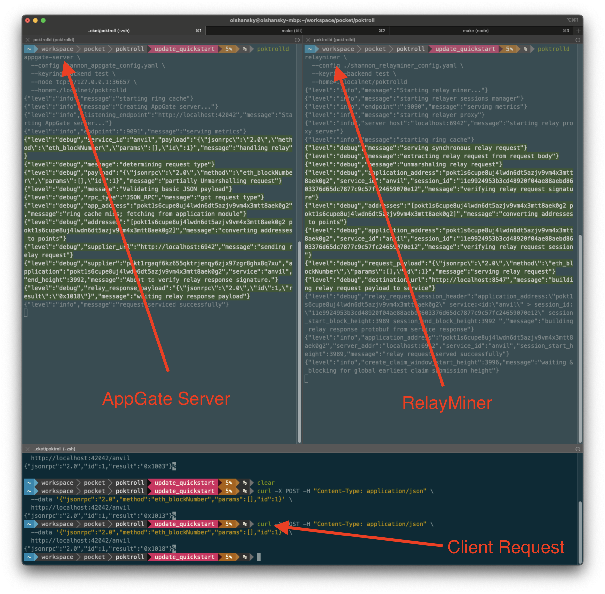
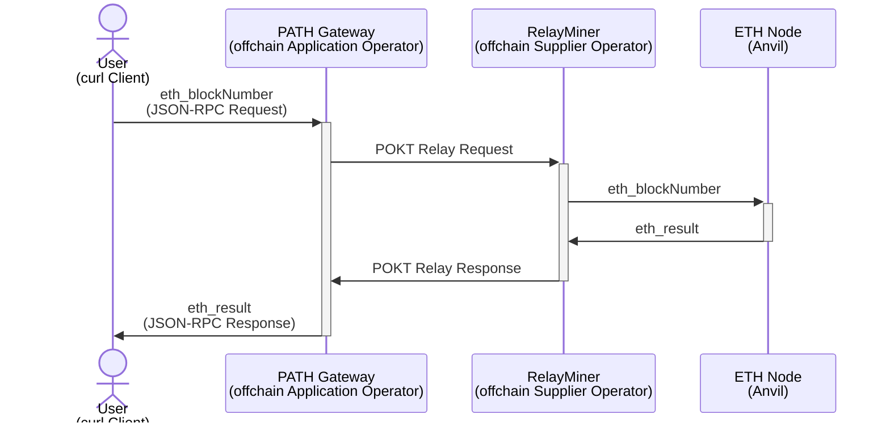
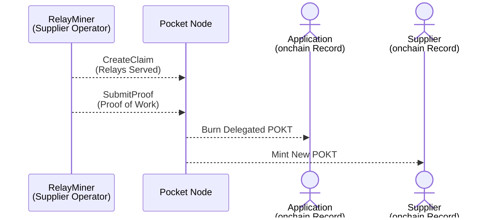
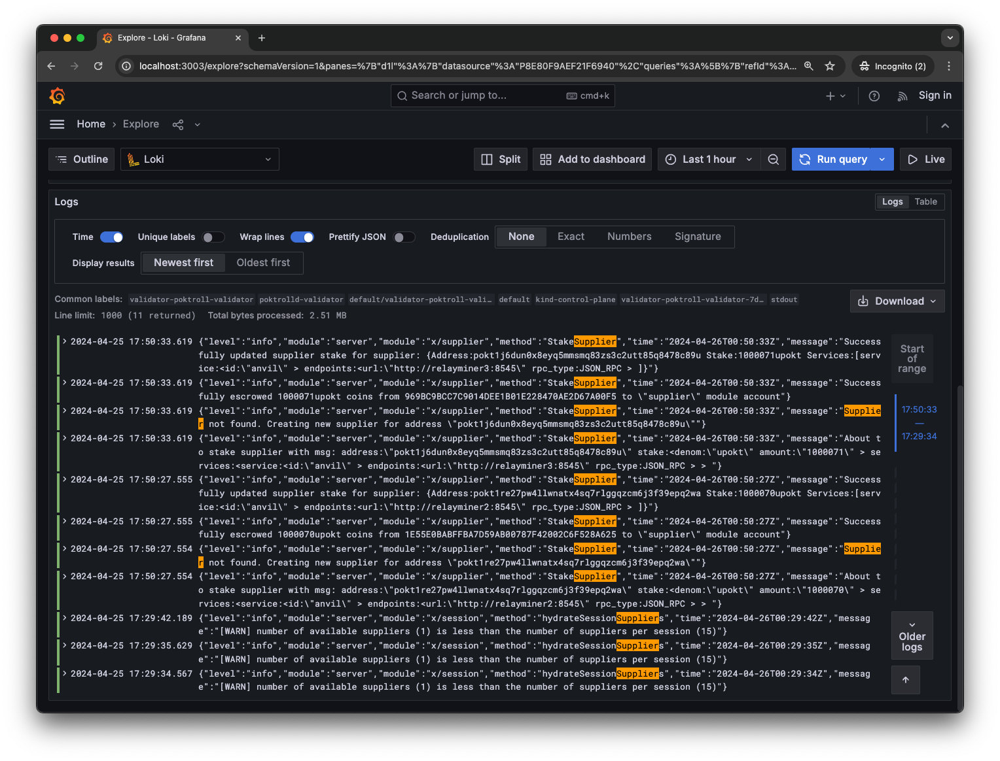
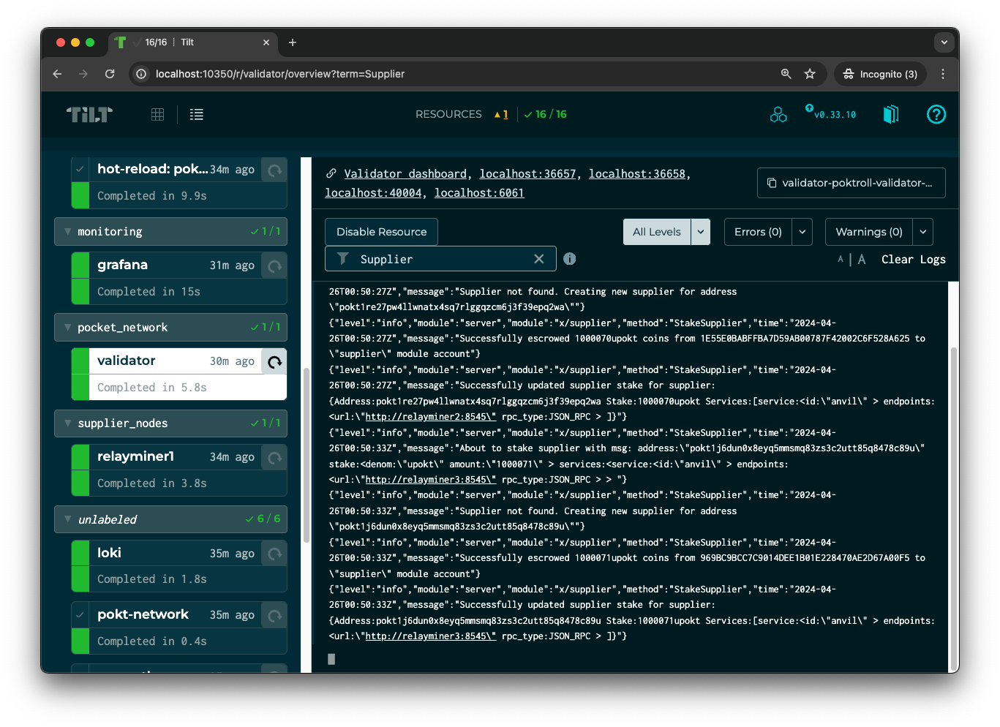

import ReactPlayer from "react-player";

## Walkthrough <!-- omit in toc -->

:::info
The goal of this document is to get you up and running with a LocalNet, some
manually deployed local actors, and sending an end-to-end relay. It will not
go in depth into any concepts.

Create a new [GitHub issue here](https://github.com/pokt-network/poktroll/issues/new/choose)
**if you encounter any problems.**
:::

- [Deployment Walkthrough](#deployment-walkthrough)
- [Video Walkthrough](#video-walkthrough)
- [0. Install Dependencies](#0-install-dependencies)
- [1. Launch \& Inspect LocalNet](#1-launch--inspect-localnet)
  - [1.1 Clone the `pocket` repository](#11-clone-the-pocket-repository)
  - [1.2 See all the available helper commands in `Makefile`](#12-see-all-the-available-helper-commands-in-makefile)
  - [1.3 Prepare your development environment](#13-prepare-your-development-environment)
  - [1.4 Create a `k8s` cluster](#14-create-a-k8s-cluster)
  - [1.5 Start up LocalNet](#15-start-up-localnet)
  - [1.6 View Grafana Logs](#16-view-grafana-logs)
  - [1.7 Check the status of the blockchain](#17-check-the-status-of-the-blockchain)
- [2. Fund New Accounts](#2-fund-new-accounts)
  - [2.1 Create a Shannon `Supplier` Account](#21-create-a-shannon-supplier-account)
  - [2.2 Create a Shannon `Application` Account](#22-create-a-shannon-application-account)
  - [2.3 Fund your `Supplier` Account](#23-fund-your-supplier-account)
  - [2.4 Fund your Application Account](#24-fund-your-application-account)
- [3. Manually Stake a Supplier \& Deploy a RelayMiner](#3-manually-stake-a-supplier--deploy-a-relayminer)
  - [3.1 View existing suppliers](#31-view-existing-suppliers)
  - [3.2 Preparing your backend data node](#32-preparing-your-backend-data-node)
  - [3.3 Create a Supplier configuration](#33-create-a-supplier-configuration)
  - [3.4 Stake the new Supplier](#34-stake-the-new-supplier)
  - [3.4 Prepare the RelayMiner configuration](#34-prepare-the-relayminer-configuration)
  - [3.5 Start the RelayMiner locally](#35-start-the-relayminer-locally)
- [4. Manually Stake an Application \& Deploy a PATH Gateway](#4-manually-stake-an-application--deploy-a-path-gateway)
  - [4.1 View Existing Application](#41-view-existing-application)
  - [4.2 Create an Application configuration](#42-create-an-application-configuration)
  - [4.3 Stake the new Application](#43-stake-the-new-application)
  - [4.4 Prepare the PATH Gateway Configuration](#44-prepare-the-path-gateway-configuration)
- [5. Send A Relay](#5-send-a-relay)
  - [5.1 Send a relay on Shannon](#51-send-a-relay-on-shannon)
  - [5.2 What just happened?](#52-what-just-happened)
  - [5.3 What will happen later](#53-what-will-happen-later)
  - [5.4 Staking a few more Suppliers without RelayMiners](#54-staking-a-few-more-suppliers-without-relayminers)
  - [5.5. Inspect the logs](#55-inspect-the-logs)
- [6. Dynamically Scaling LocalNet](#6-dynamically-scaling-localnet)
- [7. Explore the tools](#7-explore-the-tools)
  - [E2E Tests](#e2e-tests)
  - [pocketd](#pocketd)
  - [Makefile](#makefile)
  - [Ignite](#ignite)

## Deployment Walkthrough

:::info

This quickstart guide is intended for setting up your local environment for
development purposes.

:::

If you want to deploy your own Gateway and Supplier, please follow the instructions
in our [pocket-docker-compose-example](https://github.com/pokt-network/pocket-docker-compose-example)
example.

If you want to deploy a Supplier & Gateway via a copy-pasta method without understanding
anything, see the instructions [here](https://github.com/pokt-network/pocket-docker-compose-example/blob/main/debian_cheasheet.md).

## Video Walkthrough

You can access the video [here](https://www.youtube.com/watch?v=H-R5FqrCYQs).

<ReactPlayer
  playing={false}
  controls
  url="https://www.youtube.com/watch?v=H-R5FqrCYQs"
/>

## 0. Install Dependencies

Install the following dependencies:

1. [Golang](https://go.dev/doc/install) - The programming language we use to implement the protocol
2. [Docker](https://docs.docker.com/get-docker/) - Containerization tool
3. [Ignite](https://docs.ignite.com/welcome/install) - Cosmos SDK CLI for building and deploying blockchains
4. [Kind](https://kind.sigs.k8s.io/#installation-and-usage) - k8s local cluster manager
5. [Helm](https://helm.sh/docs/intro/install/#through-package-managers) - k8s configuration and automation tool
6. [Tilt](https://docs.tilt.dev/install.html) - k8s local development tool & environment manager

:::note
If you've followed the [LocalNet instructions](../networks/localnet.md),
you may already have them installed.
:::

## 1. Launch & Inspect LocalNet

This section will help you deploy a POKT LocalNet in a k8s cluster on your machine
and inspect it so you have an idea of what's going on!

We'll be manually configuring a few actors to run in your shell for the sake of
the tutorial so you have visibility into the types of onchain and offchain
actors. In practice, you should be using [localnet](../networks/localnet.md)
to dynamically scale your actors.

To learn more about the different actors type, see the docs [here](../../protocol/actors/actors.md).

It should look something like this once you're past the first section:



### 1.1 Clone the `pocket` repository

```bash
git clone https://github.com/pokt-network/pocket.git
cd pocket
```

### 1.2 See all the available helper commands in `Makefile`

We leverage the `Makefile` to abstract the complexity of some common commands,
but you can [view it directly](https://github.com/pokt-network/poktroll/blob/main/Makefile)
to see what the underlying command being executed is.

:::tip `make help`

If you run `make help` from the root of the repo, you'll see a list of all the
available commands. Looking inside the Makefile is a great way to learn how to use them!

:::

### 1.3 Prepare your development environment

Run the following command to install `golang` dependencies:

```bash
make install_ci_deps
```

Compile protobufs, generate mocks and verify that all tests are passing by running:

```bash
make go_develop_and_test
```

There are some flaky tests, so you can re-run with the following command without
needing to regenerate the mocks and types:

```bash
make test_all
```

### 1.4 Create a `k8s` cluster

Create a new `k8s` cluster for your LocalNet:

```bash
kind create cluster
```

If you use `k8s` for other things, you may need to switch your context as well:

```bash
kubectl config use-context kind-kind
```

### 1.5 Start up LocalNet

Bring up your LocalNet and wait a few minutes:

```bash
make localnet_up
```

Visit [localhost:10350](<http://localhost:10350/r/(all)/overview>) and wait until all the containers are 🟢

If everything worked as expected, your screen should look similar to the following:

### 1.6 View Grafana Logs

Every actor has a local grafana dashboard associated with it.

For example, if you visit the [RelayMiner Tilt UI](http://localhost:10350/r/relayminer1/overview),
you can click in the top left corner to view its [grafana dashboard](http://localhost:3003/d/relayminer/protocol-relayminer?orgId=1&var-relayminer=relayminer1&refresh=5s).





### 1.7 Check the status of the blockchain

You can query the status of the blockchain using `pocketd` by running:

```bash
pocketd status --node=tcp://127.0.0.1:26657 | jq
```

Alternatively, you use the [CometBFT](https://github.com/cometbft/cometbft) status directly at:

```bash
curl -s -X POST localhost:26657/status | jq
```

Or at latest block at:

```bash
curl -s -X POST localhost:26657/block | jq
```

For example, you can get the height of the blockchain by visiting the
[Validator Grafana Dashboard](http://localhost:3003/d/cosmoscometbft/protocol-cometbft-dashboard?orgId=1&from=now-1h&to=now)
or from the CLI like so:

```bash
curl -s -X POST localhost:26657/block | jq '.result.block.last_commit.height'
```

## 2. Fund New Accounts

This section will help you fund a few accounts that we'll use below. We're going
to create a `shannon_supplier` and `shannon_application`, but a dedicated gateway
is outside the scope of this guide.

### 2.1 Create a Shannon `Supplier` Account

List all the accounts we get out of the box by running:

```bash
make ignite_acc_list
```

And create a new account named `shannon_supplier` by running:

```bash
ignite account create shannon_supplier \
  --keyring-dir=./localnet/pocketd \
  --keyring-backend test
```

If you re-run `make ignite_acc_list`, you should now see `shannon_supplier` in the list.

Make sure to note its address under the `Address` column and export it as an
environment variable for convenience. For example:

```bash
export SHANNON_SUPPLIER=pokt1rgaqf6kz655qktrjenqy6zjx97zgr8ghx8q7xu
```


### 2.2 Create a Shannon `Application` Account

Let's do the same thing for a `shannon_application`:

```bash
ignite account create shannon_application \
  --keyring-dir=./localnet/pocketd \
  --keyring-backend test
```

```bash
export SHANNON_APPLICATION=pokt1s6cupe8uj4lwdn6dt5azjv9vm4x3mtt8aek0g2
```

### 2.3 Fund your `Supplier` Account

Query your supplier's balance by running:

```bash
make acc_balance_query ACC=$SHANNON_SUPPLIER
```

And you should see an empty balance:

```bash
~ Balances ~
balances: []
pagination: {}

~ Spendable Balances ~
Querying spendable balance for pokt1h04g6njyuv03dhd74a73pyzeadmd8dk7l9tsk8
balances: []
pagination: {}
```

But if you look in our genesis file (`./localnet/pocketd/config/genesis.json`)
you'll find that you actually have direct access to the `faucet`!

You can send some uPOKT to your `shannon_supplier` by running:

```bash
pocketd \
  tx bank send \
  faucet $SHANNON_SUPPLIER 420000000000069upokt \
  --node tcp://127.0.0.1:26657 \
  --home=./localnet/pocketd
```

And you'll find that `shannon_supplier` is now rolling in `POKT`:

```yaml
balances:
  - amount: "420000000000069"
    denom: upokt
pagination:
  next_key: null
  total: "0"
```

### 2.4 Fund your Application Account

Let's do the same thing for the `shannon_application`:

```bash
pocketd \
  tx bank send \
  faucet $SHANNON_APPLICATION 420000000000069upokt \
  --node tcp://127.0.0.1:26657 \
  --home=./localnet/pocketd
```

And make sure to check its balance again:

```bash
make acc_balance_query ACC=$SHANNON_APPLICATION
```

## 3. Manually Stake a Supplier & Deploy a RelayMiner

As we mentioned earlier, if you want to understand the different onchain actors
and offchain operators in POKT Network, look at the docs [here](../../protocol/actors/actors.md).

If you just want to follow instructions to make things work and get your hands
dirty, keep reading.

### 3.1 View existing suppliers

You can run the following command to see all the suppliers available in the network:

```bash
make supplier_list
```

You'll find that we have a default supplier, but `SHANNON_SUPPLIER` won't be there yet.

### 3.2 Preparing your backend data node

We need a blockchain node (i.e. a backend data node) backend data node to
configure a supplier. Since LocalNet is already has a running [`anvil`](http://localhost:10350/r/anvil/overview) service, we can re-use that as our backend.

[anvil](https://book.getfoundry.sh/anvil/) is a local Ethereum development node
that's equivalent to "running your own ETH node". It's a great way to test.

You can verify the `anvil` node is running with the following curl:

```bash
curl http://localhost:8547 \
  -X POST \
  -H "Content-Type: application/json" \
  --data '{"method":"eth_blockNumber","params":[],"id":1,"jsonrpc":"2.0"}'
```

```json
{ "jsonrpc": "2.0", "id": 1, "result": "0x61" }
```

:::tip Grove's Prod Endpoints

If you'd prefer to use a real blockchain node with production data for testing,
you can provision one at [grove.city](https://www.grove.city) and use it below.

:::

### 3.3 Create a Supplier configuration

You can learn more about our [supplier configs here](../../operate/configs/supplier_staking_config.md).

The following is an example config to get you started:

```bash
cat <<EOF >> shannon_supplier_config.yaml
owner_address: pokt1h04g6njyuv03dhd74a73pyzeadmd8dk7l9tsk8
operator_address: pokt1h04g6njyuv03dhd74a73pyzeadmd8dk7l9tsk8
stake_amount: 1000069upokt
services:
  - service_id: anvil
    endpoints:
      - publicly_exposed_url: http://localhost:6942
        rpc_type: JSON_RPC
EOF
```

### 3.4 Stake the new Supplier

Stake the `shannon_supplier` onchain:

```bash
pocketd \
  tx supplier stake-supplier \
  --config shannon_supplier_config.yaml \
  --keyring-backend test \
  --from shannon_supplier \
  --node tcp://127.0.0.1:26657 \
  --home=./localnet/pocketd \
  --yes
```

And verify that the supplier is now staked with:

```bash
pocketd query supplier show-supplier $SHANNON_SUPPLIER --node tcp://127.0.0.1:26657
```

### 3.4 Prepare the RelayMiner configuration

Next, we need to prepare a RelayMiner to operate on behalf of the Supplier.

You can learn more about our [relay miner configs here](../../operate/configs/relayminer_config.md).

The following is an example config to get you started:

```bash
cat <<EOF >> shannon_relayminer_config.yaml
default_signing_key_names: [ "shannon_supplier" ]
smt_store_path: $HOME/.pocket/smt
metrics:
  enabled: true
  addr: :9999 # you may need to change the metrics server port due to port conflicts.
pocket_node:
  query_node_rpc_url: tcp://127.0.0.1:26657
  query_node_grpc_url: tcp://127.0.0.1:9090
  tx_node_rpc_url: tcp://127.0.0.1:26657
suppliers:
  - service_id: anvil
    listen_url: http://localhost:6942
    service_config:
      backend_url: http://localhost:8547
      publicly_exposed_endpoints:
        - localhost
pprof:
  enabled: false
  addr: localhost:6060
EOF
```

### 3.5 Start the RelayMiner locally

Start the RelayMiner locally:

```bash
pocketd relayminer \
  --config ./shannon_relayminer_config.yaml \
  --keyring-backend test \
  --home=./localnet/pocketd
```

Leave it running in its own shell instance and open a new one. We'll be using it
to serve relays in the next section.

:::tip

You may need to re-export `SHANNON_APPLICATION` and `SHANNON_SUPPLIER` in the
new shell instance.

:::

## 4. Manually Stake an Application & Deploy a PATH Gateway

:::note Centralized Gateway

This section will show how to deploy a `PATH Gateway` in `Centralized` mode,
which will use its configured (i.e. owned) `Application`s to sign relays.

_Other types of Gateways (e.g. Delegated) are outside the scope of this Quickstart guide._

:::

### 4.1 View Existing Application

You can run the following command to see all the application available in the network:

```bash
make app_list
```

### 4.2 Create an Application configuration

You can learn more about our [application configs here](../../operate/configs/app_staking_config.md).

The following example should get you started:

```bash
cat <<EOF >> shannon_app_config.yaml
stake_amount: 1000069upokt
service_ids:
 - anvil
EOF
```

### 4.3 Stake the new Application

Stake the application onchain:

```bash
pocketd --home=./localnet/pocketd \
  tx application stake-application \
  --config shannon_app_config.yaml \
  --keyring-backend test \
  --from shannon_application \
  --node tcp://127.0.0.1:26657 \
  --yes
```

And verify that the application is now staked with:

```bash
pocketd query application show-application $SHANNON_APPLICATION --node tcp://127.0.0.1:26657
```

You can also you re-run, `make app_list` you should see that `SHANNON_APPLICATION` is now staked as an app:



### 4.4 Prepare the PATH Gateway Configuration

You can learn more about our [PATH Gateway configs here](https://path.grove.city/operate).

## 5. Send A Relay

Now that we've staked an `Application`, are running a `PATH Gateway`, staked
a `Supplier`, and are running a `RelayMiner`, we can send a relay!

:::note Initialize Public Keys

You must run `make acc_initialize_pubkeys` before sending a relay in order for
the public keys to be initialized correctly.

See the [x/auth](https://docs.cosmos.network/main/build/modules/auth) for more
information on how public keys are stored and accessible onchain.

:::

### 5.1 Send a relay on Shannon

You can use `curl`

```bash
curl -X POST -H "Content-Type: application/json" \
  --data '{"jsonrpc":"2.0","method":"eth_blockNumber","params":[],"id":1}' \
  http://anvil.localhost:3000/v1
```

If everything worked as expected, you should see output similar to the following:

```json
{"jsonrpc":"2.0","id":1,"result":"0x61"}%
```



### 5.2 What just happened?

The Relay Request/Response from is captured in the sequence diagram below.



### 5.3 What will happen later

Please see our protocol docs [here](../../protocol/primitives/claim_and_proof_lifecycle)
for information on how the protocol actually works, but the following will
provide some intuition:



### 5.4 Staking a few more Suppliers without RelayMiners

Even though we are running our own RelayMiner backed by our own Supplier, we
can stake a few more suppliers to diversify where the requests are going to go.

Try using the following helpers:

```bash
make supplier2_stake
make supplier3_stake
```

Running `make supplier_list` should now show that all three suppliers are staked.

You can reuse the running `PATH Gateway` to send requests. Its Quality-of-Service module
will try to handle non-performant suppliers, but you should expect some requests to periodically
fail.

Give it a shot by running the following multiple times:

```bash
curl -X POST -H "Content-Type: application/json" \
  --data '{"jsonrpc":"2.0","method":"eth_blockNumber","params":[],"id":1}' \
  http://anvil.localhost:3000/v1
```

### 5.5. Inspect the logs

As you're ready to dive in, develop or debug, you can view or inspect logs either
through Tilt or Grafana.

Given that we just staked a few suppliers, you customize the query to look for
`Supplier` either on [Grafana](http://localhost:3003/explore?schemaVersion=1&panes=%7B%22d1l%22:%7B%22datasource%22:%22P8E80F9AEF21F6940%22,%22queries%22:%5B%7B%22refId%22:%22A%22,%22expr%22:%22%7Bcontainer%3D%5C%22pocketd-validator%5C%22%7D%20%7C%3D%20%60Supplier%60%20%7C%20json%22,%22queryType%22:%22range%22,%22datasource%22:%7B%22type%22:%22loki%22,%22uid%22:%22P8E80F9AEF21F6940%22%7D,%22editorMode%22:%22builder%22%7D%5D,%22range%22:%7B%22from%22:%22now-1h%22,%22to%22:%22now%22%7D%7D%7D&orgId=1) or [Tilt](http://localhost:10350/r/validator/overview?term=Supplier).





## 6. Dynamically Scaling LocalNet

We went through a flow of steps above just so you can get a feel for how things work.

That said, you can dynamically scale the number of any actors in LocalNet by ony changing one line!

Go to our [localnet tutorial](../networks/localnet.md) to learn more.

## 7. Explore the tools

There are three primary tools you'll use to develop and interact with the network:

1. `pocketd` - the POKT Node CLI
2. `make` - a collection of helpers to make your life easier
3. `ignite` - a tool to manage the local k8s cluster

:::tip

All of these are extensive and you will likely only need a small subset of their
functionality in your day-to-day development. However, knowing of their existence
will help you when you need to do something that you haven't done before.
:::

### E2E Tests

The `e2e` package contains a collection of end-to-end tests that leverage
[Cucumber & Gherkin](https://cucumber.io/docs/gherkin/). You can execute all of
them with:

```bash
make test_e2e
```

### pocketd

Run `pocketd --help` in order to explore all the different. You will likely
spend most of your time with either `pocketd query --help` or `pocketd tx --help`.

### Makefile

Run `make` in order to see all the helpers our team has developed to
improve our development experience.

### Ignite

Run `ignite --help` in order to explore all the different commands.
