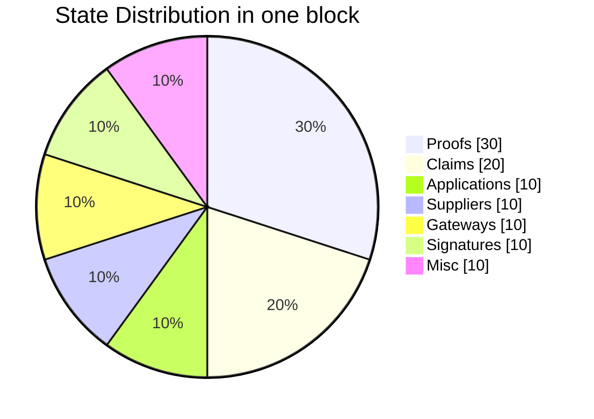
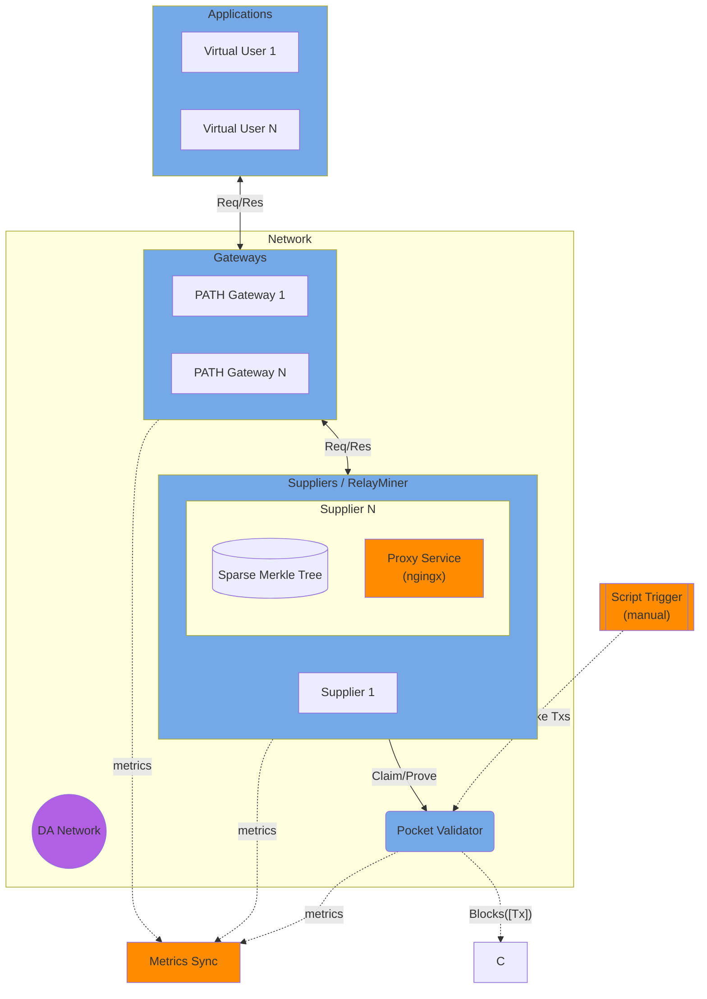

# Load Test #1 - Plan <!-- omit in toc -->

_This document outlines the first load test for the Shannon upgrade. IT **IS NOT** intended to be an exhaustive evaluation of the entire system's performance. **IT IS** intended to give visibility into the business logic of the platform, and create a baseline for future load tests._

- _All Poktroll `loadtest` issues on GitHub can be found [here](https://github.com/pokt-network/poktroll/issues?q=label%3Aloadtest+sort%3Aupdated-desc)._

## Table of Contents <!-- omit in toc -->

- [Goals](#goals)
- [Non-Goals](#non-goals)
- [Origin Document](#origin-document)
- [Load Profiles](#load-profiles)
  - [Variable Parameters](#variable-parameters)
  - [Constant Parameter](#constant-parameter)
  - [Out-of-scope Parameters](#out-of-scope-parameters)
- [Measurements](#measurements)
  - [What to measure?](#what-to-measure)
    - [1. Chain State Size](#1-chain-state-size)
    - [2. Validators](#2-validators)
    - [3. PATH Gateway (Application, Gateway, etc…)](#3-path-gateway-application-gateway-etc)
    - [4. RelayMiner (Supplier, SMT, etc..)](#4-relayminer-supplier-smt-etc)
  - [Out-of-scope](#out-of-scope)
- [Architecture / Component Diagram](#architecture--component-diagram)
- [Tool Requirements](#tool-requirements)
  - [Deployment Environment](#deployment-environment)
  - [Request Source / Generator](#request-source--generator)
  - [Script - Instructions](#script---instructions)
  - [Script - Tools](#script---tools)

## Goals

1. `De-risk` the network’s feasibility to have completely permissionless services & actors
   1. This is intended for `scalability` purposes and **does not** account for `Sybil` attacks
2. `Stress test` the SMT (Sparse Merkle Trie) and how it is being used
3. `Build intuition` into the cost of operating the network for all of the stakeholders involved, both on & off chain
4. `Gain visibility` into basic metrics (disk, RAM, CPU, ingress/egress traffic, etc.…) for our network actors
5. `Uncover` potential bugs, bottlenecks or concurrency issues in the onchain & offchain code
6. `Document and design` a process that’ll act as the foundation for future load-testing efforts

## Non-Goals

1. `Exhaustive benchmarking` of all traditional performance metrics across our tools & packages (`key-value stores`, `http libs`, etc…)
2. `Sybil attacks` tokenomic considerations
3. Perform any of the following tests: `smoke tests`, `spike tests`, `fuzzy testing`, `chaos testing`, `soak testing` etc…
4. `Evaluating` the performance or results of `proxy services` / `data nodes`
5. `Selecting new tools` or libraries as a direct outcome of these results.
6. `Mimicking the scale` of Morse (v0) today
7. Accounting for `Failure cases`, since the primary focus is just evaluating happy path scale
8. Anything to do with `Quality of Service` as it is concerned from today’s Gateway POV

## Origin Document

This [forum post](https://forum.pokt.network/t/block-sizes-claims-and-proofs-in-the-multi-gateway-era/5060/9) from Morse
is a good starting point to gain an understanding of why load testing is important and critical in Shannon.

https://forum.pokt.network/t/block-sizes-claims-and-proofs-in-the-multi-gateway-era/5060/9

## Load Profiles

### Variable Parameters

| Metric                  | Starting Value | Terminal Value | Increment (fuzz + approximate)                |
| ----------------------- | -------------- | -------------- | --------------------------------------------- |
| RelaysPerSecond         | 1 rps          | 10,000 rps     | +100 rps every 10 blocks                      |
| GatewayCount            | 1              | 10             | +1 gateway every 100 blocks                   |
| ApplicationCount        | 5              | 1,000          | +10 apps every 10 blocks                      |
| SupplierCount           | 5              | 1,00           | +1 every 100 blocks                           |
| ProxyService / DataNode | 0 / ∞          | 0 / ∞          | Mocked to avoid being a performance bottlneck |

### Constant Parameter

- `BlockTime` - A constant block time between 10s and 60s will be selected for the benchmarks in this test
- `RequestType` - We will use a “dummy” backing data node / proxy service that leverages `nginx` to return a `200` or 500 randomly
- `RequestDistribution` - The `RelaysPerSecond` will be evenely distributed
- `VirtualUsers` - For simplicity, we will assume a `1:1` mapping of virtual users (i.e. curl clients) to `Applications`

### Out-of-scope Parameters

- `Governance Parameters` have not been implemented yet and are therefore out-of-scope

## Measurements

### What to measure?

#### 1. Chain State Size

`What`:

- A `pie chart` or `stacked bar chart` of how the data in the Blocks is distributed
- A `line chart` showing state growth over size

`Why`

- Get an estimate of the cost of data publishing (i.e. TIA tokens)
- Get an estimate of data distribution (where to focus short-term optimizaiton efforts)

`Example:`

#### 2. Validators

`What`: Multiple `line charts` to capture `Disk` (size & iops), `RAM`, `CPU` , `Network` usage (ingress/egress)

`Why`:

- `Proof Validation` - `RAM` & `CPU` could be a potential bottleneck
- `Block generation` - `RAM` & `CPU` could be a bottleneck in preparing new blocks
- `Block Publishing` - `Tx` aggregation (ingress) and `Block` publishing (egress) could be more expensive than expected w.r.t network usage
- `Data Availability State` - `Disk` could be a limiting factor depending on how quickly state grows

|                         | RAM | CPU | Network | Disk | Time |
| ----------------------- | --- | --- | ------- | ---- | ---- |
| Proof Validation        | ❓   | ❓   |         |      | ❓    |
| Block Generation        | ❓   |     |         |      |      |
| Block Publishing        |     |     | ❓       |      |      |
| Data Availability State |     |     |         | ❓    |      |

#### 3. PATH Gateway (Application, Gateway, etc…)

`What`: Multiple `line charts` to capture `Disk` (size & iops), `RAM`, `CPU` , `Network` usage (ingress/egress)

`Why`:

- `Relay Proxies` Ingress/egress of relays could add up to large networking costs
- `Caches & State` - All the caching & state can have impact across the board
- `Request Processing` - Signature generation, request marshaling / unmarshaling, etc…
- `Response handling` - Slow supplier responses could increase pending relays at the `PATH Gateway` level (i.e. RAM)

|                    | RAM | CPU | Network | Disk | Time |
| ------------------ | --- | --- | ------- | ---- | ---- |
| Relay Proxies      |     |     | ❓       |      | ❓    |
| Caches & State     | ❓   | ❓   |         |      |      |
| Request Processing |     |     |         |      | ❓    |
| ???                |     |     |         | ❓    |      |

#### 4. RelayMiner (Supplier, SMT, etc..)

`What`: Multiple `line charts` to capture `Disk` (size & iops), `RAM`, `CPU` , `Network` usage (ingress/egress)

`Why`:

- `SMT` - The `SMT` is one of the most important parts of the end-to-end flow which has impact on `RAM`, `CPU` & `disk`
- `Caches & State` - All the caching & state can have impact across the board
- `Request Processing` - Signature generation, request marshaling / unmarshaling, etc…
- `Request generation` - Generating the actual response to the request via the dummy service

|                     | RAM | CPU | Network | Disk | Time |
| ------------------- | --- | --- | ------- | ---- | ---- |
| SMT                 | ❓   | ❓   |         | ❓    | ❓    |
| Caches & State      | ❓   |     |         |      |      |
| Request Processing  |     |     |         |      | ❓    |
| Response Generation |     | ❓   | ❓       |      | ❓    |

### Out-of-scope

The exact details of the implementation are out-of-scope and will be developed adhoc along the way. The following is a non-exhaustive list of items we will figure out along the way:

1. Data Collection
2. ConcreteAnalysis Methodology
3. Templates for format reporting

## Architecture / Component Diagram

Legend:

- 🔵 Pocket Specific Actors
- 🟣 Pocket Network dependencies
- 🟠 New tooling that needs to be build
- `--` Asynchronous request
- `-` Synchronous request

This GitHub does not render colored mermaid diagrams, you can also access the image
[here](https://github.com/pokt-network/poktroll/assets/1892194/bf965457-bdd0-4a35-a75c-cfcddfbaab5e).

_TODO_IMPROVE: Improve the colors for readability purposes per the comment [here](https://github.com/pokt-network/poktroll/pull/286#pullrequestreview-1806384312)._

## Tool Requirements

### Deployment Environment

- Ability to deploy the environment (and tooling) on LocalNet & DevNet

### Request Source / Generator

- A script/tool to generate $N$ requests per second

### Script - Instructions

- Ramp-up & ramp-down strategy
- Instructions on when & how to execute commands (manually) to ramp-up & down

### Script - Tools

- Commands to periodically `trigger manual stake/unstake txs`
- Commands to periodically `scale up suppliers & gateways`
- Commands to periodically `add a new virtual user`
- Command to periodically `increase the number of requests per seconds`
