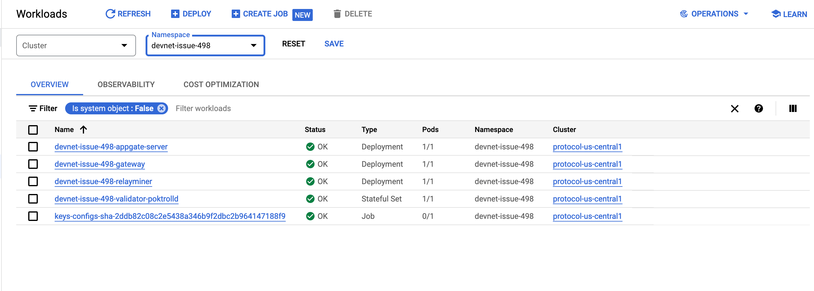
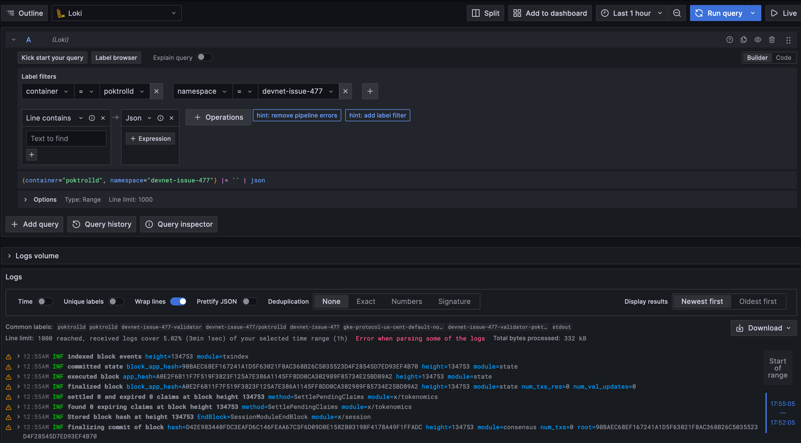

# DevNet <!-- omit in toc -->

:::note

This page is only relevant to you if you are part of the core protocol team at Grove.

:::

- 

## GCP Console

https://console.cloud.google.com/kubernetes/workload/overview?project=protocol-us-central1-d505&pageState=(%22savedViews%22:(%22i%22:%22a39690ef57a74a59b7550d42ac7655bc%22,%22c%22:%5B%5D,%22n%22:%5B%22devnet-issue-152%22%5D))

## Grafana logs

https://grafana.poktroll.com/explore?schemaVersion=1&panes=%7B%22TtK%22:%7B%22datasource%22:%22P8E80F9AEF21F6940%22,%22queries%22:%5B%7B%22refId%22:%22A%22,%22expr%22:%22%7Bcontainer%3D%5C%22poktrolld%5C%22,%20namespace%3D%5C%22devnet-issue-477%5C%22%7D%20%7C%3D%20%60%60%20%7C%20json%22,%22queryType%22:%22range%22,%22datasource%22:%7B%22type%22:%22loki%22,%22uid%22:%22P8E80F9AEF21F6940%22%7D,%22editorMode%22:%22builder%22%7D%5D,%22range%22:%7B%22from%22:%22now-1h%22,%22to%22:%22now%22%7D,%22panelsState%22:%7B%22logs%22:%7B%22logs%22:%7B%22visualisationType%22:%22logs%22%7D%7D%7D%7D%7D&orgId=1

## Infrastructure Provisioning

- The Kubernetes cluster is provisioned using Grove's internal tooling.
- We set up ArgoCD on the cluster and configure it to sync the [main/root application on the cluster](https://github.com/pokt-network/protocol-infra/blob/main/clusters/protocol-us-central1-app.yaml).
- ArgoCD, through this ArgoCD Application, provisions all the necessary resources and other ArgoCD Applications included in that Application, following the [ArgoCD App of Apps pattern](https://argo-cd.readthedocs.io/en/stable/operator-manual/cluster-bootstrapping/).
- One of the manifests provisioned is an [ArgoCD ApplicationSet](https://github.com/pokt-network/protocol-infra/blob/main/clusters/protocol-us-central1/devnets-github-label.yaml) that monitors our GitHub labels and provisions a network for each GitHub issue tagged with the `devnet` label.
- As part of our CI process, when a GitHub issue is labeled `devnet-test-e2e`, we execute a [script](https://github.com/pokt-network/poktroll/blob/main/.github/workflows-helpers/run-e2e-test.sh#L1) that creates a [Kubernetes Job](https://github.com/pokt-network/poktroll/blob/main/.github/workflows-helpers/run-e2e-test-job-template.yaml) for that DevNet.
- When the PR is closed or the label is removed, the infrastructure is cleaned up.
- We have an option to provision presistent devnets by creating a devnet yaml file in [this directory](https://github.com/pokt-network/protocol-infra/tree/main/devnets-configs) ([ArgoCD Application that monitors this directory](https://github.com/pokt-network/protocol-infra/blob/main/clusters/protocol-us-central1/devnets-persistent.yaml) for reference). 

## Configuration

Each DevNet ArgoCD App (following the App of Apps pattern) provisions a Helm chart called [full-network](https://github.com/pokt-network/protocol-infra/tree/main/charts/full-network), which includes other ArgoCD applications that deploy validators and off-chain actors. As part of the Helm chart values, we can pass configuration file changes. For example, see the [relayminer configuration](https://github.com/pokt-network/protocol-infra/blob/main/charts/full-network/templates/Application-Relayminer.yaml#L37). All possible values can be found in the `values.yaml` of the Helm chart, such as the [relayminer Helm chart](https://github.com/pokt-network/helm-charts/blob/main/charts/relayminer/values.yaml).