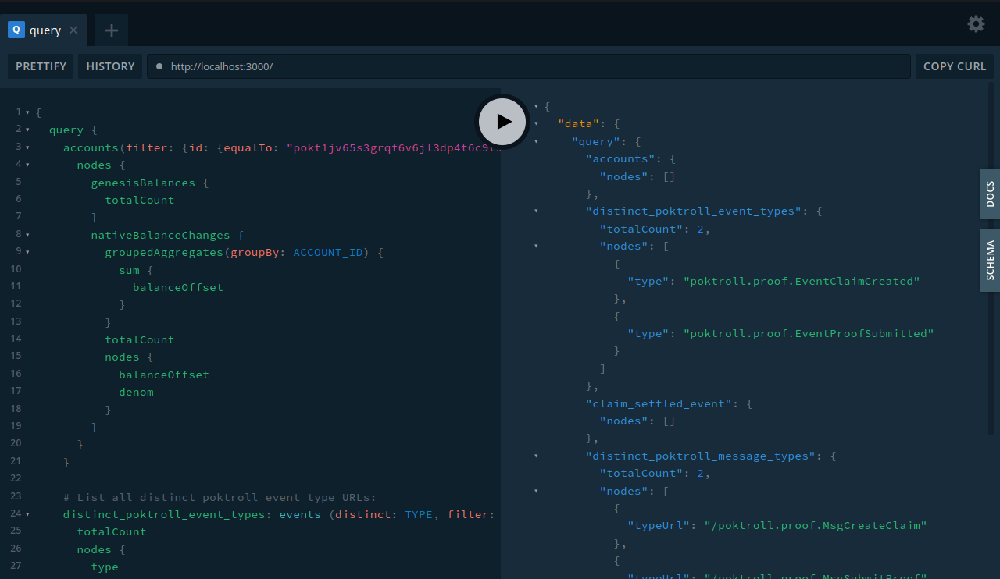
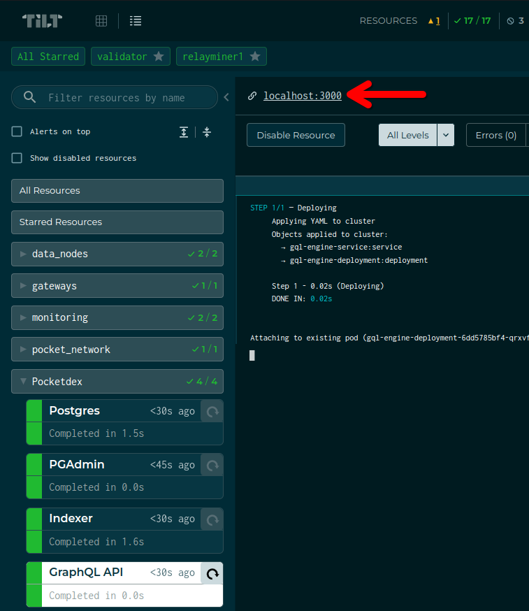

- [Usage](#usage)
  - [GraphQL](#graphql)
  - [Postgres - CLI](#postgres---cli)
- [Debugging](#debugging)
  - [Port already in use](#port-already-in-use)

:::warning

This document is a living WIP and assumes you are familiar with the LocalNet environment.

:::

## Pocketdex <!-- omit in toc -->

[Pocketdex](https://github.com/pokt-network/pocketdex/), the poktroll indexer starts up as part of the default LocalNet.

### Usage

#### GraphQL

The localnet graphiql playground is available at [http://localhost:3000](http://localhost:3000), by default.



A link is accessible from the ["GraphQL API" tab in tilt](http://localhost:10350/r/GraphQL%20API/overview):



See the [pocketdex docs](https://github.com/pokt-network/pocketdex?tab=readme-ov-file#usage--query-docs) for more details.

#### Postgres - CLI

You can connect using a tool of your choice or with the `psql` CLI via:

```bash
psql -h localhost -p 5432 -U postgres -d postgres
```

After you've connected, you MUST update your schema to `localnet` and start exploring the data:

```sql
set schema 'localnet';
\dt
select * from accounts limit 10; # Example query
```

### Debugging

#### Port already in use

If you go to [http://localhost:10350/r/Postgres/overview](http://localhost:10350/r/Postgres/overview) and see the following error:

```bash
Reconnecting... Error port-forwarding Postgres (5432 -> 5432): Unable to listen on port 5432: Listeners failed to create with the following errors: [unable to create listener: Error listen tcp4 127.0.0.1:5432: bind: address already in use unable to create listener: Error listen tcp6 [::1]:5432: bind: address already in use]
```

You likely have another local Postgres instance running. You can identify it by running

```bash
lsof -i:5432
```

On macOS, if installed via `brew`, it can be stopped with:

```bash
brew services stop postgresql
```
