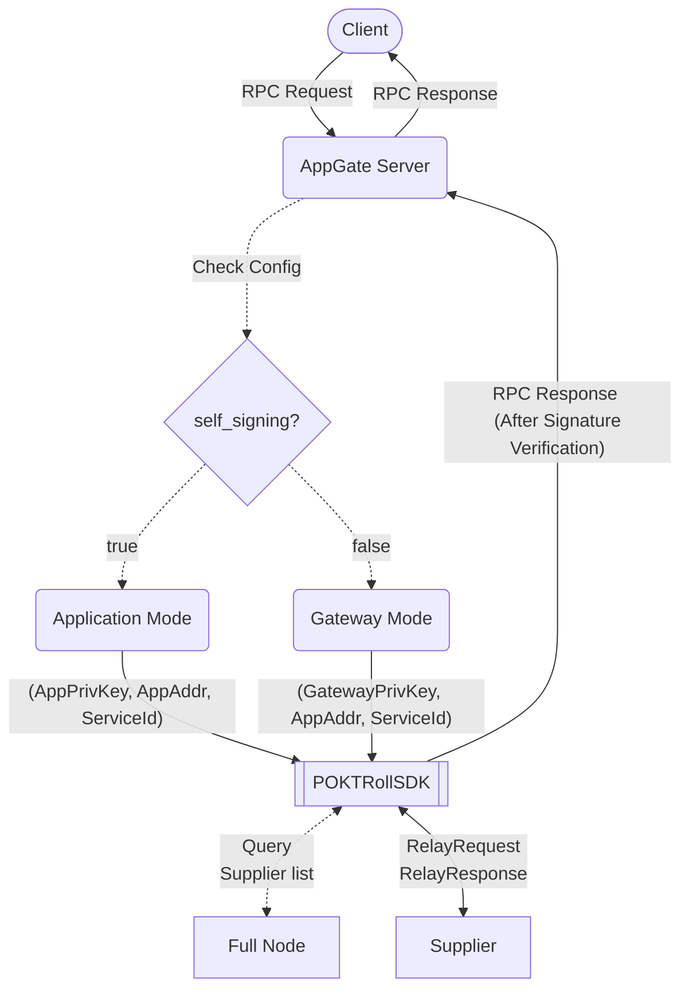

# AppGate Server <!-- omit in toc -->

- [What is AppGate Server?](#what-is-appgate-server)
- [Architecture Overview](#architecture-overview)
  - [Starting the AppGate Server](#starting-the-appgate-server)
- [Application Mode (self_signing = true)](#application-mode-self_signing--true)
  - [Application RPC Request Schema](#application-rpc-request-schema)
- [Gateway Mode (self_signing = false)](#gateway-mode-self_signing--false)
  - [Gateway RPC Request Schema](#gateway-rpc-request-schema)
- [POKTRollSDK integration](#poktrollsdk-integration)

## What is AppGate Server?

`AppGate Server` is a ready to use component that allows `Application`s and
`Gateway`s to relay RPC requests to the Pocket Network `Supplier`s without having
to manage the underlying logic of the protocol.

An operator only needs to specify a single [configuration file](../../operate/configs/appgate_server_config.md),
in order to run a sovereign `Application` or a `Gateway` via an `AppGate Server`.

## Architecture Overview

The following diagram captures a high-level overview of the `AppGate Server`'s message flow.



### Starting the AppGate Server

The `AppGate Server` could be configured to act as a `Gateway` or as a `Application`.

It can be started by running the following command:

```bash
poktrolld appgate-server  \
  --config <config-file> \
  --keyring-backend <keyring-type>
```

Where `<config-file>` is the path to the `.yaml` [appgate server config file](../../operate/configs/appgate_server_config.md)
and `<keyring-type>` is the backend to use for the keying. See the [cosmos documentation](https://docs.cosmos.network/v0.46/run-node/keyring.html)
for the full available set.

Launching the `AppGate Server` starts an HTTP server that listens for incoming
RPC requests, and forwards them to the appropriate Pocket Network `Supplier`s.

It takes care of things such as:

- Querying and updating the list of `Supplier`s that are allowed to serve the
  `Application` for given a `serviceId` during a given `session`.
- Selecting a `Supplier` to send the RPC request to.
- Appending the `Application`/`Gateway` ring-signature to the `RelayRequest`
  before sending it to the `Supplier`.
- Sending the `RelayRequest` to the `Supplier`.
- Verifying the `Supplier`'s signature.
- Returning the `RelayResponse` to the requesting client

## Application Mode (self_signing = true)

If the [`self_signing`](../../operate/configs/appgate_server_config.md#self_signing) field is
set to `true`, the `AppGate Server` will act as an `Application`. It will
only serve the address derived from the [`signing_key`](../../operate/configs/appgate_server_config.md#signing_key).

`RelayRequests` sent to the `AppGate Server` will be signed with the `signing_key`
resulting in a ring-signature that is only associated with the `Application`'s address.

:::warning

The `Application` MUST be sufficiently staked for the service being used as a
pre-requisite for the `AppGate Server` to properly service these requests.

:::

### Application RPC Request Schema

When acting as an `Application`, the `AppGate Server` expects:

- The `serviceId` to be part of the URL path
- The payload to be the body of the POST request
- The request should be sent to the [`listening_endpoint`](../../operate/configs/appgate_server_config.md#listening_endpoint) specified in the config file

The following `curl` command demonstrates how to send a JSON-RPC type request
to the `AppGate Server`:

```bash
curl -X POST \
  http://<hostname>:<port>/<serviceId> \
  -H 'Content-Type: application/json' \
  -d '{
    "jsonrpc": "2.0",
    "method": "<method_name>",
    "params": [],
    "id": 1
  }'
```

## Gateway Mode (self_signing = false)

If the [`self_signing`](../../operate/configs/appgate_server_config.md#self_signing) field
is set to `false`, then the `AppGate Server` will act as a `Gateway`, serving
`Application`s that delegated to the `Gateway` address represented by the
[`signing_key`](../../operate/configs/appgate_server_config.md#signing_key).

The `AppGate Server` will determine the `Application` address to use by extracting
it from the `senderAddr` query parameter and use it along with the `signing_key` to
generate a ring-signature associated with the `Application`'s and `Gateway`'s address.

:::warning

The `Gateway` and `Application` MUST be appropriately staked for this to work
with the `Application` also have sufficient stake to pay for the service in
order for this to work.

:::

### Gateway RPC Request Schema

When acting as an `Gateway`, the `AppGate Server` expects:

- The `serviceId` to be part of the URL path
- The `payload` to be the body of the POST request
- The `Application` address as a query parameter in the request URL
- The request should be sent to the [`listening_endpoint`](../../operate/configs/appgate_server_config.md#listening_endpoint) specified in the config file

The following `curl` command demonstrates how to send a JSON-RPC type request
to the `AppGate Server`:

```bash
curl -X POST \
  http://<hostname>:<port>/<serviceId>?senderAddr=<application_address> \
  -H 'Content-Type: application/json' \
  -d '{
    "jsonrpc": "2.0",
    "method": "<method_name>",
    "params": [],
    "id": 1
  }'
```

## POKTRollSDK integration

The `AppGate Server` implementation uses the [POKTRollSDK](../packages/sdk.md) to
interact with the Pocket Network. It can either be used directly or referenced on how
the `POKTRollSDK` can be used with a custom build `Application` / `Gateway`.
RPC requests to Pocket Network.

The `AppGate Server`'s own logic is responsible for:

- Exposing the HTTP server that listens for incoming RPC requests.
- Extracting the `serviceId` and `Application` address from the RPC request.
- Calling `POKTRollSDK.GetSessionSupplierEndpoints` to get the list of `Supplier`s
  that are allowed to serve the `Application` at a specific point in time.
- Selecting a `Supplier` to send the RPC request to.
- Calling the `POKTRollSDK.SendRelay` to send the `RelayRequest` to the selected
  `Supplier`.
- Verifying and returning the `RelayResponse` to the RPC request sender.

While `POKTRollSDK` manages:

- Being up-to-date with the latest `Session`.
- Maintaining the list of `Supplier`s that are allowed to serve the `Application`.
- Forming the `RelayRequest` object.
- Creating the ring-signature for the `RelayRequest`.
- Sending the `RelayRequest` to the `Supplier`.
- Verifying the `Supplier`'s signature.

A sequence diagram demonstrating the interaction between the `AppGate Server` and
the `POKTRollSDK` can be found in the [POKTRollSDK documentation](../packages/sdk.md).
