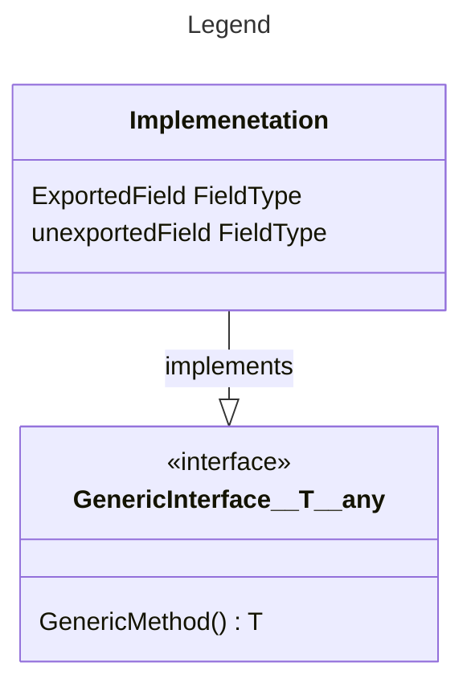
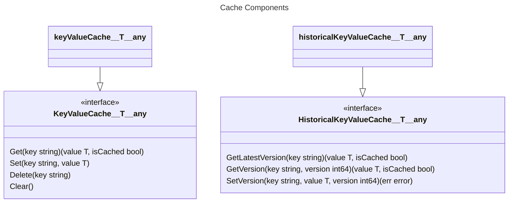

## `pocket/pkg/cache` Package <!-- omit in toc -->

// TODO_DOCUMENT(@bryanchriswhite): Add more detailed documentation.

```mermaid
---
title: Legend
---

classDiagram-v2

    class GenericInterface__T__any {
        <<interface>>
        GenericMethod() T
    }

    class Implemenetation {
        ExportedField FieldType
        unexportedField FieldType
    }

    Implemenetation --|> GenericInterface__T__any: implements
```

```mermaid
---
title: Cache Components
---

classDiagram-v2


class KeyValueCache__T__any {
    <<interface>>
    Get(key string) (value T, isCached bool)
    Set(key string, value T)
    Delete(key string)
    Clear()
}

class HistoricalKeyValueCache__T__any {
    <<interface>>
    GetLatestVersion(key string) (value T, isCached bool)
    GetVersion(key string, version int64) (value T, isCached bool)
    SetVersion(key string, value T, version int64) (err error)
}

class keyValueCache__T__any:::cacheImpl
keyValueCache__T__any --|> KeyValueCache__T__any

class historicalKeyValueCache__T__any
historicalKeyValueCache__T__any --|> HistoricalKeyValueCache__T__any
```
