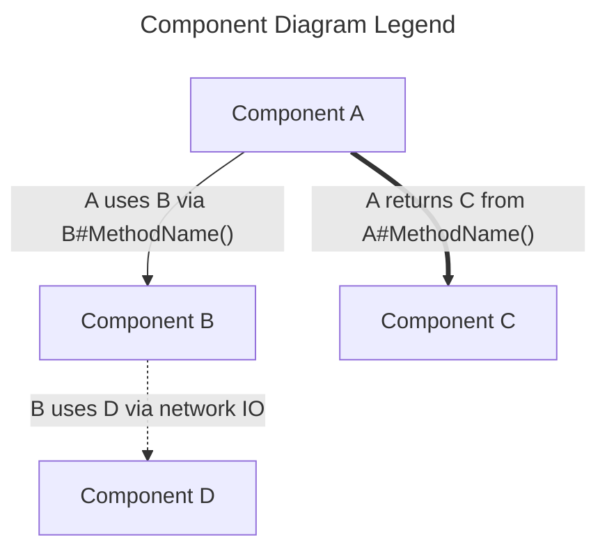
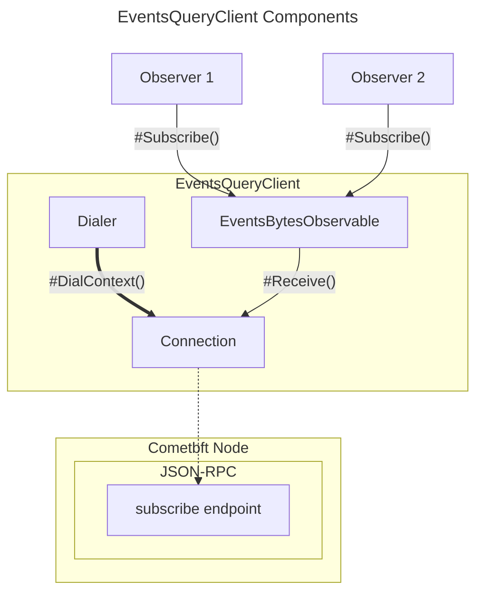
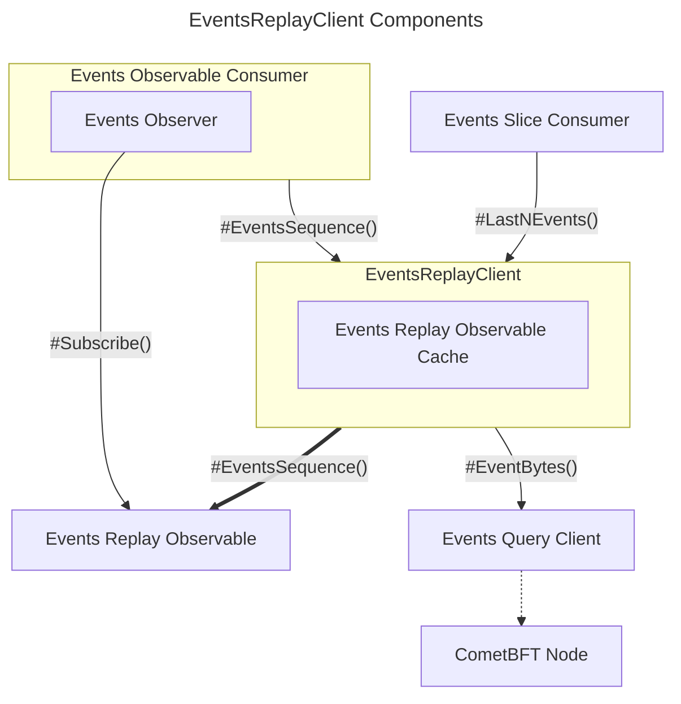
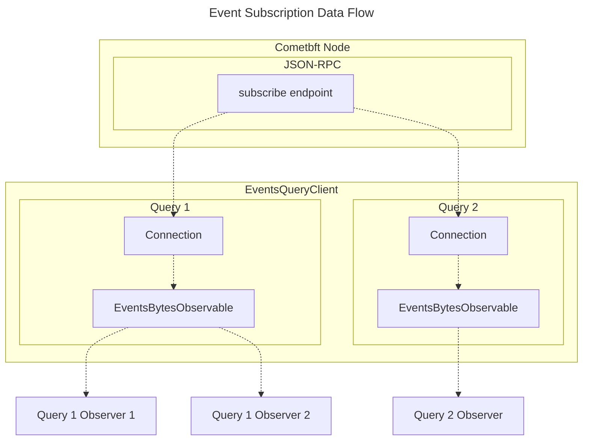

# Package `pkg/client/events` <!-- omit in toc -->

> An event query package for interfacing with [CometBFT](https://cometbft.com/)
> and the [Cosmos SDK](https://v1.cosmos.network/sdk), facilitating subscriptions
> to chain event messages.

<!-- toc -->

- [Overview](#overview)
- [Architecture Diagrams](#architecture-diagrams)
  - [Components](#components)
    - [Events Query Client](#events-query-client)
    - [Events Replay Client](#events-replay-client)
  - [Subscriptions](#subscriptions)
- [Installation](#installation)
- [Features](#features)
- [Usage (`EventsQueryClient`)](#usage-eventsqueryclient)
  - [Basic Example](#basic-example)
  - [Advanced Usage - Query Client](#advanced-usage---query-client)
  - [Configuration](#configuration)
- [Usage (`EventsReplayClient`)](#usage-eventsreplayclient)
  - [Basic Usage](#basic-usage)
  - [- Replay Client](#--replay-client)
- [Best Practices](#best-practices)
- [FAQ](#faq)
  - [Why use `events` over directly using Gorilla WebSockets?](#why-use-events-over-directly-using-gorilla-websockets)
  - [How can I use a different connection mechanism other than WebSockets?](#how-can-i-use-a-different-connection-mechanism-other-than-websockets)
  - [Why use the `EventsReplayClient` over directly maintaining an `EventsQueryClient`?](#why-use-the-eventsreplayclient-over-directly-maintaining-an-eventsqueryclient)

<!-- tocstop -->

## Overview

The `events` package provides a client interface to subscribe to chain event
messages. It abstracts the underlying connection mechanisms and offers a clear
and easy-to-use way to get events from the chain. Highlights:

- Offers subscription to chain event messages matching a given query.
- Uses the Gorilla WebSockets package for underlying connection operations.
- Provides a modular structure with interfaces allowing for mock implementations
  and testing.
- Offers considerations for potential improvements and replacements, such as
  integration with the cometbft RPC client.
- Offers a generic client to decode on chain event bytes into the desired event
  type

## Architecture Diagrams

The following section contains numerous diagrams that detail the architecture
of the different aspects of the `events` package.

### Components

The following legend describes how to read the following component diagrams.



#### Events Query Client



#### Events Replay Client



### Subscriptions

TODO_DOCUMENT(@bryanchriswhite): Add Legend



## Installation

```bash
go get github.com/pokt-network/poktroll/pkg/client/events
```

## Features

- **Websocket Connection**: Uses the
  [Gorilla WebSockets](https://github.com/gorilla/websocket) for implementing the
  connection interface.
- **Events Subscription**: Subscribe to chain event messages using a simple query
  mechanism.
- **Dialer Interface**: Offers a `Dialer` interface for constructing connections,
  which can be easily mocked for tests.
- **Observable Pattern**: Integrates the observable pattern, making it easier to
  react to chain events.
- **Generic Replay Client**: Offers a generic typed replay client to listen for
  specifc events on chain, and handles reconnection and subscription on error,
  if the `EventsQueryClient` returns an error or is unexpectedly closed.

## Usage (`EventsQueryClient`)

### Basic Example

```go
ctx := context.Background()

// Creating a new EventsQueryClient with the default, websocket dialer:
cometWebsocketURL := "ws://example.com"
evtClient := events.NewEventsQueryClient(cometWebsocketURL)

// Subscribing to a specific event, e.g. newly committed blocks:
// (see: https://docs.cosmos.network/v0.47/core/events#subscribing-to-events)
observable := evtClient.EventsBytes(ctx, "tm.event='NewBlock'")

// Subscribe and receive from the observer channel, typically in some other scope.
observer := observable.Subscribe(ctx)

// Observer channel closes when the context is canceled, observer is
// unsubscribed, or after the subscription returns an error.
for eitherEvent := range observer.Ch() {
    // (see either.Either: https://github.com/pokt-network/poktroll/blob/main/pkg/either/either.go#L3)
    eventBz, err := eitherEvent.ValueOrError()

    // ...
}
```

### Advanced Usage - Query Client

```go
// Given some custom dialer & connection implementation, e.g.:
var (
    tcpDialer events.Dialer = exampletcp.NewTcpDialerImpl()
    grcpDialer events.Dialer = examplegrpc.NewGrpcDialerImpl()
)

// Both TCP and gRPC use the TCP scheme as gRPC uses TCP for its transport layer.
cometUrl = "tcp://example.com"

// Creating new EventsQueryClients with a custom tcpDialer:
// See: https://pkg.go.dev/github.com/pokt-network/poktroll/pkg/client/events/#WithDialer
tcpDialerOpt := events.WithDialer(tcpDialer)
// See: https://pkg.go.dev/github.com/pokt-network/poktroll/pkg/client/events/#NewEventsQueryClient
tcpEvtClient := events.NewEventsQueryClient(cometUrl, tcpDialerOpt)

// Alternatively, with a custom gRPC dialer:
// See: https://pkg.go.dev/github.com/pokt-network/poktroll/pkg/client/events/#WithDialer
gcpDialerOpt := events.WithDialer(grcpDialer)
// See: https://pkg.go.dev/github.com/pokt-network/poktroll/pkg/client/events/#NewEventsQueryClient
grpcEvtClient := events.NewEventsQueryClient(cometUrl, grpcDialerOpt)

// ... rest follows the same as the basic example.
```

### Configuration

- **WithDialer**: Configure the client to use a custom dialer for connections.

## Usage (`EventsReplayClient`)

### Basic Usage

```go
const (
  // Define a query string to provide to the EventsQueryClient
  // See: https://docs.cosmos.network/v0.47/learn/advanced/events#subscribing-to-events
  // And: https://docs.cosmos.network/v0.47/learn/advanced/events#default-events
	eventQueryString = "message.action='messageActionName'"
  // Define the websocket URL the EventsQueryClient will subscribe to
  cometWebsocketURL = "ws://example.com:26657/websocket"
	// the amount of events we want before they are emitted
  replayObsBufferSize = 1
)

// Define an interface to represent an arbitrary onchain event
type EventType interface {
  GetName() string // Illustrative only; arbitrary interfaces are supported.
}

// Define the event type that implements the interface
type eventType struct {
  Name string `json:"name"`
}

func (e *eventType) GetName() string { return e.Name }

// Define a decoder function that can take the raw event bytes
// received from the EventsQueryClient and convert them into
// the desired type for the EventsReplayClient
// See: https://pkg.go.dev/github.com/pokt-network/poktroll/pkg/client/events/#NewEventsFn
func eventTypeFactory(ctx context.Context) events.NewEventsFn[EventType] {
  return function(eventBz []byte) EventType {
    eventMsg := new(eventType)
    logger := polylog.Ctx(ctx)

    if err := json.Unmarshal(eventBz, eventMsg); err != nil {
      return nil, err
    }

    // Confirm the event is correct by checking its fields
    if eventMsg.Name == "" {
      return nil, events.ErrEventsUnmarshalEvent.
        Wrapf("with eventType data: %s", string(eventBz))
    }

    return eventMsg, nil
  }
}

// Create the events query client and a depinject config to supply
// it into the EventsReplayClient
// See: https://pkg.go.dev/github.com/pokt-network/poktroll/pkg/client/events/#NewEventsQueryClient
evtClient := events.NewEventsQueryClient(cometWebsocketURL)
depConfig := depinject.Supply(evtClient)

// Create a context (this should be cancellable to close the EventsReplayClient)
ctx, cancel := context.WithCancel(context.Background())

// Create a new instance of the EventsReplayClient
// See: https://pkg.go.dev/github.com/pokt-network/poktroll/pkg/client/events/#NewEventsReplayClient
client, err := events.NewEventsReplayClient[
  EventType,
  observable.ReplayObservable[EventType],
](
  ctx,
  depConfig,
  cometWebsocketURL,
  eventQueryString,
  eventTypeFactory(ctx),
  replayObsBufferSize,
)
if err != nil {
  return nil, fmt.Errorf("unable to create EventsReplayClient %w", err)
}

// Retrieve the latest emitted event
lastEventType := client.LastNEvents(ctx, 1)[0]

// Get the latest replay observable
latestEventsObs := client.EventsSequence(ctx)
// Get the latest events from the sequence
lastEventType = latestEventsObs.Last(ctx, 1)[0]

// Cancel the context which will call client.Close and close all
// subscriptions and the EventsQueryClient
cancel()
```

### - Replay Client

The `EventsReplayClient` can be lightly wrapped to define a custom client for
a respective type. Examples of these include the `client.BlockClient` and
`client.DelegationClient` interfaces which under-the-hood are wrappers for the
`EventsReplayClient`.

:::danger
TODO(@bryanchriswhite): Update links for BlockClient and DelegationClient when they are added to the documentation.
:::

See: **BlockClient** and **DelegationClient** for more detailed examples
on how to wrap and use the `EventsReplayClient` in a more advanced setting.

## Best Practices

- **Connection Handling**: Ensure to close the `EventsQueryClient` when done to
  free up resources and avoid potential leaks.
- **Error Handling**: Always check both the synchronous error returned by
  `EventsBytes` as well as asynchronous errors send over the observable.

## FAQ

#### Why use `events` over directly using Gorilla WebSockets?

`events` abstracts many of the underlying details and provides a streamlined
interface for subscribing to chain events. It also integrates the observable
pattern and provides mockable interfaces for better testing.

#### How can I use a different connection mechanism other than WebSockets?

You can implement the `Dialer` and `Connection` interfaces and use the
`WithDialer` configuration to provide your custom dialer.

#### Why use the `EventsReplayClient` over directly maintaining an `EventsQueryClient`?

The `EventsReplayClient` will automatically attempt to reconnect to the
underlying `EventsQueryClient` in the event that it closes and publish the most
recent `observable.ReplayObservable` that can be used to retrieve events. This
means that the consumer does not need to maintain their own connection to the
`EventsQueryClient` and can always call the `EventsSequence` and `LastNEvents`
methods to retrieve the latest observable and slice of decoded events from an
active `EventsQueryClient`.
