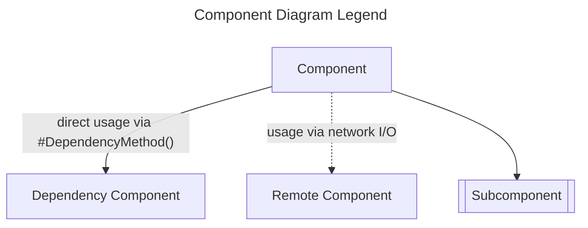
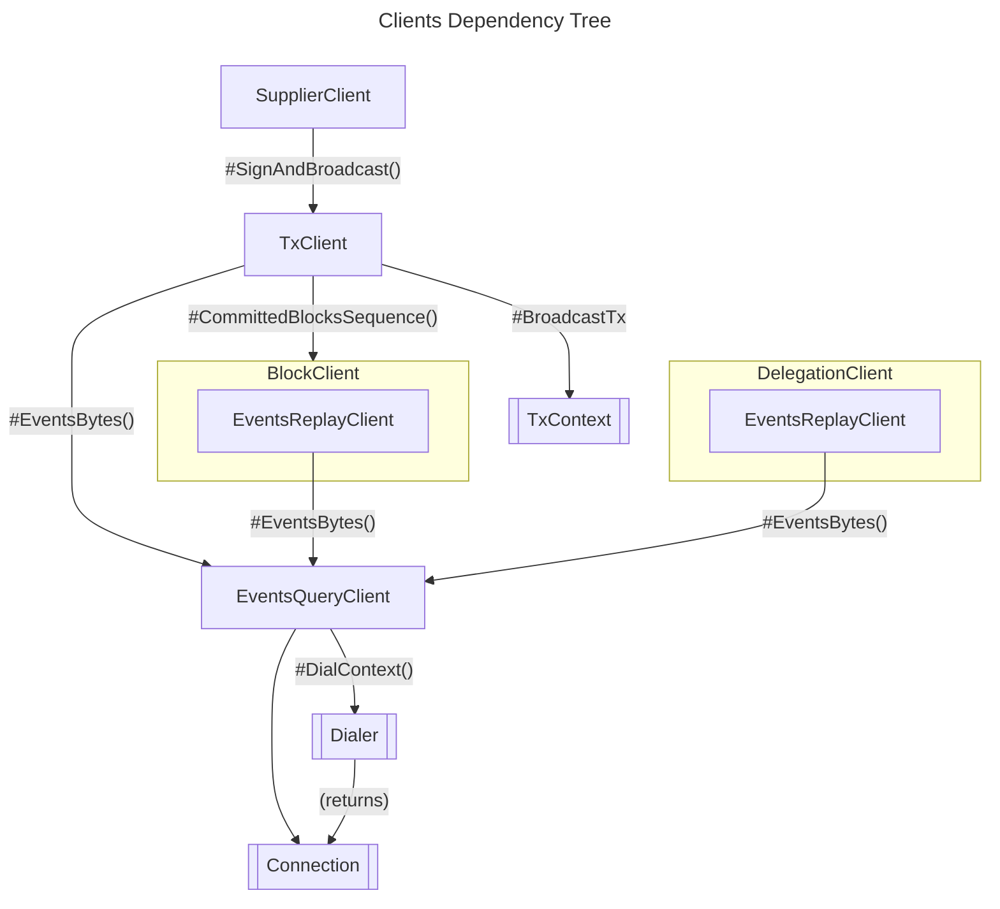
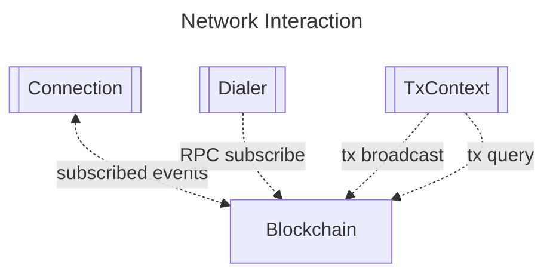

# Package `pkg/client` <!-- omit in toc -->

- [Overview](#overview)
- [Features](#features)
- [Architecture Overview](#architecture-overview)
- [Installation](#installation)
- [Usage](#usage)
  - [Basic Example](#basic-example)
  - [Advanced Usage](#advanced-usage)
  - [Configuration](#configuration)
- [API Reference](#api-reference)
- [Best Practices](#best-practices)
- [FAQ](#faq)
  - [How does the `TxClient` interface differ from `TxContext`?](#how-does-the-txclient-interface-differ-from-txcontext)
  - [Can I extend or customize the provided interfaces?](#can-i-extend-or-customize-the-provided-interfaces)

## Overview

The `client` package exposes go APIs to facilitate interactions with the Pocket network.
It includes lower-level interfaces for working with transactions and subscribing to events generally, as well as higher-level interfaces for tracking blocks and broadcasting protocol-specific transactions.

## Features

| Interface               | Description                                                                                        |
| ----------------------- | -------------------------------------------------------------------------------------------------- |
| **`SupplierClient`**    | A high-level client for use by the "supplier" actor.                                               |
| **`TxClient`**          | A high-level client used to build, sign, and broadcast transaction from cosmos-sdk messages.       |
| **`TxContext`**         | Abstracts and encapsulates the transaction building, signing, encoding, and broadcasting concerns. |
| **`BlockClient`**       | Exposes methods for receiving notifications about newly committed blocks.                          |
| **`DelegationClient`**  | Exposes methods for receiving notifications about new delegation changes from application.         |
| **`EventsQueryClient`** | Encapsulates blockchain event subscriptions.                                                       |
| **`Connection`**        | A transport agnostic communication channel for sending and receiving messages.                     |
| **`Dialer`**            | Abstracts the establishment of connections.                                                        |

## Architecture Overview



> **Figure 1**: A legend for the component diagrams in this document.



> **Figure 2**: An overview which articulates the dependency relationships between the various client interfaces and their subcompnents.



> **Figure 3**: An overview of how client subcomponents interact with the network.

## Installation

```bash
go get github.com/pokt-network/pocket/pkg/client
```

## Usage

### Basic Example

```go
// TODO_DOCUMENT: Code example showcasing the use of TxClient or any other primary interface.
```

### Advanced Usage

```go
// TODO_DOCUMENT: Example illustrating advanced features or edge cases of the package.
```

### Configuration

- **TxClientOption**: Function type that modifies the `TxClient` allowing for flexible and optional configurations.
- **EventsQueryClientOption**: Modifies the `EventsQueryClient` to apply custom behaviors or configurations.

## API Reference

For the complete API details, see the [godoc](https://pkg.go.dev/github.com/pokt-network/pocket/pkg/client).

## Best Practices

- **Use Abstractions**: Instead of directly communicating with blockchain platforms, leverage the provided interfaces for consistent and error-free interactions.
- **Stay Updated**: With evolving blockchain technologies, ensure to keep the package updated for any new features or security patches.

## FAQ

#### How does the `TxClient` interface differ from `TxContext`?

While `TxClient` is centered around signing and broadcasting transactions, `TxContext` consolidates operational dependencies for the transaction lifecycle, like building, encoding, and querying.

#### Can I extend or customize the provided interfaces?

Yes, the package is designed with modularity in mind. You can either implement the interfaces based on your requirements or extend them for additional functionalities.
