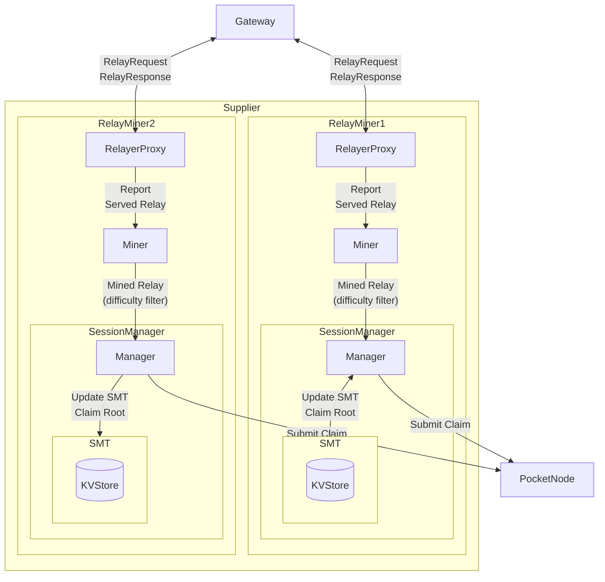
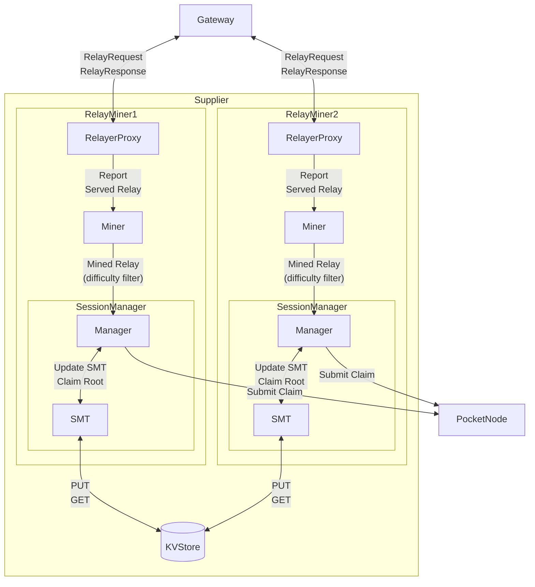
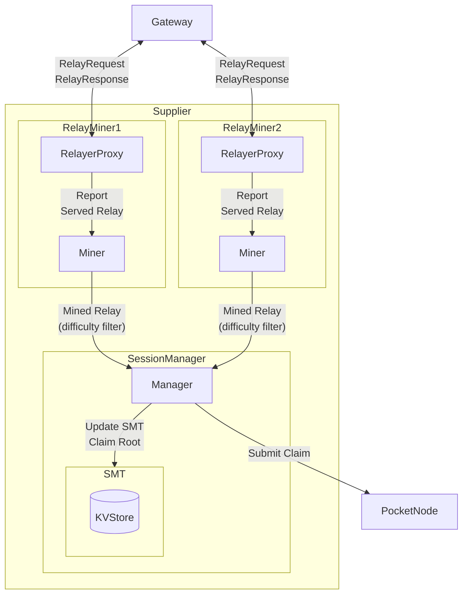

# AppGate Server <!-- omit in toc -->

- [What is RelayMiner?](#what-is-relayminer)
- [Architecture Overview](#architecture-overview)
  - [Alternative implementation](#alternative-implementation)
    - [Shared KVStore](#shared-kvstore)
    - [Shared SessionManager](#shared-sessionmanager)
  - [Lean Client](#lean-client)
  - [Starting the RelayMiner](#starting-the-relayminer)

## What is RelayMiner?

## Architecture Overview

The following diagram captures a high-level overview of the `RelayMiner`'s message flow.

### Alternative implementation
#### Shared KVStore

#### Shared SessionManager

### Lean Client

### Starting the RelayMiner

