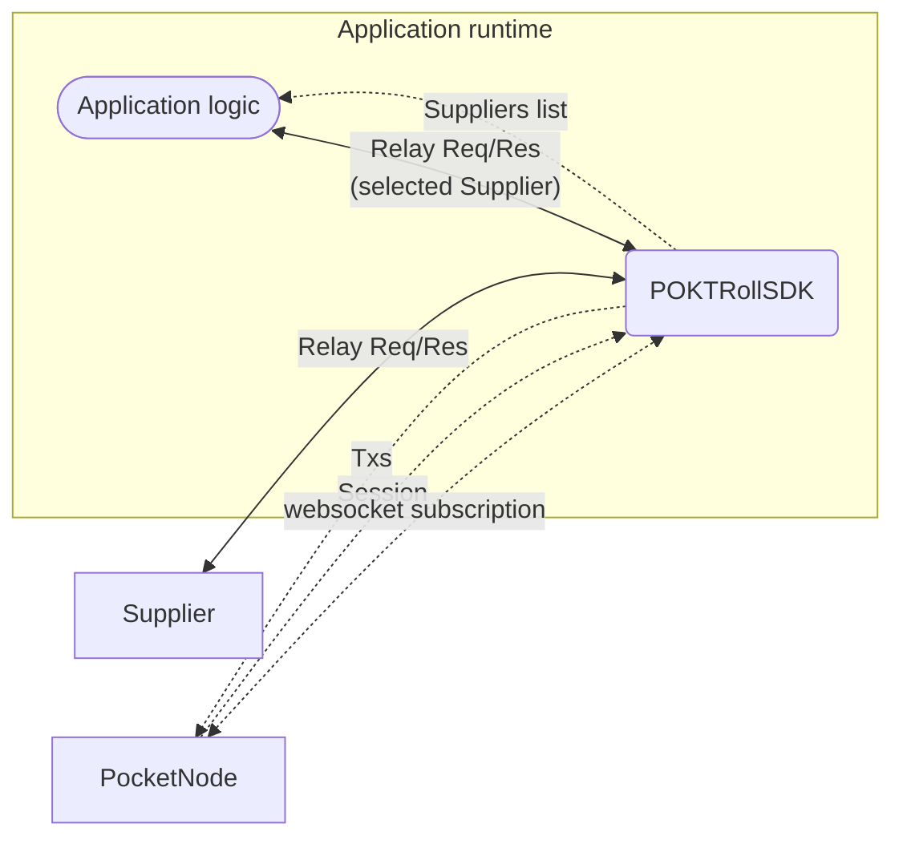
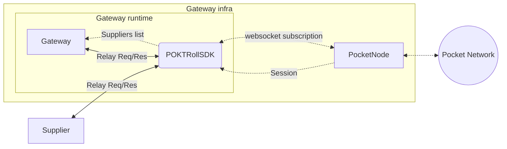
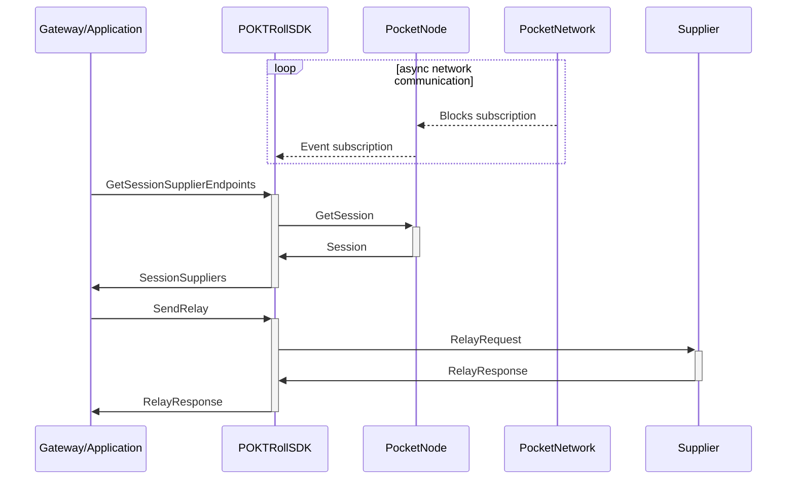

# POKTRollSDK <!-- omit in toc -->

:::warning

The `POKTRollSDK` is still in its early stages and it is subject to change. We
will try to keep the changes to a minimum and to keep the community informed of
any changes that could affect the `POKTRollSDK` consumers.

:::

- [What is the POKTRollSDK?](#what-is-the-poktrollsdk)
- [Target audience](#target-audience)
  - [Applications](#applications)
  - [Gateways](#gateways)
- [POKTRollSDK API](#poktrollsdk-api)
  - [GetSessionSupplierEndpoints](#getsessionsupplierendpoints)
  - [SendRelay](#sendrelay)
  - [NewPOKTRollSDK](#newpoktrollsdk)
  - [POKTRollSDKConfig](#poktrollsdkconfig)
- [POKTRollSDK usage](#poktrollsdk-usage)
  - [Example usage](#example-usage)
- [POKTRollSDK sequence diagram](#poktrollsdk-sequence-diagram)
- [How to contribute](#how-to-contribute)
- [Where to get help](#where-to-get-help)

## What is the POKTRollSDK?

`POKTRollSDK` is a package that provides the necessary functionality and tools
to interact with Pocket Network's on-chain actors. Specifically, it provides the
libraries for `Gateway`s and `Application`s to interact with the `Supplier`s of
the Pocket Network that complies with the on-chain protocol specifications.

Some examples of functionality the `POKTRollSDK` provides is:

- Maintaining `Application` state and session metadata based on network height.
- Querying and updating the list of `Supplier`s that are allowed to serve the
  `Application` based on the service requested.
- Sending relay requests to the selected `Supplier`.
- Appending `Application` signature to the relay requests and verifying `Supplier`
  signature on relay responses.

It lets `Application` and `Gateway` developers easily integrate the Pocket
relaying mechanism into their workflow while leaving room for customization of the
different aspects of the relay request and response lifecycle.

## Target audience

`POKTRollSDK` is intended to be used by `Gateway` and `Application` developers
who want to interact with the Pocket Network in a way that complies with the
Pocket Network's protocol.

### Applications

`Application`s that want to use the Pocket Network to **permissionlessly** query
the services provided by the network's `Supplier`s.

Provided that the `Application` is appropriately staked, the `POKTRollSDK` enables
them to directly, without the use of a Gateway `Gateway`s, to query the `Supplier`s.

The `POKTRollSDK` takes care of the following:

- Query and maintain the `Application`s latest session based on network height.
- Provides a list of `Supplier`s that are allowed to serve the `Application`.
- Handle signing of `RelayRequest`s.
- Sending the `RelayRequest` to the selected `Supplier`.
- Verifying the `RelayResponse` signature.

:::note
It is currently up to the `Application` to implement the desired strategy of
selecting the `Supplier` that will be serving them.
:::

The following diagram shows the different components involved in the case of an
`Application` integrating the `POKTRollSDK` into their workflow.



### Gateways

`Gateway`s are services that forward relay requests to `Supplier`s on behalf of
`Application`s. End-users that do not want or cannot run their own `Application`
logic, such as wallets, can use `Gateway`s to interact with the Pocket Network.

By integrating the `POKTRollSDK` into their workflow, operators can permissionlessly
setup a `Gateway` that complies with the Pocket Network's protocol.

Provided that a `Gateway` has staked the necessary amount of `POKT`, and that
a staked `Application` has delegated trust to them on-chain, the `Gateway`
can provide the `Application` with additional off-chain services. These can
include but are not limited to:

- User Authentication
- Off-chain API charges in addition to the on-chain POKT cost for service
- Performance and Quality-of-Service logic to select the best `Supplier`

The following diagram shows the different components involved in the case of a
`Gateway` integrating the `POKTRollSDK` into their workflow.



## POKTRollSDK API

:::tip
Visit `pkg/sdk/interface.go` for the latest version of the `POKTRollSDK` interface
as documentation can get out of date.
:::

`POKTRollSDK` consists of an interface that exposes the following methods:

```go
type POKTRollSDK interface {
  GetSessionSupplierEndpoints(
    ctx context.Context,
    appAddress string,
    serviceId string,
  ) (session *SessionSuppliers, err error)

  SendRelay(
    ctx context.Context,
    sessionSupplierEndpoint *SingleSupplierEndpoint,
    request *http.Request,
  ) (response *servicetypes.RelayResponse, err error)
}
```

The interface, its implementation and the relevant types involved could be found
at the following directory [pkg/sdk/](https://github.com/pokt-network/poktroll/blob/main/pkg/sdk)

```bash
pkg/sdk/
├── deps_builder.go   # Logic for auto-building the dependencies of the SDK
├── errors.go         # Errors returned by the SDK
├── interface.go      # POKTRollSDK interface
├── relay_verifier.go # Logic to verify relay responses
├── sdk.go            # POKTRollSDK implementation and initialization function
├── send_relay.go     # Logic to send relay requests
├── session.go        # Logic to handle sessions and retrieve the suppliers list
└── urls.go           # Helpers to parse the urls used by the SDK to interact with the Pocket Network
```

### GetSessionSupplierEndpoints

_tl;dr Which Supplier can service my application in this session?_

`GetSessionSupplierEndpoints` returns a `SessionSuppliers` struct that contains
the fully-hydrated session corresponding to the `appAddress` and `serviceId`
provided and a list of `SingleSupplierEndpoint`s, where each `SingleSupplierEndpoint`
contains the necessary information to send a relay request to the `Supplier` it represents.

The `POKTRollSDK` consumer is free to run any strategy to select a `Supplier` from
the list returned by the `GetSessionSupplierEndpoints` method.

### SendRelay

_tl;dr Send a relay request to a specific Supplier._

Once a `Supplier` is selected, the `POKTRollSDK` consumer can then pass the corresponding
`SingleSupplierEndpoint` to the `SendRelay` method which will take care of constructing
the `RelayRequest`, sending it to the `Supplier` and verifying the response signature.

Once the `RelayRequest` is sent, the `SendRelay` method will wait for the `RelayResponse`
and verify its signature before returning it to the `POKTRollSDK` consumer.

:::warning

The error returned by the `SendRelay` only indicates that an error occurred during
the process of sending the `RelayRequest` or verifying the `RelayResponse` signature
and does not indicate errors returned by the `Supplier` or the requested service.
These ones should be available in the `RelayResponse` returned by the `SendRelay`
and the `POKTRollSDK` considers them as valid responses.

:::

### NewPOKTRollSDK

_tl;dr Start a new stateful POKTRollSDK instance._

`NewPOKTRollSDK` is the initializing function that returns a fully functional
`POKTRollSDK` implementation given it's provided a valid `POKTRollSDKConfig`
struct which contains the necessary information to build the dependencies of the
`POKTRollSDK` implementation.

```go
func NewPOKTRollSDK(
  ctx context.Context,
  config *POKTRollSDKConfig,
) (POKTRollSDK, error)
```

### POKTRollSDKConfig

`POKTRollSDKConfig` is a struct that contains the necessary information to build
the dependencies needed by the `POKTRollSDK` implementation.

```go
type POKTRollSDKConfig struct {
  QueryNodeGRPCUrl *url.URL
  QueryNodeUrl     *url.URL
  PrivateKey       cryptotypes.PrivKey
  Deps             depinject.Config
}
```

It consists of the following fields:

- `QueryNodeGRPCUrl` is the url of the Pocket Node's gRPC endpoint, used to query
  the Pocket Network's state for sessions, account information, delegations, etc.
- `QueryNodeUrl` is the url of the Pocket Node's websocket endpoint, used to
  subscribe to Pocket Network's new block events needed to keep the
  `POKTRollSDK` session information up to date.
- `PrivateKey` is the private key used to sign the relay requests. It could be
  either the `Gateway` or the `Application` private key depending on the use case.
- `Deps` is a `depinject.Config` struct that contains the dependencies needed by
  the `POKTRollSDK` implementation. It is used to inject the dependencies into the
  `POKTRollSDK` implementation. This field is optional and if not provided, the
  `POKTRollSDK` implementation will use the default dependencies.

## POKTRollSDK usage

In order to use the `POKTRollSDK` the consumer needs to:

1. Import the `POKTRollSDK` package
2. Initialize a new `POKTRollSDK` instance by calling the `NewPOKTRollSDK` function
   and providing an adequate `POKTRollSDKConfig` struct.
3. Call the `GetSessionSupplierEndpoints` method to get the `SessionSuppliers`.
4. Select a `Supplier` from the list of `SingleSupplierEndpoint`s returned.
5. Call the `SendRelay` method providing the selected `SingleSupplierEndpoint` and
   the request to send.

### Example usage

:::warning

The code below is for illustrative purposes only. It shows how `GetSessionSupplierEndpoints`
and `SendRelay` could be used in a simple scenario. It does not show how to handle
errors or how to select a `Supplier` from the list of `SingleSupplierEndpoint`s

:::

:::tip

For a complete integration example, please refer to the [AppGateServer](https://github.com/pokt-network/poktroll/blob/main/pkg/appgateserver) package.

:::

```go
package main

import sdk "github.com/pokt-network/poktroll/pkg/sdk"

func main() {

  // Build the POKTRollSDKConfig struct
  sdkConfig := sdk.POKTRollSDKConfig{
      QueryNodeGRPCUrl grpcURL,
      QueryNodeUrl     rpcURL
      PrivateKey:      privateKey,
      // Deps are omitted and the default dependencies will be used
  }

  // Initialize a new POKTRollSDK instance
  poktrollSDK, err := sdk.NewPOKTRollSDK(ctx, &sdkConfig)

  // Get the session and the corresponding list of suppliers
  sessionSuppliers, err := poktrollSDK.GetSessionSupplierEndpoints(
    ctx,
    appAddress,
    serviceId,
  )

  // Naively select the first supplier from the list of SingleSupplierEndpoints
  selectedSupplier := sessionSuppliers.SuppliersEndpoints[0]

  // Send the request to the selected supplier and wait for the response
  response, err := poktrollSDK.SendRelay(ctx, selectedSupplier, httpRequest)
}
```

## POKTRollSDK sequence diagram

The following diagram shows the sequence of events that take place when an `Application`
or a `Gateway` uses the `POKTRollSDK` to interact with the Pocket Network.



## How to contribute

If you want to contribute to the `POKTRollSDK` you can take a look at the
[current issues](https://github.com/pokt-network/poktroll/labels/sdk)
and the project's [roadmap](https://github.com/orgs/pokt-network/projects/144)

Feel free to open a new ticket and add the `sdk` label to it if you find a bug or
have a feature request.

You can also open a PR if you want to contribute with a new feature or a bug fix.

## Where to get help

If you want to discuss the `POKTRollSDK`, you can join the [Pocket Network Discord](https://discord.gg/build-with-grove) server and head to the `#protocol-public` channel.
