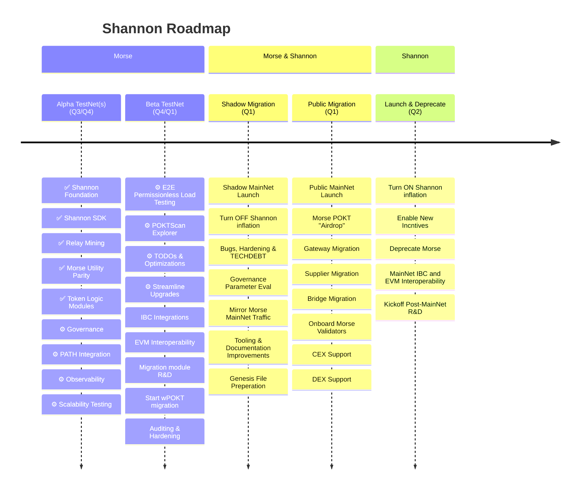

## Blogs & Updates

- [Pocket Network Shannon Update - Beta TestNet #1 Announcement](TODO_IN_THIS_PR)
- [Pocket Network Shannon Update - Alpha TestNet #3 Announcement](https://medium.com/decentralized-infrastructure/pocket-network-shannon-update-alpha-testnet-3-eca539a9e111)

## Alpha TestNet Roadmap

See the Alpha TestNet #3 Announcement [here](https://medium.com/decentralized-infrastructure/pocket-network-shannon-update-alpha-testnet-3-eca539a9e111).

