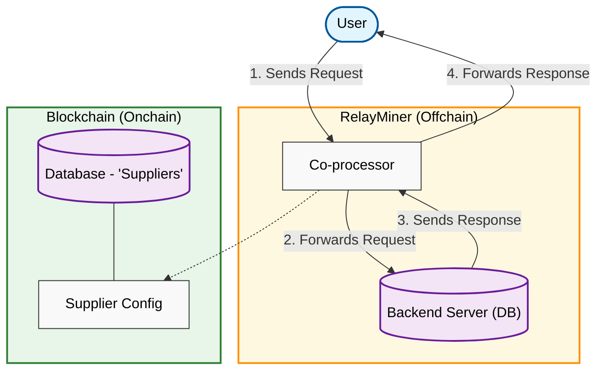

import ReactPlayer from "react-player";

## Supplier & RelayMiner Cheat Sheet <!-- omit in toc -->

**🖨 🍝 instructions to get you up and running a `RelayMiner` after staking a `Supplier` on Pocket Network ✅**

:::warning This will involve scripting avoid details or explanations of what's going on.

See the [Supplier Walkthrough](../walkthroughs/supplier_walkthrough.md) for more details if you want to understand what's happening under the hood.

:::

---

## Table of Contents <!-- omit in toc -->

- [20 Minute Video Walkthrough](#20-minute-video-walkthrough)
- [Prerequisites](#prerequisites)
  - [What are we going to do?](#what-are-we-going-to-do)
- [Account Setup](#account-setup)
  - [Create the `Supplier` account](#create-the-supplier-account)
  - [Prepare your environment](#prepare-your-environment)
  - [Fund the Supplier account](#fund-the-supplier-account)
- [Supplier Configuration](#supplier-configuration)
  - [Prepare your Supplier's public URL](#prepare-your-suppliers-public-url)
  - [Configure your Supplier](#configure-your-supplier)
  - [Stake your Supplier](#stake-your-supplier)
- [RelayMiner Configuration](#relayminer-configuration)
  - [Optional: Start the anvil node](#optional-start-the-anvil-node)
  - [Configure the RelayMiner](#configure-the-relayminer)
  - [Start the RelayMiner](#start-the-relayminer)

## 20 Minute Video Walkthrough

The following is a ~20 minute video walkthrough using this cheatsheet.

<ReactPlayer
  playing={false}
  controls
  url="https://github.com/user-attachments/assets/bafd0b3e-4968-4e92-ba8a-41b618633455"
/>

## Prerequisites

1. **CLI**: You have [installed the `pocketd` CLI](../../tools/user_guide/pocketd_cli.md).
2. **Account**: You know how to [create and fund a new account](../../tools/user_guide/create-new-wallet.md).
3. **Service**: You have either [staked a new `service` or found an existing one](1_service_cheatsheet.md).
4. **Hardware**: You have reviewed the [hardware requirements](../configs/hardware_requirements.md).

### What are we going to do?

This document will guide you through the process of:

1. **Staking a`Supplier`** - An onchain record that advertises an API service it provides
2. **Deploying an offchain `RelayMiner`** - A coprocessor that relays requests to the backend service serving API requests

By the end, you will be able to serve Relays offchain, and claim onchain rewards.

## Account Setup

### Create the `Supplier` account

Create a new key pair for the `Supplier`

```bash
pocketd keys add supplier
```

### Prepare your environment

Run the following commands to easily set up your environment to access Beta TestNet:

```bash
cat > ~/.pocketrc << 'EOF'
export SUPPLIER_ADDR=$(pocketd keys show supplier -a)
export TX_PARAM_FLAGS="--gas=auto --gas-prices=1upokt --gas-adjustment=1.5 --yes"
export BETA_NODE_FLAGS="--chain-id=pocket-beta --node=https://shannon-testnet-grove-rpc.beta.poktroll.com"
export BETA_RPC_URL="https://shannon-testnet-grove-rpc.beta.poktroll.com"
export BETA_GRPC_URL="https://shannon-testnet-grove-grpc.beta.poktroll.com:443"
EOF
```

Adopt this section depending on your shell configuration:

```bash
echo "source ~/.pocketrc" >> ~/.profile
source ~/.profile
```

### Fund the Supplier account

Run the following command to get the `Supplier` address:

```bash
echo "Supplier address: $SUPPLIER_ADDR"
```

Head over to the [Shannon Beta TestNet faucet](https://faucet.beta.testnet.pokt.network/) to fund the (supplier owner address) account.

Verify your account is funded (after waiting a couple of minutes) like so:

```bash
pocketd query bank balances $SUPPLIER_ADDR $BETA_NODE_FLAGS
```

:::tip watch and wait

```bash
watch -n 5 "pocketd query bank balances $SUPPLIER_ADDR $BETA_NODE_FLAGS"
```

:::

## Supplier Configuration

For details on all available supplier configurations, see the [Supplier configuration docs](./../configs/supplier_staking_config.md).

### Prepare your Supplier's public URL

Your Supplier's public URL is the endpoint that your RelayMiner will expose to Pocket Network.

Retrieve your external IP address:

```bash
EXTERNAL_IP=$(curl -4 ifconfig.me/ip)
```

Choose a port that'll be publicly accessible from the internet (e.g. `8545`) and expose it.

You can use the following command for OSs that use `ufw` (learn more [here](https://wiki.archlinux.org/title/Uncomplicated_Firewall)):

```bash
sudo ufw allow 8545/tcp
```

Your Supplier's public URL is then `http://$EXTERNAL_IP:8545`.

### Configure your Supplier

:::important Update the service_id

The service_id below is `anvil`.

In practice, you should use another existing service_id or [create a new one](./../configs/service_config.md).

:::

Create a Supplier stake configuration file:

```bash
cat <<🚀 > /tmp/stake_supplier_config.yaml
owner_address: $SUPPLIER_ADDR
operator_address: $SUPPLIER_ADDR
stake_amount: 1000069upokt
default_rev_share_percent:
  $SUPPLIER_ADDR: 100
services:
  - service_id: "anvil" #README: Update this value if not using Anvil
    endpoints:
      - publicly_exposed_url: http://$EXTERNAL_IP:8545 #README: Must be publicly accessible
        rpc_type: JSON_RPC
🚀
```

### Stake your Supplier

Run the following command to stake the `Supplier`:

```bash
pocketd tx supplier stake-supplier \
  --config /tmp/stake_supplier_config.yaml \
  --from=$SUPPLIER_ADDR $TX_PARAM_FLAGS $BETA_NODE_FLAGS
```

Once the transaction successfully settles on the next block, you can query it like so:

```bash
pocketd query supplier show-supplier $SUPPLIER_ADDR $BETA_NODE_FLAGS
```

## RelayMiner Configuration

For details on all available relayminer configurations, see the [RelayMiner configuration docs](./../configs/relayminer_config.md).

### Optional: Start the anvil node

If you kept the default `anvil` service_id, you'll need to start a local Anvil node.

<details>

<summary>How to run an Anvil node</summary>

Stand up a local anvil node like so:

```bash
curl -L https://foundry.paradigm.xyz | bash
source ~/.foundry/bin
foundryup
anvil --port 8546
```

And test it like so:

```bash
curl -X POST http://127.0.0.1:8546 \
  -H "Content-Type: application/json" \
  -d '{"jsonrpc": "2.0", "id": 1, "method": "eth_blockNumber", "params": []}'
```

</details>

### Configure the RelayMiner

Create a RelayMiner configuration file:

```bash
cat <<🚀 > /tmp/relayminer_config.yaml
default_signing_key_names:
  - supplier
smt_store_path: $HOME/.pocket/smt
pocket_node:
  query_node_rpc_url: $BETA_RPC_URL
  query_node_grpc_url: $BETA_GRPC_URL
  tx_node_rpc_url: $BETA_RPC_URL
suppliers:
  - service_id: "anvil" # README: Update this value if not using Anvil
    service_config:
      backend_url: "http://127.0.0.1:8546" # README: Update this value if not using Anvil
    listen_url: http://0.0.0.0:8545 # README: This must be reachable via the publicly_exposed_url from the Supplier configuration file
metrics:
  enabled: false
  addr: :9090
pprof:
  enabled: false
  addr: :6060
🚀
```

### Start the RelayMiner

Start the RelayMiner like so:

```bash
pocketd \
    relayminer \
    --grpc-insecure=false \
    --log_level=debug \
    --config=/tmp/relayminer_config.yaml
```
