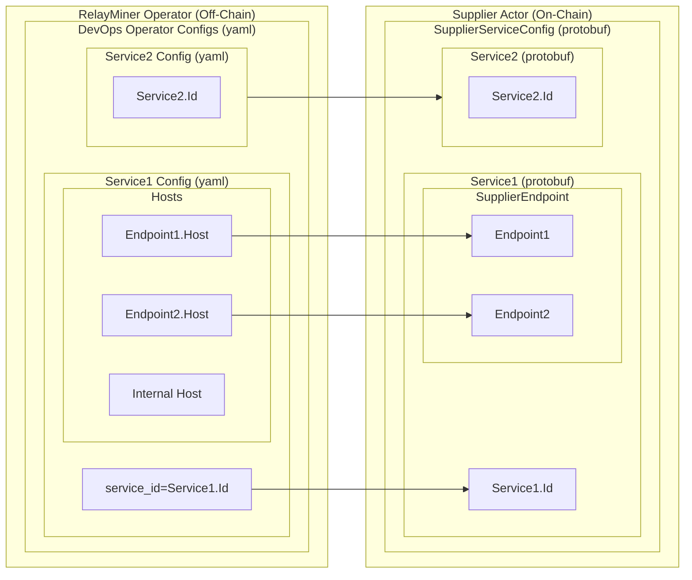
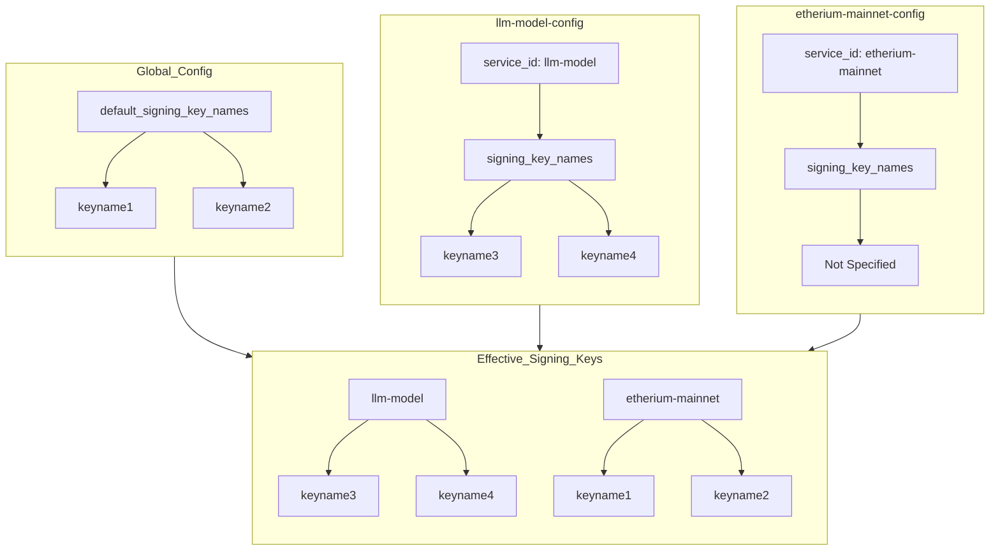
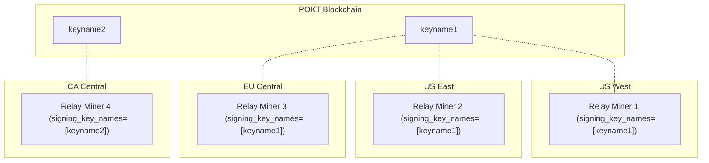

# RelayMiner config <!-- omit in toc -->

_This document describes the configuration options available through the
`relayminer_config.yaml` file. It configures how the `RelayMiner` is setup in terms
of Pocket network connectivity, starting up backend servers, querying requests
and which domains to accept queries from._

- [Full config reference example](#full-config-reference-example)
- [RelayMiner (off-chain) config -\> Supplier (on-chain) configs](#relayminer-off-chain-config---supplier-on-chain-configs)
- [Usage](#usage)
- [Structure](#structure)
- [Global options](#global-options)
  - [`default_signing_key_names`](#default_signing_key_names)
  - [`smt_store_path`](#smt_store_path)
  - [`metrics`](#metrics)
  - [`pprof`](#pprof)
- [Pocket node connectivity](#pocket-node-connectivity)
  - [`query_node_rpc_url`](#query_node_rpc_url)
  - [`query_node_grpc_url`](#query_node_grpc_url)
  - [`tx_node_rpc_url`](#tx_node_rpc_url)
- [Suppliers](#suppliers)
  - [`service_id`](#service_id)
  - [`signing_key_names`](#signing_key_names)
  - [`listen_url`](#listen_url)
  - [`service_config`](#service_config)
    - [`backend_url`](#backend_url)
    - [`authentication`](#authentication)
    - [`headers`](#headers)
    - [`publicly_exposed_endpoints`](#publicly_exposed_endpoints)
      - [Why should one supplier have multiple `publicly_exposed_endpoints`?](#why-should-one-supplier-have-multiple-publicly_exposed_endpoints)
- [Configuring Signing Keys](#configuring-signing-keys)
  - [Example Configuration](#example-configuration)
- [Supported server types](#supported-server-types)

## Full config reference example

A full and commented example of a `RelayMiner` configuration file can be found
at [localnet/poktrolld/config/relayminer_config_full_example.yaml](https://github.com/pokt-network/poktroll/tree/main/localnet/poktrolld/config/relayminer_config_full_example.yaml)

## RelayMiner (off-chain) config -> Supplier (on-chain) configs

The following diagram illustrates how the _off-chain_ `RelayMiner` operator
config (yaml) MUST match the _on-chain_ `Supplier` actor service endpoints
for correct and deterministic behavior.

If these do not match, the behavior is non-deterministic and could result in
a variety of errors such as bad QoS, incorrect proxying, burning of the actor, etc...

_Assuming that the on-chain endpoints 1 and 2 have different hosts_



## Usage

The `RelayMiner` start command accepts a `--config` flag that points to a configuration
`yaml` file that will be used to setup the `RelayMiner` instance.

```bash
poktrolld relayminer --config ./relayminer_config.yaml --keyring-backend test
```

## Structure

The `RelayMiner` configuration file is a `yaml` file that contains `global options`
and `supplier` specific sections and configurations.

## Global options

```yaml
default_signing_key_names: [ <string>, <string> ]
smt_store_path: <string>
```

### `default_signing_key_names`

_`Required`_ if `suppliers.*.signing_key_names` is not specified.

This configuration option specifies a list of key names from the keyring that the
`RelayMiner` will use to sign transactions. These key names are used to derive the public
key and the corresponding address, which are essential for interacting with POKT.
Each key name listed here must be present in the keyring used to start the
`RelayMiner` instance.

For more details, see [Configuring Signing Keys](#configuring-signing-keys).


### `smt_store_path`

_`Required`_

The relative or absolute path to the directory where the `RelayMiner` will store
the `SparseMerkleTree` data on disk. This directory is used to persist the `SMT`
in a BadgerDB KV store data files.

### `metrics`

_`Optional`_

This section configures a Prometheus exporter endpoint, enabling the collection
and export of metrics data. The `addr` field specifies the network address for
the exporter to bind to. It can be either a port number, which assumes binding
to all interfaces, or a specific host:port combination.

Example configuration:

```yaml
metrics:
  enabled: true
  addr: :9090
```

When `enabled` is set to `true`, the exporter is active. The addr `value` of
`:9090` implies the exporter is bound to port 9090 on all available network
interfaces.

### `pprof`

_`Optional`_

Configures a [pprof](https://github.com/google/pprof/blob/main/doc/README.md)
endpoint for troubleshooting and debugging performance issues.

Example configuration:

```yaml
pprof:
  enabled: true
  addr: localhost:6060
```

You can learn how to use that endpoint on the [Performance Troubleshooting](../../develop/developer_guide/performance_troubleshooting.md) page.

## Pocket node connectivity

```yaml
pocket_node:
  query_node_rpc_url: tcp://<hostname>:<port>
  query_node_grpc_url: tcp://<hostname>:<port>
  tx_node_rpc_url: tcp://<hostname>:<port>
```

### `query_node_rpc_url`

_`Required`_

The RPC URL of the Pocket node that allows the `RelayMiner` to subscribe to events
via websockets. It is then re-formatted as `ws://<hostname>:<port>/websocket`
and establishes a persistent connection to the Pocket node to stream events such as
latest blocks, application staking events, etc...
If unspecified, `tx_node_rpc_url` value will be used.

### `query_node_grpc_url`

_`Optional`_

The gRPC URL of the Pocket node that allows the `RelayMiner` to query/pull data from
the Pocket network (eg. Sessions, Accounts, etc...).

### `tx_node_rpc_url`

_`Required`_

The RPC URL of the Pocket node that allows the `RelayMiner` to broadcast transactions
to the a Pocket network Tendermint node.
It may have a different host than the `query_node_rpc_url` but the same value is
acceptable too.

## Suppliers

The `suppliers` section configures the services that the `RelayMiner` will offer
to Pocket Network. It specifies exactly where those requests will be forwarded
to by the Supplier's infrastructure.

Each suppliers entry's `service_id` MUST reflect the on-chain `Service.Id` the
supplier staked for. In addition, the `publicly_exposed_endpoints` list MUST
contain the same endpoints that the Supplier advertised on-chain when staking for
that service.

At least one supplier is required for the `RelayMiner` to be functional.

```yaml
suppliers:
  - service_id: <string>
    listen_url: <enum{http}>://<host>
    service_config:
      backend_url: <url>
      authentication:
        username: <string>
        password: <string>
      headers:
        <key>: <value>
      publicly_exposed_endpoints:
        - <host>
```

### `service_id`

_`Required`_, _`Unique`_

The Id of the service which will be used as a unique identifier to reference
a service provided by the `Supplier` and served by the `RelayMiner` instance.

It MUST match the `Service.Id` specified by the supplier when staking for the
service.

### `signing_key_names`

_`Required`_ if `default_signing_key_names` is empty.

This option specifies the list of signing key names specific to a supplier.
If a supplier does not provide its own `signing_key_names`, the `RelayMiner` will use the `default_signing_key_names`.

For more details, see [Configuring Signing Keys](#configuring-signing-keys).

### `listen_url`

_`Required`_

The address on which the `RelayMiner` will start a server to listen for incoming
requests. The server type is inferred from the URL scheme (http, https, etc...).

The same `listen_url` can be used for multiple suppliers and/or different
`publicly_exposed_endpoints`, the `RelayMiner` takes care of routing the requests
to the correct `backend_url` based on the `service_id` and the `publicly_exposed_endpoints`
it received a request form.

### `service_config`

_`Required`_

The `service_config` section of the supplier configuration is a set of options
that are specific to the service that the `RelayMiner` will be offering to the
Pocket network.

#### `backend_url`

_`Required`_

The URL of the service that the `RelayMiner` will forward the requests to when
a relay is received, also known as **data node** or **service node**.
It MUST be a valid URL (not just a host) and be reachable from the `RelayMiner` instance.

#### `authentication`

_`Optional`_

The `authentication` section of the supplier configuration is a pair of `username`
and `password` that will be used by the basic authentication mechanism to authenticate
the requests that are forwarded to the service.

#### `headers`

_`Optional`_

The `headers` section of the supplier configuration is a set of key-value pairs
that will be added to the request headers when the `RelayMiner` forwards the
requests to the service. It can be used to add additional headers like
`Authorization: Bearer <TOKEN>` for example.

#### `publicly_exposed_endpoints`

_`Required`_, _`Unique` within the supplier's `publicly_exposed_endpoints` list_

The `publicly_exposed_endpoints` section of the supplier configuration is a list
of hosts that the `RelayMiner` will accept requests from. It MUST be a valid host
that reflects the on-chain supplier staking service endpoints.

It is used to determine if the incoming request is allowed to be processed by
the server listening on `listen_url` host address as well as to check if the
request's RPC-Type matches the on-chain endpoint's RPC-Type.

:::note

The `service_id` of the supplier is automatically added to the
`publicly_exposed_endpoints` list as it may help troubleshooting the `RelayMiner`
and/or send requests internally from a k8s cluster for example.

:::

##### Why should one supplier have multiple `publicly_exposed_endpoints`?

There are various reasons to having multiple `publicly_exposed_endpoints`
for the same supplier service.

- The on-chain Supplier may provide the same Service on multiple domains
  (e.g. for different regions).
- The operator may want to route requests of different RPC types to
  the same server
- Migrating from one domain to another. Where the operator could still
  accept requests on the old domain while the new domain is being propagated.
- The operator may want to have a different domain for internal requests.
- The on-chain Service configuration accepts multiple endpoints.

## Configuring Signing Keys

`RelayMiner` expects the addresses with signing keys to be staked before running
a `RelayMiner`.

There are two ways to configure signing keys for `RelayMiner`: globally using `default_signing_key_names`
or individually for each supplier using `signing_key_names`.

1. **Global Configuration (`default_signing_key_names`)**
- Provides a default list of key names used by all suppliers unless overridden.
- Useful for ensuring a base level of configuration and simplicity.

1. **Supplier-specific Configuration (`signing_key_names`)**
- Allows each supplier to have its own set of signing key names.
- Provides flexibility and granular control over key management.

In summary, use `default_signing_key_names` for a robust fallback and simplified setup.
Use `signing_key_names` for greater control and security tailored to individual suppliers.

### Example Configuration

```yaml
default_signing_key_names:
  - keyname1
  - keyname2
suppliers:
  # RelayMiner will only provide service for `llm-model` using `keyname3` and `keyname4` keys.
  - service_id: llm-model
    signing_key_names:
      - keyname3
      - keyname4
    # ... the rest of the config

  # RelayMiner will only provide service for `etherium-mainnet` using `keyname1` and `keyname2` keys.
  - service_id: etherium-mainnet
    # ... the rest of the config
```




:::note

Multiple `RelayMiner`s can be configured with the same signing keys to sign `RelayResponse`s
and submit `Claim`s and `Proof`s transactions to the Pocket network. (e.g. This is
useful for a `Supplier` that is willing to provide redundant or geographically
distributed services.)



:::

---

## Supported server types

The list of supported server types can be found at [pkg/relayer/config/types.go](https://github.com/pokt-network/poktroll/tree/main/pkg/relayer/config/types.go#L8)
