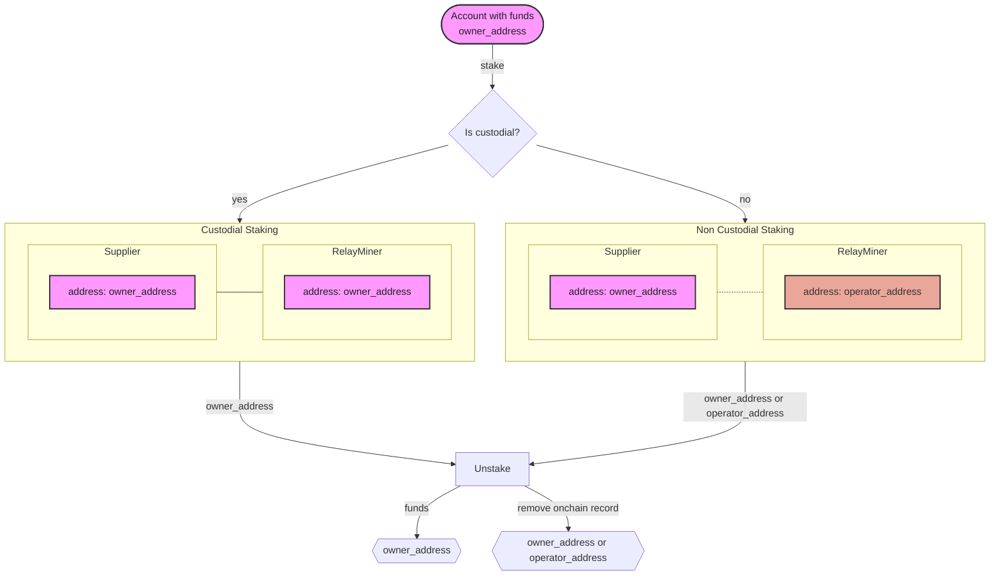

## Supplier staking config <!-- omit in toc -->

This document describes the configuration file used by the `Supplier` actor
to submit a `stake` transaction, **which is a prerequisite** for it to provide
RPC services on Pocket Network.

:::tip

You can find a fully featured example configuration at [supplier_staking_config.yaml](https://github.com/pokt-network/poktroll/tree/main/localnet/pocketd/config/supplier1_stake_config.yaml).

:::

- [Usage](#usage)
- [Staking types](#staking-types)
  - [Custodial Staking](#custodial-staking)
  - [Non-Custodial Staking](#non-custodial-staking)
- [Configuration](#configuration)
  - [`owner_address`](#owner_address)
  - [`operator_address`](#operator_address)
  - [`stake_amount`](#stake_amount)
  - [`default_rev_share_percent`](#default_rev_share_percent)
  - [`services`](#services)
    - [`service_id`](#service_id)
    - [`endpoints`](#endpoints)
      - [`publicly_exposed_url`](#publicly_exposed_url)
      - [`rpc_type`](#rpc_type)
    - [`rev_share_percent`](#rev_share_percent)

## Usage

The `stake-supplier` transaction submission command accepts a `--config` flag
that points to a `yaml` configuration file that defines their staking
configuration. This includes, but is not limited to, things like `stake_amount`,
provided `service`s, their respective advertised `endpoints`, etc.

The following is an example command of how to stake a supplier
in a LocalNet environment.

```bash
pocketd tx supplier stake-supplier \
  --home=./pocket \
  --config ./stake_config.yaml \
  --keyring-backend test \
  --from supplier1 \
  --node tcp://pocket-node:26657
```

## Staking types

The `Supplier` staking command supports `Custodial` and `Non-Custodial` staking
which can be illustrated in the following flowchart:



### Custodial Staking

The owner of the `Supplier` is the same as the operator.
This means the account that receives the rewards is the same as the one that
signs the `RelayResponse`s and submits claims and proofs.

Custodial staking is the simplest to set up and manage, as there is no need to
manage multiple accounts. It is suitable for `Supplier`s that do not have concerns
about using the private key of the staking or the rewarded account to operate the
`RelayMiner` or update the `Supplier`'s stake and services.

### Non-Custodial Staking

The owner of the `Supplier` is different from the operator.
This means the account that receives the rewards is different from the one signing
the `RelayResponse`s and submitting claims and proofs.

Non-custodial staking is suitable for `Supplier`s that want to separate the `RelayMiner`
staking operations from the account that has custody over the staked funds, and in turn,
the rewards being earned.

:::note

When staking a `Supplier`, the signing account specified with the `--from` flag
(which may differ from the `Supplier`'s owner or operator) will have its `upokt`
balance deducted to stake the `Supplier`.

When unstaking a `Supplier`, the staked `upokt` will be returned to the `owner_address`
account.

:::

## Configuration

### `owner_address`

_`Required`_

```yaml
owner_address: <address>
```

The `owner_address` is the address of the account that owns the `Supplier`s staked
funds, which will be transferred to this account's balannce when the `Supplier`
unstakes and finishes unbonding.

For custodial staking, the `owner_address` is the same as the `operator_address`.

For non-custodial staking, the `owner_address` MUST be different from the `operator_address`.
This address receives the staked `upokt` when the `Supplier` is unstaked and finished unbonding.

The `owner_address` can only be changed with a stake message signed by the
`Supplier`'s owner account.

It is also used as the unique shareholder address for the `Supplier`
if none of `default_rev_share_percent` or `rev_share_percent` is defined in the
configuration file.

:::note

The `owner_address` does not identify a `Supplier`; multiple `Supplier`s can have
the same `owner_address`.

:::

### `operator_address`

_`Optional`_

```yaml
operator_address: <address>
```

The `operator_address` is the address that identifies the `Supplier`.
Its corresponding account is used for operational tasks such as signing `RelayResponse`s,
submitting `Claims` and `Proofs` as well as updating the `Supplier`'s info
(i.e. Adding or removing services, increasing the stake amount, etc.)

The operator account can also be used to unstake the `Supplier`, which will cause
the staked `upokt` to be sent to the `owner_address` after unbonding finishes.

If the `operator_address` is empty or not specified, the `owner_address` is used
as the `operator_address`.

If the `operator_address` is the same as the `owner_address`, then the staking
is custodial.

:::warning

Since the `operator_address` is the unique identifier of a `Supplier`, it cannot
be changed once the `Supplier` is created. If it needs to be changed, then the
corresponding `Supplier` has to be unstaked and a new one staked with the new
`operator_address`.

:::

### `stake_amount`

_`Required`_, _`Non-empty`_

```yaml
stake_amount: <number>upokt
```

Defines the amount of `upokt` to stake for the `Supplier` account.
This amount covers all the `service`s defined in the `services` section.

### `default_rev_share_percent`

_`Optional`_, _`Non-empty`_

```yaml
default_rev_share_percent:
  <shareholder_address_1>: <uint32>
  <shareholder_address_2>: <uint32>
```

`default_rev_share_percent` is an optional map that defines the default the revenue
share percentage for all the `service`s that do not have their specific `rev_share_percent`
entry defined.

This field is useful if the `Supplier` owner wants to set a default revenue share
for all the `service`s entries that do not provide one. This way, the operator
does not have to repeat the same values for each `service` in the `services` section.

This map cannot be empty but can be omitted, in which case the default revenue
share falls back to `100%` of the rewards allocated to the `Supplier`'s `owner_address`.

:::note

The `shareholder_address`s MUST be valid Pocket addresses.

The revenue share values MUST be strictly positive floats with a maximum value of
100 and a total sum of 100 across all the `shareholder_address`es.

:::

:::warning

If `default_rev_share_percent` is defined, then the `owner_address` of the `Supplier`
MUST be **explicitly** defined in the map if they are to receive a share on the
`service`s that fall back to the default.

:::

### `services`

_`Required`_, _`Non-empty`_

```yaml
services:
  - service_id: <string>
    endpoints:
      - publicly_exposed_url: <protocol>://<hostname>:<port>
        rpc_type: <string>
    rev_share_percent:
      <shareholder_address>: <float>
```

`services` define the list of services that the `Supplier` wants to provide.
It takes the form of a list of `service` objects. Each `service` object
consists of a `service_id` and a list of `endpoints` that the `Supplier` will
advertise on Pocket Network.

#### `service_id`

_`Required`_

`service_id` is a string that uniquely identifies the service that the `Supplier`
is providing. It MUST 8 characters or less and composed of alphanumeric characters,
underscores, and dashes only.

For example, it must match the regex `^[a-zA-Z0-9_-]{1,8}$`, and spaces are disallowed.

#### `endpoints`

_`Required`_, _`Non-empty`_

`endpoints` is a list of `endpoint` objects that the `Supplier` will advertise
to the Pocket Network. Each `endpoint` object consists of a `publicly_exposed_url`
and a `rpc_type`.

##### `publicly_exposed_url`

_`Required`_

The `publicly_exposed_url` defines the endpoint for sending `RelayRequests` from
the Pocket Network's `Gateways` and `Applications`. This endpoint is provided by
the `Supplier` when staking, and is meant to point to (or route requests to)
the `Supplier`'s `RelayMiner` which in turn forwards these requests to the service node.

- **Example**: When a `Supplier` stakes with a config file that contains
  `https://ethereum-relayminer1.relayminers.com:443` as a `publicly_exposed_url`,
  this endpoint will be discoverable on the Pocket Network by `Gateways` and
  `Applications`, which can send it Ethereum `RelayRequests` to be processed by the
  `Supplier`'s `RelayMiner`.

##### `rpc_type`

_`Required`_

`rpc_type` is a string that defines the type of RPC service that the `Supplier`
is providing.

Since services may support multiple types of RPCs (e.g., Ethereum has both
JSON-RPC and WebSocket), a `Supplier` needs to specify which one it provides.

This allows `Gateways` and `Applications` to know which ones are supported by
a given `Supplier` and select the appropriate one to send `RelayRequest`s to.

:::note

The same url can be used for different `rpc_type`s and it is up to the `Gateway`
or `Application` to build the `RelayRequest` with the desired `rpc_type`.

For example, a `Supplier` can provide `JSON_RPC` and `GRPC` `rpc_type`s to be
served from the same endpoint:

```yaml
endpoints:
  - publicly_exposed_url: http://service-host
    rpc_type: JSON_RPC
  - publicly_exposed_url: http://service-host
    rpc_type: GRPC
```

:::

The `rpc_type` MUST be one of the [supported types found here](https://github.com/pokt-network/poktroll/tree/main/pkg/relayer/config/types.go#L8).

#### `rev_share_percent`

`rev_share_percent` is an optional map that defines the `service`'s specific revenue
share percentage.

It overrides the `default_rev_share_percent` if defined for the `service`.

This map cannot be empty but can be omitted, in which case it falls back to the
`default_rev_share_percent` top-level configuration entry.

:::note

The `shareholder_address`s MUST be valid Pocket addresses.

The revenue share values MUST be strictly positive decimals with a maximum value
of 100 and a total sum of 100 across all the `shareholder_address`es.

:::

:::warning

If `rev_share_percent` is defined for a `service`, then the `owner_address` of the
`Supplier` MUST be **explicitly** defined in the map if they are to receive a share.

:::
