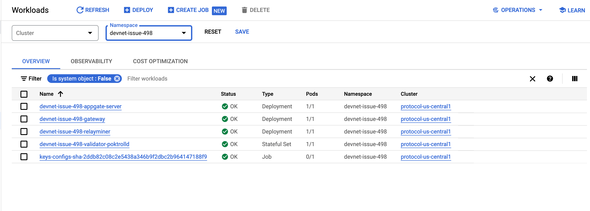

# DevNets <!-- omit in toc -->

:::note

This page is only relevant to you if you are part of the core protocol team at Grove.

Make sure to follow the instructions [here](https://www.notion.so/buildwithgrove/Infrastructure-Setup-79b1431b70374e24b10cd9da556c7645?pvs=4) if you are unsure how
to set up your access to GCP.

:::

## Table of Contents <!-- omit in toc -->

- [GCP Console](#gcp-console)
- [Grafana logs](#grafana-logs)
- [Infrastructure Provisioning](#infrastructure-provisioning)
- [Configuration](#configuration)
- [Interaction with DevNet](#interaction-with-devnet)
- [DevNet types](#devnet-types)
- [Manually provisioned DevNets](#manually-provisioned-devnets)
  - [How to create](#how-to-create)
  - [How to delete](#how-to-delete)
  - [Configuring and updating DevNets](#configuring-and-updating-devnets)
  - [Scaling actors up and down](#scaling-actors-up-and-down)
  - [Run e2e tests on a manually provisioned DevNet](#run-e2e-tests-on-a-manually-provisioned-devnet)
  - [Staking actors](#staking-actors)

## GCP Console

As an example, this [GCP link](<https://console.cloud.google.com/kubernetes/workload/overview?project=protocol-us-central1-d505&pageState=(%22savedViews%22:(%22i%22:%22a39690ef57a74a59b7550d42ac7655bc%22,%22c%22:%5B%5D,%22n%22:%5B%22devnet-issue-498%22%5D))>) links to `devnet-issue-498` created
from [PR #498](https://github.com/pokt-network/poktroll/pull/498).



## Grafana logs

As an example, this [Grafana link](https://grafana.poktroll.com/explore?schemaVersion=1&panes=%7B%22TtK%22:%7B%22datasource%22:%22P8E80F9AEF21F6940%22,%22queries%22:%5B%7B%22refId%22:%22A%22,%22expr%22:%22%7Bcontainer%3D%5C%22poktrolld%5C%22,%20namespace%3D%5C%22devnet-issue-477%5C%22%7D%20%7C%3D%20%60%60%20%7C%20json%22,%22queryType%22:%22range%22,%22datasource%22:%7B%22type%22:%22loki%22,%22uid%22:%22P8E80F9AEF21F6940%22%7D,%22editorMode%22:%22builder%22%7D%5D,%22range%22:%7B%22from%22:%22now-1h%22,%22to%22:%22now%22%7D,%22panelsState%22:%7B%22logs%22:%7B%22logs%22:%7B%22visualisationType%22:%22logs%22%7D%7D%7D%7D%7D&orgId=1) links to the logs for `devnet-issue-477` from [PR #477](https://github.com/pokt-network/poktroll/pull/477)


## Infrastructure Provisioning

The following is a list of details to know how our DevNet infrastructure is provisioned:

- **Grove & Kubernetes**: The Kubernetes cluster is provisioned using Grove's internal tooling.
- **Main Cluster**: We set up ArgoCD on the cluster and configure it to sync the [main/root application on the cluster](https://github.com/pokt-network/protocol-infra/blob/main/clusters/protocol-us-central1-app.yaml).
- **App of Apps**: ArgoCD provisions all the necessary resources and other ArgoCD Applications included in that Application, following the [ArgoCD App of Apps pattern](https://argo-cd.readthedocs.io/en/stable/operator-manual/cluster-bootstrapping/).
- **PR `devnet` label**: One of the manifests provisioned is an [ArgoCD ApplicationSet](https://github.com/pokt-network/protocol-infra/blob/main/clusters/protocol-us-central1/devnets-github-label.yaml), which monitors our GitHub labels and provisions a network for each GitHub issue tagged with the `devnet` label.
- **PR `devnet-test-e2e` label**: As part of our CI process, when a GitHub issue is labeled `devnet-test-e2e`, we execute a [script](https://github.com/pokt-network/poktroll/blob/main/.github/workflows-helpers/run-e2e-test.sh#L1) that creates a [Kubernetes Job](https://github.com/pokt-network/poktroll/blob/main/.github/workflows-helpers/run-e2e-test-job-template.yaml) to for that `DevNet`.
- **Ephemeral DevNet**: The DevNet deplyed using the labels described above are considered to be ephemeral.
- **Closing PR**s: When the PR is closed or the label is removed, the infrastructure is cleaned up.
- **Persistent DevNet**: We have an option to provision `persistent DevNets` by creating a DevNet yaml file in [this directory](https://github.com/pokt-network/protocol-infra/tree/main/devnets-configs) ([ArgoCD Application that monitors this directory](https://github.com/pokt-network/protocol-infra/blob/main/clusters/protocol-us-central1/devnets-persistent.yaml) for reference).

## Configuration

Each DevNet ArgoCD App (following the App of Apps pattern) provisions a Helm chart called [full-network](https://github.com/pokt-network/protocol-infra/tree/main/charts/full-network).

Each `full-network` includes other ArgoCD applications that deploy Validators and off-chain actors.

Each Helm chart receives a list of configuration files. For example, see the [relayminer configuration](https://github.com/pokt-network/protocol-infra/blob/main/charts/full-network/templates/Application-Relayminer.yaml#L37). All possible values can be found in the `values.yaml` of the Helm chart, such as the [relayminer Helm chart](https://github.com/pokt-network/helm-charts/blob/main/charts/relayminer/values.yaml).

## Interaction with DevNet

:::note
Devnets are provisioned with the same mnemonc phrases as LocalNet, so it is possible to reuse the same keys
from the keybase - the user just needs to change the `--node=` flag to point to the DevNet RPC endpoint when using the `poktrolld` CLI.
:::

The DevNet RPC endpoint is exposed on `https://devnet-**NETWORK_NAME**-validator-rpc.poktroll.com`.

It is possible to reuse the LocalNet make targets with DevNet endpoints. For example

```bash
POCKET_NODE=https://devnet-issue-420-validator-rpc.poktroll.com make supplier_list
```

## DevNet types

We have two types of DevNets:
1. Automatically provisioned by `devnet-test-e2e` GitHub label.
  - Their main purpose is to automatically run e2e tests for each PR this label has been assigned to.
  - They are not easily modified and configured. E.g. we automatically provision single instance of each actor only.
2. Manually provisioned by creating a file in [protocol-infra repo under `devnet-configs` directory](https://github.com/pokt-network/protocol-infra/tree/main/devnets-configs).
  - Their main purpose is for testing new features or configurations that require more complex setups than the first type can provide.
  - They are easily modified and configured, allowing you to add multiple instances of each actor.

## Manually provisioned DevNets

### How to create

Commit a new YAML file in the [devnets-configs](https://github.com/pokt-network/protocol-infra/tree/main/devnets-configs)
directory on the `main` branch. Use [this template](https://github.com/pokt-network/protocol-infra/blob/main/devnets-configs/_TEMPLATE_YAML_)
as a reference. If you are not a member of the protocol team, open a pull request (PR) to add the new YAML file to the
`main` branch. Protocol team members can bypass the `main` branch protection to commit directly without going through
the PR flow.

### How to delete

Remove the devnet config file by committing the deletion to the `main` branch. If you are not a member of the protocol
team, open a pull request (PR) to delete the YAML file from the `main` branch. Protocol team members can bypass the
`main` branch protection to commit the deletion directly without going through the PR flow.

### Configuring and updating DevNets

New container images are automatically built on each merge to the `main` branch and each push to non-main branches for which there exists a PR with the `push-image` label.
Images named according to the following format:

```
ghcr.io/pokt-network/poktrolld:sha-7042be3
ghcr.io/pokt-network/poktrolld:sha-7042be3922245fb4313ee90e1f28d0f402b700a0
```

You can update the version of DevNet by changing this parameter in the devnet config file:

```yaml
image:
  tag: sha-7042be3
```

All parameters in this config are passed to the [downstream helm chart](https://github.com/pokt-network/protocol-infra/tree/main/charts/full-network) via an [ArgoCD Application](https://github.com/pokt-network/protocol-infra/blob/main/clusters/protocol-us-central1/devnets-persistent.yaml).
Here is a [list of all options](https://github.com/pokt-network/protocol-infra/blob/main/charts/full-network/values.yaml) which can be modified, in addition to the image tag.

### Scaling actors up and down

You can modify the number of each actor by changing the devnet config file:

:::info
We use the same ignite `config.yaml` to provision genesis in devnet as is used in localnet. Because localnet supports a max of 3 of each actor type, any devnet deployment with more actors would also require additional corresponding genesis state to be included in `config.yaml`, or on-demand account funding and staking. General rule of thumb: don't go over `3`.
:::


```yaml
path_gateways:
  count: 1
gateways:
  count: 1
relayminers:
  count: 1
```

### Run e2e tests on a manually provisioned DevNet

To run e2e tests on a manually provisioned DevNet, use the following command from the root of the poktroll repo:

```bash
IMAGE_TAG=**IMAGE TAG NAME FROM DEVNET CONFIG** NAMESPACE=devnet-**NETWORK NAME** JOB_NAME=e2e-test-**GITSHA FROM IMAGE TAG** POCKET_NODE=tcp://devnet-**NETWORK NAME**-validator-poktrolld:26657 bash .github/workflows-helpers/run-e2e-test.sh
```

**Environment Variables**:

- **IMAGE_TAG**: The tag of the image from the devnet config YAML file. This tag must match the tag of the image used in the DevNet configuration.
- **NAMESPACE**: The name of the devnet. This should be specified in the environment variables and follow the format devnet-**NETWORK NAME**.
- **JOB_NAME**: A unique identifier for the e2e test job. It follows the format e2e-test-**GITSHA FROM IMAGE TAG**.
- **POCKET_NODE**: The address of the pocket node, following the format tcp://devnet-**NETWORK NAME**-validator-poktrolld:26657.


**Example**

```bash
IMAGE_TAG=sha-7042be3 NAMESPACE=devnet-sophon JOB_NAME=e2e-test-7042be3 POCKET_NODE=tcp://devnet-sophon-validator-poktrolld:26657 bash .github/workflows-helpers/run-e2e-test.sh
```

:::info
- The `IMAGE_TAG` must match the tag of the image from the devnet config YAML file.
- The name of the devnet in the environment variables must be specified.
- The Kubernetes context must be pointed to the protocol cluster. This command can be used to change context:
  ```bash
  kubectl config set-context gke_protocol-us-central1-d505_us-central1_protocol-us-central1
  ```
:::

### Staking actors

Since the genesis actor keys are the same as LocalNet, we can use the same commands (and keyring) to stake actors on
DevNet. Additionally, DevNets match the hostnames with LocalNet, making it possible for the same stake configs to work on different networks.
For example, this command stakes supplier2 on DevNet `devnet-sophon`:

```bash
POCKET_NODE=https://devnet-sophon-validator-rpc.poktroll.com make supplier2_stake
```

:::note
Only manually provisioned DevNets have more than one actor to stake. 
:::