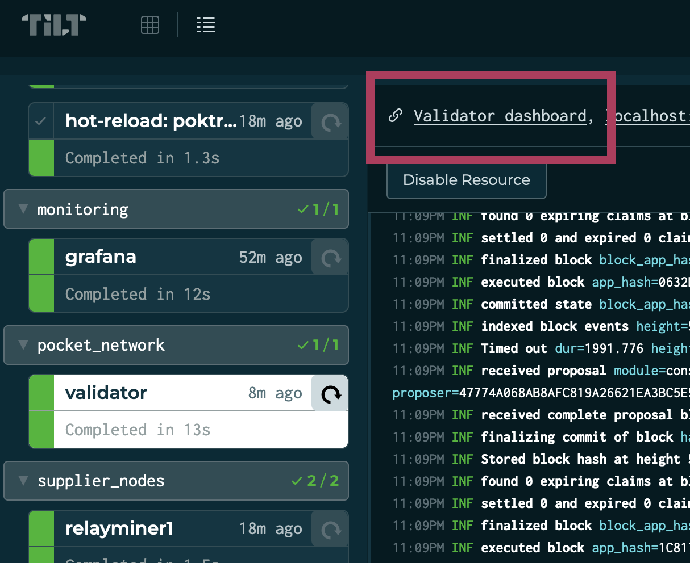
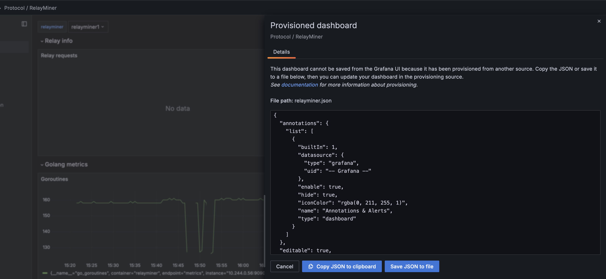

# LocalNet <!-- omit in toc -->

## Background <!-- omit in toc -->

This document walks you through launching a LocalNet that brings up a k8s cluster
with a Data Availability network, a validator, Pocket actors and everything else
needed to send an end-to-end relay.

- [Run Poktroll locally](#run-poktroll-locally)
  - [Report issues](#report-issues)
  - [TL;DR](#tldr)
- [Developing with LocalNet](#developing-with-localnet)
  - [localnet\_config.yaml](#localnet_configyaml)
  - [Scaling network actors](#scaling-network-actors)
  - [Off-chain actors configuration](#off-chain-actors-configuration)
  - [Modify Kubernetes workloads](#modify-kubernetes-workloads)
- [Observability](#observability)
  - [Access dashboards with graphs and logs](#access-dashboards-with-graphs-and-logs)
  - [How to update and save an existing dashboard?](#how-to-update-and-save-an-existing-dashboard)
- [High-level overview of LocalNet](#high-level-overview-of-localnet)
  - [LocalNet Deployment Flow](#localnet-deployment-flow)
- [Troubleshooting](#troubleshooting)
  - [Clean Slate (Nuclear Option)](#clean-slate-nuclear-option)

## Run Poktroll locally

### Report issues

If you encounter any problems, please create a new [GitHub Issue here](https://github.com/pokt-network/pocket/issues/new/choose).

### TL;DR

1. Install dependencies:
   1. [Ignite](https://docs.ignite.com/welcome/install)
   2. [Docker](https://docs.docker.com/engine/install/)
   3. [Kind](https://kind.sigs.k8s.io/#installation-and-usage)
   4. [Helm](https://helm.sh/docs/intro/install/#through-package-managers)
   5. [Tilt](https://docs.tilt.dev/install.html) (note: we recommend using Kind cluster with Tilt)
2. Run `make localnet_up` to start the network
3. When prompted, click `space` to see the web UI with logs and current status of the network. Alternatively, you can go directly to [localhost:10350](http://localhost:10350)

## Developing with LocalNet

### localnet_config.yaml

Once LocalNet is started, a new file `localnet_config.yaml` is generated in the root directory of the repository. This file contains the configuration of the network. It looks like this:

```yaml
helm_chart_local_repo:
  enabled: false
  path: ../helm-charts
relayers:
  count: 1
```

### Scaling network actors

To scale the number of actors, edit the `localnet_config.yaml` file and change the `count` of the relayers.

For example:

```diff
helm_chart_local_repo:
  enabled: false
  path: ../helm-charts
relayers:
-   count: 1
+   count: 2
```

_NOTE: You may need to up to 1 minute for the new actors to be registered and deployed locally._

### Off-chain actors configuration

We heavily use Helm charts for configuring LocalNet. The goal is to maximize the tooling involved in deploying production
workloads and local development.

Following best practices in Helm chart design, we have default values defined in the `values.yaml` file of each service
Helm chart. For example, [here are the RelayMiner `values.yaml`](https://github.com/pokt-network/helm-charts/blob/main/charts/relayminer/values.yaml).

Local infrastructure requires some changes to the default values to properly configure the RelayMiner
ro PATH Gateway, so we override some of the values. You can find such overrides in the
[poktroll/localnet/kubernetes directory](https://github.com/pokt-network/poktroll/tree/main/localnet/kubernetes).

**IF YOU NEED TO CHANGE LocalNet configs, 👆 is the place.**

### Modify Kubernetes workloads

The local cluster is dependant on the latest available helm charts available at
[github.com/pokt-network/helm-charts](https://github.com/pokt-network/helm-charts.git).

If you need to modify Kubernetes resources in your local setup, follow these steps.

Clone the helm charts locally:

```bash
cd .. && git clone git@github.com:pokt-network/helm-charts.git
cd -
```

Update the path of the helm charts to the **relative** path of the cloned repository:

```bash
sed -i'' -e '/helm_chart_local_repo:/,/path:/ s|\(path: \).*|\1../helm-charts|' localnet_config.yaml
```

Set the `helm_chart_local_repo.enabled` flag in `localnet_config.yaml` to `true`:

```bash
sed -i'' -e '/helm_chart_local_repo:/,+1 s/\(enabled: \)true/\1false/; /helm_chart_local_repo:/,+1 s/\(enabled: \)false/\1true/' localnet_config.yaml
```

You can always set it back to `false` with:

```bash
sed -i'' -e '/helm_chart_local_repo:/,+1 s/\(enabled: \)false/\1true/; /helm_chart_local_repo:/,+1 s/\(enabled: \)true/\1false/' localnet_config.yaml
```

## Observability

You can configure LocalNet to deploy third-party observability tools such as Prometheus and Grafana:

`localnet_config.yaml`:

```yaml
observability:
  enabled: true
```

### Access dashboards with graphs and logs

Each service in Tilt has a link to its own Grafana dashboard as seen in the image below.

Specifically, the RelayMiner, Validator, PATH Gateway and others each have a separate dashboards.



### How to update and save an existing dashboard?

Every time LocalNet is re-started, Grafana is deployed and provisioned from scratch.

A list of existing dashboards are saved as JSON files in `localnet/grafana-dashboards`.
If you wish to change a dashboard, do the following:

1. Make the necessary modifications in the Grafana UI
2. Click save button. This will then display the updated JSON output of the dashboard
3. Copy-paste the output to the corresponding file in `localnet/grafana-dashboards`



## High-level overview of LocalNet

This section describes how LocalNet operates and the interactions between different
components to provision a working network.

### LocalNet Deployment Flow

After you execute `make localnet_up`, many things happen:

1. `ignite` CLI provisions a new `genesis.json` and validator keys.
2. `tilt` starts and runs a [Tiltfile](https://github.com/pokt-network/poktroll/blob/main/Tiltfile) - a Python-like script.
3. Subsequently, the logic described in the `Tiltfile` executes various CLI commands, communicates with the `k8s` API, and creates or reads the LocalNet configuration file:
   1. Creates a new `localnet_config.yaml` if it doesn't exist. Updates it with default values if new ones are introduced.
   2. Depending on the configuration in `localnet_config.yaml`, uses Helm charts from the local [helm-charts](https://github.com/pokt-network/helm-charts)repository or downloads Helm charts from our Helm chart repository (`https://pokt-network.github.io/helm-charts/`).
   3. Compiles the `poktrolld` binary from the source code.
   4. Using values from `localnet_config.yaml`, provisions an observability stack (Grafana, Prometheus, Loki), a validator, PATH Gateways, RelayMiners, etc.
4. With `make localnet_up` continually running in the background, `tilt` monitors for code changes and re-compiles the binary when a code change is detected. After the new binary is built, it is pushed to the containers and all processes restart.

## Troubleshooting

### Clean Slate (Nuclear Option)

If you're encountering weird issues and just need to start over, follow these steps:

```bash
make localnet_down
kind delete cluster
make docker_wipe
make go_develop_and_test
kind create cluster
make localnet_up
```
